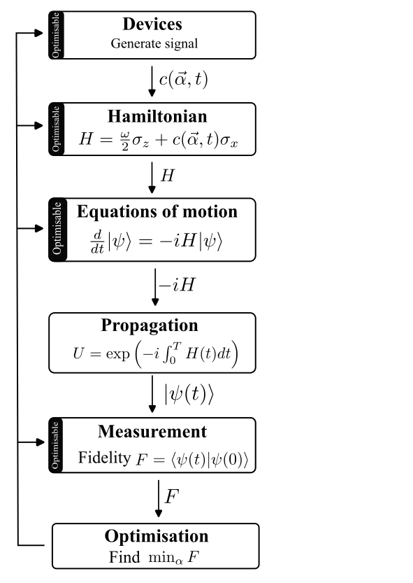

  

# ParaQeet -  A quantum optimal control toolkit with simple parameter management

Choose a pulse parametrisation, simulate a quantum system, and optimise. 

Combining Quantum Optimal Control methods with automatic differentiation with JAX.
Aimed at resource efficient computation.

We use a top-down approach to make the codebase modular. 
Each module interacts only with the module above it in hierarchy. 

  

Currently implementated optimization methods
- GRAPE: Gradient Ascent Pulse Enginnering
- GOAT: Gradient Optimization of Analytic conTrols

## Installation
Install with `pip install paraqeet`.
