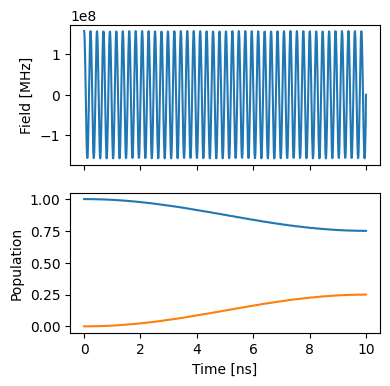
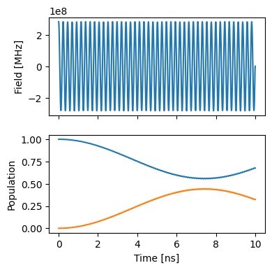
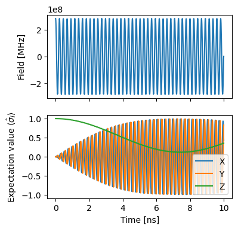
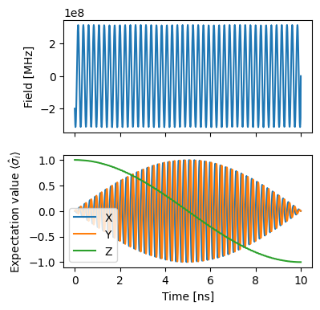

Single spin Part 2: Gradient descent gate optimization
======================================================

First, we make the necessary imports.

.. code:: ipython3

    import matplotlib.pyplot as plt
    import numpy as np
    
    from paraqeet.optimisation_map import OptimisationMap
    from paraqeet.quantity import Quantity
    from paraqeet.measurement.unitary_fidelity import UnitaryFidelity
    from paraqeet.model.closed_system import ClosedSystem
    from paraqeet.model.drive_operator import DriveOperator
    from paraqeet.model.qubit import Qubit
    from paraqeet.optimisers.scipy_optimiser import ScipyOptimiser
    from paraqeet.optimisers.scipy_optimiser_gradient import ScipyOptimiserGradient
    from paraqeet.propagation.scipy_expm_goat import ScipyExpmGOAT
    from paraqeet.signal.envelopes import ConstantEnvelope
    from paraqeet.signal.iq_mixer import IQMixer

System Setup
------------

For signal generation, we define a simple cosine shaped tone generator
:math:`A \cos(\omega t)`

.. code:: ipython3

    t_final = 10e-9
    tone = ConstantEnvelope()
    tone.t_final.set_value(t_final)
    gen = IQMixer(envelopes=[tone])

We can inspect the pre-defined parameters with

.. code:: ipython3

    params = gen.get_parameters()

in this case amplitude :math:`A` and frequency :math:`\omega` and phase
:math:`\phi`.

Next, we setup the qubit system we want to control. We set the qubit
frequency :math:`\omega_q` to be 4.8 GHz and define the Hamiltonian as

.. math:: H(t)=H_\text{drift}+H_c(t)= \frac{\omega_q}{2} \sigma_z + \Omega(t)\sigma_x

, where :math:`\Omega(t)=A\cos(\omega t+\phi)` will be supplied by the
generator.

.. code:: ipython3

    FREQ = 4.327884e9 * 2 * np.pi
    
    drive = DriveOperator(gen, isLongitudinal=False)
    controlled_qubit = Qubit(
        frequency=Quantity(
            FREQ,
            min_value=FREQ / 4,
            max_value=FREQ,
            unit="Hz",
            name="Qubit frequency",
        ),
        drives=[drive],
    )
    
    model = ClosedSystem(controlled_qubit)

Textbook values for implementing an :math:`X` rotation on this system at
a time :math:`T` would be :math:`\omega=\omega_q` and :math:`A=\pi/T`.
We use some offset from these values as initial guess to demonstrate the
optimization procedure.

.. code:: ipython3

    params[0].set_value(0.5 * np.pi / t_final)
    params[2].set_value(1.01 * FREQ)

We select a propagation method, piecewise constant exponentation, and
configure :math:`\sigma_x` as a target gate. Also we initialize the full
basis at time 0 with :math:`\mathcal{I}_2`

.. code:: ipython3

    prop = ScipyExpmGOAT(model, res=500e9)
    
    X = np.array([[0.0, 1], [1, 0.0]])
    Y = np.array([[0.0, -1j], [1j, 0.0]])
    Z = np.array([[1, 0], [0.0, -1]])
    
    prop.set_initial_state(np.identity(2))
    gateFid = UnitaryFidelity(
        propagation=prop,
        gate=X,
        times=np.array([0.0, t_final]),
    )

.. code:: ipython3

    def plotStates():
        """Plot the states."""
        ts = np.linspace(0, t_final, 1001)
        states = prop.propagate(ts)
        sig = gen.generate_signal(ts)
    
        fig, ax = plt.subplots(2, figsize=(4, 4), sharex=True)
        ax[0].plot(ts / 1e-9, sig)
        ax[0].set_ylabel("Field [MHz]")
        ax[1].plot(ts / 1e-9, np.abs(states)[:, :, 0] ** 2)
        ax[1].set_ylabel("Population")
        ax[-1].set_xlabel("Time [ns]")
        return fig, ax
    
    
    plotStates()

.. parsed-literal::

    (<Figure size 400x400 with 2 Axes>,
     array([<Axes: ylabel='Field [MHz]'>,
            <Axes: xlabel='Time [ns]', ylabel='Population'>], dtype=object))

As expected, we get a partial transfer and a low fidelity.

.. code:: ipython3

    gateFid.measure()

.. parsed-literal::

    0.09555411208408474

We define an optimizer and link our fidelity measure as a goal function
and the parameters of the cosine tone and optimise just amplitude and
frequency, as in the state transfer example.

.. code:: ipython3

    optmap = OptimisationMap()
    optmap.add(gen, [params[0], params[2]])
    opt = ScipyOptimiserGradient(gateFid, optimisables=optmap)

.. code:: ipython3

    opt.optimise()

.. parsed-literal::

    {'status': 1, 'value': 0.8037201693294322, 'iterations': 17, 'message': 'CONVERGENCE: NORM OF PROJECTED GRADIENT <= PGTOL'}

.. code:: ipython3

    plotStates()

.. parsed-literal::

    (<Figure size 400x400 with 2 Axes>,
     array([<Axes: ylabel='Field [MHz]'>,
            <Axes: xlabel='Time [ns]', ylabel='Population'>], dtype=object))

Dynamics of Pauli operators
---------------------------

Here, we end up with an unsatisfactory result. For optimising gate
fidelities, looking at state populations does not give enough
information to identify the problem.

.. code:: ipython3

    def expecationValue(Op, states):
        """Get the expectation value across states."""
        ex = []
        for state in states:
            ex.append(np.real(state.conj() @ Op @ state.T))
        return ex

.. code:: ipython3

    def plotPauli():
        """Plot the Pauli operators."""
        ts = np.linspace(0, t_final, 1001)
        states = prop.propagate(ts)
        sig = gen.generate_signal(ts)
    
        fig, ax = plt.subplots(2, figsize=(4, 4), sharex=True)
        ax[0].plot(ts / 1e-9, sig)
        ax[0].set_ylabel("Field [MHz]")
        ax[1].plot(ts / 1e-9, expecationValue(X, states[:, :, 0]))
        ax[1].plot(ts / 1e-9, expecationValue(Y, states[:, :, 0]))
        ax[1].plot(ts / 1e-9, expecationValue(Z, states[:, :, 0]))
        ax[1].set_ylabel(r"Expectation value $\langle\hat\sigma_i\rangle$")
        ax[-1].set_xlabel("Time [ns]")
        ax[1].legend(["X", "Y", "Z"])
        return fig, ax
    
    
    plotPauli()

.. parsed-literal::

    (<Figure size 400x400 with 2 Axes>,
     array([<Axes: ylabel='Field [MHz]'>,
            <Axes: xlabel='Time [ns]', ylabel='Expectation value $\\langle\\hat\\sigma_i\\rangle$'>],
           dtype=object))

Instead, we look at the expecation values of the three Pauli operators
and observe that the qubit is rotating at its eigenfrequency along the
Z-axis. We can mitigate this problem by allowing the rotation axis of
our drive to shift and inclide the phase parameter in the optimisation.

.. code:: ipython3

    optmap = OptimisationMap()
    optmap.add(tone, [params[0], params[2], params[3]])
    opt = ScipyOptimiser(gateFid, optimisables=optmap)

.. code:: ipython3

    params[0].set_value(0.5 * np.pi / t_final)
    params[2].set_value(1.01 * FREQ)
    opt.optimise()

.. parsed-literal::

    {'status': 1, 'value': 1.0475176281943277e-11, 'iterations': 108, 'message': 'CONVERGENCE: RELATIVE REDUCTION OF F <= FACTR*EPSMCH'}

.. code:: ipython3

    plotPauli()

.. parsed-literal::

    (<Figure size 400x400 with 2 Axes>,
     array([<Axes: ylabel='Field [MHz]'>,
            <Axes: xlabel='Time [ns]', ylabel='Expectation value $\\langle\\hat\\sigma_i\\rangle$'>],
           dtype=object))

