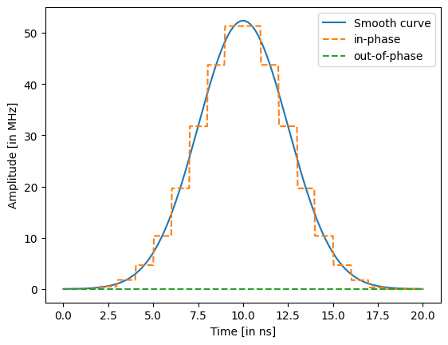
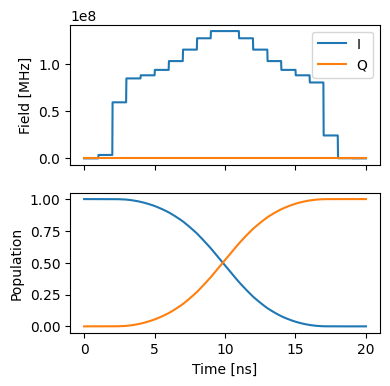
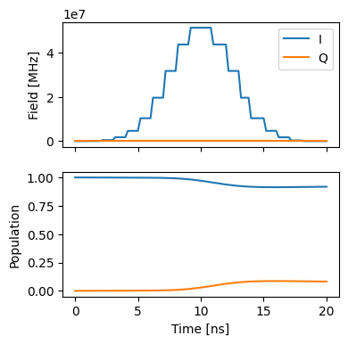
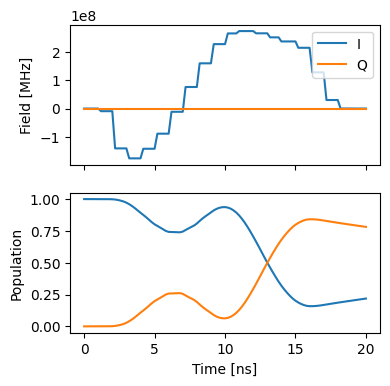

GRAPE on a single spin
======================

This in an introductory example to the
`GRAPE <10.1016/j.jmr.2004.11.004>`__ method and its implementation in
this software package.

1. Generate a PWC pulse shape
-----------------------------

.. code:: ipython3

    import matplotlib.pyplot as plt
    import numpy as np
    from paraqeet.quantity import Quantity
    
    from paraqeet.signal.envelopes import GaussEnvelope
    from paraqeet.signal.pwc_generator import PWCGenerator

First, let’s generate a piecewise constant (PWC) pulse envelope for the
Gaussian pulse. For GRAPE, we need to specify an anstanz for piecewise
constant controls at a given resolution. Here, we setup a Gaussian
initial guess, sampling at 21 points during a gate time of 20ns.

.. code:: ipython3

    t_final = 20e-9
    tlist = np.linspace(0, t_final, 21)
    tone = GaussEnvelope(amplitude=Quantity(np.pi / t_final / 3, -np.pi / t_final, np.pi / t_final))
    tone.t_final.set_value(t_final)
    gen = PWCGenerator(envelopes=[tone], tlist=tlist)
    gen.multiply_flat_top = True
    gen.max_amplitude = 2 * 1e8

We have added the option ``multiplyFlatTop``, to ensure the pulse to
start and end smoothly at 0 and ``t_final``.

.. code:: ipython3

    ts = np.linspace(0, t_final, 501)
    
    plt.plot(ts / 1e-9, tone.compute_output(ts) / 1e6, label="Smooth curve")
    plt.plot(ts / 1e-9, np.real(gen.generate_signal(ts)) / 1e6, ls="--", label="in-phase")
    plt.plot(
        ts / 1e-9,
        np.imag(gen.generate_signal(ts)) / 1e6,
        ls="--",
        label="out-of-phase",
    )
    
    plt.xlabel("Time [in ns]")
    plt.ylabel("Amplitude [in MHz]")
    plt.legend()
    plt.show()

2. Define Hamiltonian in the rotating frame of drive
----------------------------------------------------

As a simple toy model, we use a single spin.

.. code:: ipython3

    from paraqeet.model.closed_system import ClosedSystem
    from paraqeet.model.rotating_frame_drive import RotatingFrameDrive
    from paraqeet.model.hamiltonian import Hamiltonian
    
    
    class SpinRWA(Hamiltonian):
        """A Single Spin."""
    
        def __init__(self, drives=None):
            super().__init__(drives)
            self.sigma_p = np.array([[0j, 1], [0, 0]])
            self.dim = 2
    
        def get_matrix_one_time(self, t):
            """Just sigma-X."""
            return self._drives[0].get_matrix_one_time(self.sigma_p, t)
    
        def gradient(self, t):
            """Gradient is just the drive matrix."""
            return self._drives[0].gradient(self.sigma_p, t)
    
    
    drive = RotatingFrameDrive(gen)
    spin = SpinRWA(drives=[drive])
    model = ClosedSystem(spin)

.. code:: ipython3

    from paraqeet.measurement.state_transfer_fidelity import StateTransferFidelityGRAPE
    from paraqeet.propagation.scipy_expm_grape import ScipyExpmGRAPE
    
    
    prop = ScipyExpmGRAPE(model, res=1e9)
    
    init = np.array([[1.0], [0]])  # |0>
    target = np.array([[0.0], [1]])  # |1>
    
    prop.set_initial_state(init)
    prop.target_state = target
    
    zeroone = StateTransferFidelityGRAPE(
        propagation=prop,
        initial_state=init,
        target_state=target,
        times=tlist,
    )

.. code:: ipython3

    def plot_states():
        """Plot the states."""
        ts = np.linspace(0, t_final, 1001)
        states = prop.propagate(ts)
        sig = gen.generate_signal(ts)
    
        _, ax = plt.subplots(2, figsize=(4, 4), sharex=True)
        ax[0].plot(ts / 1e-9, np.real(sig), label="I")
        ax[0].plot(ts / 1e-9, np.imag(sig), label="Q")
        ax[0].legend(loc=1)
        ax[0].set_ylabel("Field [MHz]")
        ax[1].plot(ts / 1e-9, np.abs(states)[:, :, 0] ** 2)
        ax[1].set_ylabel("Population")
        ax[-1].set_xlabel("Time [ns]")
        plt.show()
    
    
    plot_states()

.. image:: 04A_GRAPE_TLS_files/04A_GRAPE_TLS_11_0.png

.. code:: ipython3

    zeroone.measure()

.. parsed-literal::

    0.10336679494545335

.. code:: ipython3

    from paraqeet.optimisation_map import OptimisationMap
    from paraqeet.optimisers.scipy_optimiser_gradient import ScipyOptimiserGradient
    
    
    optmap = OptimisationMap()
    optmap.add(gen)
    optmap.register_params_with_optimisables()
    
    opt_grad = ScipyOptimiserGradient(zeroone, optimisables=optmap)

.. code:: ipython3

    opt_grad.optimise()

.. parsed-literal::

    {'status': 1, 'value': 4.1100456371623295e-13, 'iterations': 7, 'message': 'CONVERGENCE: NORM OF PROJECTED GRADIENT <= PGTOL'}

For this simple example, we reach near perfect fidelity within a few
iterations.

.. code:: ipython3

    plot_states()

With open system
----------------

Lets first reset the pulse and create a open-system model

.. code:: ipython3

    import matplotlib.pyplot as plt
    import numpy as np
    from paraqeet.quantity import Quantity
    
    from paraqeet.signal.envelopes import GaussEnvelope
    from paraqeet.signal.pwc_generator import PWCGenerator

.. code:: ipython3

    t_final = 20e-9
    tlist = np.linspace(0, t_final, 21)
    tone = GaussEnvelope(amplitude=Quantity(np.pi / t_final / 3, -np.pi / t_final, np.pi / t_final))
    tone.t_final.set_value(t_final)
    gen = PWCGenerator(envelopes=[tone], tlist=tlist)
    gen.multiply_flat_top = True
    gen.max_amplitude = 5 * 1e8

.. code:: ipython3

    from paraqeet.model.open_system import OpenSystem
    from paraqeet.model.rotating_frame_drive import RotatingFrameDrive
    from paraqeet.model.hamiltonian import Hamiltonian
    import jax.numpy as jnp
    
    
    class SpinRWA(Hamiltonian):
        """A Single Spin."""
    
        def __init__(self, drives=None):
            super().__init__(drives)
            self.sigma_p = np.array([[0j, 1], [0, 0]])
            self.sigma_m = np.array([[0j, 0], [1, 0]])
            self.sigma_z = np.array([[1, 0j], [0, -1]])
            self.dim = 2
            self.t1 = Quantity(50e-9, 1e-9, 100e-9)
            self.temp = Quantity(10e-3, 1e-3, 50e-3)
            self.t2star = Quantity(100e-9, 1e-9, 100e-9)
    
        def dimension(self):
            """Return TLS dimension."""
            return self.dim
    
        def get_matrix_one_time(self, t):
            """Just sigma-X."""
            return self._drives[0].get_matrix_one_time(self.sigma_p, t)
    
        def gradient(self, t):
            """Gradient is just the drive matrix."""
            return self._drives[0].gradient(self.sigma_p, t)
    
        def get_decay_rates(self) -> list[float]:
            """Return decay rate for T1, T2star and Temp respectively."""
            if (self.t1 is None) or (self.t2star is None) or (self.temp is None):
                raise Exception("Specify values of T1, T2star and Temp for Open system simulations.")
    
            gamma = 1 / self.t1.get_value()
            gamma_t2star = 0.5 / self.t2star.get_value()
    
            hbar_over_kb = 7.638232582257738e-12
            beta = hbar_over_kb / (self.temp.get_value())
            # inserting typical qubit freq here. TODO - CHECK
            nbar = jnp.exp(-beta * 5e9)
            gamma_temp = gamma * nbar
            gamma_t1 = gamma * (nbar + 1)
            return [gamma_t1, gamma_temp, gamma_t2star]
    
        def get_collapseops(self) -> list[jnp.ndarray]:
            """Return a list tuples of decay rates and collapse operators for each subsystem."""
            gamma_t1, gamma_temp, gamma_t2star = self.get_decay_rates()
            col_t1 = self.sigma_p
            col_temp = self.sigma_m
            col_t2star = 2 * self.sigma_z
            return [(gamma_t1, col_t1), (gamma_temp, col_temp), (gamma_t2star, col_t2star)]
    
    
    drive = RotatingFrameDrive(gen)
    spin = SpinRWA(drives=[drive])
    model = OpenSystem(spin, ode_propagation=True)

Lets test GRAPE with ODE-propgation

.. code:: ipython3

    from paraqeet.measurement.state_transfer_fidelity import StateTransferFidelityGRAPE
    from paraqeet.propagation.vern7_grape import Vern7GRAPE
    
    prop = Vern7GRAPE(model, res=1e9)
    
    init = np.array([[1.0], [0.0j]])  # |0>
    target = np.array([[0.0j], [1.0]])  # |1>
    
    init = jnp.matmul(init, init.T.conj())
    target = jnp.matmul(target, target.T.conj())
    
    prop.set_initial_state(init)
    prop.target_state = target
    
    zeroone = StateTransferFidelityGRAPE(
        propagation=prop,
        initial_state=init,
        target_state=target,
        times=tlist,
    )

.. code:: ipython3

    from jax import vmap
    
    
    def calculate_populations(states, dm=False):
        """Calculate state populations from density matrices and vectorized dm."""
        if len(states.shape) > 2:
            if dm:
                pops = jnp.abs(vmap(jnp.diag, in_axes=0)(states))
            else:
                pops = jnp.abs(states) ** 2
                pops = jnp.reshape(pops, [pops.shape[0], pops.shape[1]])
        else:
            if dm:
                pops = jnp.diag(states)
            else:
                pops = jnp.abs(states) ** 2
        return pops
    
    
    def plot_states():
        """Plot the states."""
        ts = np.linspace(0, t_final, 101)
        states = prop.propagate(ts)
        sig = gen.generate_signal(ts)
    
        _, ax = plt.subplots(2, figsize=(4, 4), sharex=True)
        ax[0].plot(ts / 1e-9, np.real(sig), label="I")
        ax[0].plot(ts / 1e-9, np.imag(sig), label="Q")
        ax[0].legend(loc=1)
        ax[0].set_ylabel("Field [MHz]")
        ax[1].plot(ts / 1e-9, calculate_populations(states, dm=True))
        ax[1].set_ylabel("Population")
        ax[-1].set_xlabel("Time [ns]")
        plt.show()
    
    
    plot_states()

.. code:: ipython3

    zeroone.measure()

.. parsed-literal::

    0.006921055509936116

.. code:: ipython3

    from paraqeet.optimisation_map import OptimisationMap
    from paraqeet.optimisers.scipy_optimiser_gradient import ScipyOptimiserGradient
    
    
    optmap = OptimisationMap()
    optmap.add(gen)
    optmap.register_params_with_optimisables()

.. code:: ipython3

    opt_grad = ScipyOptimiserGradient(zeroone, optimisables=optmap)
    opt_grad.set_options({"disp": True})

.. code:: ipython3

    opt_grad.optimise()

.. parsed-literal::

    {'status': 2, 'value': 0.3986234856331238, 'iterations': 71, 'message': 'ABNORMAL: '}

.. code:: ipython3

    plot_states()

.. code:: ipython3

    zeroone.measure()

.. parsed-literal::

    0.6037315068515552

