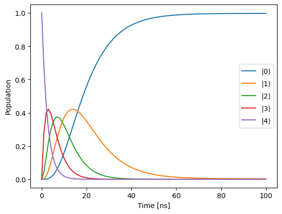
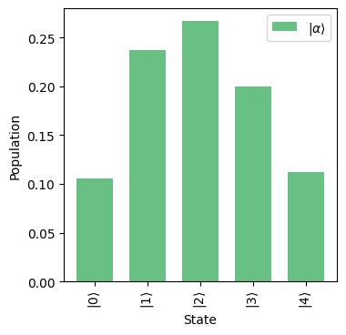
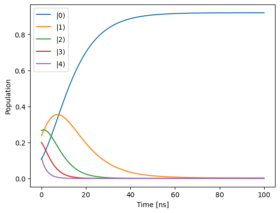

Decay of coherent state of a resonator
======================================

This is an example demonstrating open system simulation methods -
exponentiation of Lindblad superoperator and ODE solver. We consider a
simple model of decay of a coherent state in a resonator for this
example.

.. code:: ipython3

    import matplotlib.pyplot as plt
    
    import numpy as np
    import jax.numpy as jnp
    
    from paraqeet.quantity import Quantity
    from paraqeet.signal.envelopes import ZeroEnvelope
    from paraqeet.model.drive_operator import DriveOperator
    from paraqeet.signal.iq_mixer import IQMixer
    from paraqeet.model.resonator import Resonator
    from paraqeet.model.open_system import OpenSystem

1. Using ``ScipyExmp``
----------------------

Exponentiating the full Lindbladian super-operator

.. code:: ipython3

    tone = ZeroEnvelope()
    gen = IQMixer(envelopes=[tone])

.. code:: ipython3

    FREQ = 6.02e9 * 2 * np.pi
    DIMS = 5
    
    drive = DriveOperator(gen, isLongitudinal=False)
    resonator = Resonator(
        frequency=Quantity(FREQ, 0.8 * FREQ, 1.2 * FREQ),
        drives=[drive],
        dimension=DIMS,
        t1=Quantity(value=10e-9, min_value=10e-9, max_value=1000e-9, unit="s"),
        t2star=Quantity(value=50e-7, min_value=10e-9, max_value=100e-6, unit="s"),
        temp=Quantity(value=50e-3, min_value=10e-3, max_value=10e-2, unit="K"),
    )
    model = OpenSystem(resonator)

.. code:: ipython3

    resonator.get_decay_rates()

.. parsed-literal::

    [Array([1.00309401e+08], dtype=float64),
     Array([309400.57749512], dtype=float64),
     Array([100000.], dtype=float64)]

.. code:: ipython3

    1 / resonator.t1.get_value()

.. parsed-literal::

    Array([1.e+08], dtype=float64)

1. Fock state decay -
~~~~~~~~~~~~~~~~~~~~~

.. code:: ipython3

    def generate_basis_state(dim: int, index, dm=False):
        """Generate a basis state for one subsystem."""
        if index >= dim:
            raise Exception("Index has to be less than dimension")
    
        state = np.zeros(dim)
        state[index] = 1
    
        state = jnp.reshape(state, (-1, 1))
    
        if dm:
            state = state @ state.conj().T
        return state
    
    
    init_dm = generate_basis_state(DIMS, 4, dm=True)
    init_dm

.. parsed-literal::

    array([[0., 0., 0., 0., 0.],
           [0., 0., 0., 0., 0.],
           [0., 0., 0., 0., 0.],
           [0., 0., 0., 0., 0.],
           [0., 0., 0., 0., 1.]])

.. code:: ipython3

    from paraqeet.propagation.scipy_expm import ScipyExpm
    
    t_final = 100e-9
    ts = np.linspace(0, t_final, 101)
    
    prop = ScipyExpm(model, res=100e9)
    prop.set_initial_state(init_dm)
    states = prop.propagate(ts)

.. code:: ipython3

    states.shape

.. parsed-literal::

    (101, 5, 5)

.. code:: ipython3

    from jax import vmap
    
    
    def calculate_populations(states, dm=False):
        """Calculate state populations from density matrices and vectorized dm."""
        if len(states.shape) > 2:
            if dm:
                pops = jnp.abs(vmap(jnp.diag, in_axes=0)(states))
            else:
                pops = jnp.abs(states) ** 2
                pops = jnp.reshape(pops, [pops.shape[0], pops.shape[1]])
        else:
            if dm:
                pops = jnp.diag(states)
            else:
                pops = jnp.abs(states) ** 2
        return pops

.. code:: ipython3

    pops = calculate_populations(states, dm=True)
    
    plt.figure()
    plt.plot(ts / 1e-9, pops)
    plt.legend([rf"$|{i}\rangle$" for i in range(DIMS)])
    plt.xlabel("Time [ns]")
    plt.ylabel("Population")
    plt.show()

2. Coherent state decay -
~~~~~~~~~~~~~~~~~~~~~~~~~

.. code:: ipython3

    from jax.scipy.special import factorial
    
    
    def generate_coherent_state(dim, alpha, dm=False):
        """Generate a coherent state for a given alpha."""
        state = generate_basis_state(dim, 0, dm=False)
        for n in range(1, dim):
            state += ((alpha**n) / jnp.sqrt(factorial(n))) * generate_basis_state(dim, n, dm=False)
    
        state = jnp.exp(-0.5 * jnp.abs(alpha) ** 2) * state
    
        if dm:
            state = state @ state.conj().T
        return state
    
    
    coherent_state = generate_coherent_state(DIMS, 1.5, dm=True)

plot coherent state populations

.. code:: ipython3

    def plot_population_distribution(
        states,
        dims,
        state_labels,
        dm=False,
        dpi=100,
        labels=None,
        xticks_spacing=3,
        grid=True,
        title="",
        colors=None,
        alpha=1.0,
        grid_alpha=0.7,
        figsize=(3, 3),
        filename=None,
        show_legend=True,
        barwidth=None,
    ):
        """Plot state occupation as a bar plot."""
        pops = []
        for i in range(len(states)):
            pops.append(calculate_populations(states[i], dm=dm))
    
        def getPlotParamsDict(index):
            plot_parms_dict = {"alpha": alpha}
            if colors is not None:
                plot_parms_dict["color"] = colors[index]
            if labels is not None:
                plot_parms_dict["label"] = labels[index]
            if barwidth is not None:
                plot_parms_dict["width"] = barwidth
            return plot_parms_dict
    
        fig = plt.figure(figsize=figsize, dpi=dpi)
        ax = fig.add_axes([0, 0, 1, 1])
    
        for i in range(len(states)):
            ax.bar(range(len(state_labels)), pops[i], **getPlotParamsDict(i))
    
        xticks_latex = []
        for i in state_labels:
            if len(dims) > 1:
                xticks_latex.append(rf"$|{i}\rangle$")
            else:
                xticks_latex.append(rf"$|{i[0]}\rangle$")
    
        ax.set_xticks(
            ticks=range(len(state_labels))[::xticks_spacing],
            labels=xticks_latex[::xticks_spacing],
            rotation="vertical",
        )
    
        if show_legend:
            ax.legend()
    
        if grid:
            ax.grid(grid, linestyle=":", alpha=grid_alpha)
        ax.set_title(title)
        ax.set_xlabel("State")
        ax.set_ylabel("Population")
    
        if filename is not None:
            plt.savefig(filename, bbox_inches="tight")

.. code:: ipython3

    state_labels = [(i,) for i in range(DIMS)]
    
    plot_population_distribution(
        states=[coherent_state],
        dims=(DIMS,),
        state_labels=state_labels,
        dm=True,
        labels=[r"$|\alpha\rangle$"],
        dpi=100,
        grid=False,
        colors=["#57b977"],
        alpha=0.9,
        xticks_spacing=1,
        barwidth=0.7,
    )

.. code:: ipython3

    t_final = 100e-9
    ts = np.linspace(0, t_final, 101)
    
    prop = ScipyExpm(model, res=100e9)
    prop.set_initial_state(coherent_state)
    states = prop.propagate(ts)

.. code:: ipython3

    pops = calculate_populations(states, dm=True)
    
    plt.figure()
    plt.plot(ts / 1e-9, pops)
    plt.legend([rf"$|{i}\rangle$" for i in range(DIMS)])
    plt.xlabel("Time [ns]")
    plt.ylabel("Population")
    plt.show()

.. image:: 06_Resonator_decay_files/06_Resonator_decay_20_0.png

2. Using ``Vern7``
------------------

Using ODE solver to compute the state

Set ``model.ode_propagation = True``

.. code:: ipython3

    model.ode_propagation = True

1. Fock state decay -
~~~~~~~~~~~~~~~~~~~~~

.. code:: ipython3

    from paraqeet.propagation.vern7 import Vern7
    
    t_final = 100e-9
    ts = np.linspace(0, t_final, 101)
    init_dm = generate_basis_state(DIMS, 4, dm=True)
    
    prop = Vern7(model, res=100e9)
    prop.set_initial_state(init_dm)
    states = prop.propagate(ts)

.. code:: ipython3

    pops = calculate_populations(states, dm=True)
    
    plt.figure()
    plt.plot(ts / 1e-9, pops)
    plt.legend([rf"$|{i}\rangle$" for i in range(DIMS)])
    plt.xlabel("Time [ns]")
    plt.ylabel("Population")
    plt.show()

.. image:: 06_Resonator_decay_files/06_Resonator_decay_26_0.png

2. Coherent state decay
~~~~~~~~~~~~~~~~~~~~~~~

.. code:: ipython3

    coherent_state = generate_coherent_state(DIMS, 1.5, dm=True)
    
    state_labels = [(i,) for i in range(DIMS)]
    
    plot_population_distribution(
        states=[coherent_state],
        dims=(DIMS,),
        state_labels=state_labels,
        dm=True,
        labels=[r"$|\alpha\rangle$"],
        dpi=100,
        grid=False,
        colors=["#57b977"],
        alpha=0.9,
        xticks_spacing=1,
        barwidth=0.7,
    )

.. image:: 06_Resonator_decay_files/06_Resonator_decay_28_0.png

.. code:: ipython3

    t_final = 100e-9
    ts = np.linspace(0, t_final, 101)
    
    prop = Vern7(model, res=100e9)
    prop.set_initial_state(coherent_state)
    states = prop.propagate(ts)

.. code:: ipython3

    pops = calculate_populations(states, dm=True)
    
    plt.figure()
    plt.plot(ts / 1e-9, pops)
    plt.legend([rf"$|{i}\rangle$" for i in range(DIMS)])
    plt.xlabel("Time [ns]")
    plt.ylabel("Population")
    plt.show()

