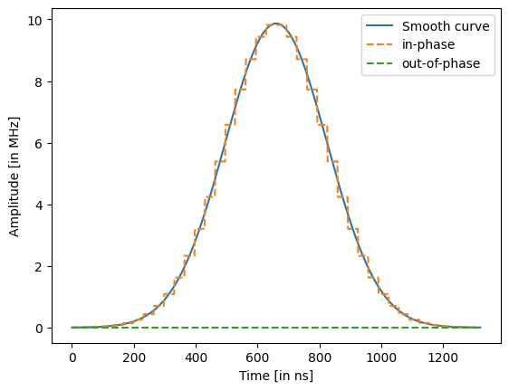
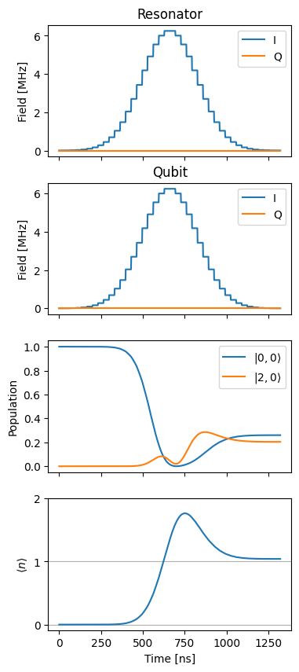
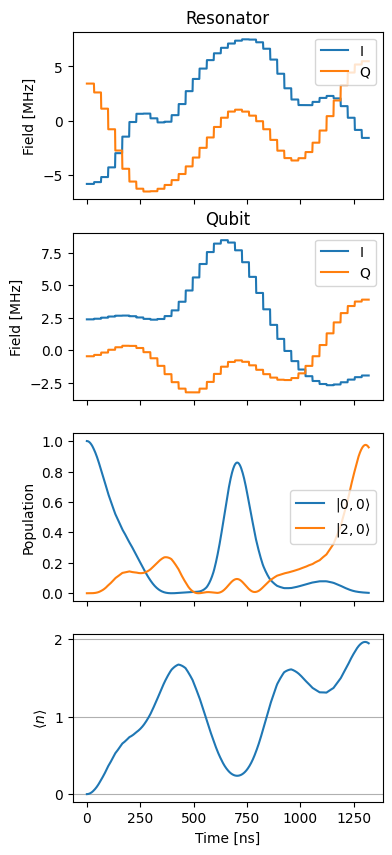
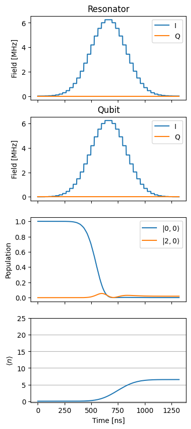
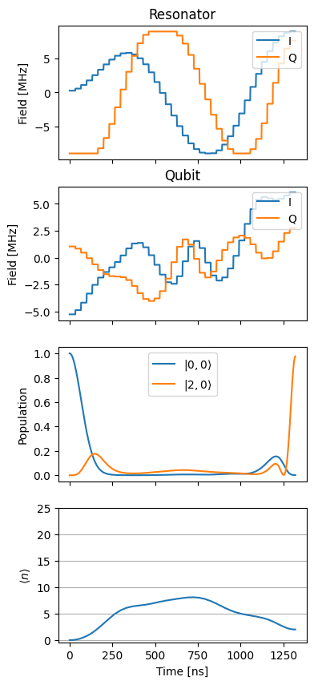

Arbitrary bosonic state preparation using GRAPE
===============================================

In this notebook, we implement a standard application of GRAPE, namely
the preparation of an arbitrary state of a bosonic mode, such a resonant
mode of a microwave cavity. In the notebook, we mostly follow the
optimization strategy of [Heeres2017]. The parameters are taken from
[Eickbusch2022] Table S1, without considering the anharmonicity for
simplicity and with the exception of the dispersive shift taken to be
:math:`10` times larger for simulation purposes. Our starting point is
the well-known Jaynes-Cummings Hamiltonian in the dispersive regime,
which describes an interaction of a qubit with a single bosonic mode
when the characteristic qubit frequency :math:`\omega_{q}` is far
detuned from the one of the resonator :math:`\omega_{r}` (see for
instance [Blais2021] for more details)

.. math::

   H_{\mathrm{disp}} = \omega_{r} a^{\dagger} a + \frac{\omega_{q}}{2} \sigma_z + \chi \sigma_z a^{\dagger} a,

where we set :math:`\hbar = 1`. The parameter :math:`\chi` is the
dispersive shift, which represents a qubit-state-dependent shift of the
frequency of the resonator. Note that we set conventionally
:math:`\sigma_z = | e \rangle \langle e | - |g \rangle \langle g |`,
with :math:`|e \rangle, |g \rangle` the excited and ground state of the
qubit, respectively. We additionally introduce a drive Hamiltonian on
both the qubit and the resonator mode, which we write directly within
the rotating wave approximation

.. math::

   H_{d, r}(t) = \varepsilon_{r}(t) e^{i \omega_{d, r} t} a + \varepsilon_{r}^*(t) e^{-i \omega_{d, r} t} a^{\dagger} , \quad H_{d, q}(t) = \varepsilon_{q}(t) e^{i \omega_{d, q} t} \sigma_- + \varepsilon_{q}^*(t) e^{-i \omega_{d, q} t} \sigma_+.

The total Hamiltonian is

.. math::

   H(t) = H_{\mathrm{disp}} + H_{d, r}(t) + H_{d, q}(t).

We assume that the qubit and the resonator are both driven resonantly,
i.e., :math:`\omega_{d, q} = \omega_q` and
:math:`\omega_{d,r}=\omega_r`, and work in the interaction picture
(rotating frame) with reference Hamiltonian

.. math::

   H_{\mathrm{ref}} = \omega_{r} a^{\dagger} a + \frac{\omega_{q}}{2} \sigma_z,

so that the Hamiltonian in the interaction picture is

.. math::

   H_{I}(t) = e^{i H_{\mathrm{ref}} t} (H(t) - H_{\mathrm{ref}}) e^{-i H_{\mathrm{ref}} t} = \chi \sigma_z a^{\dagger} a + \varepsilon_{r}(t) a + \varepsilon_{r}^*(t) a^{\dagger}  + \varepsilon_{q}(t) \sigma_- + \varepsilon_{q}^*(t) \sigma_+,

Our goal is to prepare the resonator in a Fock state
:math:`| n \rangle, \, n \in \mathbb{N}`, while keeping the qubit in the
ground state :math:`| g \rangle`. Thus, the target state is

.. math::

   | \Psi_{\mathrm{target}} \rangle = |n, g \rangle.

In the notebook, :math:`n` is set to :math:`2` as an example. We assume
that the system starts in the initial state

.. math::

   | \Psi_{\mathrm{initial}} \rangle = |0, g \rangle.

Let :math:`\varepsilon(t) = (\varepsilon_{r}(t), \varepsilon_{q}(t))`.
For a fixed time :math:`T`, the system evolves to a state
:math:`| \Psi(T; \varepsilon(t)) \rangle = U(T; \varepsilon(t)) | \Psi_{\mathrm{initial}} \rangle`.
We thus want to maximize the state fidelity, i.e., the overlap between
:math:`| \Psi_{\mathrm{target}} \rangle` and :math:`| \Psi(t) \rangle`:

.. math::

   \mathcal{F}(\varepsilon(t))  = | \langle \Psi(T; \varepsilon(t) ) )| \Psi_{\mathrm{target}} \rangle|^2.

In GRAPE we consider piecewise constant pulses with time step
:math:`\Delta t`. Each constant can take values in a certain subset
:math:`\mathcal{I} \in \mathbb{C}`. We denote by :math:`R` the range of
the piecewise constant pulse, i.e.,
:math:`R = \mathrm{max}_{\varepsilon, \varepsilon' \in \mathcal{I}} | \varepsilon - \varepsilon'|`.
Thus, in what follows :math:`R_r` and :math:`R_q` represent the range of
the resonator and qubit pulses, respectively.

.. code:: ipython3

    import numpy as np
    import matplotlib.pyplot as plt
    
    from paraqeet.quantity import Quantity
    from paraqeet.model.resonator import Resonator
    from paraqeet.model.qubit import Qubit
    from paraqeet.model.coupling import Coupling
    from paraqeet.signal.envelopes import GaussEnvelope
    from paraqeet.signal.pwc_generator import PWCGenerator
    from paraqeet.model.closed_system import ClosedSystem
    from paraqeet.model.rotating_frame_drive import RotatingFrameDrive
    from paraqeet.model.composite_hamiltonian import CompositeHamiltonian
    from paraqeet.measurement.state_transfer_fidelity import StateTransferFidelityGRAPE
    from paraqeet.measurement.weighted_sum_goal import WeightedSumGoal
    from paraqeet.propagation.scipy_expm_grape import ScipyExpmGRAPE
    from paraqeet.optimisation_map import OptimisationMap
    from paraqeet.optimisers.scipy_optimiser_gradient import ScipyOptimiserGradient
    from paraqeet.measurement.smoothness import Smoothness

We initialize our pulses as simple Gaussian envelopes. Additionally, we
require fix ranges for the minimum and maximum amplitudes.

.. code:: ipython3

    # in seconds (See Eickbusch et al https://arxiv.org/abs/2111.06414 S9 A)
    delta_sampling = 33e-9
    n_pwc = 40  # number of piecewiise constants in the pulse
    t_final = n_pwc * delta_sampling  # for now just set up for trying
    tlist = np.linspace(0, t_final, n_pwc + 1)
    eps_res = 2 * np.pi * 1.0  # initial amplitude of the resonator (in MHz)
    eps_max_res = 5 * eps_res  # maximum amplitude of the resonator (in MHz)
    eps_qubit = 2 * np.pi * 1.0  # initial amplitude of the qubit (in MHz)
    eps_max_qubit = 5 * eps_qubit  # maximum amplitude of the resonator (in MHz)
    tone_res = GaussEnvelope(
        amplitude=Quantity(eps_res * 1e6, -eps_max_res * 1e6, eps_max_res * 1e6),
        t_final=Quantity(t_final, 1 / 2 * t_final, 2 * t_final),
    )
    tone_qubit = GaussEnvelope(
        amplitude=Quantity(eps_qubit * 1e6, -eps_max_qubit * 1e6, eps_max_qubit * 1e6),
        t_final=Quantity(t_final, 1 / 2 * t_final, 2 * t_final),
    )
    gen_res = PWCGenerator(envelopes=[tone_res], tlist=tlist)
    gen_qubit = PWCGenerator(envelopes=[tone_qubit], tlist=tlist)

We plot the resonator tone and compare it to its smooth version.
Similarly one can plot the qubit tone.

.. code:: ipython3

    ts = np.linspace(0, t_final, 1001)
    
    plt.plot(ts / 1e-9, tone_res.compute_output(ts) / 1e6 / 2 * np.pi, label="Smooth curve")
    plt.plot(ts / 1e-9, np.real(gen_res.generate_signal(ts)) / 1e6 / 2 * np.pi, ls="--", label="in-phase")
    plt.plot(
        ts / 1e-9,
        np.imag(gen_res.generate_signal(ts)) / 1e6,
        ls="--",
        label="out-of-phase",
    )
    
    plt.xlabel("Time [in ns]")
    plt.ylabel("Amplitude [in MHz]")
    plt.legend()
    plt.show()

We define qubit and resonator parameters, as well as the list of
different Fock truncation numbers. We also set the target Fock state.

For now we set the Fock-state truncation at small values (3 and 4) for
testing the method. Later we demonstrate the method with (30 and 31)
levels in the resonator.

.. code:: ipython3

    # Increasing the number of Fock states gives a more realistic scenario, at the price of increasing the simulation time
    n_fock_truncation_list = [3, 4]
    fock_target = 2
    n_times = 1001
    
    omega_range_factor = 1e-3  # just for initialization of the Quantity object
    omega_res = 2 * np.pi * 5.26e9
    omega_qubit = 2 * np.pi * 6.65e9
    
    omega_drive_res = omega_res
    omega_drive_qubit = omega_qubit
    
    detuning_drive_res = omega_res - omega_drive_res
    detuning_drive_qubit = omega_qubit - omega_drive_qubit
    
    drive_res = RotatingFrameDrive(gen_res)
    drive_qubit = RotatingFrameDrive(gen_qubit)

Due to the infinite-dimensional nature of the Hilbert space of the
resonator, it is necessary to introduce a Fock state truncation number
:math:`N_{\mathrm{T}}`. This creates the problem that given certain
pulses :math:`\mathcal{F}` depends on the choice of
:math:`N_{\mathrm{T}}`. Following [Heeres2017], we thus consider
:math:`N_{\mathrm{T}} \in \{N_{\mathrm{T}}^{(\mathrm{min})}, N_{\mathrm{T}}^{(\mathrm{min})} + 1, \dots, N_{\mathrm{T}}^{(\mathrm{max})} \}`,
and introduce a penalty when having different values of fidelities for
different truncation numbers. Thus, we create different systems, and
accordingly fidelity measures, for the different Fock truncation
numbers.

.. code:: ipython3

    def create_experiment(n_fock_truncation_list, fock_target):
        """
        Create the inital and target states, for the given Fock numbers.
        Also create the propagations and measurements for the given truncation numbers and target Fock states.
        """
        resonator_list = []
        coupling_list = []
        model_list = []
        hamiltonian_list = []
        prop_list = []
        initial_state_list = []
        target_state_list = []
        fock_number_op_list = []
        fid_list = []
    
        qubit = Qubit(
            frequency=Quantity(
                value=detuning_drive_qubit,
                min_value=-omega_range_factor * omega_qubit,
                max_value=omega_range_factor * omega_qubit,
            ),
            drives=[drive_qubit],
        )
        ground_state_qubit = np.array([[0.0], [1.0]])
    
        # We take it to be 10 times the value in Eickbusch et al to speed up the simulation
        chi = 2 * np.pi * 32.81e3 * 10
    
        for n in n_fock_truncation_list:
            resonator = Resonator(
                frequency=Quantity(
                    value=detuning_drive_res,
                    min_value=-omega_range_factor * omega_res,
                    max_value=omega_range_factor * omega_res,
                ),
                dimension=n,
                drives=[drive_res],
            )
            resonator_list.append(resonator)
            coupling = Coupling(
                [resonator, qubit],
                is_longitudinal=True,
                coefficient=Quantity(value=chi, min_value=chi / 2, max_value=2 * chi),
            )
            coupling_list.append(coupling)
            ham = CompositeHamiltonian([resonator, qubit], [coupling])
            hamiltonian_list.append(ham)
            model = ClosedSystem(hamiltonian=ham)
            model_list.append(model)
            prop = ScipyExpmGRAPE(model, res=1e9)
    
            initial_res_state = np.zeros([n, 1], dtype=complex)
            initial_res_state[0, 0] = 1  # vacuum state
            initial_state = np.kron(initial_res_state, ground_state_qubit)
            initial_state_list.append(initial_state)
    
            target_res_state = np.zeros([n, 1], dtype=complex)
            target_res_state[fock_target, 0] = 1
            target_state = np.kron(target_res_state, ground_state_qubit)
            target_state_list.append(target_state)
    
            n_op = np.kron(np.diag([x for x in range(n)]), np.identity(2))
            fock_number_op_list.append(n_op)
    
            prop.set_initial_state(initial_state)
            prop.target_state = target_state
            prop.use_schirmer_derivative = True
    
            prop_list.append(prop)
    
            fid = StateTransferFidelityGRAPE(
                propagation=prop, initial_state=initial_state, target_state=target_state, times=tlist
            )
    
            fid_list.append(fid)
    
        return initial_state_list, target_state_list, fock_number_op_list, prop_list, fid_list
    
    
    initial_state_list, target_state_list, fock_number_op_list, prop_list, meas_list = create_experiment(
        n_fock_truncation_list, fock_target
    )

Furthermore, following [Heeres2017] we also introduce a penalty for
non-smooth pulses. In particular, we consider the (normalized) sum of
consecutive square differences of the pulse pixels as cost function (see
Eqs. 21 in the supplementary material of [Heeres2017]) for both the
resonator and the qubit pulses:

.. math:: g_{\mathrm{smooth}, r} (\varepsilon(t)) = 1.0 - \frac{1}{(N_{\mathrm{PWC}} - 1) R_r^2}\sum_{n=0}^{N_{\mathrm{PWC}} - 1} | \varepsilon_{r}((n+1) \Delta t) - \varepsilon_{r}((n) \Delta t) |^2,

.. math:: \quad g_{\mathrm{smooth}, q} (\varepsilon(t)) = 1.0- \frac{1}{(N_{\mathrm{PWC}} - 1) R_q^2} \sum_{n=0}^{N_{\mathrm{PWC}} - 1} | \varepsilon_{q}((n+1) \Delta t) - \varepsilon_{q}((n) \Delta t) |^2

.. code:: ipython3

    res_smoothness = Smoothness(pwc_generator=gen_res)
    qubit_smoothness = Smoothness(pwc_generator=gen_qubit)
    meas_list.append(res_smoothness)
    meas_list.append(qubit_smoothness)

We consider as cost function of the form

.. math::

   C(\varepsilon(t) ) = w_1 \sum_{N = N_{\mathrm{T}}^{(\mathrm{min})}}^{ N_{\mathrm{T}}^{(\mathrm{max})}} \mathcal{F}_{N} (\varepsilon(t) ) + w_2 g_{\mathrm{smooth}, r} (\varepsilon(t)) + w_3 g_{\mathrm{smooth}, q} (\varepsilon(t))   - \frac{w_4}{2} \sum_{N, N' = N_{\mathrm{T}}^{(\mathrm{min})}}^{ N_{\mathrm{T}}^{(\mathrm{max})}} \left[\mathcal{F}_{N}(\varepsilon(t))- \mathcal{F}_{N'} (\varepsilon(t) ) \right]^2,

that we want to maximize. This cost weighted cost function can be
constructed using the class WeightedSumGoal.

.. code:: ipython3

    weights = np.array([1.0 for _ in range(len(meas_list))])
    weights[-1] = 10.0
    weights[-2] = 10.0
    weight_sum_of_squares = -0.05
    total_sum_of_weights = np.sum(weights) + weight_sum_of_squares
    weights = weights / total_sum_of_weights
    weight_sum_of_squares = weight_sum_of_squares / total_sum_of_weights
    meas_list_bool = [True for meas in meas_list]
    meas_list_bool[-1] = False
    meas_list_bool[-2] = False
    sum_of_squares_options = {"weight": weight_sum_of_squares, "meas_bool": meas_list_bool}
    
    goal = WeightedSumGoal(meas_list, weights, sum_of_squares_options=sum_of_squares_options)

We can plot the initial pulses, as well as the corresponding relevant
dynamics.

.. code:: ipython3

    def plot_states_and_fock_number():
        """Plot the states."""
        item = 0
        ts = np.linspace(0, t_final, 1001)
        states = prop_list[item].propagate(ts)
        sig_res = gen_res.generate_signal(ts)
        sig_qubit = gen_qubit.generate_signal(ts)
        pop_initial_state = (np.abs(initial_state_list[item].conj().T @ states) ** 2).flatten()
        pop_target_state = (np.abs(target_state_list[item].conj().T @ states) ** 2).flatten()
    
        pop_initial_state = (np.abs(initial_state_list[item].conj().T @ states) ** 2).flatten()
    
        n_fock_avg = np.zeros(n_times, dtype=float)
        for k in range(n_times):
            n_fock_avg[k] = np.real((states[k].conj().T @ fock_number_op_list[item] @ states[k])[0, 0])
    
        _, ax = plt.subplots(4, figsize=(4, 10), sharex=True)
        ax[0].plot(ts / 1e-9, np.real(sig_res) / 1e6, label="I")
        ax[0].plot(ts / 1e-9, np.imag(sig_res) / 1e6, label="Q")
        ax[0].legend(loc=1)
        ax[0].set_ylabel("Field [MHz]")
        ax[0].set_title("Resonator")
        ax[1].plot(ts / 1e-9, np.real(sig_qubit) / 1e6, label="I")
        ax[1].plot(ts / 1e-9, np.imag(sig_qubit) / 1e6, label="Q")
        ax[1].legend(loc=1)
        ax[1].set_ylabel("Field [MHz]")
        ax[1].set_title("Qubit")
        ax[2].plot(ts / 1e-9, pop_initial_state, label="$|0,0 \\rangle$")
        ax[2].plot(ts / 1e-9, pop_target_state, label="$|2, 0 \\rangle$")
        ax[2].legend(loc="best")
        ax[2].set_ylabel("Population")
        ax[3].plot(ts / 1e-9, n_fock_avg)
        ax[3].set_ylabel("$\\langle n \\rangle$")
        if n_fock_truncation_list[item] < 10:
            y_fock_ticks = np.arange(n_fock_truncation_list[item])
        else:
            y_fock_ticks = np.arange(n_fock_truncation_list[item])[::5]
        ax[3].set_yticks(y_fock_ticks)
        ax[3].grid(axis="y")
        ax[-1].set_xlabel("Time [ns]")
        plt.show()
    
    
    plot_states_and_fock_number()

We can compute the fidelities for the different truncation numbers

.. code:: ipython3

    print(f"Fidelity at N_T={n_fock_truncation_list[0]} = {meas_list[0].measure()}")
    print(f"Fidelity at N_T={n_fock_truncation_list[1]} = {meas_list[1].measure()}")

.. parsed-literal::

    Fidelity at N_T=3 = 0.20391965494497966

.. parsed-literal::

    Fidelity at N_T=4 = 0.143585707648637

which are quite poor! We now proceed with the pulse optimization.

.. code:: ipython3

    max_iter = 1000  # set to 1000 for a good result; set to 10 for a quick example
    optmap = OptimisationMap()
    optmap.add(gen_res, gen_res.get_parameters())
    optmap.add(gen_qubit, gen_qubit.get_parameters())
    opt = ScipyOptimiserGradient(goal, optimisables=optmap)
    opt.set_options({"maxfun": max_iter})
    optmap.register_params_with_optimisables()

.. code:: ipython3

    optmap

.. parsed-literal::

    ==== <class 'paraqeet.signal.pwc_generator.PWCGenerator'> ====
    [Inphase: 3.13e+03  6.69e+03  1.37e+04  2.71e+04  5.15e+04  9.38e+04  1.64e+05  2.76e+05  4.46e+05  6.93e+05  1.03e+06  1.48e+06  2.04e+06  2.7e+06  3.43e+06  4.19e+06  4.92e+06  5.54e+06  6.01e+06  6.25e+06  6.25e+06  6.01e+06  5.54e+06  4.92e+06  4.19e+06  3.43e+06  2.7e+06  2.04e+06  1.48e+06  1.03e+06  6.93e+05  4.46e+05  2.76e+05  1.64e+05  9.38e+04  5.15e+04  2.71e+04  1.37e+04  6.69e+03  3.13e+03  , out-of-phase: 0  0  0  0  0  0  0  0  0  0  0  0  0  0  0  0  0  0  0  0  0  0  0  0  0  0  0  0  0  0  0  0  0  0  0  0  0  0  0  0  ]
    
    ==== <class 'paraqeet.signal.pwc_generator.PWCGenerator'> ====
    [Inphase: 3.13e+03  6.69e+03  1.37e+04  2.71e+04  5.15e+04  9.38e+04  1.64e+05  2.76e+05  4.46e+05  6.93e+05  1.03e+06  1.48e+06  2.04e+06  2.7e+06  3.43e+06  4.19e+06  4.92e+06  5.54e+06  6.01e+06  6.25e+06  6.25e+06  6.01e+06  5.54e+06  4.92e+06  4.19e+06  3.43e+06  2.7e+06  2.04e+06  1.48e+06  1.03e+06  6.93e+05  4.46e+05  2.76e+05  1.64e+05  9.38e+04  5.15e+04  2.71e+04  1.37e+04  6.69e+03  3.13e+03  , out-of-phase: 0  0  0  0  0  0  0  0  0  0  0  0  0  0  0  0  0  0  0  0  0  0  0  0  0  0  0  0  0  0  0  0  0  0  0  0  0  0  0  0  ]

.. code:: ipython3

    %%time
    opt.optimise()

.. parsed-literal::

    CPU times: user 2min 16s, sys: 1.15 s, total: 2min 17s
    Wall time: 38.9 s

.. parsed-literal::

    {'status': 1, 'value': 0.0022876645204834567, 'iterations': 175, 'message': 'CONVERGENCE: RELATIVE REDUCTION OF F <= FACTR*EPSMCH'}

We can now plot the new pulses and the corresponding dynamics. If the
number of iterations (max_iter) is chosen to be large enough, we should
see an improvement.

.. code:: ipython3

    plot_states_and_fock_number()

The new fidelities are

.. code:: ipython3

    print(f"Fidelity at N_T={n_fock_truncation_list[0]} = {meas_list[0].measure()}")
    print(f"Fidelity at N_T={n_fock_truncation_list[1]} = {meas_list[1].measure()}")

.. parsed-literal::

    Fidelity at N_T=3 = 0.9587725309766322
    Fidelity at N_T=4 = 0.9742004963529665

Setting truncation to higher values
-----------------------------------

Here we increase the system truncation to 30 and 31 levels and rerun the
entire simulation.

*Note - The following takes about 10-15 mins to run on a cluster (might
take more depending on the number of CPU cores available).*

We first reset the generator parameters (by redefining them), and
redefine the resonator with higher truncation numbers.

.. code:: ipython3

    # in seconds (See Eickbusch et al https://arxiv.org/abs/2111.06414 S9 A)
    delta_sampling = 33e-9
    n_pwc = 40  # number of piecewiise constants in the pulse
    t_final = n_pwc * delta_sampling  # for now just set up for trying
    tlist = np.linspace(0, t_final, n_pwc + 1)
    eps_res = 2 * np.pi * 1.0  # initial amplitude of the resonator (in MHz)
    eps_max_res = 5 * eps_res  # maximum amplitude of the resonator (in MHz)
    eps_qubit = 2 * np.pi * 1.0  # initial amplitude of the qubit (in MHz)
    eps_max_qubit = 5 * eps_qubit  # maximum amplitude of the resonator (in MHz)
    tone_res = GaussEnvelope(
        amplitude=Quantity(eps_res * 1e6, -eps_max_res * 1e6, eps_max_res * 1e6),
        t_final=Quantity(t_final, 1 / 2 * t_final, 2 * t_final),
    )
    tone_qubit = GaussEnvelope(
        amplitude=Quantity(eps_qubit * 1e6, -eps_max_qubit * 1e6, eps_max_qubit * 1e6),
        t_final=Quantity(t_final, 1 / 2 * t_final, 2 * t_final),
    )
    gen_res = PWCGenerator(envelopes=[tone_res], tlist=tlist)
    gen_qubit = PWCGenerator(envelopes=[tone_qubit], tlist=tlist)

.. code:: ipython3

    n_fock_truncation_list = [30, 31]
    fock_target = 2
    n_times = 1001
    
    omega_range_factor = 1e-3  # just for initialization of the Quantity object
    omega_res = 2 * np.pi * 5.26e9
    omega_qubit = 2 * np.pi * 6.65e9
    
    omega_drive_res = omega_res
    omega_drive_qubit = omega_qubit
    
    detuning_drive_res = omega_res - omega_drive_res
    detuning_drive_qubit = omega_qubit - omega_drive_qubit
    
    drive_res = RotatingFrameDrive(gen_res)
    drive_qubit = RotatingFrameDrive(gen_qubit)
    
    initial_state_list, target_state_list, fock_number_op_list, prop_list, meas_list = create_experiment(
        n_fock_truncation_list, fock_target
    )

lets also add the smoothness penalty to the measurement

.. code:: ipython3

    res_smoothness = Smoothness(pwc_generator=gen_res)
    qubit_smoothness = Smoothness(pwc_generator=gen_qubit)
    meas_list.append(res_smoothness)
    meas_list.append(qubit_smoothness)
    
    weights = np.array([1.0 for _ in range(len(meas_list))])
    weights[-1] = 10.0
    weights[-2] = 10.0
    weight_sum_of_squares = -0.05
    total_sum_of_weights = np.sum(weights) + weight_sum_of_squares
    weights = weights / total_sum_of_weights
    weight_sum_of_squares = weight_sum_of_squares / total_sum_of_weights
    meas_list_bool = [True for meas in meas_list]
    meas_list_bool[-1] = False
    meas_list_bool[-2] = False
    sum_of_squares_options = {"weight": weight_sum_of_squares, "meas_bool": meas_list_bool}
    
    goal = WeightedSumGoal(meas_list, weights, sum_of_squares_options=sum_of_squares_options)

And then plot the dynamics of the resonator under the unoptimised pulse

.. code:: ipython3

    plot_states_and_fock_number()

Initial fidelity before optimisation

.. code:: ipython3

    print(f"Fidelity at N_T={n_fock_truncation_list[0]} = {meas_list[0].measure()}")
    print(f"Fidelity at N_T={n_fock_truncation_list[1]} = {meas_list[1].measure()}")

.. parsed-literal::

    Fidelity at N_T=30 = 0.0191897809908802

.. parsed-literal::

    Fidelity at N_T=31 = 0.019189780990880208

We redefine the optimiser and perform the optimisation again with higher
truncation numbers

.. code:: ipython3

    max_iter = 1000  # set to 1000 for a good result; set to 10 for a quick example
    optmap = OptimisationMap()
    optmap.add(gen_res, gen_res.get_parameters())
    optmap.add(gen_qubit, gen_qubit.get_parameters())
    opt = ScipyOptimiserGradient(goal, optimisables=optmap)
    opt.set_options({"maxfun": max_iter})
    optmap.register_params_with_optimisables()

.. code:: ipython3

    %%time
    opt.optimise()

.. parsed-literal::

    CPU times: user 8h 32min 44s, sys: 25min 25s, total: 8h 58min 10s
    Wall time: 12min 23s

.. parsed-literal::

    {'status': 1, 'value': 0.003695502233559078, 'iterations': 269, 'message': 'CONVERGENCE: RELATIVE REDUCTION OF F <= FACTR*EPSMCH'}

The new fidelities are

.. code:: ipython3

    print(f"Fidelity at N_T={n_fock_truncation_list[0]} = {meas_list[0].measure()}")
    print(f"Fidelity at N_T={n_fock_truncation_list[1]} = {meas_list[1].measure()}")

.. parsed-literal::

    Fidelity at N_T=30 = 0.9756092572351025

.. parsed-literal::

    Fidelity at N_T=31 = 0.9755700654718467

And the dynamics of the system under these optimised pulses looks like
the following

.. code:: ipython3

    plot_states_and_fock_number()

References
----------

| [Heeres2017] R. Heeres et al., “Implementing a universal gate set on a
  logical qubit encoded in an oscillator”, Nature Communications 8, 94
  (2017)
| [Eickbusch2022] A. Eickbusch et al., “Fast Universal Control of an
  Oscillator with Weak Dispersive Coupling to a Qubit”, Nature Physics
  18, 1464–1469 (2022)
| [Blais2021] A. Blais, A. Grimsmo, S. Girvin and A. Wallraff, “Circuit
  quantum electrodynamics”, Review of Modern Physics 93, 025005 (2021)
