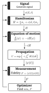

.. _concepts:

Concepts and architecture
=========================

ParaQeet is organized as a stack of layers. Each layer interacts only with the
layer above it in the hierarchy, which keeps the codebase modular: you can swap
a pulse parametrization, a propagator, or an optimizer without touching the
rest of the setup.

The layers
----------

**Signal** (:mod:`paraqeet.signal`)
   Pulse parametrizations. Envelope shapes such as
   :class:`~paraqeet.signal.envelopes.GaussEnvelope` or
   :class:`~paraqeet.signal.envelopes.DCRABEnvelope` are combined by generators
   like the :class:`~paraqeet.signal.iq_mixer.IQMixer` (envelope mixed with a
   local oscillator) or the :class:`~paraqeet.signal.pwc_generator.PWCGenerator`
   (piecewise-constant bins for GRAPE) into the control signal seen by the
   system.

**Model** (:mod:`paraqeet.model`)
   The physical system: Hamiltonians for qubits, transmons, and resonators,
   couplings and drives, composed with
   :class:`~paraqeet.model.composite_hamiltonian.CompositeHamiltonian`. The
   model layer turns a Hamiltonian into an equation of motion — the
   :class:`~paraqeet.model.schroedinger_equation.SchroedingerEquation` for
   closed systems or the Lindblad
   :class:`~paraqeet.model.master_equation.MasterEquation` for open systems.

**Propagation** (:mod:`paraqeet.propagation`)
   Solvers of the equation of motion, from piecewise matrix exponentials
   (:class:`~paraqeet.propagation.scipy_expm.ScipyExpm` and its GOAT/GRAPE
   variants) to Runge-Kutta and Verner ODE integrators. The GOAT and GRAPE
   variants propagate gradients alongside the state.

**Measurement** (:mod:`paraqeet.measurement`)
   Goal functions: state transfer and unitary fidelities, the Makhlin
   functional, pulse smoothness, and weighted sums of goals. A measurement
   reduces a propagated state to the scalar that the optimizer minimizes.

**Optimizers** (:mod:`paraqeet.optimizers`)
   Gradient-based (:class:`~paraqeet.optimizers.scipy_optimizer_gradient.ScipyOptimizerGradient`)
   and gradient-free (CMA-ES, Bayesian) algorithms, plus a dCRAB driver that
   grows the pulse basis between runs.

Parameters: ``Quantity`` and ``OptimizationMap``
------------------------------------------------

Two classes connect the layers to the optimizer:

- A :class:`~paraqeet.quantity.Quantity` represents every tunable value —
  amplitude, frequency, coupling strength — together with its bounds and unit.
  Internally it is stored on a normalized scale, so optimizers always work on
  well-conditioned values regardless of physical magnitude. Quantities can be
  derived from other quantities via relations and update automatically.

- An :class:`~paraqeet.optimization_map.OptimizationMap` collects which
  quantities of which objects are optimized in a given run. This makes the
  choice of optimization variables explicit and independent of the model
  definition: the same setup can optimize two parameters or twenty.

Choosing an optimization method
-------------------------------

.. list-table::
   :header-rows: 1
   :widths: 18 34 20 28

   * - Method
     - Pulse parametrization
     - Gradients
     - Example
   * - GOAT
     - Analytic envelopes (Gaussian, flat-top, …)
     - Analytic, exact
     - :doc:`notebooks/02B_Single_qubit_gate`
   * - GRAPE
     - Piecewise-constant bins
     - Analytic, exact
     - :doc:`notebooks/04A_GRAPE_TLS`
   * - GOAToverGRAPE
     - Analytic envelopes, propagated piecewise
     - Chain rule of GOAT through GRAPE
     - :doc:`notebooks/04C_Single_qubit_gate_GOAToverGRAPE`
   * - dCRAB
     - Randomized sinusoidal basis, grown iteratively
     - Gradient-based per iteration
     - :doc:`notebooks/02E_GOAToverGRAPE_dCRAB`
   * - Gradient-free
     - Any
     - None (CMA-ES, Bayesian)
     - :doc:`notebooks/02C_Qubit-bayesian-optimization`

As a rule of thumb: use GOAT when a few physical pulse parameters should stay
interpretable, GRAPE when you want maximum pulse flexibility per time bin, and
GOAToverGRAPE/dCRAB when you want smooth analytic pulses with the propagation
efficiency of GRAPE. Gradient-free methods are a fallback for measures without
gradients, e.g. when optimizing directly against an experiment.

See the :doc:`quickstart` for a complete GOAT example, or the
:doc:`example gallery <notebooks/index>` for all of the above.
