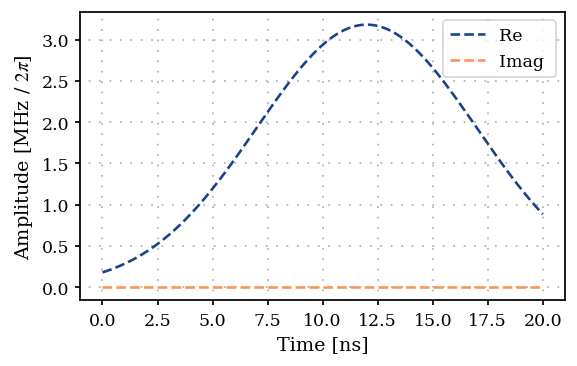
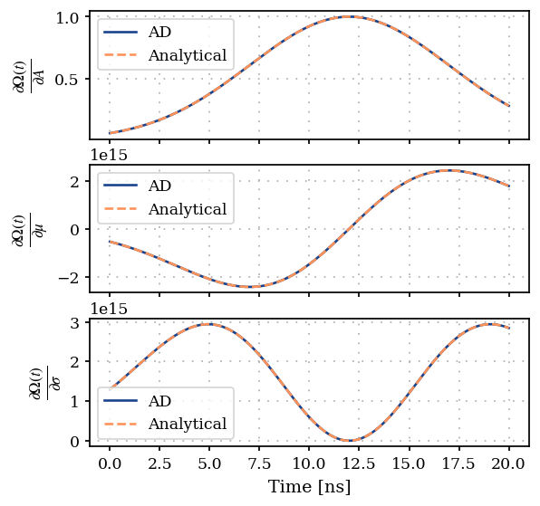
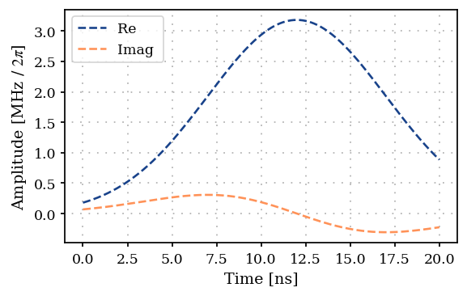
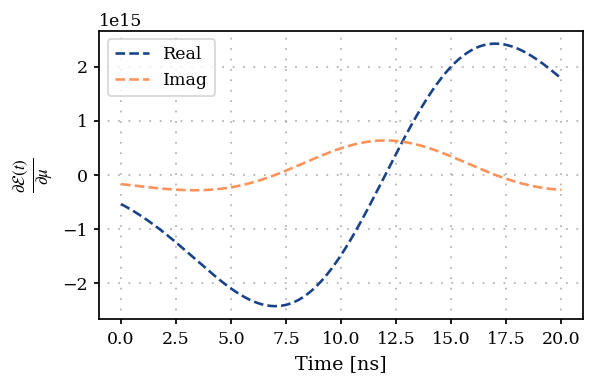

Gradient evaluation in ParaQeet
===============================

ParaQeet builds on the idea of the *semi-automatic differentiation*
[Georz2022] and combines automatic differentiaion (AD) with analytic
gradients from quantum optimal control methods to provide a resource
efficient and flexible framework for optimal control. It is designed in
a top-down modular structure, where each module can be differentiated.
Modules providing gradient values are derived from the base class
:math:`\texttt{Differentiable}`. All the classes deriving from
:math:`\texttt{Differentiable}` provide a ``get_value_and_gradient``
method that returns the value and the gradient.

This notebook provides an overview of the gradient computation in all
the modules and aims to explain how gradients are chained across the
package.

Chain rule based gradient computation
-------------------------------------

The aim here is to compute the gradients of an objective function
:math:`(\mathcal{F})`, a :math:`\texttt{Measurement}` in ParaQeet, with
respect to the parameters of the input pulse :math:`(\vec{\alpha})`.
Computing this derivative for a state-transfer fidelity
:math:`(\mathcal{F}(t) = |\phi|^2 = |\langle \lambda | \psi(t) \rangle|^2)`
for a pulse :math:`(u(t))` would lead to computing the terms

.. math:: \frac{\partial \mathcal{F}(t) }{\partial \alpha} = \frac{\partial \mathcal{F}(t)}{\partial \phi}  \frac{\partial \phi}{\partial u} \frac{\partial u}{\partial \alpha}.

Practically the pulse contains multiple elements, and the objective
function may be a sum of multiple fidelities. Computing the derivative,
thus, amounts to systematic use of chain rule. This is computed by
forward propagating the gradients through the modules

.. math:: \frac{\partial v_k }{\partial \alpha} = \sum_{i < k} \frac{\partial v_k} {\partial v_i} \frac{\partial v_i}{\partial \alpha},

where :math:`v_k` are values of the intermediate steps, and
:math:`v_N = \mathcal{F}(t)` for some :math:`N`.

Thus each module computes the gradients for its own parameters, and also
collects the gradients propagated through the prior modules. As shown in
the flow-chart below the gradients from the device class
(:math:`\texttt{signal}`) is passed down to the :math:`\texttt{model}`,
through :math:`\texttt{propagation}` and finally to the
:math:`\texttt{measurement}`.

.. raw:: html

   

.. raw:: html

   

Below we explain the gradient flow across the package by using some
examples.

1. The :math:`\texttt{signal}` module
-------------------------------------

Here signal generation is modeled by modeling the components used in
classical signal generation, including :math:`\texttt{Waveform}`
generator, :math:`\texttt{LocalOscillator}`, :math:`\texttt{IQMixer}`,
etc.

The :math:`\texttt{Waveform}` class derives from the
:math:`\texttt{Optimizable}` and :math:`\texttt{Differentiable}` base
classes and offers the ``get_value`` and ``get_value_and_gradient``
methods. This class implements a fallback to AD for computing gradients
in case a ``get_value_and_gradient`` method is not specified. It expects
the ``_evaluate`` method to be a pure-JAX function, with arguments as
``jax.Array``. Further, all the classes deriving from
:math:`\texttt{Waveform}` support differentiation of complex output.

The :math:`\texttt{signal}` module includes the
:math:`\texttt{Envelopes}` class which defines the shape of a pulse.
Lets define an example envelope of a Gaussian

.. math:: \Omega(t) = A \, e^{-\frac{(t - \mu)^2}{2\sigma^2}}.

\ And try to plot its gradients.

.. code:: ipython3

    from functools import partial
    
    import jax.numpy as jnp
    import numpy as np
    from jax import jit
    
    from paraqeet import Array, Quantity
    from paraqeet.signal.envelopes import Envelope
    
    
    class ExampleEnvelope(Envelope):
        """Example envelope implementing a Gaussian envelope."""
    
        _amplitude: Quantity
        _t_final: Quantity
        _t_up: Quantity
        _t_down: Quantity
        _ramp_time: Quantity
    
        def __init__(self):
            self._amplitude = Quantity(
                20e6,
                min_value=jnp.array(0.0),
                max_value=jnp.array(50e6),
                name="amplitude",
            )
    
            self._mu = Quantity(
                12e-9,
                min_value=jnp.array(0.0),
                max_value=jnp.array(20e-9),
                name="mu",
            )
    
            self._sigma = Quantity(
                5e-9,
                min_value=jnp.array(0.0),
                max_value=jnp.array(10e-9),
                name="sigma",
            )
    
        def get_parameters(self):
            """Get parameters Amplitude, Mu, sigma."""
            return [self._amplitude, self._mu, self._sigma]
    
        @partial(jit, static_argnums=(0,))
        def _evaluate(self, amp: Array, mu: Array, sigma: Array, t: Array):
            return jnp.squeeze(amp * jnp.exp(-((t - mu) ** 2 / (2 * sigma**2))))
    
        def get_value(self, times: Array | float) -> Array:
            """Get value of envelope."""
            amp = self._amplitude.get_value()
            mu = self._mu.get_value()
            sigma = self._sigma.get_value()
            return self._evaluate(amp, mu, sigma, times)
    
    
    tone = ExampleEnvelope()

Plotting the signal

.. code:: ipython3

    import matplotlib.pyplot as plt
    from plotting import plot_signal
    
    t_final = 20e-9
    ts = np.linspace(0, t_final, 501)
    sig, grads = tone.get_value_and_gradient(ts)
    
    fig, ax = plt.subplots(1, figsize=(5, 3))
    plot_signal(tone, ts, ax, linestyle="--")
    plt.show()

Computing the gradients using the ``get_value_and_gradient`` method, we
get

.. code:: ipython3

    value, grads = tone.get_value_and_gradient(ts)
    grads

.. parsed-literal::

    Array([], shape=(501, 0), dtype=float64)

The gradients are currently empty as the ``OptimizationMap`` is not
defined yet. Lets define the optmap and add the ``tone`` to it. We need
to “register” the parameters using ``register_params_with_optimizables``
method to inform the specified classes which parameters are being
optimized.

.. code:: ipython3

    from paraqeet.optimization_map import OptimizationMap
    
    optmap = OptimizationMap()
    optmap.add(tone)
    optmap.register_params_with_optimizables()
    optmap

.. parsed-literal::

    ==== <class '__main__.ExampleEnvelope'> ====
    [amplitude: 2e+07, mu: 1.2e-08, sigma: 5e-09]

.. code:: ipython3

    value, grads = tone.get_value_and_gradient(ts)
    grads.shape

.. parsed-literal::

    (501, 3)

Note that the shape of the gradients is (t, num_params). Here there are
3 parameters added to the ``optmap``.

Lets compare the gradients with analytical formulas

.. code:: ipython3

    def der_gaussian(amp, mu, sigma, t):
        """derivative of Gaussian envelope."""
        # Derivative w.r.t amp
        f = jnp.exp(-((t - mu) ** 2) / (2 * sigma**2))
        # Derivative w.r.t mu
        dmu = amp * f * (t - mu) / sigma**2
        # Derivative w.r.t sigma
        dsigma = amp * f * ((t - mu) ** 2 / sigma**3)
        return f, dmu, dsigma
    
    
    params = tone.get_parameters()
    damp, dmu, dsigma = der_gaussian(params[0].get_value(), params[1].get_value(), params[2].get_value(), ts)
    
    fig, ax = plt.subplots(3, figsize=(5, 5), sharex=True)
    ax[0].plot(ts / 1e-9, grads[:, 0, ...], linestyle="-", label="AD")
    ax[0].plot(ts / 1e-9, damp, linestyle="--", label="Analytical")
    ax[0].grid(True, linestyle=(1, (1, 5)), linewidth=1)
    ax[0].legend()
    
    ax[1].plot(ts / 1e-9, grads[:, 1, ...], linestyle="-", label="AD")
    ax[1].plot(ts / 1e-9, dmu, linestyle="--", label="Analytical")
    ax[1].grid(True, linestyle=(1, (1, 5)), linewidth=1)
    ax[1].legend()
    
    ax[2].plot(ts / 1e-9, grads[:, 2, ...], linestyle="-", label="AD")
    ax[2].plot(ts / 1e-9, dsigma, linestyle="--", label="Analytical")
    ax[2].grid(True, linestyle=(1, (1, 5)), linewidth=1)
    ax[2].legend()
    
    ax[0].set_ylabel(r"$\frac{\partial \Omega(t)}{\partial A}$", fontsize=14)
    ax[1].set_ylabel(r"$\frac{\partial \Omega(t)}{\partial \mu}$", fontsize=14)
    ax[2].set_ylabel(r"$\frac{\partial \Omega(t)}{\partial \sigma}$", fontsize=14)
    ax[-1].set_xlabel("Time [ns]")
    plt.show()

Further, the signal module includes filter functions and
:math:`\texttt{DRAGMixer}` to modify the pulse shape. Lets include a
:math:`\texttt{FlatTopGaussianFilter}`
:math:`(\epsilon(t) = s(t) \Omega(t))` on top of this pulse and add the
DRAG component. The final pulse would be

.. math::  \mathcal{E}(t) = s(t) \Omega(t) - i \frac{\dot{\epsilon(t)}}{\delta}.

The derivative of this pulse wrt parameters like :math:`\mu` can be
evaluated by

.. math::  \frac{\partial \mathcal{E}(t)}{\partial \mu} = s(t) \frac{\partial \Omega(t)}{\partial \mu} - \frac{i}{\delta} \frac{\partial^2  (s(t) \Omega(t))}{\partial \mu \, \partial t} 

.. code:: ipython3

    from paraqeet.signal.waveform import DRAGMixer, FlatTopGaussianFilter
    
    drag_tone = DRAGMixer(tone)
    filtered_tone = FlatTopGaussianFilter(
        envelopes=drag_tone, t_final=Quantity(t_final, 1 / 2 * t_final, 2 * t_final, name="t_final")
    )
    
    optmap.remove(tone)
    optmap.add(drag_tone)
    optmap.register_params_with_optimizables()
    optmap

.. parsed-literal::

    ==== <class 'paraqeet.signal.waveform.DRAGMixer'> ====
    [amplitude: 2e+07, mu: 1.2e-08, sigma: 5e-09, Delta: -1.26 GHz]

.. code:: ipython3

    fig, ax = plt.subplots(1, figsize=(5, 3))
    
    plot_signal(drag_tone, ts, ax, linestyle="--")
    plt.show()

Lets plot the derivative with :math:`\mu`

.. code:: ipython3

    value, grads = drag_tone.get_value_and_gradient(ts)
    
    fig, ax = plt.subplots(1, figsize=(5, 3), sharex=True)
    ax.plot(ts / 1e-9, np.real(grads[:, 1, ...]), linestyle="--", label="Real")
    ax.plot(ts / 1e-9, np.imag(grads[:, 1, ...]), linestyle="--", label="Imag")
    ax.grid(True, linestyle=(1, (1, 5)), linewidth=1)
    ax.legend()
    ax.set_xlabel("Time [ns]")
    ax.set_ylabel(r"$\frac{\partial \mathcal{E}(t)}{\partial \mu}$", fontsize=14)
    plt.show()

Now there is the added imaginary component in the derivative.

Finally, the ``Generator`` class gathers the gradients from individual
components and returns them.

.. code:: ipython3

    from paraqeet.signal.iq_mixer import IQMixer
    
    gen = IQMixer(envelopes=[tone])
    
    optmap.remove(drag_tone)
    optmap.add(gen)
    optmap.register_params_with_optimizables()
    optmap

.. parsed-literal::

    ==== <class 'paraqeet.signal.iq_mixer.IQMixer'> ====
    [amplitude: 2e+07, mu: 1.2e-08, sigma: 5e-09, lo_freq: 4.8 GHz x 2pi, Phase: 0 rad]

.. code:: ipython3

    value, grads = gen.get_value_and_gradient(ts)
    grads.shape

.. parsed-literal::

    (501, 5)

Note that now that the optmap has 5 elements, the gradients generated by
the generator is also 5.

2. The :math:`\texttt{Model}` module
------------------------------------

:math:`\texttt{Model}` includes the Hamiltonian, Drive and coupling. Due
to the parameter dependence are only in the coefficient of the
operators, computing derivatives just results in multiplying the signal
gradient with the respective operator. For a Hamiltonian of the from
:math:`H(t) = H_0 + u(\alpha, t) H_d`, where :math:`u(\alpha, t)` is the
drive signal

.. math::  \frac{\partial H(t)}{\partial \alpha} = \frac{\partial u(t)}{\partial \alpha} H_d.

Note that similar operation can also be performed to compute the
gradients with respect to the model parameters, for e.g., the the
coupling strength between two subsystems, by adding the corresponding
quantity to the optmap. Thus we can put the optimization of the model
and pulse parameter on the same footing.

For this example, lets define a qubit, given by the Hamiltonian

.. math:: H(t)=H_\text{drift}+H_c(t)= \frac{\omega_q}{2} \sigma_z + \Omega(t)\sigma_x, 

and add its frequency and drive parameters to the optmap.

.. code:: ipython3

    from paraqeet.model.drive import Drive
    from paraqeet.model.qubit import QubitHamiltonian
    
    freq_q = 4.8e9
    omega_q = 2 * np.pi * freq_q
    sigma_x = jnp.array([[0.0, 1.0], [1.0, 0.0]])
    
    drive = Drive(sigma_x, gen, add_hermitian=False)
    qubit_hamiltonian = QubitHamiltonian(
        frequency=Quantity(omega_q, 0.8 * omega_q, 1.2 * omega_q, unit="Hz", name="Qubit Freq"), drives=[drive]
    )
    
    model_params = qubit_hamiltonian.get_parameters()

.. code:: ipython3

    optmap.add(qubit_hamiltonian, model_params[-1])
    optmap.register_params_with_optimizables()
    optmap

.. parsed-literal::

    ==== <class 'paraqeet.signal.iq_mixer.IQMixer'> ====
    [amplitude: 2e+07, mu: 1.2e-08, sigma: 5e-09, lo_freq: 4.8 GHz x 2pi, Phase: 0 rad]
    
    ==== <class 'paraqeet.model.qubit.QubitHamiltonian'> ====
    [Qubit Freq: 30.2 GHz]

We see now that the optmap has an additional parameter. Let’s compute
the gradient of the Hamiltonian and check the number of components.

.. code:: ipython3

    value, grads = qubit_hamiltonian.get_value_and_gradient(ts)
    grads.shape

.. parsed-literal::

    (501, 6, 2, 2)

The gradients now has the shape (t, num_params, dim, dim), where dim is
the dimension of the Hilbert space. We see that the gradients now has 6
parameters as expected.

Similarly the equation of motion (EOM) returns the gradients of the
right hand side of the EOM.

.. code:: ipython3

    from paraqeet.model.schroedinger_equation import SchroedingerEquation
    
    schrgl = SchroedingerEquation(
        hamiltonian_func=qubit_hamiltonian.get_value,
        hamiltonian_gradient_func=qubit_hamiltonian.get_gradient,
    )
    
    value, grads = schrgl.get_value_and_gradient(ts)
    grads.shape

.. parsed-literal::

    (501, 6, 2, 2)

3. The :math:`\texttt{Propagation}` Module
------------------------------------------

The :math:`\texttt{Propagation}` module computes the derivative of the
unitary operator generated by the time-dependent Hamiltonian by using
quantum optimal control methods like GRAPE and GOAT. These methods work
for specific pulse ansatz, for e.g. GRAPE require a piecewise constant
(PWC) ansatz, and GOAT requires a continuous ansatz. These methods
provide ways to propagate the derivative of the Hamiltonian to compute
derivative of the state-overlap and the unitary operator, respectively.

The gradients computed in GRAPE are computed by:

.. math:: \frac{\partial \Phi(T)}{\partial u_n} = \bra{\tilde{\lambda}(t_n)} \frac{\partial U_n}{\partial u_n} \ket{\psi(t_n)} 

where :math:`u_n = u(t_n)` is the PWC pulse value,
:math:`\ket{\tilde{\lambda}(t)}` the reverse-propagated target state,
:math:`\ket{\psi(t)}` the forward propagated initial state, and
:math:`\Phi(T) = \langle{\lambda}|{\psi(T)}\rangle` the state-overlap.

The gradients computed in GOAT are computed by the solution of:

.. math::

   \frac{\partial}{\partial t}
   \begin{pmatrix}
   U(t) \\[4pt]
   \partial_{\alpha_k} U(t)
   \end{pmatrix}
   = -i
   \begin{pmatrix}
   H(\vec{\alpha}, t) & 0 \\[4pt]
   \partial_{\alpha_k} H(\vec{\alpha}, t) & H(\vec{\alpha}, t)
   \end{pmatrix}
   \begin{pmatrix}
   U(t) \\[4pt]
   \partial_{\alpha_k} U(t)
   \end{pmatrix}.

Furthermore, in ParaQeet, we perform state evolution as a default to
perform matrix-vector products instead of matrix-matrix products. So
here we instead compute

.. math:: \frac{\partial \ket{\psi(t)}}{\partial \alpha} = \frac{\partial U(t)}{\partial \alpha} \ket{\psi(0)}.

In this example we look at the gradients computed using GOAT by using
the propagation module :math:`\texttt{ScipyExpmGOAT}` at the initial and
the final time points.

.. code:: ipython3

    from paraqeet.propagation.scipy_expm_goat import ScipyExpmGOAT
    
    times = np.array([0.0, t_final])
    
    init = np.array([[1.0], [0.0]])  # |0>
    target = np.array([[0.0], [1.0]])  # |1>
    
    prop = ScipyExpmGOAT(
        eom_func=schrgl.get_value, eom_gradient_func=schrgl.get_gradient, resolution=10e9, initial_state=init
    )
    
    value, grads = prop.get_value_and_gradient(times)
    grads.shape

.. parsed-literal::

    (2, 6, 2, 1)

4. The :math:`\texttt{Measurement}` Module
------------------------------------------

Finally, the gradient of the cost function with respect to the pulse
parameters can be compute by following the chain rule,

.. math:: \frac{\partial \mathcal{C}}{\partial \alpha} = \frac{\partial \mathcal{C}}{\partial \mathcal{F}} \frac{\partial \mathcal{F}}{\partial \Phi} \frac{\partial \Phi}{\partial \ket{\psi}} \frac{\partial \ket{\psi}}{\partial \alpha},

where :math:`\mathcal{F}` is the fidelity, and :math:`\Phi` is the
overlap :math:`\langle \lambda | \psi(t) \rangle`. Usually,
:math:`\mathcal{C} = 1 - \mathcal{F}`, and the gradient of the evolved
state with respect to pulse parameters can be computed using GOAT/GRAPE.

The measurement class thus encodes a way to compute the two terms
:math:`\frac{\partial \mathcal{F}}{\partial \Phi}` and
:math:`\frac{\partial \Phi}{\partial \ket{\psi}}`, either using
analytical method or using AD.

For a state-transfer fidelity problem,
:math:`\mathcal{F} = |\Phi|^2 = |\langle \lambda | \psi(t) \rangle|^2`.
Then

.. math:: \frac{\partial \mathcal{F}}{\partial \Phi} = \frac{1}{2} \left( \Phi^* \frac{\partial \Phi}{\partial \alpha} +  \frac{\partial \Phi}{\partial \alpha}^* \Phi  \right) =  \frac{1}{2} \left( \Phi^* \left(\bra{\lambda}\frac{\partial \ket{\psi}}{\partial \alpha} \right) +  \left(\bra{\lambda}\frac{\partial \ket{\psi}}{\partial \alpha}\right)^* \Phi  \right)

.. code:: ipython3

    from paraqeet.measurement.state_transfer_fidelity import StateTransferFidelity
    from paraqeet.measurement.utils import overlap_state_vector
    
    measure = StateTransferFidelity(
        propagation_func=prop.propagate,
        propagation_gradient_func=prop.get_gradient,
        target_state=target,
        overlap=overlap_state_vector,
    )
    value, grads = measure.get_value_and_gradient(times)
    
    grads.shape

.. parsed-literal::

    (6,)

These gradient values can now be passed to an optimizer to optimize the
parameters of the pulse.

References
----------

[Georz2022] Goerz, Michael H., Sebastián C. Carrasco, and Vladimir S.
Malinovsky. “Quantum optimal control via semi-automatic
differentiation.” Quantum 6 (2022): 871.
