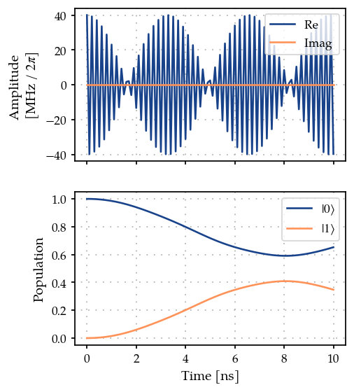
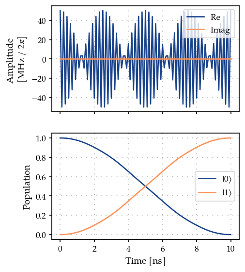

State preparation of a single spin
==================================

In this notebook, we will study a simple problem of state preparation
for a single spin or qubit.

.. code:: ipython3

    import numpy as np
    
    from paraqeet.measurement.state_transfer_fidelity import StateTransferFidelity
    from paraqeet.model.closed_system import ClosedSystem
    from paraqeet.model.drive_operator import DriveOperator
    from paraqeet.model.qubit import Qubit
    from paraqeet.optimization_map import OptimizationMap
    from paraqeet.optimizers.scipy_optimizer import ScipyOptimizer
    from paraqeet.propagation.scipy_expm import ScipyExpm
    from paraqeet.quantity import Quantity
    from paraqeet.signal.envelopes import ConstantEnvelope
    from paraqeet.signal.iq_mixer import IQMixer

System Setup
------------

We first set up the qubit system we want to control. We set the qubit
frequency :math:`\omega_q / 2 \pi` to be :math:`4.8` GHz and define the
Hamiltonian as

.. math:: H(t)=H_\text{drift}+H_c(t)= \frac{\omega_q}{2} \sigma_z + \Omega(t)\sigma_x, 

\ where :math:`\Omega(t)` will be supplied by the generator.

.. code:: ipython3

    freq_q = 4.8e9
    omega_q = 2 * np.pi * freq_q
    
    controlled_qubit = Qubit(frequency=Quantity(omega_q, 0.8 * omega_q, 1.2 * omega_q, unit="Hz", two_pi=True), drives=[])
    model = ClosedSystem(controlled_qubit)

For signal generation, we define a simple cosine shaped tone generator
:math:`A \cos(\omega t)`

.. code:: ipython3

    tone = ConstantEnvelope()
    gen = IQMixer(envelopes=[tone])

We can inspect the pre-defined parameters with

.. code:: ipython3

    params_tone = tone.get_parameters()
    print(params_tone)
    params_gen = gen.get_parameters()
    print(params_gen)

.. parsed-literal::

    [Amplitude: 24.7 MHz x 2pi, t_final: 32 ns]
    [Amplitude: 24.7 MHz x 2pi, t_final: 32 ns, lo_freq: 4.8 GHz x 2pi, Phase: 0 rad]

In this notebook, we would like to optimize the amplitude ``Amplitude``
and frequency ``lo_freq`` if the drive. We add a drive on the qubit.

.. code:: ipython3

    drive = DriveOperator(gen, is_longitudinal=False)
    controlled_qubit.drives = [drive]
    model = ClosedSystem(controlled_qubit)

Textbook values for implementing an :math:`X` rotation on this system at
a time :math:`T` would be :math:`\omega=\omega_q` and :math:`A=\pi/T`.
We use some offset from these values as initial guess to demonstrate the
optimization procedure.

.. code:: ipython3

    t_simu = 10e-9
    params_gen[0].set_value(0.8 * np.pi / t_simu)
    params_gen[2].set_value(1.01 * omega_q)

It is important to note that, although we changed the parameters of
``params_gen`` the corresponding parameter of ``params_tone`` also
changes, due Python’s “Pass By Object Reference” scheme. In fact,

.. code:: ipython3

    print(params_tone)
    print(params_gen)

.. parsed-literal::

    [Amplitude: 40 MHz x 2pi, t_final: 32 ns]
    [Amplitude: 40 MHz x 2pi, t_final: 32 ns, lo_freq: 4.85 GHz x 2pi, Phase: 0 rad]

We can try to see what happens if we print the gradient of the
controlled qubit at the time ``t_simu``:

.. code:: ipython3

    print(controlled_qubit.get_gradient_at_timestep(np.array([t_simu])))

.. parsed-literal::

    []

We see that in this case it is empty. This is because, we haven’t yet
defined an ``OptimizationMap`` object that defines the optimizable
parameters. Also note that the tone parameter ``t_final`` is simply the
time after which the pulse it is assumed to be zero and it is set by
default to :math:`32 \, \mathrm{ns}`. This is not necessarily the
simulation time, which is another parameter of our choice called
``t_simu`` in this case.

Next, we select a propagation method, piecewise constant exponentation,
and configure a state transfer problem from :math:`\ket{0}` to
:math:`\ket{1}`.

.. code:: ipython3

    prop = ScipyExpm(model, resolution=100e9)  # implicit timestep is 1 / resolution
    times = np.array([0.0, t_simu])
    
    
    init = np.array([[1.0], [0.0]])  # |0>
    target = np.array([[0.0], [1.0]])  # |1>
    zeroone = StateTransferFidelity(
        propagation=prop,
        initial_state=init,
        target_state=target,
    )

Population dynamics
-------------------

.. code:: ipython3

    from plotting import plot_signal_and_dynamics
    
    ts = np.linspace(0.0, t_simu, 101)
    plot_signal_and_dynamics(gen, prop, ts, state_labels=[r"$|0\rangle$", r"$|1\rangle$"]);

As expected, we get a partial transfer and a low fidelity.

.. code:: ipython3

    print(f"State fidelity: {zeroone.measure(times)}")

.. parsed-literal::

    State fidelity: 0.34736071270511687

Optimization
------------

We define an optimizer and link our fidelity measure as a goal function
and the parameters of the cosine tone.

.. code:: ipython3

    optmap = OptimizationMap()
    optmap.add(gen, [params_gen[0], params_gen[2]])
    opt = ScipyOptimizer(zeroone, optimization_map=optmap)

One might think that the gradient associated with ``controlled_qubit``
would not be empty, but instead

.. code:: ipython3

    controlled_qubit.get_gradient_at_timestep(np.array([t_simu]))

.. parsed-literal::

    Array([], shape=(0, 2, 2), dtype=float64)

This is because, the parameters have been passed, but not “registered”
by ``optmap``. To remedy this

.. code:: ipython3

    optmap.register_params_with_optimizables()
    print(controlled_qubit.get_gradient_at_timestep(np.array([t_simu])))

.. parsed-literal::

    [[[-0.        +0.j        -0.49605735+0.j       ]
      [-0.49605735+0.j        -0.        +0.j       ]]
    
     [[ 0.        -0.j        -0.15749839-1.2467281j]
      [-0.15749839-1.2467281j  0.        -0.j       ]]]

.. code:: ipython3

    tone.get_value_and_gradient([t_simu])

.. parsed-literal::

    (Array(2.51327412e+08, dtype=float64), Array([[1.]], dtype=float64))

In this case, as expected, we get two matrices which represent the
gradient of the qubit Hamiltonian with respect to the two parameters we
want to optimize, which can be accessed via the optmap as

.. code:: ipython3

    print(optmap.get_all_parameters())

.. parsed-literal::

    [Amplitude: 40 MHz x 2pi, lo_freq: 4.85 GHz x 2pi]

We can now run the optmization as

.. code:: ipython3

    print(opt.optimize(times))

.. parsed-literal::

    {'status': 1, 'value': 3.008704396734174e-13, 'iterations': 33, 'message': 'CONVERGENCE: NORM OF PROJECTED GRADIENT <= PGTOL'}

The new optimal parameters are

.. code:: ipython3

    print(optmap.get_all_parameters())

.. parsed-literal::

    [Amplitude: 50.2 MHz x 2pi, lo_freq: 4.8 GHz x 2pi]

We can now plot the optimized dynamics

.. code:: ipython3

    plot_signal_and_dynamics(gen, prop, ts, state_labels=[r"$|0\rangle$", r"$|1\rangle$"]);

We can see from the plot and optimizer output that we have found good
controls.

.. code:: ipython3

    print(f"State fidelity: {zeroone.measure(times)}")

.. parsed-literal::

    State fidelity: 0.9999999999996274

In this notebook, we focused on state preparation. In the next notebook,
we will show how to perform the optimization directly in terms of gate
fidelity.
