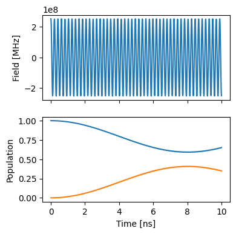
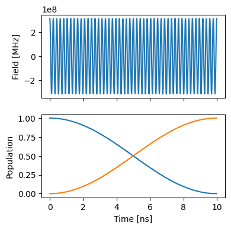

State transfer control of a single spin
=======================================

First, we make the necessary imports.

.. code:: ipython3

    import matplotlib.pyplot as plt
    
    import numpy as np
    
    from paraqeet.optimization_map import OptimizationMap
    from paraqeet.quantity import Quantity
    from paraqeet.measurement.state_transfer_fidelity import StateTransferFidelity
    from paraqeet.model.drive_operator import DriveOperator
    from paraqeet.model.qubit import Qubit
    from paraqeet.propagation.scipy_expm import ScipyExpm
    from paraqeet.optimizers.scipy_optimizer import ScipyOptimizer
    
    from paraqeet.model.closed_system import ClosedSystem
    
    from paraqeet.signal.iq_mixer import IQMixer
    from paraqeet.signal.envelopes import ConstantEnvelope

System Setup
------------

For signal generation, we define a simple cosine shaped tone generator
:math:`A \cos(\omega t)`

.. code:: ipython3

    tone = ConstantEnvelope()
    gen = IQMixer(envelopes=[tone])

We can inspect the pre-defined parameters with

.. code:: ipython3

    params = gen.get_parameters()
    params

.. parsed-literal::

    [Amplitude: 24.7 MHz x 2pi ,
     t_final: 32 ns ,
     lo_freq: 4.8 GHz x 2pi ,
     Phase: 0 rad ]

in this case amplitude :math:`A` and frequency :math:`\omega`.

Next, we setup the qubit system we want to control. We set the qubit
frequency :math:`\omega_q` to be 4.8 GHz and define the Hamiltonian as

.. math:: H(t)=H_\text{drift}+H_c(t)= \frac{\omega_q}{2} \sigma_z + \Omega(t)\sigma_x

, where :math:`\Omega(t)` will be supplied by the generator.

.. code:: ipython3

    freq = 4.8e9 * 2 * np.pi
    
    drive = DriveOperator(gen, is_longitudinal=False)
    controlled_qubit = Qubit(frequency=Quantity(freq, 0.8 * freq, 1.2 * freq), drives=[drive])
    model = ClosedSystem(controlled_qubit)

Textbook values for implementing an :math:`X` rotation on this system at
a time :math:`T` would be :math:`\omega=\omega_q` and :math:`A=\pi/T`.
We use some offset from these values as initial guess to demonstrate the
optimization procedure.

.. code:: ipython3

    t_final = 10e-9
    params[0].set_value(0.8 * np.pi / t_final)
    params[2].set_value(1.01 * freq)

We select a propagation method, piecewise constant exponentation, and
configure a state transfer problem from :math:`\ket{0}` to
:math:`\ket{1}`.

.. code:: ipython3

    prop = ScipyExpm(model, res=100e9)
    
    init = np.array([[1.0], [0]])  # |0>
    target = np.array([[0.0], [1]])  # |1>
    zeroone = StateTransferFidelity(
        propagation=prop,
        initial_state=init,
        target_state=target,
        times=np.array([0.0, t_final]),
    )

Population dynamics
-------------------

.. code:: ipython3

    def make_plot():
        """Plot the signal."""
        ts = np.linspace(0, t_final, 1001)
        states = np.reshape(prop.propagate(ts), (-1, 2))
        sig = gen.generate_signal(ts)
    
        fig, ax = plt.subplots(2, figsize=(4, 4), sharex=True)
        ax[0].plot(ts / 1e-9, sig)
        ax[0].set_ylabel("Field [MHz]")
        ax[1].plot(ts / 1e-9, np.abs(states) ** 2)
        ax[1].set_ylabel("Population")
        ax[-1].set_xlabel("Time [ns]")
        return fig, ax
    
    
    make_plot()

.. parsed-literal::

    (<Figure size 400x400 with 2 Axes>,
     array([<Axes: ylabel='Field [MHz]'>,
            <Axes: xlabel='Time [ns]', ylabel='Population'>], dtype=object))

As expected, we get a partial transfer and a low fidelity.

.. code:: ipython3

    zeroone.measure()

.. parsed-literal::

    0.34736071270511687

Optimization
------------

We define an optimizer and link our fidelity measure as a goal function
and the parameters of the cosine tone.

.. code:: ipython3

    optmap = OptimizationMap()
    optmap.add(tone, params)
    opt = ScipyOptimizer(zeroone, optimizables=optmap)

.. code:: ipython3

    opt.optimize()

.. parsed-literal::

    {'status': 1, 'value': 4.3098857815948577e-13, 'iterations': 55, 'message': 'CONVERGENCE: NORM OF PROJECTED GRADIENT <= PGTOL'}

.. code:: ipython3

    make_plot()

.. parsed-literal::

    (<Figure size 400x400 with 2 Axes>,
     array([<Axes: ylabel='Field [MHz]'>,
            <Axes: xlabel='Time [ns]', ylabel='Population'>], dtype=object))

We can see from the plot and optimizer output that we have found good
controls.

.. code:: ipython3

    zeroone.measure()

.. parsed-literal::

    0.9999999999995541

.. code:: ipython3

    params

.. parsed-literal::

    [Amplitude: 50.2 MHz x 2pi ,
     t_final: 32 ns ,
     lo_freq: 4.8 GHz x 2pi ,
     Phase: 615 µrad ]

and parameters close to the textbook values:

.. code:: ipython3

    np.pi / t_final, freq

.. parsed-literal::

    (314159265.3589793, 30159289474.462013)

