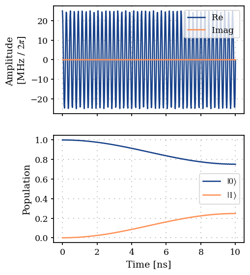
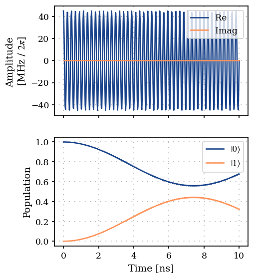
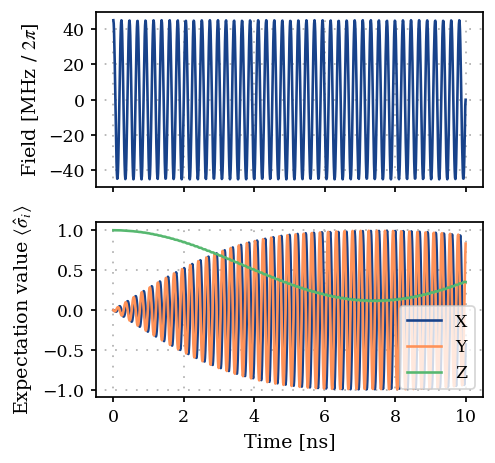
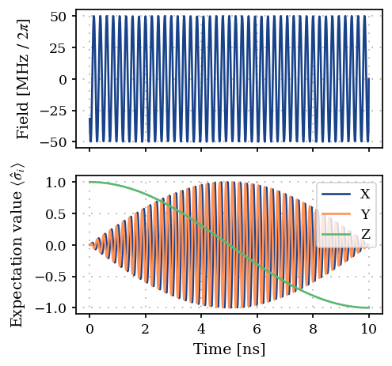

Single spin Part 2: Gradient descent gate optimization
======================================================

In this notebook, we show how to use ``ParaQeet`` to optimize a
single-qubit gate, specifically an :math:`X`-gate.

.. code:: ipython3

    import matplotlib.pyplot as plt
    import numpy as np
    
    from paraqeet.measurement.unitary_fidelity import UnitaryFidelity
    from paraqeet.model.drive import Drive
    from paraqeet.model.qubit import QubitHamiltonian
    from paraqeet.model.schroedinger_equation import SchroedingerEquation
    from paraqeet.optimization_map import OptimizationMap
    from paraqeet.optimizers.scipy_optimizer import ScipyOptimizer
    from paraqeet.optimizers.scipy_optimizer_gradient import ScipyOptimizerGradient
    from paraqeet.propagation.scipy_expm_goat import ScipyExpmGOAT
    from paraqeet.quantity import Quantity
    from paraqeet.signal.envelopes import ConstantEnvelope
    from paraqeet.signal.iq_mixer import IQMixer

System Setup
------------

We first set up the qubit system we want to control. We set the qubit
frequency :math:`\omega_q / 2 \pi` to be :math:`4.327884` GHz and define
the Hamiltonian as

.. math:: H(t)=H_\text{drift}+H_c(t)= \frac{\omega_q}{2} \sigma_z + \Omega(t)\sigma_x, 

\ where :math:`\Omega(t)` will be supplied by the generator.

.. code:: ipython3

    freq = 4.327884e9 * 2 * np.pi
    
    qubit_hamiltonian = QubitHamiltonian(
        frequency=Quantity(
            freq,
            min_value=freq / 4,
            max_value=freq,
            unit="Hz",
            name="Qubit frequency",
        ),
        drives=[],
    )

For signal generation, we define a simple cosine shaped tone generator
:math:`A \cos(\omega t)`

.. code:: ipython3

    t_simu = 10e-9
    tone = ConstantEnvelope()
    tone.t_final.set_value(t_simu)
    gen = IQMixer(envelopes=[tone])

In this notebook we set the parameter ``t_final`` equal to the
simulation time, but it is not strictly necessary as long as ``t_final``
is larger than ``t_simu`` (see the notebook
02A_Single_qubit_state_preparation.ipynb)

We can inspect the parameters with

.. code:: ipython3

    params_tone = tone.get_parameters()
    print(params_tone)
    params_gen = gen.get_parameters()
    print(params_gen)

.. parsed-literal::

    [Amplitude: 24.7 MHz x 2pi, t_final: 10 ns]
    [Amplitude: 24.7 MHz x 2pi, t_final: 10 ns, lo_freq: 4.8 GHz x 2pi, Phase: 0 rad]

In this notebook, we would like to optimize the amplitude ``Amplitude``
and frequency ``lo_freq`` if the drive. We add a drive on the qubit.

.. code:: ipython3

    sigma_x = qubit_hamiltonian.sigma_x
    sigma_y = qubit_hamiltonian.sigma_y
    sigma_z = qubit_hamiltonian.sigma_z
    drive = Drive(sigma_x, gen)
    qubit_hamiltonian.drives = [drive]
    eom = SchroedingerEquation(
        hamiltonian_func=qubit_hamiltonian.get_value,
        hamiltonian_gradient_func=qubit_hamiltonian.get_gradient,
    )

Textbook values for implementing an :math:`X` rotation on this system at
a time :math:`T` would be :math:`\omega=\omega_q` and :math:`A=\pi/T`.
We use some offset from these values as initial guess to demonstrate the
optimization procedure.

.. code:: ipython3

    params_gen[0].set_value(0.5 * np.pi / t_simu)
    params_gen[2].set_value(1.01 * freq)

We select a propagation method, piecewise constant exponentiation, and
configure an :math:`X`-gate as a target gate. Also we initialize the
identity at time :math:`0`.

.. code:: ipython3

    times = np.array([0.0, t_simu])
    
    prop = ScipyExpmGOAT(
        eom_func=eom.get_value, eom_gradient_func=eom.get_gradient, resolution=100e9, initial_state=np.identity(2)
    )
    gate_fid = UnitaryFidelity(
        propagation_func=prop.propagate,
        propagation_gradient_func=prop.get_gradient,
        gate=sigma_x,
    )

.. code:: ipython3

    from plotting import plot_signal_and_dynamics
    
    ts = np.linspace(0.0, t_simu, 501)
    plot_signal_and_dynamics(gen, prop, ts, state_labels=[r"$|0\rangle$", r"$|1\rangle$"])

.. parsed-literal::

    array([<Axes: ylabel='Amplitude \n[MHz / $2\\pi$]'>,
           <Axes: xlabel='Time [ns]', ylabel='Population'>], dtype=object)

As expected, we get a partial transfer and a low fidelity.

.. code:: ipython3

    print(f"Gate fidelity: {gate_fid.measure(times)}")

.. parsed-literal::

    Gate fidelity: 0.09513387531954913

We define an optimizer and link our fidelity measure as a goal function
and the parameters of the cosine tone and optimize just amplitude and
frequency, as in the state transfer example.

.. code:: ipython3

    optmap = OptimizationMap()
    optmap.add(gen, [params_gen[0], params_gen[2]])
    opt = ScipyOptimizerGradient(measure_and_gradient_func=gate_fid.get_value_and_gradient, optimization_map=optmap)

.. code:: ipython3

    opt.optimize(times)

.. parsed-literal::

    Iteration   10 | Infid = 8.036767e-01

.. parsed-literal::

    {'status': 1, 'value': 0.8036766363151119, 'iterations': 16, 'message': 'CONVERGENCE: NORM OF PROJECTED GRADIENT <= PGTOL'}

.. code:: ipython3

    plot_signal_and_dynamics(gen, prop, ts, state_labels=[r"$|0\rangle$", r"$|1\rangle$"])

.. parsed-literal::

    array([<Axes: ylabel='Amplitude \n[MHz / $2\\pi$]'>,
           <Axes: xlabel='Time [ns]', ylabel='Population'>], dtype=object)

Dynamics of Pauli operators
---------------------------

Here, we end up with an unsatisfactory result. For optimizing gate
fidelities, looking at state populations does not give enough
information to identify the problem.

.. code:: ipython3

    def expecation_value(op, states):
        """Get the expectation value across states."""
        ex = []
        for state in states:
            ex.append(np.real(state.conj() @ op @ state.T))
        return ex

.. code:: ipython3

    def plot_pauli():
        """Plot the Pauli operators."""
        ts = np.linspace(0, t_simu, 1001)
        states = prop.propagate(ts)
        sig = gen.get_value(ts) / 1e6 / (2 * np.pi)
    
        fig, ax = plt.subplots(2, figsize=(4, 4), sharex=True)
        ax[0].plot(ts / 1e-9, sig)
        ax[0].set_ylabel(r"Field [MHz / $2\pi$]")
        ax[0].grid(True, linestyle=(1, (1, 5)), linewidth=1)
    
        ax[1].plot(ts / 1e-9, expecation_value(sigma_x, states[:, :, 0]))
        ax[1].plot(ts / 1e-9, expecation_value(sigma_y, states[:, :, 0]))
        ax[1].plot(ts / 1e-9, expecation_value(sigma_z, states[:, :, 0]))
        ax[1].set_ylabel(r"Expectation value $\langle\hat\sigma_i\rangle$")
        ax[1].grid(True, linestyle=(1, (1, 5)), linewidth=1)
    
        ax[-1].set_xlabel("Time [ns]")
        ax[1].legend(["X", "Y", "Z"])
        plt.show()
        return fig, ax
    
    
    plot_pauli()

.. parsed-literal::

    (<Figure size 500x500 with 2 Axes>,
     array([<Axes: ylabel='Field [MHz / $2\\pi$]'>,
            <Axes: xlabel='Time [ns]', ylabel='Expectation value $\\langle\\hat\\sigma_i\\rangle$'>],
           dtype=object))

Instead, we look at the expectation values of the three Pauli operators
and observe that the qubit is rotating at its eigenfrequency along the
Z-axis. We can mitigate this problem by allowing the rotation axis of
our drive to shift and include the phase parameter in the optimization.

.. code:: ipython3

    optmap = OptimizationMap()
    optmap.add(tone, [params_gen[0], params_gen[2], params_gen[3]])
    opt = ScipyOptimizer(measure_func=gate_fid.measure, optimization_map=optmap)

.. code:: ipython3

    params_gen[0].set_value(0.5 * np.pi / t_simu)
    params_gen[2].set_value(1.01 * freq)
    opt.optimize(times)

.. parsed-literal::

    Iteration   10 | Infid = 2.374870e-01

.. parsed-literal::

    Iteration   20 | Infid = 1.151436e-09

.. parsed-literal::

    {'status': 1, 'value': 8.832046205498045e-12, 'iterations': 108, 'message': 'CONVERGENCE: RELATIVE REDUCTION OF F <= FACTR*EPSMCH'}

.. code:: ipython3

    plot_pauli()

.. parsed-literal::

    (<Figure size 500x500 with 2 Axes>,
     array([<Axes: ylabel='Field [MHz / $2\\pi$]'>,
            <Axes: xlabel='Time [ns]', ylabel='Expectation value $\\langle\\hat\\sigma_i\\rangle$'>],
           dtype=object))

