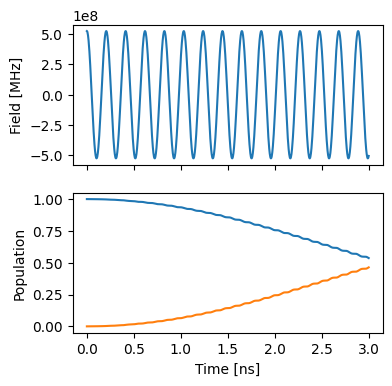
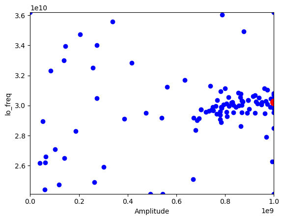
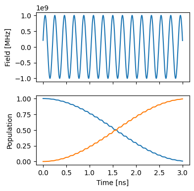

Single spin: Bayesian optimization of a gate
============================================

This is similar to the OC_Single_qubit_gate example, except that it uses
Bayesian optimization instead of gradient descent.

.. code:: ipython3

    import matplotlib.pyplot as plt
    
    import numpy as np
    from jax import Array
    
    from paraqeet.logger import Logger
    from paraqeet.optimization_map import OptimizationMap
    from paraqeet.quantity import Quantity
    from paraqeet.measurement.unitary_fidelity import UnitaryFidelity
    from paraqeet.model.drive_operator import DriveOperator
    from paraqeet.model.qubit import Qubit
    from paraqeet.optimizers.bayesian_optimizer import BayesianOptimizer
    from paraqeet.propagation.scipy_expm_goat import ScipyExpmGOAT
    
    from paraqeet.model.closed_system import ClosedSystem
    
    from paraqeet.signal.iq_mixer import IQMixer
    from paraqeet.signal.envelopes import ConstantEnvelope

Setup
-----

For signal generation, we define a simple cosine shaped tone generator
:math:`A \cos(\omega t)`

.. code:: ipython3

    t_final = 3e-9
    tone = ConstantEnvelope()
    tone.t_final.set_value(t_final)
    gen = IQMixer(envelopes=[tone])

We can inspect the pre-defined parameters with

.. code:: ipython3

    params = gen.get_parameters()

in this case amplitude :math:`A` and frequency :math:`\omega`.

Next, we setup the qubit system we want to control. We set the qubit
frequency :math:`\omega_q` to be 4.8 GHz and define the Hamiltonian as

.. math:: H(t)=H_\text{drift}+H_c(t)= \frac{\omega_q}{2} \sigma_z + \Omega(t)\sigma_x

, where :math:`\Omega(t)` will be supplied by the generator.

.. code:: ipython3

    freq = 4.8e9 * 2 * np.pi
    
    drive = DriveOperator(gen, is_longitudinal=False)
    controlled_qubit = Qubit(frequency=Quantity(freq, 0.8 * freq, 1.2 * freq), drives=[drive])
    model = ClosedSystem(controlled_qubit)

Textbook values for implementing an :math:`X` rotation on this system at
a time :math:`T` would be :math:`\omega=\omega_q` and :math:`A=\pi/T`.
We use some offset from these values as initial guess to demonstrate the
optimization procedure.

.. code:: ipython3

    params[0].set_value(0.5 * np.pi / t_final)
    params[2].set_value(1.01 * freq)

.. code:: ipython3

    params

.. parsed-literal::

    [Amplitude: 83.3 MHz x 2pi ,
     t_final: 3 ns ,
     lo_freq: 4.85 GHz x 2pi ,
     Phase: 0 rad ]

We select a propagation method, piecewise constant exponentation, and
configure :math:`\sigma_x` as a target gate. Also we initialize the full
basis at time 0 with :math:`\mathcal{I}_2`

.. code:: ipython3

    prop = ScipyExpmGOAT(model, res=500e9)
    
    pauli_x = np.array([[0.0, 1], [1, 0.0]])
    
    prop.set_initial_state(np.identity(2))
    gate_fid = UnitaryFidelity(
        propagation=prop,
        gate=pauli_x,
        times=np.array([0.0, t_final]),
    )

.. code:: ipython3

    def plot_time_evolution():
        """Plot the time evolution of the system."""
        ts = np.linspace(0, t_final, 1001)
        states = prop.propagate(ts)
        sig = gen.generate_signal(ts)
    
        fig, ax = plt.subplots(2, figsize=(4, 4), sharex=True)
        ax[0].plot(ts / 1e-9, sig)
        ax[0].set_ylabel("Field [MHz]")
        ax[1].plot(ts / 1e-9, np.abs(states)[:, :, 0] ** 2)
        ax[1].set_ylabel("Population")
        ax[-1].set_xlabel("Time [ns]")
        return fig, ax
    
    
    plot_time_evolution()

.. parsed-literal::

    (<Figure size 400x400 with 2 Axes>,
     array([<Axes: ylabel='Field [MHz]'>,
            <Axes: xlabel='Time [ns]', ylabel='Population'>], dtype=object))

As expected, we get a partial transfer and a low fidelity.

.. code:: ipython3

    gate_fid.measure()

.. parsed-literal::

    0.008892622545869415

Custom logger implementation
----------------------------

We define an optimizer and link our fidelity measure as a goal function
and the parameters of the cosine tone. We also use a custom logger class
to collect all samples that the optimizer takes

.. code:: ipython3

    samples = []
    
    
    class CustomLogger(Logger):
        """Custom logger class definition."""
    
        def log(self, params: list[Quantity], infid: Array):
            """Log the list of quantities and the fidelity.
    
            Parameters
            ----------
            params: list[Quantity]
                List of parameters of the system.
            infid: Array
                Inverse of fidelity.
    
            """
            samples.append((params[0].get_value(), params[1].get_value()))
    
    
    optmap = OptimizationMap()
    optmap.add(gen, [params[0], params[2], params[3]])
    opt = BayesianOptimizer(gate_fid, optimizables=optmap, initial_samples=10, iterations=100)
    opt.logger = CustomLogger()

.. code:: ipython3

    opt.optimize()

.. parsed-literal::

    |   iter    |  target   |     0     |     1     |     2     |
    -------------------------------------------------------------
    | 1         | 0.0036571 | -0.165955 | 0.4406489 | -0.999771 |
    | 2         | 0.0001105 | -0.395334 | -0.706488 | -0.815322 |
    | 3         | 0.0003969 | -0.627479 | -0.308878 | -0.206465 |
    | 4         | 0.0095249 | 0.0776334 | -0.161610 | 0.3704390 |
    | 5         | -.107e-06 | -0.591095 | 0.7562348 | -0.945224 |
    | 6         | 0.2036608 | 0.3409350 | -0.165390 | 0.1173796 |
    | 7         | 0.0007858 | -0.719226 | -0.603797 | 0.6014891 |
    | 8         | 0.0438829 | 0.9365231 | -0.373151 | 0.3846452 |

.. parsed-literal::

    | 9         | -.744e-06 | 0.7527783 | 0.7892133 | -0.829911 |
    | 10        | -.607e-06 | -0.921890 | -0.660339 | 0.7562850 |

.. parsed-literal::

    | 11        | 0.2436705 | 0.3864240 | -0.166255 | 0.0746289 |

.. parsed-literal::

    | 12        | 0.3152984 | 0.4014301 | -0.072420 | -0.063436 |
    | 13        | 0.1466834 | 0.5649364 | -0.212259 | -0.332136 |

.. parsed-literal::

    | 14        | 0.2810023 | 0.5635366 | 0.1276022 | 0.0006607 |
    | 15        | 0.0152823 | 0.2674978 | 0.2561853 | -0.169559 |
    | 16        | 0.3836315 | 0.4408709 | -0.098842 | -0.084145 |

.. parsed-literal::

    | 17        | 0.4766822 | 0.6119481 | -0.095131 | -0.052578 |
    | 18        | 0.2890354 | 0.4034507 | -0.068209 | -0.066917 |

.. parsed-literal::

    | 19        | 0.4964185 | 0.5297423 | -0.121980 | -0.029561 |
    | 20        | 0.2971542 | 0.5591593 | -0.177524 | -0.092768 |

.. parsed-literal::

    | 21        | 0.4609845 | 0.5715910 | -0.053883 | 0.0224457 |
    | 22        | 0.4405435 | 0.6169550 | -0.144028 | 0.0384503 |

.. parsed-literal::

    | 23        | 0.0011515 | 0.9867827 | -0.644633 | 0.8585118 |
    | 24        | -.931e-05 | -0.472166 | -0.869049 | -0.553717 |
    | 25        | -.177e-08 | -0.877018 | -0.657881 | 0.0207137 |
    | 26        | 0.0012021 | -0.795254 | -0.508318 | 0.9524448 |

.. parsed-literal::

    | 27        | 0.2051465 | 0.3692185 | -0.191760 | -0.075047 |
    | 28        | 0.4125911 | 0.6886774 | -0.046218 | 0.0114139 |

.. parsed-literal::

    | 29        | 0.5436281 | 0.4663919 | -0.086370 | 0.0246949 |
    | 30        | 0.6413501 | 0.4979543 | -0.041705 | 0.1428720 |

.. parsed-literal::

    | 31        | 0.7819337 | 0.5710362 | -0.045724 | 0.2137782 |

.. parsed-literal::

    | 32        | 0.4767379 | 0.5352728 | 0.0299197 | 0.2624907 |

.. parsed-literal::

    | 33        | 0.3013880 | 0.5579259 | -0.130762 | 0.2397892 |
    | 34        | 0.0138074 | 0.3362308 | -0.840353 | -0.837670 |
    | 35        | 0.0013310 | -0.483655 | 0.3866039 | 0.6740750 |
    | 36        | 0.1174572 | -0.049565 | -0.108954 | -0.202153 |

.. parsed-literal::

    | 37        | 0.5255571 | 0.6097817 | -0.004734 | 0.1679875 |

.. parsed-literal::

    | 38        | 0.7379100 | 0.5218613 | -0.034616 | 0.2090108 |
    | 39        | 0.8490859 | 0.6323366 | -0.032667 | 0.2707394 |

.. parsed-literal::

    | 40        | -.044e-07 | -0.831439 | 0.3584873 | -0.030378 |
    | 41        | 0.9025055 | 0.7107871 | -0.024897 | 0.3139254 |

.. parsed-literal::

    | 42        | 0.8603514 | 0.6672859 | -0.024387 | 0.3857774 |

.. parsed-literal::

    | 43        | 0.5009260 | 0.7225206 | 0.0629590 | 0.3653689 |
    | 44        | 0.0008535 | -0.324396 | 0.8964272 | -0.695403 |
    | 45        | 0.7708845 | 0.9743153 | 0.0468998 | 0.6726593 |

.. parsed-literal::

    | 46        | 0.2796883 | 0.7344644 | -0.104430 | 0.3734581 |
    | 47        | 0.5285330 | 0.4842338 | -0.073633 | 0.0276697 |
    | 48        | 0.1170918 | -0.455283 | 0.0556825 | -0.294502 |

.. parsed-literal::

    | 49        | 0.0005530 | -0.896720 | -0.199863 | -0.487141 |

.. parsed-literal::

    | 50        | 0.6889618 | 1.0       | 0.0906087 | 0.7673260 |

.. parsed-literal::

    | 51        | 0.6838936 | 0.8762485 | 0.0603446 | 0.7296905 |
    | 52        | 0.0067735 | 0.9691647 | -0.042159 | 0.7514141 |

.. parsed-literal::

    | 53        | 0.3685365 | 0.9467601 | 0.1473334 | 0.6715911 |

.. parsed-literal::

    | 54        | 0.8365565 | 0.6495542 | 0.0045080 | 0.3293315 |
    | 55        | 0.8216861 | 0.7354916 | -0.020858 | 0.2344069 |

.. parsed-literal::

    | 56        | -.577e-05 | -0.879484 | -0.954218 | 0.7154813 |
    | 57        | 0.7832472 | 0.5852044 | -0.015138 | 0.4526613 |

.. parsed-literal::

    | 58        | 0.7938804 | 0.6597925 | 0.0105868 | 0.5419519 |

.. parsed-literal::

    | 59        | 0.2440359 | 0.5661378 | -0.041364 | 0.5962431 |

.. parsed-literal::

    | 60        | 0.8320164 | 0.7867958 | 0.0324158 | 0.5959492 |
    | 61        | 0.4959325 | 0.7079475 | 0.1158142 | 0.5953950 |

.. parsed-literal::

    | 62        | 0.1669744 | 0.1229802 | 0.1805488 | 0.0361662 |

.. parsed-literal::

    | 63        | 0.8216539 | 0.9007799 | 0.0125311 | 0.5672909 |
    | 64        | 0.8316071 | 0.7870544 | 0.0327162 | 0.5968212 |
    | 65        | 0.0003834 | -0.712240 | 0.6268556 | 0.2073338 |

.. parsed-literal::

    | 66        | 0.0001571 | 0.5744876 | 0.9758150 | 0.6370951 |
    | 67        | 0.0003994 | 0.3575027 | -0.296749 | -0.023575 |

.. parsed-literal::

    | 68        | 0.0840023 | 0.7956128 | -0.065188 | 0.6093132 |

.. parsed-literal::

    | 69        | 0.6736730 | 0.8465738 | 0.0872708 | 0.5378365 |
    | 70        | 0.9500097 | 1.0       | 0.0343604 | 0.5404349 |

.. parsed-literal::

    | 71        | 0.9937998 | 1.0       | 0.0120896 | 0.4337827 |

.. parsed-literal::

    | 72        | 0.2720796 | 1.0       | 0.1068704 | 0.4237261 |

.. parsed-literal::

    | 73        | 0.4196244 | 1.0       | -0.060757 | 0.4818069 |

.. parsed-literal::

    | 74        | 0.9787179 | 0.9329835 | 0.0194547 | 0.4620656 |

.. parsed-literal::

    | 75        | 0.9821017 | 0.9462511 | -0.011583 | 0.3572611 |

.. parsed-literal::

    | 76        | 0.8554799 | 0.8962685 | -0.014639 | 0.2455088 |
    | 77        | 0.1200786 | 0.4775626 | 0.1868229 | 0.1878511 |

.. parsed-literal::

    | 78        | 0.9185996 | 1.0       | -0.047368 | 0.2737846 |

.. parsed-literal::

    | 79        | 0.4297086 | 1.0       | 0.0093534 | 0.1550549 |

.. parsed-literal::

    | 80        | 0.4254756 | 0.9266481 | -0.114392 | 0.2660853 |

.. parsed-literal::

    | 81        | 0.7669268 | 1.0       | 0.0218862 | 0.3068369 |

.. parsed-literal::

    | 82        | 0.8139711 | 0.8550331 | 0.0184429 | 0.3242011 |
    | 83        | 0.3778611 | 0.9226054 | 0.1628879 | 0.9119623 |

.. parsed-literal::

    | 84        | 0.0002142 | -0.873608 | -0.590417 | -0.322908 |
    | 85        | -.995e-06 | 0.0889854 | -1.0      | 1.0       |

.. parsed-literal::

    | 86        | 0.0547662 | 0.8283655 | 0.0747172 | 0.1985934 |
    | 87        | 0.0       | -1.0      | 1.0       | 1.0       |

.. parsed-literal::

    | 88        | 0.6663736 | 0.6280386 | 0.0664455 | 0.4674775 |
    | 89        | 0.0007961 | 1.0       | -1.0      | -0.258467 |

.. parsed-literal::

    | 90        | 0.6252212 | 1.0       | -0.101559 | -1.0      |

.. parsed-literal::

    | 91        | 0.0018788 | 1.0       | -0.274042 | -1.0      |
    | 92        | 0.0009246 | -0.723588 | 0.4703690 | -0.997180 |

.. parsed-literal::

    | 93        | 0.0223863 | 1.0       | 0.0519901 | -1.0      |
    | 94        | 0.9625406 | 0.8660557 | -0.003959 | 0.4206908 |

.. parsed-literal::

    | 95        | 0.9176641 | 0.7439024 | 0.0140623 | 0.4802418 |
    | 96        | 0.0001722 | 1.0       | 1.0       | -0.071982 |

.. parsed-literal::

    | 97        | 0.0001046 | -0.012447 | -1.0      | 0.1514002 |
    | 98        | 0.0001749 | -0.765238 | -0.898005 | 0.5169565 |
    | 99        | 0.0166398 | -0.227062 | -0.174050 | 0.2779688 |

.. parsed-literal::

    | 100       | 0.5763829 | 0.7266898 | 0.1043722 | 0.8172706 |

.. parsed-literal::

    | 101       | 0.3153274 | 0.5996019 | 0.1592724 | 0.9868877 |
    | 102       | 0.6040294 | 0.7812510 | -0.106681 | -1.0      |

.. parsed-literal::

    | 103       | 0.6332109 | 0.8467796 | -0.106571 | -0.832928 |

.. parsed-literal::

    | 104       | 0.6295450 | 0.6685843 | -0.103822 | -0.847980 |

.. parsed-literal::

    | 105       | 0.0002737 | 0.7300373 | -0.253650 | -0.852260 |

.. parsed-literal::

    | 106       | 0.2067497 | 0.7366109 | 0.0267531 | -0.865456 |

.. parsed-literal::

    | 107       | 0.5769434 | 0.5569218 | -0.092325 | -0.978868 |
    | 108       | -.780e-05 | -0.454330 | 0.6388374 | -0.363639 |

.. parsed-literal::

    | 109       | 0.6671670 | 0.5032939 | -0.080969 | -0.800404 |

.. parsed-literal::

    | 110       | 0.4690523 | 0.3717895 | -0.119981 | -0.899121 |
    =============================================================

.. parsed-literal::

    {'status': 0, 'value': 0.006200159446014486, 'iterations': 110}

The plot shows the all the samples that the optimization took in the
two-dimensional parameter space. The red dot marks the best value.

.. code:: ipython3

    plt.figure()
    plt.scatter([s[0] for s in samples[:-1]], [s[1] for s in samples[:-1]], c="blue")
    plt.scatter([params[0].get_value()], [params[2].get_value()], c="red", marker="o", s=100)
    plt.xlim(params[0].get_min_value()[0], params[0].get_max_value()[0])
    plt.ylim(params[2].get_min_value()[0], params[2].get_max_value()[0])
    plt.xlabel(params[0].get_name())
    plt.ylabel(params[2].get_name())
    plt.show()

.. code:: ipython3

    plot_time_evolution()

.. parsed-literal::

    (<Figure size 400x400 with 2 Axes>,
     array([<Axes: ylabel='Field [MHz]'>,
            <Axes: xlabel='Time [ns]', ylabel='Population'>], dtype=object))

We can see from the plot and optimizer output that we have found good
controls.

.. code:: ipython3

    gate_fid.measure()

.. parsed-literal::

    0.9937998405539855

