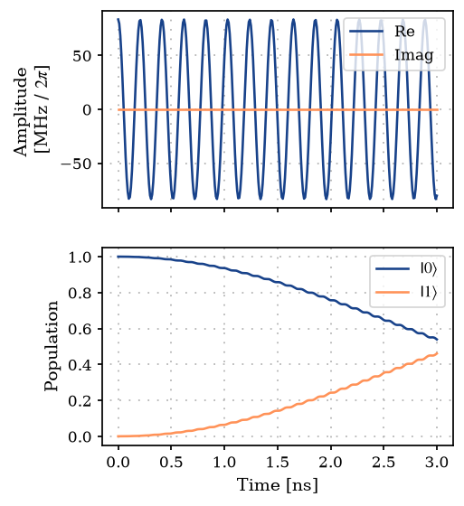
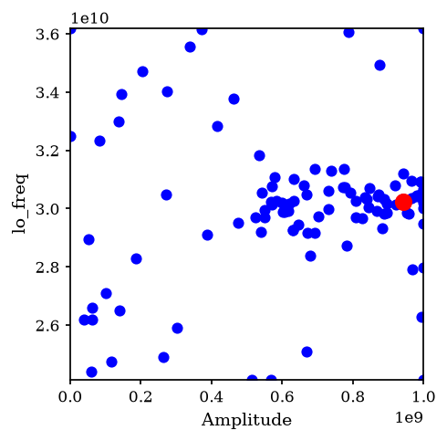
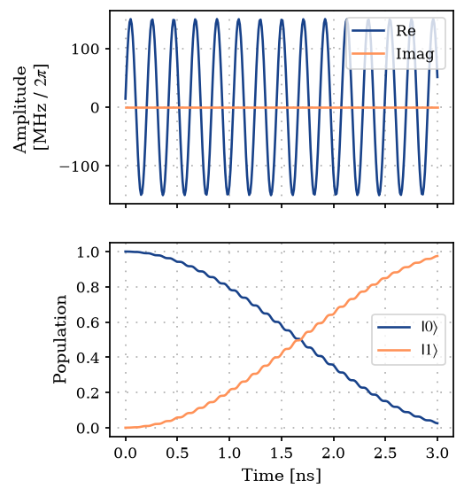

Single spin: Bayesian optimization of a gate
============================================

This is similar to the 02B_Single_qubit_gate example, except that it
uses Bayesian optimization (Shahriari et al., 2016) instead of gradient
descent.

.. code:: ipython3

    import matplotlib.pyplot as plt
    import numpy as np
    from jax import Array
    
    from paraqeet.eom.schroedinger_equation import SchroedingerEquation
    from paraqeet.hamiltonian.drive import Drive
    from paraqeet.hamiltonian.qubit import QubitHamiltonian
    from paraqeet.logger import Logger
    from paraqeet.measurement.fidelity import UnitaryFidelity
    from paraqeet.optimization_map import OptimizationMap
    from paraqeet.optimizers.bayesian_optimizer import BayesianOptimizer
    from paraqeet.propagation import Expm
    from paraqeet.quantity import Quantity
    from paraqeet.signal.envelopes import ConstantEnvelope
    from paraqeet.signal.iq_mixer import IQMixer

Setup
-----

We first set up the qubit system we want to control. We set the qubit
frequency :math:`\omega_q / 2 \pi` to be :math:`4.8` GHz and define the
Hamiltonian as

.. math:: H(t)=H_\text{drift}+H_c(t)= \frac{\omega_q}{2} \sigma_z + \Omega(t)\sigma_x, 

\ where :math:`\Omega(t)` will be supplied by the generator.

.. code:: ipython3

    freq_q = 4.8e9
    omega_q = 2 * np.pi * freq_q
    
    qubit_hamiltonian = QubitHamiltonian(
        frequency=Quantity(omega_q, 0.8 * omega_q, 1.2 * omega_q, unit="Hz", two_pi=True), drives=[]
    )
    model = SchroedingerEquation(
        hamiltonian_func=qubit_hamiltonian.get_value,
        hamiltonian_gradient_func=qubit_hamiltonian.get_gradient,
    )

For signal generation, we define a simple cosine shaped tone generator
:math:`A \cos(\omega t)`

.. code:: ipython3

    t_simu = 3e-9
    tone = ConstantEnvelope()
    tone.t_final.set_value(t_simu)
    gen = IQMixer(envelopes=[tone])

We can inspect the pre-defined parameters with

.. code:: ipython3

    params_gen = gen.get_parameters()

In this notebook, we would like to optimize the amplitude ``Amplitude``
and frequency ``lo_freq`` of the drive. We add a drive on the qubit.

.. code:: ipython3

    freq = 4.8e9 * 2 * np.pi
    sigma_x = qubit_hamiltonian.sigma_x
    drive = Drive(sigma_x, gen)
    qubit_hamiltonian.drives = [drive]
    model = SchroedingerEquation(
        hamiltonian_func=qubit_hamiltonian.get_value,
        hamiltonian_gradient_func=qubit_hamiltonian.get_gradient,
    )

Textbook values for implementing an :math:`X` rotation on this system at
a time :math:`T` would be :math:`\omega=\omega_q` and :math:`A=\pi/T`.
We use some offset from these values as an initial guess to demonstrate
the optimization procedure.

.. code:: ipython3

    params_gen[0].set_value(0.5 * np.pi / t_simu)
    params_gen[2].set_value(1.01 * freq)

We select a propagation method, piecewise constant exponentiation, and
configure an :math:`X`-gate as a target gate. Also, we initialize the
identity at time :math:`0`.

.. code:: ipython3

    times = np.array([0.0, t_simu])
    
    prop = Expm(eom_func=model.get_value, resolution=100e9, initial_state=np.identity(2))
    gate_fid = UnitaryFidelity(propagation_func=prop.get_value, propagation_gradient_func=None, gate=sigma_x)

.. code:: ipython3

    from plotting import plot_signal_and_dynamics
    
    ts = np.linspace(0.0, t_simu, 301)
    plot_signal_and_dynamics(gen, prop, ts, state_labels=[r"$|0\rangle$", r"$|1\rangle$"])

.. parsed-literal::

    array([<Axes: ylabel='Amplitude \n[MHz / $2\\pi$]'>, <Axes: xlabel='Time [ns]', ylabel='Population'>], dtype=object)

As expected, we get a partial transfer and a low fidelity.

.. code:: ipython3

    print(f"Gate fidelity: {gate_fid.get_value(times)}")

.. parsed-literal::

    Gate fidelity: 0.008842872531522971

Custom logger implementation
----------------------------

We define an optimizer and link our fidelity measure as a goal function
and the parameters of the cosine tone. We also use a custom logger class
to collect all samples that the optimizer takes

.. code:: ipython3

    samples = []
    
    
    class CustomLogger(Logger):
        """Custom logger class definition."""
    
        def log(self, params: list[Quantity], infid: Array):
            """Log the list of quantities and the fidelity.
    
            Parameters
            ----------
            params: list[Quantity]
                List of parameters of the system.
            infid: Array
                Inverse of fidelity.
    
            """
            samples.append((params[0].get_value(), params[1].get_value()))
    
    
    optmap = OptimizationMap()
    optmap.add(gen, [params_gen[0], params_gen[2], params_gen[3]])
    opt = BayesianOptimizer(measure_func=gate_fid.get_value, optimization_map=optmap, initial_samples=10, iterations=100)
    opt.logger = CustomLogger()

.. code:: ipython3

    opt.optimize(times)

.. parsed-literal::

    |   iter    |  target   |     0     |     1     |     2     |
    -------------------------------------------------------------
    | 1         | 0.0036278 | -0.165955 | 0.4406489 | -0.999771 |
    | 2         | 0.0001104 | -0.395334 | -0.706488 | -0.815322 |
    | 3         | 0.0003939 | -0.627479 | -0.308878 | -0.206465 |
    | 4         | 0.0094778 | 0.0776334 | -0.161610 | 0.3704390 |
    | 5         | 3.085e-06 | -0.591095 | 0.7562348 | -0.945224 |
    | 6         | 0.2028943 | 0.3409350 | -0.165390 | 0.1173796 |
    | 7         | 0.0007805 | -0.719226 | -0.603797 | 0.6014891 |
    | 8         | 0.0434133 | 0.9365231 | -0.373151 | 0.3846452 |
    | 9         | 1.729e-06 | 0.7527783 | 0.7892133 | -0.829911 |
    | 10        | 3.574e-06 | -0.921890 | -0.660339 | 0.7562850 |
    | 11        | 0.2425734 | 0.3863518 | -0.166299 | 0.0746278 |
    | 12        | 0.3066583 | 0.4027489 | -0.070437 | -0.062772 |
    | 13        | 0.1000863 | 0.5626991 | -0.235444 | -0.322011 |
    | 14        | 0.1240102 | 0.5454712 | 0.0932292 | 0.0241167 |
    | 15        | 0.2938039 | 0.2579886 | -0.151104 | -0.137715 |
    | 16        | 0.2955032 | 0.2598865 | -0.148306 | -0.140559 |
    | 17        | 0.2785474 | 0.1549411 | 0.1498233 | -0.217921 |
    | 18        | 0.0051731 | -0.073092 | 0.6008264 | -0.041727 |
    | 19        | 0.5373705 | 0.1386107 | 0.0137562 | -0.486849 |
    | 20        | 0.3633793 | 0.1027192 | -0.076982 | -0.669758 |
    | 21        | 0.0637430 | 0.2637873 | 0.1406780 | -0.555237 |
    | 22        | 0.0522654 | 0.0470878 | -0.075446 | -0.430826 |
    | 23        | 0.0011528 | 0.9867827 | -0.644633 | 0.8585118 |
    | 24        | 6.894e-05 | -0.472166 | -0.869049 | -0.553717 |
    | 25        | 5.132e-08 | -0.877018 | -0.657881 | 0.0207137 |
    | 26        | 0.0011949 | -0.795254 | -0.508318 | 0.9524448 |
    | 27        | 0.5590701 | 0.1431811 | -0.003723 | -0.559337 |
    | 28        | 0.3727635 | 0.2058624 | -0.043312 | -0.517609 |
    | 29        | 0.3966277 | 0.0825405 | 0.0616688 | -0.552897 |
    | 30        | 0.4136614 | 0.1003338 | -0.035671 | -0.551026 |
    | 31        | 0.5339144 | 0.1673675 | 0.0165512 | -0.649423 |
    | 32        | 0.6124068 | 0.2367937 | -0.040245 | -0.733500 |
    | 33        | 0.3211367 | 0.1986800 | 0.0082263 | -0.818897 |
    | 34        | 0.0137368 | 0.3362308 | -0.840353 | -0.837670 |
    | 35        | 0.2460532 | 0.2928300 | -0.119270 | -0.709660 |
    | 36        | 0.1168021 | -0.049565 | -0.108954 | -0.202153 |
    | 37        | 0.5141011 | 0.2657757 | 0.0174219 | -0.704422 |
    | 38        | 0.5764846 | 0.2122271 | -0.042962 | -0.669358 |
    | 39        | 0.3956524 | 0.1417220 | 0.0993403 | -0.397644 |
    | 40        | 3.035e-07 | -0.831439 | 0.3584873 | -0.030378 |
    | 41        | 0.4364339 | 0.3355248 | 0.0520019 | -0.253463 |
    | 42        | 0.1312007 | 0.3847292 | 0.1981156 | -0.214810 |
    | 43        | 0.2610900 | 0.2391648 | -0.000474 | -0.320963 |
    | 44        | 0.0008451 | -0.324396 | 0.8964272 | -0.695403 |
    | 45        | 0.7703155 | 0.9743153 | 0.0468998 | 0.6726593 |
    | 46        | 0.5792541 | 0.9821157 | 0.1255883 | 0.7204063 |
    | 47        | 0.4854179 | 0.8848882 | 0.0139857 | 0.6906923 |
    | 48        | 0.1162966 | -0.455283 | 0.0556825 | -0.294502 |
    | 49        | 0.0005492 | -0.896720 | -0.199863 | -0.487141 |
    | 50        | 0.8434360 | 1.0       | 0.0731378 | 0.5856685 |
    | 51        | 0.4756298 | 1.0       | -0.025385 | 0.5800696 |
    | 52        | 0.3522303 | 0.9336380 | 0.1339088 | 0.5843633 |
    | 53        | 0.8009691 | 1.0       | 0.0842420 | 0.6369940 |
    | 54        | 0.2177734 | 1.0       | 0.0069847 | 0.7652570 |
    | 55        | 0.8796430 | 0.9635119 | 0.0466889 | 0.6114599 |
    | 56        | 5.541e-05 | -0.879484 | -0.954218 | 0.7154813 |
    | 57        | 0.9392248 | 0.9564116 | 0.0423778 | 0.5418760 |
    | 58        | 0.8826403 | 0.9717767 | 0.0459873 | 0.4555968 |
    | 59        | 0.9593122 | 0.8851160 | 0.0101834 | 0.4696790 |
    | 60        | 0.8575817 | 0.8781596 | 0.0253189 | 0.3671445 |
    | 61        | 0.6719517 | 0.9170180 | -0.055604 | 0.4032423 |
    | 62        | 0.5844410 | 0.9816713 | 0.1248721 | 0.7212348 |
    | 63        | 0.9034961 | 0.7778790 | 0.0279627 | 0.4297197 |
    | 64        | 0.2761779 | 0.8398392 | 0.1044075 | 0.4196583 |
    | 65        | 0.0003793 | -0.712240 | 0.6268556 | 0.2073338 |
    | 66        | 0.0001554 | 0.5744876 | 0.9758150 | 0.6370951 |
    | 67        | 0.0004002 | 0.3575027 | -0.296749 | -0.023575 |
    | 68        | 0.6014330 | 0.7765967 | -0.057606 | 0.4158530 |
    | 69        | 0.8312231 | 0.7922471 | 0.0024097 | 0.5224359 |
    | 70        | 0.8823406 | 0.6765071 | 0.0301289 | 0.4710920 |
    | 71        | 0.6820388 | 0.6695648 | 0.0394229 | 0.3613728 |
    | 72        | 0.6813709 | 0.9910682 | 0.0295843 | 0.3006294 |
    | 73        | 0.7281863 | 0.6153518 | 0.0178641 | 0.5842212 |
    | 74        | 0.4349023 | 0.5521343 | 0.0947130 | 0.4802972 |
    | 75        | 0.1919352 | 0.6154761 | -0.077313 | 0.5060826 |
    | 76        | 0.6649850 | 0.6955734 | 0.0881400 | 0.5632729 |
    | 77        | 0.1196956 | 0.4775626 | 0.1868229 | 0.1878511 |
    | 78        | 0.7736701 | 0.8444544 | -0.002527 | 0.2455184 |
    | 79        | 0.1726257 | 0.9323864 | 0.0311770 | 0.1289437 |
    | 80        | 0.6308703 | 0.5852912 | 0.0633755 | 0.7207908 |
    | 81        | 0.8620536 | 0.7327830 | -0.040436 | 0.2360373 |
    | 82        | 0.3610334 | 0.7669465 | -0.138269 | 0.1803362 |
    | 83        | 0.2680901 | 0.7456379 | 0.0531964 | 0.2414917 |
    | 84        | 0.0002128 | -0.873608 | -0.590417 | -0.322908 |
    | 85        | 0.8492311 | 0.7937192 | -0.052520 | 0.2973935 |
    | 86        | 0.6405572 | 0.6527114 | -0.082214 | 0.2750349 |
    | 87        | 0.2158292 | 0.6862140 | -0.017719 | 0.6862239 |
    | 88        | 0.6545552 | 0.4640107 | 0.0769393 | 0.6622457 |
    | 89        | 0.0729920 | 0.5485769 | 0.1991330 | 0.6784366 |
    | 90        | 0.0418708 | 0.4638825 | -0.027108 | 0.7473997 |
    | 91        | 0.7876427 | 0.8877786 | -0.001146 | 0.5417888 |
    | 92        | 0.0009172 | -0.723588 | 0.4703690 | -0.997180 |
    | 93        | 0.8957059 | 0.9033507 | -0.048855 | 0.2893118 |
    | 94        | 0.3349450 | 0.8852940 | 0.1722478 | 0.8723699 |
    | 95        | 0.4422511 | 0.3215106 | 0.1035222 | 0.5829254 |
    | 96        | 0.0001670 | -0.257414 | 0.9945973 | 0.9939409 |
    | 97        | 0.4775091 | 1.0       | -0.110546 | 0.2569957 |
    | 98        | 0.0001739 | -0.765238 | -0.898005 | 0.5169565 |
    | 99        | 0.0165422 | -0.227062 | -0.174050 | 0.2779688 |
    | 100       | 4.686e-05 | 0.1375422 | -1.0      | 0.9424497 |
    | 101       | 0.8646517 | 0.7383023 | 0.0442397 | 0.4828521 |
    | 102       | 0.0       | -1.0      | 0.3872079 | 1.0       |
    | 103       | 0.0008088 | 1.0       | -1.0      | -0.262179 |
    | 104       | 0.0001732 | 1.0       | 1.0       | -0.070733 |
    | 105       | 5.308e-05 | 0.0711411 | 0.2757976 | 0.7103456 |
    | 106       | 0.0080969 | 1.0       | -0.363937 | -1.0      |
    | 107       | 4.781e-05 | 0.0270387 | -1.0      | 0.1049451 |
    | 108       | 8.685e-05 | -0.454330 | 0.6388374 | -0.363639 |
    | 109       | 0.0       | -1.0      | 1.0       | 0.7254970 |
    | 110       | 0.0       | -1.0      | -1.0      | -1.0      |
    =============================================================

.. parsed-literal::

    {'status': 0, 'value': 0.040687709101412284, 'iterations': 110}

The plot shows all the samples that the optimization took in the
two-dimensional parameter space. The red dot marks the best value.

.. code:: ipython3

    plt.figure(figsize=(4, 4))
    plt.scatter([s[0] for s in samples[:-1]], [s[1] for s in samples[:-1]], c="blue")
    plt.scatter([params_gen[0].get_value()], [params_gen[2].get_value()], c="red", marker="o", s=100)
    plt.xlim(params_gen[0].get_min_value()[0], params_gen[0].get_max_value()[0])
    plt.ylim(params_gen[2].get_min_value()[0], params_gen[2].get_max_value()[0])
    plt.xlabel(params_gen[0].get_name())
    plt.ylabel(params_gen[2].get_name())
    plt.show()

.. code:: ipython3

    plot_signal_and_dynamics(gen, prop, ts, state_labels=[r"$|0\rangle$", r"$|1\rangle$"])

.. parsed-literal::

    array([<Axes: ylabel='Amplitude \n[MHz / $2\\pi$]'>, <Axes: xlabel='Time [ns]', ylabel='Population'>], dtype=object)

We can see from the plot and optimizer output that we have found good
controls.

.. code:: ipython3

    print(f"Gate fidelity: {gate_fid.get_value(times)}")

.. parsed-literal::

    Gate fidelity: 0.9593122908985877

References
----------

-  **(Shahriari et al., 2016)** B. Shahriari et al., “Taking the human
   out of the loop: A review of Bayesian optimization,” *Proceedings of
   the IEEE* **104**, 148–175 (2016).
