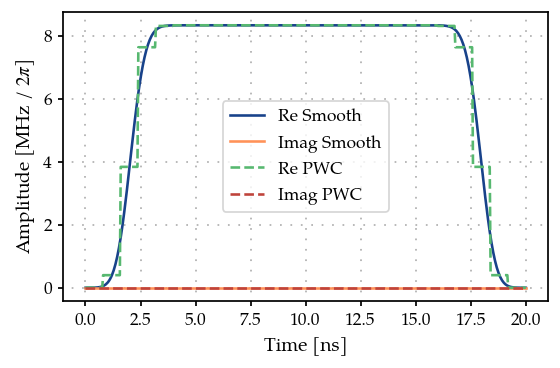
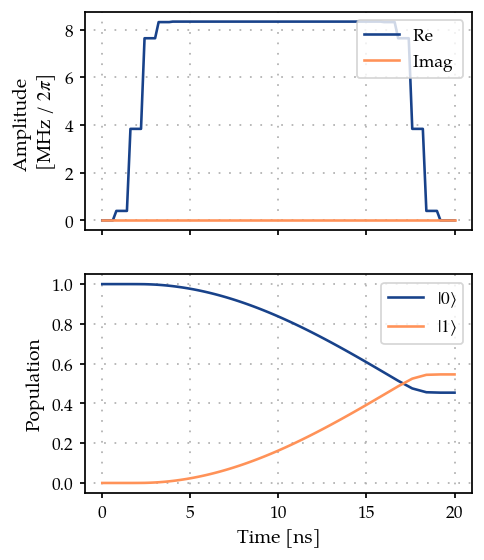
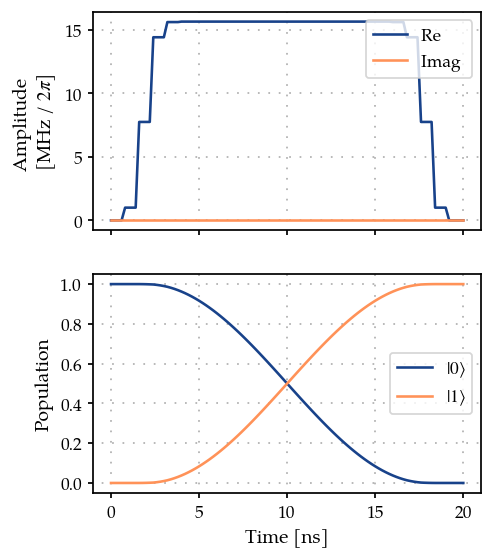

Optimal control of a single spin by using GOAT over GRAPE
=========================================================

In this introductory example we compute the gradients of analytic pulse
shapes in
`GOAT <https://journals.aps.org/prl/abstract/10.1103/PhysRevLett.120.150401>`__
by using the gradients of the time evolition from
`GRAPE <10.1016/j.jmr.2004.11.004>`__. This is performed by using chain
rule -

.. math:: \frac{\partial J}{\partial p} = \sum_k \frac{\partial J}{\partial c_k} \frac{\partial c_k}{\partial p}

where :math:`c_k = c(t_k)` the ‘pixelated’ control pulse,
:math:`\vec{p}` are the analytical parameters of the control pulse $c(t)
:raw-latex:`\equiv `c(:raw-latex:`\vec{p}`, t) $, and
:math:`\frac{\partial J}{\partial c_k}` are the gradients from GRAPE.

1. Generate a PWC pulse shape
-----------------------------

.. code:: ipython3

    import matplotlib.pyplot as plt
    import numpy as np
    from paraqeet.quantity import Quantity
    
    from paraqeet.signal.pwc_generator import PWCGenerator

Lets define a ``FlatTopGaussianEnvelope`` with multiple optimizable
parameters to check if the optimization of all the parameters works when
we rebuild them with GRAPE propagation. We can rely on Automatic
differentiation to obtain the gradient of the pulse wrt its parameters.

.. code:: ipython3

    from collections.abc import Callable
    from functools import partial
    
    from paraqeet.quantity import Array
    import jax.numpy as jnp
    
    from jax import jit
    from jax.scipy.special import erf
    from paraqeet.signal.envelopes import Envelope
    from paraqeet.signal.waveform import FlatTopGaussianFilter
    
    
    class FlatTopGaussianEnvelope(Envelope):
        """A flat-top Gaussian envelope."""
    
        def __init__(
            self,
            amplitude: Quantity,
            t_up: Quantity,
            t_down: Quantity,
            ramp_time: Quantity,
        ):
            self._amplitude = amplitude
            self.__t_up = t_up
            self.__t_down = t_down
            self.__ramp_time = ramp_time
    
            self._gradient_function: Callable | None = None
            self._grad_arg_nums: tuple[int, ...] = ()
    
        def get_parameters(self):
            """Get all parameters of the system."""
            return [self._amplitude, self.__t_up, self.__t_down, self.__ramp_time]
    
        @partial(jit, static_argnums=(0,))
        def _evaluate(self, amp: Array, t_up: Array, t_down: Array, ramp_time: Array, t: Array):
            ramp_up = 1 + erf((t - t_up) / ramp_time)
            ramp_down = 1 + erf((-t + t_down) / ramp_time)
            return jnp.squeeze(amp * ramp_up * ramp_down / 4)
    
        def compute_output(self, t: Array) -> Array:
            """Compute pulse shape."""
            amp = self._amplitude.get_value()
            t_up = self.__t_up.get_value()
            t_down = self.__t_down.get_value()
            ramp_time = self.__ramp_time.get_value()
            return self._evaluate(amp, t_up, t_down, ramp_time, t)

Define the ``Envelope`` and the ``PWCGenerator``. The ``PWCGenerator``
is used to produce the pixelated pulse shape for computing the gradients
using GRAPE. The optimization would be performed on the ``Envelope``
parameters: ``amplitude``, ``t_up``, ``t_down``, ``ramp_time``.

.. code:: ipython3

    t_final = 20e-9
    tlist = np.linspace(0, t_final, 26)
    
    tone = FlatTopGaussianEnvelope(
        amplitude=Quantity(np.pi / t_final / 3, -np.pi / t_final, np.pi / t_final, name="Amplitude"),
        t_up=Quantity(1e-9, 0.0, t_final, name="t_up"),
        t_down=Quantity(t_final - 1e-9, 0.0, t_final, name="t_down"),
        ramp_time=Quantity(1e-9, 0.5e-9, t_final, name="ramp_time"),
    )
    
    tone_smooth = FlatTopGaussianFilter(tone, t_final=Quantity(t_final, 0.0, 1.2 * t_final, name="t_final"))
    
    gen = PWCGenerator(envelopes=[tone_smooth], tlist=tlist)

.. code:: ipython3

    params = gen.get_parameters()
    params[0].set_limits(-200e6, 200e6)
    params[1].set_limits(-200e6, 200e6)

.. code:: ipython3

    from plotting import plot_signal
    
    ts = np.linspace(0, t_final, 501)
    fig, ax = plt.subplots(1, figsize=(5, 3))
    
    plot_signal(tone_smooth, ts, ax, linestyle="-", label="Smooth")
    plot_signal(gen, ts, ax, linestyle="--", label="PWC");

2. Define Hamiltonian in the rotating frame of drive
----------------------------------------------------

As a simple toy model, we use a single spin.

.. code:: ipython3

    from paraqeet.model.closed_system import ClosedSystem
    from paraqeet.model.rotating_frame_drive import RotatingFrameDrive
    from paraqeet.model.hamiltonian import Hamiltonian
    
    
    class SpinRWA(Hamiltonian):
        """A Single Spin."""
    
        def __init__(self, drives=None):
            super().__init__(drives)
            self.sigma_p = np.array([[0j, 1], [0, 0]])
            self.dim = 2
    
        def get_matrix_one_time(self, t):
            """Just sigma-X."""
            return self._drives[0].get_matrix_one_time(self.sigma_p, t)
    
        def gradient(self, t):
            """Gradient is just the drive matrix."""
            return self._drives[0].gradient(self.sigma_p, t)
    
    
    drive = RotatingFrameDrive(gen)
    spin = SpinRWA(drives=[drive])
    model = ClosedSystem(spin)

Using GRAPE as the method to propagate and compute the gradients

.. code:: ipython3

    from paraqeet.measurement.state_transfer_fidelity import StateTransferFidelityGRAPE
    from paraqeet.propagation.scipy_expm_grape import ScipyExpmGRAPE
    
    
    prop = ScipyExpmGRAPE(model, res=1e9)
    
    init = np.array([[1.0], [0]])  # |0>
    target = np.array([[0.0], [1]])  # |1>
    
    prop.set_initial_state(init)
    prop.target_state = target
    
    zeroone = StateTransferFidelityGRAPE(
        propagation=prop,
        initial_state=init,
        target_state=target,
        times=tlist,
    )

.. code:: ipython3

    from plotting import plot_signal_and_dynamics
    
    ts = np.linspace(0.0, t_final, 101)
    plot_signal_and_dynamics(gen, prop, ts, state_labels=[r"$|0\rangle$", r"$|1\rangle$"]);

3. Optimization
---------------

Finally, we define the ``GOATOverGRAPE`` fideltiy that chains together
the GRAPE gradients to compute the gradient wrt the tone parameters

.. code:: ipython3

    from paraqeet.optimization_map import OptimizationMap
    from paraqeet.optimizers.scipy_optimizer_gradient import ScipyOptimizerGradient
    from paraqeet.measurement.goat_over_grape import GOATOverGRAPE
    
    optmap = OptimizationMap()
    optmap.add(tone)
    optmap.register_params_with_optimizables()
    
    goat = GOATOverGRAPE(zeroone, generators=[gen], generators_order=[0])
    opt_grad = ScipyoptimizerGradient(goat, optimization_map=optmap)

.. code:: ipython3

    goat.measure_with_gradient()

.. parsed-literal::

    (0.5458511041978135,
     Array([ 7.90501289e-09, -3.51099110e+06,  3.51099110e+06, -6.26131879e+06],      dtype=float64))

.. code:: ipython3

    optmap.get_all_parameters()

.. parsed-literal::

    [Amplitude: 5.24e+07, t_up: 1e-09, t_down: 1.9e-08, ramp_time: 1e-09]

.. code:: ipython3

    optmap

.. parsed-literal::

    ==== <class '__main__.FlatTopGaussianEnvelope'> ====
    [Amplitude: 5.24e+07, t_up: 1e-09, t_down: 1.9e-08, ramp_time: 1e-09]

.. code:: ipython3

    opt_grad.optimize()

.. parsed-literal::

    {'status': 1, 'value': 2.220446049250313e-16, 'iterations': 6, 'message': 'CONVERGENCE: NORM OF PROJECTED GRADIENT <= PGTOL'}

For this simple example, we reach near perfect fidelity within a few
iterations.

.. code:: ipython3

    plot_signal_and_dynamics(gen, prop, ts, state_labels=[r"$|0\rangle$", r"$|1\rangle$"]);

