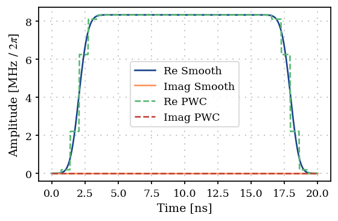
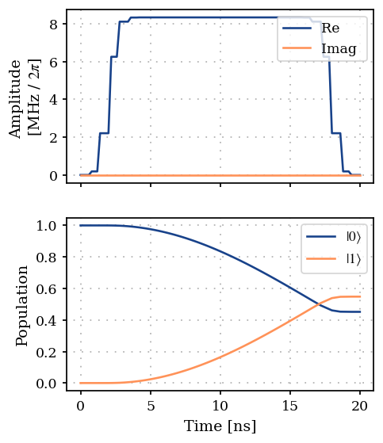
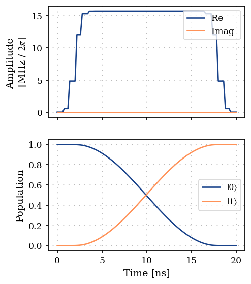

Optimal control of a single spin by using GOAT over GRAPE
=========================================================

In this introductory example we compute the gradients of analytic pulse
shapes in GOAT (Machnes et al., 2018) :cite:p:`machnes2018tunable` by
using the gradients of the time evolution from GRAPE (Khaneja et al.,
2005) :cite:p:`khaneja2005optimal`. This is performed by using chain
rule -

.. math:: \frac{\partial J}{\partial p} = \sum_k \frac{\partial J}{\partial c_k} \frac{\partial c_k}{\partial p}

where :math:`c_k = c(t_k)` the ‘pixelated’ control pulse,
:math:`\vec{p}` are the analytical parameters of the control pulse
:math:`c(t) \equiv c(\vec{p}, t)`, and
:math:`\frac{\partial J}{\partial c_k}` are the gradients from GRAPE.

The combination of GOAT and GRAPE gradients used here is a
gradient-based variant of the GROUP method (Sørensen et al., 2018)
:cite:p:`sorensen2018quantum`.

1. Generate a PWC pulse shape
-----------------------------

.. code:: ipython3

    import matplotlib.pyplot as plt
    import numpy as np
    
    from paraqeet.eom.schroedinger_equation import SchroedingerEquation
    from paraqeet.hamiltonian.drive import Drive
    from paraqeet.hamiltonian.qubit import QubitHamiltonian
    from paraqeet.quantity import Quantity
    from paraqeet.signal.envelopes import FlatTopGaussianEnvelope
    from paraqeet.signal.pwc_generator import PWCGenerator
    from paraqeet.signal.signal import FlatTopGaussianFilter

Define the ``FlatTopGaussianEnvelope`` and the ``PWCGenerator``. The
``PWCGenerator`` is used to produce the pixelated pulse shape for
computing the gradients using GRAPE.

Here we also define the ``FlatTopGaussianFilter`` to ensure that the
pulse always starts and ends at zero.

The optimization would be performed on the ``FlatTopGaussianEnvelope``
parameters: ``amplitude``, ``t_up``, ``t_down``, ``ramp_time``.

.. code:: ipython3

    t_final = 20e-9
    num_pwc = 30  # number of signal pixels
    t_simu = t_final
    times = np.linspace(0, t_final, num_pwc)
    
    tone = FlatTopGaussianEnvelope(
        amplitude=Quantity(np.pi / t_final / 3, -np.pi / t_final, np.pi / t_final, name="Amplitude"),
        t_up=Quantity(1e-9, 0.0, t_final, name="t_up"),
        t_down=Quantity(t_final - 1e-9, 0.0, t_final, name="t_down"),
        ramp_time=Quantity(1e-9, 0.5e-9, t_final, name="ramp_time"),
    )
    
    filtered_tone = FlatTopGaussianFilter(tone, t_final=Quantity(t_final, 0.0, 1.2 * t_final, name="t_final"))
    
    gen = PWCGenerator(envelopes=[filtered_tone], tlist=times)

.. code:: ipython3

    params = gen.get_parameters()
    params[0].set_limits(-200e6, 200e6)
    params[1].set_limits(-200e6, 200e6)

.. code:: ipython3

    from plotting import plot_signal
    
    ts = np.linspace(0, t_final, 501)
    fig, ax = plt.subplots(1, figsize=(5, 3))
    
    plot_signal(filtered_tone, ts, ax, linestyle="-", label="Smooth")
    plot_signal(gen, ts, ax, linestyle="--", label="PWC")

.. parsed-literal::

    <Axes: xlabel='Time [ns]', ylabel='Amplitude [MHz / $2\\pi$]'>

2. Define Hamiltonian in the rotating frame of drive
----------------------------------------------------

As a simple toy model, we use a single spin.

.. code:: ipython3

    qubit_hamiltonian = QubitHamiltonian(frequency=Quantity(0.0, 0.0, 2 * np.pi * 1e6, unit="Hz"), drives=[])
    drive = Drive(qubit_hamiltonian.sigma_minus, gen, add_hermitian=True)
    qubit_hamiltonian.drives = [drive]
    model = SchroedingerEquation(
        hamiltonian_func=qubit_hamiltonian.get_value,
        hamiltonian_gradient_func=qubit_hamiltonian.get_gradient,
    )

Using GRAPE as the method to propagate and compute the gradients

.. code:: ipython3

    from paraqeet.measurement.state_transfer_fidelity import StateTransferFidelityGRAPE
    from paraqeet.measurement.utils import overlap_state_vector
    from paraqeet.propagation import GRAPE, Expm
    from paraqeet.propagation.utils import grape_operator_sandwich_function_closed
    
    init = np.array([[1.0], [0.0]])  # |0>
    target = np.array([[0.0], [1.0]])  # |1>
    
    propagation = Expm(eom_func=model.get_value, resolution=2e9, initial_state=init)
    prop = GRAPE(
        propagation,
        eom_gradient_func=model.get_gradient,
        target_state=target,
        operator_sandwich_function=grape_operator_sandwich_function_closed,
    )
    
    zeroone = StateTransferFidelityGRAPE(
        propagation_func=prop.get_value,
        propagation_gradient_func=prop.get_gradient,
        target_state=target,
        overlap=overlap_state_vector,
    )

.. code:: ipython3

    zeroone.get_value(times)

.. parsed-literal::

    Array(0.54584316, dtype=float64)

.. code:: ipython3

    from plotting import plot_signal_and_dynamics
    
    ts = np.linspace(0.0, t_final, 101)
    plot_signal_and_dynamics(gen, prop, ts, state_labels=[r"$|0\rangle$", r"$|1\rangle$"])

.. parsed-literal::

    array([<Axes: ylabel='Amplitude \n[MHz / $2\\pi$]'>,
           <Axes: xlabel='Time [ns]', ylabel='Population'>], dtype=object)

3. Optimization
---------------

Finally, we define the ``GOATOverGRAPE`` fidelity that chains together
the GRAPE gradients to compute the gradient wrt the tone parameters

.. code:: ipython3

    from paraqeet.measurement.goat_over_grape import GOATOverGRAPE
    from paraqeet.optimization_map import OptimizationMap
    from paraqeet.optimizers.scipy_optimizer_gradient import ScipyOptimizerGradient
    
    optmap = OptimizationMap()
    optmap.add(filtered_tone)
    optmap.register_params_with_optimizables()
    
    goat = GOATOverGRAPE(zeroone, gen, propagation.resolution)
    opt_grad = ScipyOptimizerGradient(measure_and_gradient_func=goat.get_value_and_gradient, optimization_map=optmap)

.. code:: ipython3

    opt_grad.optimize(np.array([0.0, t_simu]))

.. parsed-literal::

    {'status': 1, 'value': 1.4224774691484754e-09, 'iterations': 5, 'message': 'CONVERGENCE: NORM OF PROJECTED GRADIENT <= PGTOL'}

For this simple example, we reach near-perfect fidelity within a few
iterations.

.. code:: ipython3

    plot_signal_and_dynamics(gen, prop, ts, state_labels=[r"$|0\rangle$", r"$|1\rangle$"])

.. parsed-literal::

    array([<Axes: ylabel='Amplitude \n[MHz / $2\\pi$]'>,
           <Axes: xlabel='Time [ns]', ylabel='Population'>], dtype=object)

References
----------

- **(Khaneja et al., 2005)** N. Khaneja et al., “Optimal control of
  coupled spin dynamics: design of NMR pulse sequences by gradient
  ascent algorithms,” *Journal of Magnetic Resonance* **172**, 296–305
  (2005).
- **(Machnes et al., 2018)** S. Machnes et al., “Tunable, flexible, and
  efficient optimization of control pulses for practical qubits,”
  *Physical Review Letters* **120**, 150401 (2018).
- **(Sørensen et al., 2018)** J. J. W. H. Sørensen et al., “Quantum
  optimal control in a chopped basis: Applications in control of
  Bose-Einstein condensates,” *Physical Review A* **98**, 022119 (2018).
