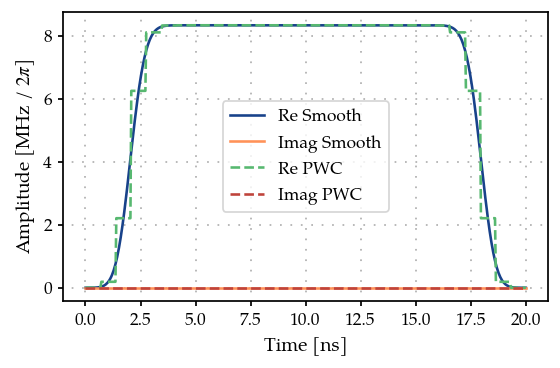
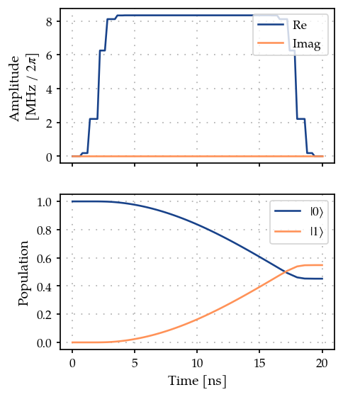
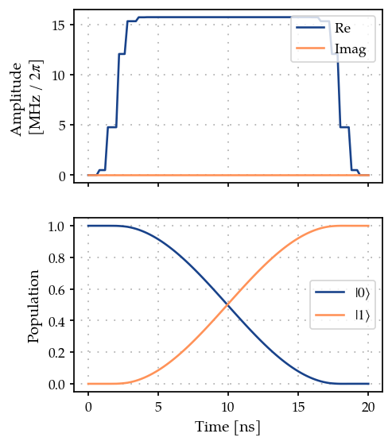

Optimal control of a single spin by using GOAT over GRAPE
=========================================================

In this introductory example we compute the gradients of analytic pulse
shapes in
`GOAT <https://journals.aps.org/prl/abstract/10.1103/PhysRevLett.120.150401>`__
by using the gradients of the time evolution from
`GRAPE <https://www.sciencedirect.com/science/article/pii/S1090780704003696>`__.
This is performed by using chain rule -

.. math:: \frac{\partial J}{\partial p} = \sum_k \frac{\partial J}{\partial c_k} \frac{\partial c_k}{\partial p}

where :math:`c_k = c(t_k)` the ‘pixelated’ control pulse,
:math:`\vec{p}` are the analytical parameters of the control pulse $c(t)
:raw-latex:`\equiv `c(:raw-latex:`\vec{p}`, t) $, and
:math:`\frac{\partial J}{\partial c_k}` are the gradients from GRAPE.

1. Generate a PWC pulse shape
-----------------------------

.. code:: ipython3

    import jax.numpy as jnp
    import matplotlib.pyplot as plt
    import numpy as np
    
    from paraqeet.quantity import Quantity
    from paraqeet.signal.envelopes import FlatTopGaussianEnvelope
    from paraqeet.signal.pwc_generator import PWCGenerator
    from paraqeet.signal.waveform import FlatTopGaussianFilter

Define the ``FlatTopGaussianEnvelope`` and the ``PWCGenerator``. The
``PWCGenerator`` is used to produce the pixelated pulse shape for
computing the gradients using GRAPE.

Here we also define the ``FlatTopGaussianFilter`` to ensure that the
pulse always starts and end at zero.

The optimization would be performed on the ``FlatTopGaussianEnvelope``
parameters: ``amplitude``, ``t_up``, ``t_down``, ``ramp_time``.

.. code:: ipython3

    t_final = 20e-9
    num_pwc = 30  # number of signal pixels
    t_simu = t_final
    times = np.linspace(0, t_final, num_pwc)
    
    tone = FlatTopGaussianEnvelope(
        amplitude=Quantity(np.pi / t_final / 3, -np.pi / t_final, np.pi / t_final, name="Amplitude"),
        t_up=Quantity(1e-9, 0.0, t_final, name="t_up"),
        t_down=Quantity(t_final - 1e-9, 0.0, t_final, name="t_down"),
        ramp_time=Quantity(1e-9, 0.5e-9, t_final, name="ramp_time"),
    )
    
    filtered_tone = FlatTopGaussianFilter(tone, t_final=Quantity(t_final, 0.0, 1.2 * t_final, name="t_final"))
    
    gen = PWCGenerator(envelopes=[filtered_tone], tlist=times)

.. code:: ipython3

    params = gen.get_parameters()
    params[0].set_limits(-200e6, 200e6)
    params[1].set_limits(-200e6, 200e6)

.. code:: ipython3

    from plotting import plot_signal
    
    ts = np.linspace(0, t_final, 501)
    fig, ax = plt.subplots(1, figsize=(5, 3))
    
    plot_signal(filtered_tone, ts, ax, linestyle="-", label="Smooth")
    plot_signal(gen, ts, ax, linestyle="--", label="PWC");

2. Define Hamiltonian in the rotating frame of drive
----------------------------------------------------

As a simple toy model, we use a single spin.

.. code:: ipython3

    from paraqeet.model.closed_system import ClosedSystem
    from paraqeet.model.differentiable_hamiltonian import DifferentiableHamiltonian
    from paraqeet.model.rotating_frame_drive import RotatingFrameDrive
    from paraqeet.quantity import Array
    
    
    class SpinRWA(DifferentiableHamiltonian):
        """A Single Spin."""
    
        def __init__(self, drives=None):
            super().__init__(drives)
            self.sigma_p = jnp.array([[0j, 1], [0, 0]])
            self.dim = 2
    
        def get_value_at_timestep(self, timestep: float) -> Array:
            """Just sigma-X."""
            return self._drives[0].get_value_at_timestep(self.sigma_p, timestep)
    
        def get_value_and_gradient(self, times: Array) -> tuple[Array, Array] | tuple[float, Array]:
            """Gradient is just the drive matrix."""
            return self.get_value(times), self._drives[0].get_gradient(self.sigma_p, times)
    
        def get_gradient_at_timestep(self, time):
            """Computes the gradient"""
            return self._drives[0].get_gradient_at_timestep(self.sigma_p, time)
    
        def dimension(self) -> int:
            """Returns the dimension"""
            raise self.d
    
        def get_collapseops(self) -> list[tuple[Array, Array]]:
            """Returns an empyt list since we study closed system dynamics"""
            return []
    
        def get_parameters(self):
            """Returns the parameters, which in this case are only the drive parameters"""
            return self._get_drive_parameters()
    
    
    drive = RotatingFrameDrive(gen)
    spin = SpinRWA(drives=[drive])
    model = ClosedSystem(spin)

Using GRAPE as the method to propagate and compute the gradients

.. code:: ipython3

    from paraqeet.measurement.state_transfer_fidelity import StateTransferFidelityGRAPE
    from paraqeet.propagation.scipy_expm_grape import ScipyExpmGRAPE
    
    prop = ScipyExpmGRAPE(model, resolution=2e9)
    
    init = np.array([[1.0], [0.0]])  # |0>
    target = np.array([[0.0], [1.0]])  # |1>
    
    prop.set_initial_state(init)
    prop.set_target_state(target)
    
    zeroone = StateTransferFidelityGRAPE(
        propagation=prop,
        initial_state=init,
        target_state=target,
    )

.. code:: ipython3

    zeroone.measure(times)

.. parsed-literal::

    0.5458431639927377

.. code:: ipython3

    from plotting import plot_signal_and_dynamics
    
    ts = np.linspace(0.0, t_final, 101)
    plot_signal_and_dynamics(gen, prop, ts, state_labels=[r"$|0\rangle$", r"$|1\rangle$"]);

3. Optimization
---------------

Finally, we define the ``GOATOverGRAPE`` fideltiy that chains together
the GRAPE gradients to compute the gradient wrt the tone parameters

.. code:: ipython3

    from paraqeet.measurement.goat_over_grape import GOATOverGRAPE
    from paraqeet.optimization_map import OptimizationMap
    from paraqeet.optimizers.scipy_optimizer_gradient import ScipyOptimizerGradient
    
    optmap = OptimizationMap()
    optmap.add(filtered_tone)
    optmap.register_params_with_optimizables()
    
    goat = GOATOverGRAPE(zeroone, prop, gen)
    opt_grad = ScipyOptimizerGradient(goat, optimization_map=optmap)

.. code:: ipython3

    opt_grad.optimize(np.array([0.0, t_simu]))

.. parsed-literal::

    {'status': 1, 'value': 3.1086244689504383e-15, 'iterations': 6, 'message': 'CONVERGENCE: NORM OF PROJECTED GRADIENT <= PGTOL'}

For this simple example, we reach near perfect fidelity within a few
iterations.

.. code:: ipython3

    plot_signal_and_dynamics(gen, prop, ts, state_labels=[r"$|0\rangle$", r"$|1\rangle$"]);

