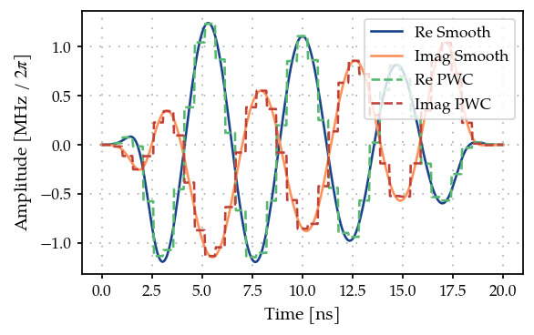
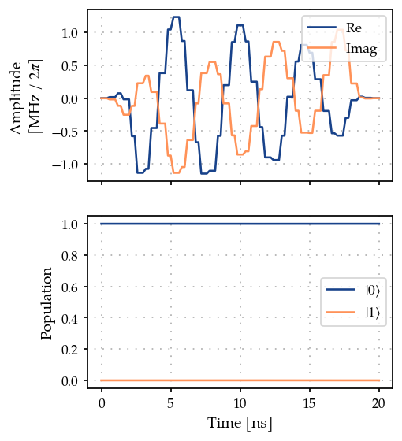
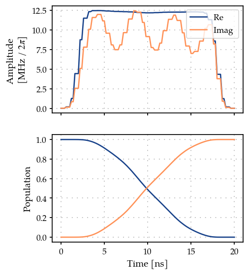
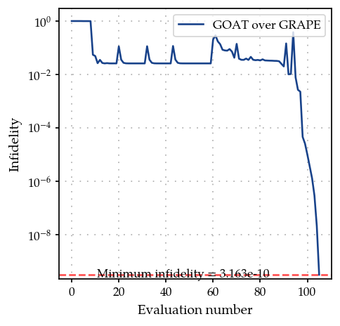

Optimal control of a single spin by using GOAT over GRAPE
=========================================================

In this introductory example we compute the gradients of analytic pulse
shapes in
`GOAT <https://journals.aps.org/prl/abstract/10.1103/PhysRevLett.120.150401>`__
by using the gradients of the time evolition from
`GRAPE <10.1016/j.jmr.2004.11.004>`__. This is performed by using chain
rule -

.. math:: \frac{\partial J}{\partial p} = \sum_k \frac{\partial J}{\partial c_k} \frac{\partial c_k}{\partial p}

where :math:`c_k = c(t_k)` the ‘pixelated’ control pulse,
:math:`\vec{p}` are the analytical parameters of the control pulse $c(t)
:raw-latex:`\equiv `c(:raw-latex:`\vec{p}`, t) $, and
:math:`\frac{\partial J}{\partial c_k}` are the gradients from GRAPE.

1. Generate a PWC pulse shape
-----------------------------

.. code:: ipython3

    import matplotlib.pyplot as plt
    import numpy as np
    from paraqeet.quantity import Quantity
    
    from paraqeet.signal.pwc_generator import PWCGenerator
    from paraqeet.signal.envelopes import DCRABEnvelope
    from paraqeet.signal.waveform import FlatTopGaussianFilter

.. code:: ipython3

    t_final = 20e-9
    tlist = np.linspace(0, t_final, 40)
    eps = 5 * np.pi * 1.0  # initial amplitude of the resonator (in MHz)
    eps_max = 10 * eps  # maximum amplitude of the resonator (in MHz)
    
    tone = DCRABEnvelope(
        num_components=2,
        max_frequency=5 * 2 * np.pi,
        amplitude=Quantity(eps * 1e6, -eps_max * 1e6, eps_max * 1e6, name="Amplitude"),
        t_final=Quantity(t_final, 1 / 2 * t_final, 2 * t_final, name="t_final"),
        seed=18537,
    )
    smooth_tone = FlatTopGaussianFilter(
        envelopes=tone, t_final=Quantity(t_final, 1 / 2 * t_final, 2 * t_final, name="t_final")
    )
    
    gen = PWCGenerator(envelopes=[smooth_tone], tlist=tlist, max_amplitude=np.sqrt(2) * eps_max * 1e6)
    
    params = gen.get_parameters()

.. code:: ipython3

    from paraqeet.plotting import plot_signal
    
    ts = np.linspace(0, t_final, 501)
    fig, ax = plt.subplots(1, figsize=(5, 3))
    plot_signal(smooth_tone, ts, ax, linestyle="-", label="Smooth")
    plot_signal(gen, ts, ax, linestyle="--", label="PWC")
    ax.legend(loc=1, frameon=True)
    plt.show()

2. Define Hamiltonian in the rotating frame of drive
----------------------------------------------------

As a simple toy model, we use a single spin.

.. code:: ipython3

    from paraqeet.model.closed_system import ClosedSystem
    from paraqeet.model.rotating_frame_drive import RotatingFrameDrive
    from paraqeet.model.hamiltonian import Hamiltonian
    
    
    class SpinRWA(Hamiltonian):
        """A Single Spin."""
    
        def __init__(self, drives=None):
            super().__init__(drives)
            self.sigma_p = np.array([[0j, 1], [0, 0]])
            self.dim = 2
    
        def get_matrix_one_time(self, t):
            """Just sigma-X."""
            return self._drives[0].get_matrix_one_time(self.sigma_p, t)
    
        def gradient(self, t):
            """Gradient is just the drive matrix."""
            return self._drives[0].gradient(self.sigma_p, t)
    
    
    drive = RotatingFrameDrive(gen)
    spin = SpinRWA(drives=[drive])
    model = ClosedSystem(spin)

Using GRAPE as the method to propagate and compute the gradients

.. code:: ipython3

    from paraqeet.measurement.state_transfer_fidelity import StateTransferFidelityGRAPE
    from paraqeet.propagation.scipy_expm_grape import ScipyExpmGRAPE
    
    
    prop = ScipyExpmGRAPE(model, res=1e9)
    
    init = np.array([[1.0], [0]])  # |0>
    target = np.array([[0.0], [1]])  # |1>
    
    prop.set_initial_state(init)
    prop.target_state = target
    
    zeroone = StateTransferFidelityGRAPE(
        propagation=prop,
        initial_state=init,
        target_state=target,
        times=tlist,
    )

.. code:: ipython3

    from paraqeet.plotting import plot_signal_and_dynamics
    
    ts = np.linspace(0.0, t_final, 101)
    plot_signal_and_dynamics(gen, prop, ts, state_labels=[r"$|0\rangle$", r"$|1\rangle$"]);

3. Optimisation
---------------

Finally, we define the ``GOATOverGRAPE`` fideltiy that chains together
the GRAPE gradients to compute the gradient wrt the tone parameters

.. code:: ipython3

    params = tone.get_parameters()
    params

.. parsed-literal::

    [Amplitude: 1.57e+07,
     t_final: 2e-08,
     CRAB Re coefficient 0: 0.801,
     CRAB Re coefficient 1: -0.707,
     CRAB Re frequency 0: 4 Hz x 2pi,
     CRAB Re frequency 1: 4.51 Hz x 2pi,
     CRAB Re Phase 0: -75.6 mHz x 2pi,
     CRAB Re Phase 1: 320 mHz x 2pi,
     CRAB Im coefficient 0: -0.419,
     CRAB Im coefficient 1: 0.72,
     CRAB Im frequency 0: 472 mHz x 2pi,
     CRAB Im frequency 1: 4.27 Hz x 2pi,
     CRAB Im Phase 0: -23.1 mHz x 2pi,
     CRAB Im Phase 1: 317 mHz x 2pi]

.. code:: ipython3

    from paraqeet.file_logger import FileLogger
    from paraqeet.optimisation_map import OptimisationMap
    from paraqeet.optimisers.dcrab_optimiser_gradient import DCRABOptimiserGradient
    from paraqeet.measurement.goat_over_grape import GOATOverGRAPE
    
    import tempfile
    
    temp_dir = tempfile.TemporaryDirectory()
    
    file_logger = FileLogger(temp_dir.name)
    
    optmap = OptimisationMap()
    optmap.add(tone, [params[0]] + params[2:])
    optmap.register_params_with_optimisables()
    
    goat = GOATOverGRAPE(zeroone, generators=[gen], generators_order=[0])
    opt_grad = DCRABOptimiserGradient(
        goat,
        optimisation_map=optmap,
        super_iteration_every=150,
        max_super_iteration_num=5,
        print_every_iteration_num=10,
        super_iteration_tol=1e-9,
        seed=19573,
    )
    opt_grad.logger = file_logger

.. code:: ipython3

    optmap

.. parsed-literal::

    ==== <class 'paraqeet.signal.envelopes.DCRABEnvelope'> ====
    [Amplitude: 1.57e+07, CRAB Re coefficient 0: 0.801, CRAB Re coefficient 1: -0.707, CRAB Re frequency 0: 4 Hz x 2pi, CRAB Re frequency 1: 4.51 Hz x 2pi, CRAB Re Phase 0: -75.6 mHz x 2pi, CRAB Re Phase 1: 320 mHz x 2pi, CRAB Im coefficient 0: -0.419, CRAB Im coefficient 1: 0.72, CRAB Im frequency 0: 472 mHz x 2pi, CRAB Im frequency 1: 4.27 Hz x 2pi, CRAB Im Phase 0: -23.1 mHz x 2pi, CRAB Im Phase 1: 317 mHz x 2pi]

.. code:: ipython3

    opt_grad.optimise()

.. parsed-literal::

    scipy.optimize: The `disp` and `iprint` options of the L-BFGS-B solver are deprecated and will be removed in SciPy 1.18.0.

.. parsed-literal::

    Iteration number = 0 	  Infidelity  = 9.999e-01
    
    
    ==== Decrease in infidelity less than 1e-09 ====
    ==== Starting super-iteration 1 ====
    * Current lowest infidelity =  2.594e-02
    * Current no. of parameters = 25
    Iteration number = 10 	  Infidelity  = 1.732e-01
    Iteration number = 20 	  Infidelity  = 3.355e-02
    Iteration number = 30 	  Infidelity  = 7.757e-03
    Iteration number = 40 	  Infidelity  = 3.163e-10
    Setting parameters to the best values.

.. parsed-literal::

    {'status': 1, 'value': 3.1633584640644585e-10, 'iterations': 60, 'message': 'CONVERGENCE: RELATIVE REDUCTION OF F <= FACTR*EPSMCH'}

As the parameters are added with random values, the optimization may not
succeed somethimes. If it does not reach a low value restart the
optimization.

.. code:: ipython3

    opt_grad.set_parameters(opt_grad.best_params)
    plot_signal_and_dynamics(gen, prop, ts);

.. code:: ipython3

    optmap

.. parsed-literal::

    ==== <class 'paraqeet.signal.envelopes.DCRABEnvelope'> ====
    [Amplitude: 1.57e+08, CRAB Re coefficient 0: -0.00229, CRAB Re coefficient 1: -1, CRAB Re coefficient 2: 0.389, CRAB Re coefficient 3: 0.00994, CRAB Re frequency 0: 4.98 Hz x 2pi, CRAB Re frequency 1: 0 Hz x 2pi, CRAB Re frequency 2: 48.1 mHz x 2pi, CRAB Re frequency 3: 1.88 Hz x 2pi, CRAB Re Phase 0: 496 mHz x 2pi, CRAB Re Phase 1: -500 mHz x 2pi, CRAB Re Phase 2: 19.4 mHz x 2pi, CRAB Re Phase 3: -429 mHz x 2pi, CRAB Im coefficient 0: -0.251, CRAB Im coefficient 1: -1, CRAB Im coefficient 2: 0.0093, CRAB Im coefficient 3: -0.04, CRAB Im frequency 0: 4.53 Hz x 2pi, CRAB Im frequency 1: 0 Hz x 2pi, CRAB Im frequency 2: 2.68 Hz x 2pi, CRAB Im frequency 3: 1.2 Hz x 2pi, CRAB Im Phase 0: -460 mHz x 2pi, CRAB Im Phase 1: -500 mHz x 2pi, CRAB Im phase 2: -161 mHz x 2pi, CRAB Im phase 3: 4.54 mHz x 2pi]

.. code:: ipython3

    from paraqeet.plotting import plot_infidelity_vs_evaluation_from_logs
    
    plot_infidelity_vs_evaluation_from_logs(log_path=temp_dir.name + "/opt.log", label="GOAT over GRAPE");

.. code:: ipython3

    temp_dir.cleanup()
