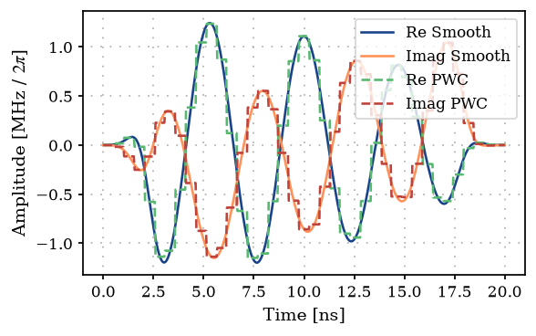
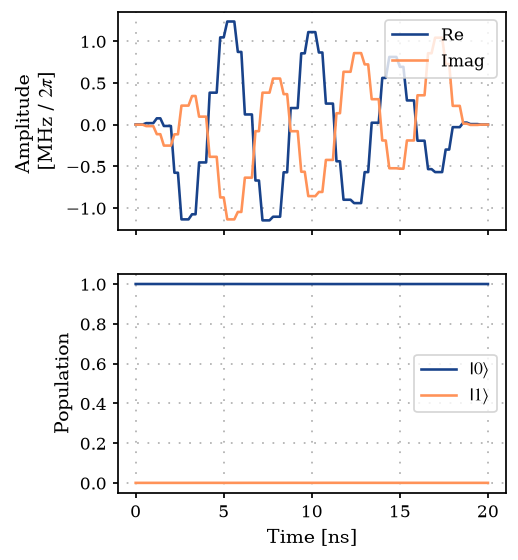
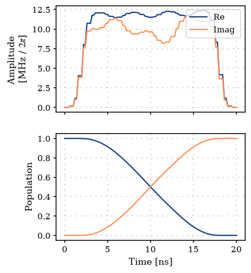
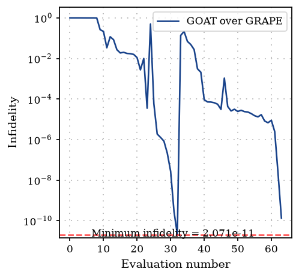

Gradient based dCRAB optimization of a single spin
==================================================

In this example, we solve the optimization task in the `previous
example <02D_GOAToverGRAPE_TLS.ipynb>`__ by using the dCRAB (Rach et
al., 2015) :cite:p:`rach2015dressing` (Müller et al., 2022)
:cite:p:`muller2022one` optimization method. Here we implement a
gradient based dCRAB algorithm by using the GOAToverGRAPE method, which
combines GOAT (Machnes et al., 2018) :cite:p:`machnes2018tunable` and
GRAPE (Khaneja et al., 2005) :cite:p:`khaneja2005optimal` as a
gradient-based variant of the GROUP method (Sørensen et al., 2018)
:cite:p:`sorensen2018quantum`.

1. Generate a PWC pulse shape
-----------------------------

.. code:: ipython3

    import matplotlib.pyplot as plt
    import numpy as np
    
    from paraqeet.eom.schroedinger_equation import SchroedingerEquation
    from paraqeet.hamiltonian.drive import Drive
    from paraqeet.hamiltonian.qubit import QubitHamiltonian
    from paraqeet.quantity import Quantity
    from paraqeet.signal.envelopes import DCRABEnvelope
    from paraqeet.signal.pwc_generator import PWCGenerator
    from paraqeet.signal.signal import FlatTopGaussianFilter

Similar to the previous case, let’s define the pulse generator, with the
envelope being the ``DCRABEnvelope``. We use a ``FlatTopGaussianFilter``
to ensure that the pulse always starts and ends at zero. Finally, to
obtain GRAPE gradients we pixelate the pulse using a ``PWCGenerator``.

.. code:: ipython3

    t_final = 20e-9
    tlist = np.linspace(0, t_final, 40)
    eps = 5 * np.pi * 1.0  # initial amplitude of the resonator (in MHz)
    eps_max = 10 * eps  # maximum amplitude of the resonator (in MHz)
    
    tone = DCRABEnvelope(
        num_components=2,
        max_frequency=5 * 2 * np.pi,
        amplitude=Quantity(eps * 1e6, -eps_max * 1e6, eps_max * 1e6, name="Amplitude"),
        t_final=Quantity(t_final, 1 / 2 * t_final, 2 * t_final, name="t_final"),
        seed=18537,
    )
    smooth_tone = FlatTopGaussianFilter(
        envelopes=tone, t_final=Quantity(t_final, 1 / 2 * t_final, 2 * t_final, name="t_final")
    )
    
    gen = PWCGenerator(envelopes=[smooth_tone], tlist=tlist, max_amplitude=np.sqrt(2) * eps_max * 1e6)
    
    params = gen.get_parameters()

Here the ``DCRABEnvelope`` is defined with a seed to make sure that the
results obtained are reproducible.

.. code:: ipython3

    from plotting import plot_signal
    
    ts = np.linspace(0, t_final, 501)
    fig, ax = plt.subplots(1, figsize=(5, 3))
    plot_signal(smooth_tone, ts, ax, linestyle="-", label="Smooth")
    plot_signal(gen, ts, ax, linestyle="--", label="PWC")
    ax.legend(loc=1, frameon=True)
    plt.show()

2. Define Hamiltonian in the rotating frame of drive
----------------------------------------------------

As before we define a single spin in the rotating frame of the drive.

.. code:: ipython3

    qubit_hamiltonian = QubitHamiltonian(frequency=Quantity(0.0, 0.0, 2 * np.pi * 1e6, unit="Hz"), drives=[])
    drive = Drive(qubit_hamiltonian.sigma_minus, gen, add_hermitian=True)
    qubit_hamiltonian.drives = [drive]
    model = SchroedingerEquation(
        hamiltonian_func=qubit_hamiltonian.get_value,
        hamiltonian_gradient_func=qubit_hamiltonian.get_gradient,
    )

And using GRAPE as the method to propagate and compute the gradients.
The propagation :math:`dt` has to be smaller than the :math:`\Delta t`
of the time grid used for discretization. In this case
:math:`\Delta t = 0.5` ns, so we choose the propagation resolution to be
> 2e9.

.. code:: ipython3

    from paraqeet.measurement.state_transfer_fidelity import StateTransferFidelityGRAPE
    from paraqeet.measurement.utils import overlap_state_vector
    from paraqeet.propagation import GRAPE, Expm
    from paraqeet.propagation.utils import grape_operator_sandwich_function_closed
    
    init = np.array([[1.0], [0.0]])  # |0>
    target = np.array([[0.0], [1.0]])  # |1>
    
    propagation = Expm(eom_func=model.get_value, resolution=3e9, initial_state=init)
    prop = GRAPE(
        propagation,
        eom_gradient_func=model.get_gradient,
        target_state=target,
        operator_sandwich_function=grape_operator_sandwich_function_closed,
        order=3
    )
    
    zeroone = StateTransferFidelityGRAPE(
        propagation_func=prop.get_value,
        propagation_gradient_func=prop.get_gradient,
        target_state=target,
        overlap=overlap_state_vector,
    )

.. code:: ipython3

    from plotting import plot_signal_and_dynamics
    
    ts = np.linspace(0.0, t_final, 101)
    plot_signal_and_dynamics(gen, prop, ts, state_labels=[r"$|0\rangle$", r"$|1\rangle$"])

.. parsed-literal::

    array([<Axes: ylabel='Amplitude \n[MHz / $2\\pi$]'>,
           <Axes: xlabel='Time [ns]', ylabel='Population'>], dtype=object)

3. Optimization
---------------

Finally, we define the ``DCRABOptimizerGradient`` that takes the
``GOATOverGRAPE`` fidelity to chain together the GRAPE gradients to
compute the gradient wrt the dCRAB envelope

.. code:: ipython3

    params = tone.get_parameters()
    params

.. parsed-literal::

    [Amplitude: 1.57e+07,
     t_final: 2e-08,
     CRAB Re coefficient 0: 0.801,
     CRAB Re coefficient 1: -0.707,
     CRAB Re frequency 0: 4 Hz x 2pi,
     CRAB Re frequency 1: 4.51 Hz x 2pi,
     CRAB Re Phase 0: -475 mrad,
     CRAB Re Phase 1: 2.01 rad,
     CRAB Im coefficient 0: -0.419,
     CRAB Im coefficient 1: 0.72,
     CRAB Im frequency 0: 472 mHz x 2pi,
     CRAB Im frequency 1: 4.27 Hz x 2pi,
     CRAB Im Phase 0: -145 mrad,
     CRAB Im Phase 1: 1.99 rad]

Here we add the parameters from the ``DCRABEnvelope`` to the ``optmap``
(except the ``t_final`` to keep the simulation time constant)

.. code:: ipython3

    import tempfile
    
    from paraqeet.file_logger import FileLogger
    from paraqeet.measurement.goat_over_grape import GOATOverGRAPE
    from paraqeet.optimization_map import OptimizationMap
    from paraqeet.optimizers.dcrab_optimizer_gradient import DCRABOptimizerGradient
    
    temp_dir = tempfile.TemporaryDirectory(suffix="pq")  # Ends in 'pq' to prevent _ at the end
    
    file_logger = FileLogger(temp_dir.name)
    
    optmap = OptimizationMap()
    optmap.add(tone, [params[0]] + params[2:])
    optmap.register_params_with_optimizables()
    
    goat = GOATOverGRAPE(zeroone, gen, propagation.resolution)
    opt_grad = DCRABOptimizerGradient(
        measure_and_gradient_func=goat.get_value_and_gradient,
        optimization_map=optmap,
        super_iteration_every=150,
        max_super_iteration_num=5,
        print_every_iteration_num=10,
        super_iteration_tol=1e-9,
        seed=19573,
    )
    opt_grad.logger = file_logger

The ``optmap`` in this case contains the pulse amplitude and the Fourier
coefficients for the optimization.

.. code:: ipython3

    optmap

.. parsed-literal::

    ==== <class 'paraqeet.signal.envelopes.DCRABEnvelope'> ====
    [Amplitude: 1.57e+07, CRAB Re coefficient 0: 0.801, CRAB Re coefficient 1: -0.707, CRAB Re frequency 0: 4 Hz x 2pi, CRAB Re frequency 1: 4.51 Hz x 2pi, CRAB Re Phase 0: -475 mrad, CRAB Re Phase 1: 2.01 rad, CRAB Im coefficient 0: -0.419, CRAB Im coefficient 1: 0.72, CRAB Im frequency 0: 472 mHz x 2pi, CRAB Im frequency 1: 4.27 Hz x 2pi, CRAB Im Phase 0: -145 mrad, CRAB Im Phase 1: 1.99 rad]

.. code:: ipython3

    opt_grad.optimize(np.array([0.0, t_final]))

.. parsed-literal::

    Iteration number = 0 	  Infidelity  = 9.999e-01

.. parsed-literal::

    Iteration number = 10 	  Infidelity  = 2.753e-03

.. parsed-literal::

    
    
    ==== Decrease in infidelity less than 1e-09 ====
    ==== Starting super-iteration 1 ====
    * Current lowest infidelity =  2.071e-11
    * Current no. of parameters = 25

.. parsed-literal::

    Iteration number = 20 	  Infidelity  = 4.878e-02

.. parsed-literal::

    Iteration number = 30 	  Infidelity  = 2.294e-05

.. parsed-literal::

    Setting parameters to the best values.

.. parsed-literal::

    Stopping the optimization or backtracking to previous best fidelity. Going to step with 13 parameters.

.. parsed-literal::

    {'status': 1, 'value': 2.071320892582662e-11, 'iterations': 33, 'message': 'CONVERGENCE: RELATIVE REDUCTION OF F <= FACTR*EPSMCH'}

As the parameters are added with random values, the optimization may not
succeed sometimes. If it does not reach a low value, restart the
optimization. Here, we have chosen a seed that converges to the target
fidelity.

.. code:: ipython3

    opt_grad.set_parameters(opt_grad.best_params)
    plot_signal_and_dynamics(gen, prop, ts)

.. parsed-literal::

    array([<Axes: ylabel='Amplitude \n[MHz / $2\\pi$]'>,
           <Axes: xlabel='Time [ns]', ylabel='Population'>], dtype=object)

.. code:: ipython3

    from plotting import plot_infidelity_vs_evaluation_from_logs
    
    plot_infidelity_vs_evaluation_from_logs(log_path=temp_dir.name + "/opt.log", label="GOAT over GRAPE")

.. parsed-literal::

    <Axes: xlabel='Evaluation number', ylabel='Infidelity'>

.. code:: ipython3

    temp_dir.cleanup()

References
----------

-  **(Khaneja et al., 2005)** N. Khaneja et al., “Optimal control of
   coupled spin dynamics: design of NMR pulse sequences by gradient
   ascent algorithms,” *Journal of Magnetic Resonance* **172**, 296–305
   (2005).
-  **(Machnes et al., 2018)** S. Machnes et al., “Tunable, flexible, and
   efficient optimization of control pulses for practical qubits,”
   *Physical Review Letters* **120**, 150401 (2018).
-  **(Sørensen et al., 2018)** J. J. W. H. Sørensen et al., “Quantum
   optimal control in a chopped basis: Applications in control of
   Bose-Einstein condensates,” *Physical Review A* **98**, 022119
   (2018).
-  **(Rach et al., 2015)** N. Rach et al., “Dressing the
   chopped-random-basis optimization: A bandwidth-limited access to the
   trap-free landscape,” *Physical Review A* **92**, 062343 (2015).
-  **(Müller et al., 2022)** M. M. Müller et al., “One decade of quantum
   optimal control in the chopped random basis,” *Reports on Progress in
   Physics* **85**, 076001 (2022).
