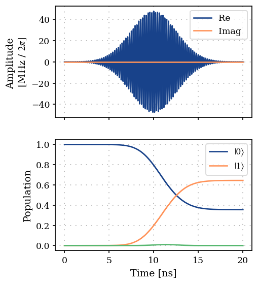
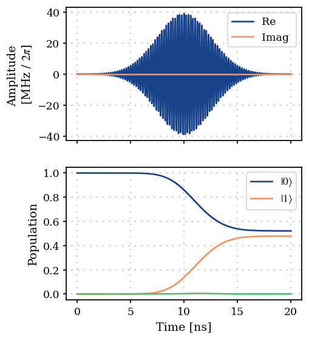

DRAG Correction of a Gaussian Pulse
===================================

First, we make the necessary imports.

.. code:: ipython3

    import numpy as np
    
    from paraqeet.measurement.unitary_fidelity import UnitaryFidelity
    from paraqeet.model.drive import Drive
    from paraqeet.model.schroedinger_equation import SchroedingerEquation
    from paraqeet.model.transmon import TransmonHamiltonian
    from paraqeet.optimization_map import OptimizationMap
    from paraqeet.optimizers.scipy_optimizer import ScipyOptimizer
    from paraqeet.propagation.scipy_expm_goat import ScipyExpmGOAT
    from paraqeet.quantity import Quantity
    from paraqeet.signal.envelopes import GaussEnvelope
    from paraqeet.signal.iq_mixer import IQMixer
    from paraqeet.signal.waveform import DRAGMixer

1. Define the Gaussian Tone and put into the DRAGMixer
------------------------------------------------------

The GaussTone explicitly allows for the evaluation of an envelope signal
and its time derivative which is then used to calculate the DRAG
corrected signal in the DRAGMixer

.. code:: ipython3

    t_final = 20e-9
    env_tone = GaussEnvelope()
    env_tone.t_final.set_value(t_final)
    drag_tone = DRAGMixer(envelopes=env_tone)

.. code:: ipython3

    drag_tone._envs[0]._delta

.. parsed-literal::

    Delta: -1.26 GHz

.. code:: ipython3

    gen = IQMixer(envelopes=[drag_tone])

.. code:: ipython3

    freq = 4.8e9 * 2 * np.pi
    anhar = -200e6 * 2 * np.pi
    
    num_levels = 3
    transmon_hamiltonian = TransmonHamiltonian(
        frequency=Quantity(
            freq,
            min_value=np.array(freq / 4),
            max_value=np.array(freq * 1.2),
            unit="Hz",
            name="Qubit frequency",
        ),
        anharmonicity=Quantity(
            anhar,
            min_value=np.array(anhar * 1.2),
            max_value=np.array(anhar * 0.8),
            unit="Hz",
            name="Qubit anharmonicity",
        ),
        num_levels=num_levels,
        drives=[],
    )
    
    drive_op = transmon_hamiltonian.annihilation_op + (transmon_hamiltonian.annihilation_op).conj().T
    drive = Drive(drive_op, gen)
    transmon_hamiltonian.drives = [drive]
    
    model = SchroedingerEquation(
        hamiltonian_func=transmon_hamiltonian.get_value,
        hamiltonian_gradient_func=transmon_hamiltonian.get_gradient,
    )
    
    params = gen.get_parameters()
    
    prop = ScipyExpmGOAT(
        eom_func=model.get_value,
        eom_gradient_func=model.get_gradient,
        resolution=100e9,
        initial_state=np.eye(num_levels),
    )

.. code:: ipython3

    params

.. parsed-literal::

    [Amplitude: 24.7 MHz x 2pi,
     t_final: 20 ns,
     Delta: -1.26 GHz,
     lo_freq: 4.8 GHz x 2pi,
     Phase: 0 rad]

.. code:: ipython3

    params[0].set_value(3e8)
    params[2].set_value(2 * anhar)

.. code:: ipython3

    gen.get_parameters()

.. parsed-literal::

    [Amplitude: 47.7 MHz x 2pi,
     t_final: 20 ns,
     Delta: -2.51 GHz,
     lo_freq: 4.8 GHz x 2pi,
     Phase: 0 rad]

2. Set up ideal reference matrix to compare the pulses result to.
-----------------------------------------------------------------

.. code:: ipython3

    def rx(theta) -> np.ndarray:
        """Get the ideal representation of a rx rotation of angle theta."""
        return np.array(
            [
                [np.cos(theta / 2), -1j * np.sin(theta / 2), 0],
                [-1j * np.sin(theta / 2), np.cos(theta / 2), 0],
                [0, 0, 1],
            ],
            dtype=np.complex128,
        )

Set up measure that is optimized. In this case, the gate fidelity
between the propagator resulting from the pulse simulation and the ideal
reference defined above is used.

.. code:: ipython3

    gate_fid = UnitaryFidelity(
        propagation_func=prop.propagate,
        propagation_gradient_func=prop.get_gradient,
        gate=rx(np.pi / 2),
    )

Plot initial pulse shape and population transfer. Target is the full
population transfer,i.e., an X-gate.

.. code:: ipython3

    from plotting import plot_signal_and_dynamics
    
    ts = np.linspace(0.0, t_final, 1001)
    plot_signal_and_dynamics(gen, prop, ts, state_labels=[r"$|0\rangle$", r"$|1\rangle$"])

.. parsed-literal::

    array([<Axes: ylabel='Amplitude \n[MHz / $2\\pi$]'>,
           <Axes: xlabel='Time [ns]', ylabel='Population'>], dtype=object)

As expected, we get a partial transfer and a low fidelity.

.. code:: ipython3

    times = np.array([0.0, t_final])
    gate_fid.measure(times)

.. parsed-literal::

    Array(0.97379736, dtype=float64)

3. Optimization
---------------

We define an optimizer and link our fidelity measure as a goal function
and the parameters of the cosine tone.

.. code:: ipython3

    optmap = OptimizationMap()
    selected_params = []
    for i in [0, 2, 3, 4]:
        selected_params.append(params[i])
    optmap.add(gen, selected_params)
    opt = ScipyOptimizer(measure_func=gate_fid.measure, optimization_map=optmap)

.. code:: ipython3

    opt.optimize(times)

.. parsed-literal::

    {'status': 1, 'value': 0.005760894081225376, 'iterations': 90, 'message': 'CONVERGENCE: RELATIVE REDUCTION OF F <= FACTR*EPSMCH'}

Print all parameters that were optimized.

.. code:: ipython3

    print("{: >15}: {: >20} {: >20} {: >20}".format("Name", "Value", "Min", "Max"))
    print("-" * 80)
    for par in selected_params:
        print(
            f"{par.get_name(): >15}: {par.get_value()[0]: >20.6e} "
            f"{par.get_min_value()[0]: >20.6e} {par.get_max_value()[0]: >20.6e}"
        )

.. parsed-literal::

               Name:                Value                  Min                  Max
    --------------------------------------------------------------------------------
          Amplitude:         2.455072e+08         0.000000e+00         1.000000e+09
              Delta:        -2.493540e+09        -3.769911e+09        -1.256637e+08
            lo_freq:         3.015934e+10         2.412743e+10         3.619115e+10
              Phase:         2.006086e-04        -3.141593e+00         3.141593e+00

Plot final pulse shape and population transfer. Target is the full
population transfer,i.e., an X-gate.

.. code:: ipython3

    plot_signal_and_dynamics(gen, prop, ts, state_labels=[r"$|0\rangle$", r"$|1\rangle$"])

.. parsed-literal::

    array([<Axes: ylabel='Amplitude \n[MHz / $2\\pi$]'>,
           <Axes: xlabel='Time [ns]', ylabel='Population'>], dtype=object)

We can see from the plot and optimizer output that we have found better
controls. For which the excitement to the second excited state is much
smaller than initially.

.. code:: ipython3

    gate_fid.measure(times)

.. parsed-literal::

    Array(0.99423911, dtype=float64)

