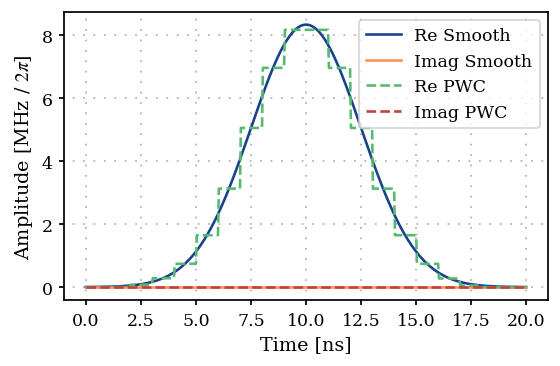
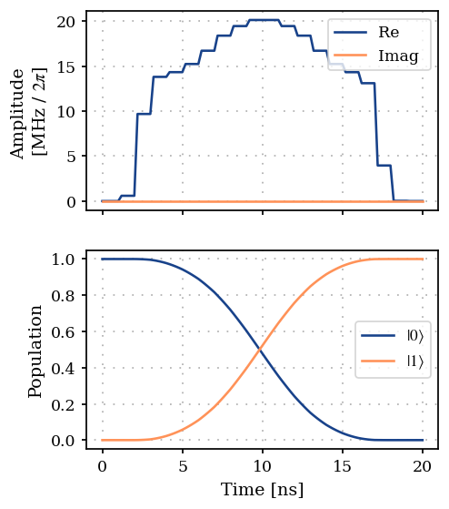
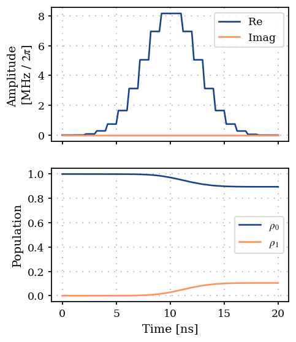
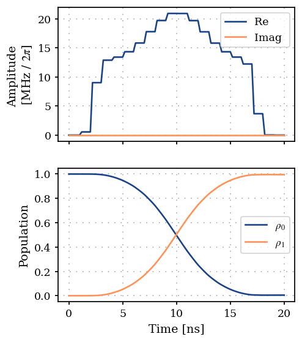

GRAPE on a single spin
======================

This in an introductory example to the
`GRAPE <10.1016/j.jmr.2004.11.004>`__ method and its implementation in
this software package.

1. Generate a PWC pulse shape
-----------------------------

.. code:: ipython3

    import matplotlib.pyplot as plt
    import numpy as np
    
    from paraqeet.model.drive import Drive
    from paraqeet.model.qubit import QubitHamiltonian
    from paraqeet.model.schroedinger_equation import SchroedingerEquation
    from paraqeet.quantity import Quantity
    from paraqeet.signal.envelopes import GaussEnvelope
    from paraqeet.signal.pwc_generator import PWCGenerator

First, let’s generate a piecewise constant (PWC) pulse envelope for the
Gaussian pulse. For GRAPE, we need to specify an anstanz for piecewise
constant controls at a given resolution. Here, we setup a Gaussian
initial guess, sampling at 21 points during a gate time of 20ns.

.. code:: ipython3

    t_final = 20e-9
    tlist = np.linspace(0, t_final, 21)
    tone = GaussEnvelope(amplitude=Quantity(np.pi / t_final / 3, -np.pi / t_final, np.pi / t_final))
    tone.t_final.set_value(t_final)
    
    gen = PWCGenerator(envelopes=[tone], tlist=tlist)
    gen.multiply_flat_top = True
    gen.max_amplitude = 2 * 1e8

We have added the option ``multiply_flat_top``, to ensure the pulse to
start and end smoothly at 0 and ``t_final``. This acts like the
``FlatTopGaussianFilter``, but enforced directly by the
``PWCGenerator``.

.. code:: ipython3

    from plotting import plot_signal
    
    ts = np.linspace(0, t_final, 501)
    fig, ax = plt.subplots(1, figsize=(5, 3))
    plot_signal(tone, ts, ax, linestyle="-", label="Smooth")
    plot_signal(gen, ts, ax, linestyle="--", label="PWC")
    ax.legend(loc=1, frameon=True)
    plt.show()

2. Define Hamiltonian in the rotating frame of drive
----------------------------------------------------

As a simple toy model, we use a single spin.

.. code:: ipython3

    qubit_hamiltonian = QubitHamiltonian(frequency=Quantity(0.0, 0.0, 2 * np.pi * 1e6, unit="Hz"), drives=[])
    drive = Drive(qubit_hamiltonian.sigma_minus, gen, add_hermitian=True)
    qubit_hamiltonian.drives = [drive]
    model = SchroedingerEquation(
        hamiltonian_func=qubit_hamiltonian.get_value,
        hamiltonian_gradient_func=qubit_hamiltonian.get_gradient,
    )

.. code:: ipython3

    from paraqeet.measurement.state_transfer_fidelity import StateTransferFidelityGRAPE
    from paraqeet.measurement.utils import overlap_state_vector
    from paraqeet.propagation.scipy_expm_grape import ScipyExpmGRAPE
    from paraqeet.propagation.utils import grape_operator_sandwich_function_closed
    
    init = np.array([[1.0], [0.0]])  # |0>
    target = np.array([[0.0], [1.0]])  # |1>
    
    prop = ScipyExpmGRAPE(
        eom_func=model.get_value,
        eom_gradient_func=model.get_gradient,
        resolution=2e9,
        initial_state=init,
        target_state=target,
        operator_sandwich_function=grape_operator_sandwich_function_closed,
    )
    
    times = np.array([0.0, t_final])
    
    zeroone = StateTransferFidelityGRAPE(
        propagation_func=prop.propagate,
        propagation_gradient_func=prop.get_gradient,
        target_state=target,
        overlap=overlap_state_vector,
    )

.. code:: ipython3

    from plotting import plot_signal_and_dynamics
    
    ts = np.linspace(0.0, t_final, 101)
    plot_signal_and_dynamics(gen, prop, ts, state_labels=[r"$|0\rangle$", r"$|1\rangle$"])

.. parsed-literal::

    array([<Axes: ylabel='Amplitude \n[MHz / $2\\pi$]'>,
           <Axes: xlabel='Time [ns]', ylabel='Population'>], dtype=object)

.. image:: 04A_GRAPE_TLS_files/04A_GRAPE_TLS_11_1.png

.. code:: ipython3

    zeroone.measure(times)

.. parsed-literal::

    Array(0.73183237, dtype=float64)

.. code:: ipython3

    from paraqeet.optimization_map import OptimizationMap
    from paraqeet.optimizers.scipy_optimizer_gradient import ScipyOptimizerGradient
    
    optmap = OptimizationMap()
    optmap.add(gen)
    optmap.register_params_with_optimizables()
    
    opt_grad = ScipyOptimizerGradient(measure_and_gradient_func=zeroone.get_value_and_gradient, optimization_map=optmap)

Unlike the previous examples, for GRAPE based optimization, we need to
specify the exact time grid used to discretize the signal for
optimization. This is required to compute the correct gradients at the
exact time points. The time grid used for discretization can be found
from a ``PWCGenerator`` using ``gen.tlist``.

.. code:: ipython3

    opt_grad.optimize(gen.tlist)

.. parsed-literal::

    {'status': 1, 'value': 1.4499512701604544e-13, 'iterations': 7, 'message': 'CONVERGENCE: NORM OF PROJECTED GRADIENT <= PGTOL'}

For this simple example, we reach near perfect fidelity within a few
iterations.

.. code:: ipython3

    plot_signal_and_dynamics(gen, prop, ts, state_labels=[r"$|0\rangle$", r"$|1\rangle$"])

.. parsed-literal::

    array([<Axes: ylabel='Amplitude \n[MHz / $2\\pi$]'>,
           <Axes: xlabel='Time [ns]', ylabel='Population'>], dtype=object)

With open system
----------------

Lets first reset the pulse and create a open-system model

.. code:: ipython3

    import numpy as np
    
    from paraqeet.quantity import Quantity
    from paraqeet.signal.envelopes import GaussEnvelope
    from paraqeet.signal.pwc_generator import PWCGenerator

.. code:: ipython3

    tone = GaussEnvelope(amplitude=Quantity(np.pi / t_final / 3, -np.pi / t_final, np.pi / t_final))
    tone.t_final.set_value(t_final)
    gen = PWCGenerator(envelopes=[tone], tlist=tlist)
    gen.multiply_flat_top = True
    gen.max_amplitude = 5 * 1e8

.. code:: ipython3

    import jax.numpy as jnp
    
    from paraqeet.model.master_equation import MasterEquation
    from paraqeet.model.qubit import Qubit
    
    t1 = Quantity(10e-6, 1e-6, 100e-6)
    temp = Quantity(10e-3, 1e-3, 50e-3)
    t2star = Quantity(20e-6, 1e-6, 100e-6)
    
    
    qubit_hamiltonian = QubitHamiltonian(frequency=Quantity(0.0, 0.0, 2 * np.pi * 1e6, unit="Hz"), drives=[])
    drive = Drive(qubit_hamiltonian.sigma_minus, gen, add_hermitian=True)
    qubit_hamiltonian.drives = [drive]
    
    open_qubit = Qubit(hamiltonian=qubit_hamiltonian, t1=t1, temp=temp, t2star=t2star)
    
    model = MasterEquation(
        hamiltonian_func=qubit_hamiltonian.get_value,
        hamiltonian_gradient_func=qubit_hamiltonian.get_gradient,
        jump_operators=open_qubit.get_jump_operators(),
    )

Lets test GRAPE with ODE-propgation

.. code:: ipython3

    from paraqeet.measurement.state_transfer_fidelity import StateTransferFidelityGRAPE
    from paraqeet.measurement.utils import overlap_density_matrix
    from paraqeet.propagation.utils import grape_operator_sandwich_function_open, lindblad_step, reverse_lindblad_step
    from paraqeet.propagation.vern7_grape import Vern7GRAPE
    
    init = np.array([[1.0], [0.0j]])  # |0>
    target = np.array([[0.0j], [1.0]])  # |1>
    
    init = jnp.matmul(init, init.T.conj())
    target = jnp.matmul(target, target.T.conj())
    
    prop = Vern7GRAPE(
        eom_func=model.get_eom_ode_propagation,
        eom_gradient_func=model.get_eom_gradient_ode_propagation,
        resolution=10e9,
        initial_state=init,
        target_state=target,
        step_function=lindblad_step,
        reverse_step_function=reverse_lindblad_step,
        operator_sandwich_function=grape_operator_sandwich_function_open,
        jump_operators=open_qubit.get_jump_operators(),
    )
    
    zeroone = StateTransferFidelityGRAPE(
        propagation_func=prop.propagate,
        propagation_gradient_func=prop.get_gradient,
        target_state=target,
        overlap=overlap_density_matrix,
    )

.. code:: ipython3

    init

.. parsed-literal::

    Array([[1.+0.j, 0.+0.j],
           [0.+0.j, 0.+0.j]], dtype=complex128)

.. code:: ipython3

    ts = np.linspace(0, t_final, 101)
    plot_signal_and_dynamics(gen, prop, times=ts, state_labels=[r"$\rho_0$", r"$\rho_1$"], open_system=True)

.. parsed-literal::

    array([<Axes: ylabel='Amplitude \n[MHz / $2\\pi$]'>,
           <Axes: xlabel='Time [ns]', ylabel='Population'>], dtype=object)

.. code:: ipython3

    zeroone.measure(times)

.. parsed-literal::

    Array(0.0109955, dtype=float64)

.. code:: ipython3

    from paraqeet.optimization_map import OptimizationMap
    from paraqeet.optimizers.scipy_optimizer_gradient import ScipyOptimizerGradient
    
    optmap = OptimizationMap()
    optmap.add(gen)
    optmap.register_params_with_optimizables()

.. code:: ipython3

    opt_grad = ScipyOptimizerGradient(measure_and_gradient_func=zeroone.get_value_and_gradient, optimization_map=optmap)
    opt_grad.set_options({"disp": True})

.. code:: ipython3

    opt_grad.optimize(tlist)

.. parsed-literal::

    {'status': 2, 'value': 0.009539974355470049, 'iterations': 49, 'message': 'ABNORMAL: '}

.. code:: ipython3

    plot_signal_and_dynamics(gen, prop, times=ts, state_labels=[r"$\rho_0$", r"$\rho_1$"], open_system=True)

.. parsed-literal::

    array([<Axes: ylabel='Amplitude \n[MHz / $2\\pi$]'>,
           <Axes: xlabel='Time [ns]', ylabel='Population'>], dtype=object)

.. code:: ipython3

    zeroone.measure(times)

.. parsed-literal::

    Array(0.99046003, dtype=float64)

