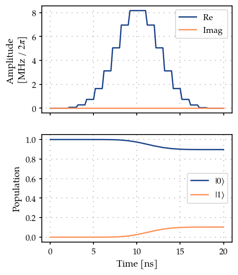
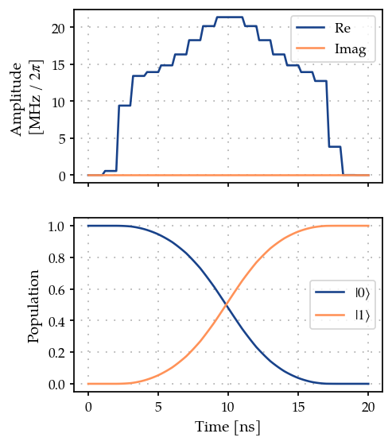
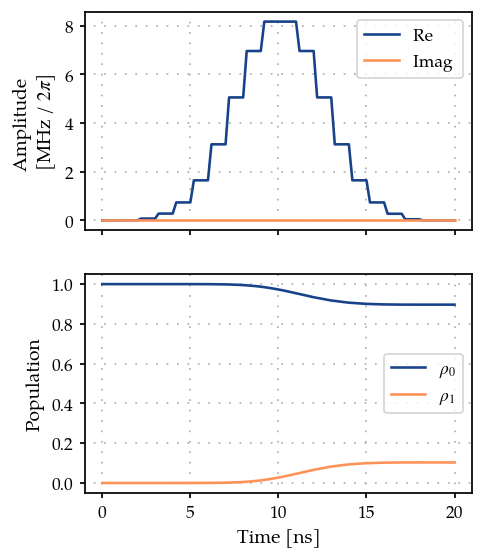

GRAPE on a single spin
======================

This in an introductory example to the
`GRAPE <10.1016/j.jmr.2004.11.004>`__ method and its implementation in
this software package.

1. Generate a PWC pulse shape
-----------------------------

.. code:: ipython3

    import matplotlib.pyplot as plt
    import numpy as np
    
    from paraqeet.quantity import Quantity
    from paraqeet.signal.envelopes import GaussEnvelope
    from paraqeet.signal.pwc_generator import PWCGenerator

First, let’s generate a piecewise constant (PWC) pulse envelope for the
Gaussian pulse. For GRAPE, we need to specify an anstanz for piecewise
constant controls at a given resolution. Here, we setup a Gaussian
initial guess, sampling at 21 points during a gate time of 20ns.

.. code:: ipython3

    t_final = 20e-9
    tlist = np.linspace(0, t_final, 21)
    tone = GaussEnvelope(amplitude=Quantity(np.pi / t_final / 3, -np.pi / t_final, np.pi / t_final))
    tone.t_final.set_value(t_final)
    
    gen = PWCGenerator(envelopes=[tone], tlist=tlist)
    gen.multiply_flat_top = True
    gen.max_amplitude = 2 * 1e8

We have added the option ``multiplyFlatTop``, to ensure the pulse to
start and end smoothly at 0 and ``t_final``. This acts like the
``FlatTopGaussianFilter``, but enforced directly by the
``PWCGenerator``.

.. code:: ipython3

    from plotting import plot_signal
    
    ts = np.linspace(0, t_final, 501)
    fig, ax = plt.subplots(1, figsize=(5, 3))
    plot_signal(tone, ts, ax, linestyle="-", label="Smooth")
    plot_signal(gen, ts, ax, linestyle="--", label="PWC")
    ax.legend(loc=1, frameon=True)
    plt.show()

.. image:: 04A_GRAPE_TLS_files/04A_GRAPE_TLS_7_0.png

2. Define Hamiltonian in the rotating frame of drive
----------------------------------------------------

As a simple toy model, we use a single spin.

.. code:: ipython3

    from paraqeet import Array
    from paraqeet.model.closed_system import ClosedSystem
    from paraqeet.model.differentiable_hamiltonian import DifferentiableHamiltonian
    from paraqeet.model.rotating_frame_drive import RotatingFrameDrive
    
    
    class SpinRWA(DifferentiableHamiltonian):
        """A Single Spin."""
    
        def __init__(self, drives=None):
            super().__init__(drives)
            self.sigma_p = np.array([[0j, 1], [0, 0]])
            self.dim = 2
    
        def get_value_at_timestep(self, timestep: float) -> Array:
            """Just sigma-X."""
            return self._drives[0].get_value_at_timestep(self.sigma_p, timestep)
    
        def get_value_and_gradient(self, times: Array) -> tuple[Array, Array] | tuple[float, Array]:
            """Gradient is just the drive matrix."""
            return self.get_value(times), self._drives[0].get_gradient(self.sigma_p, times)
    
        def get_gradient_at_timestep(self, time):
            """Computes the gradient"""
            return self._drives[0].get_gradient_at_timestep(self.sigma_p, time)
    
        def dimension(self) -> int:
            """Returns the dimension"""
            raise self.d
    
        def get_collapseops(self) -> list[tuple[Array, Array]]:
            """Returns an empyt list since we study closed system dynamics"""
            return []
    
        def get_parameters(self):
            """Returns the parameters, which in this case are only the drive parameters"""
            return self._get_drive_parameters()
    
    
    drive = RotatingFrameDrive(gen)
    spin = SpinRWA(drives=[drive])
    model = ClosedSystem(spin)

.. code:: ipython3

    from paraqeet.measurement.state_transfer_fidelity import StateTransferFidelityGRAPE
    from paraqeet.propagation.scipy_expm_grape import ScipyExpmGRAPE
    
    prop = ScipyExpmGRAPE(model, resolution=2e9)
    
    init = np.array([[1.0], [0.0]])  # |0>
    target = np.array([[0.0], [1.0]])  # |1>
    
    prop.set_initial_state(init)
    prop.set_target_state(target)
    times = np.array([0.0, t_final])
    
    zeroone = StateTransferFidelityGRAPE(
        propagation=prop,
        initial_state=init,
        target_state=target,
    )

.. code:: ipython3

    from plotting import plot_signal_and_dynamics
    
    ts = np.linspace(0.0, t_final, 101)
    plot_signal_and_dynamics(gen, prop, ts, state_labels=[r"$|0\rangle$", r"$|1\rangle$"]);

.. code:: ipython3

    zeroone.measure(times)

.. parsed-literal::

    0.7318323723330802

.. code:: ipython3

    from paraqeet.optimization_map import OptimizationMap
    from paraqeet.optimizers.scipy_optimizer_gradient import ScipyOptimizerGradient
    
    optmap = OptimizationMap()
    optmap.add(gen)
    optmap.register_params_with_optimizables()
    
    opt_grad = ScipyOptimizerGradient(zeroone, optimization_map=optmap)

Unlike the previous examples, for GRAPE based optimization, we need to
specify the exact time grid used to discretize the signal for
optimization. This is required to compute the correct gradients at the
exact time points. The time grid used for discretization can be found
from a ``PWCGenerator`` using ``gen.tlist``.

.. code:: ipython3

    opt_grad.optimize(gen.tlist)

.. parsed-literal::

    {'status': 1, 'value': 4.1100456371623295e-13, 'iterations': 7, 'message': 'CONVERGENCE: NORM OF PROJECTED GRADIENT <= PGTOL'}

For this simple example, we reach near perfect fidelity within a few
iterations.

.. code:: ipython3

    plot_signal_and_dynamics(gen, prop, ts, state_labels=[r"$|0\rangle$", r"$|1\rangle$"]);

With open system
----------------

Lets first reset the pulse and create a open-system model

.. code:: ipython3

    import numpy as np
    
    from paraqeet.quantity import Quantity
    from paraqeet.signal.envelopes import GaussEnvelope
    from paraqeet.signal.pwc_generator import PWCGenerator

.. code:: ipython3

    tone = GaussEnvelope(amplitude=Quantity(np.pi / t_final / 3, -np.pi / t_final, np.pi / t_final))
    tone.t_final.set_value(t_final)
    gen = PWCGenerator(envelopes=[tone], tlist=tlist)
    gen.multiply_flat_top = True
    gen.max_amplitude = 5 * 1e8

.. code:: ipython3

    import jax.numpy as jnp
    
    from paraqeet.model.open_system import OpenSystem
    from paraqeet.model.rotating_frame_drive import RotatingFrameDrive
    
    
    class SpinRWA(DifferentiableHamiltonian):
        """A Single Spin."""
    
        def __init__(self, drives=None):
            super().__init__(drives)
            self.sigma_p = np.array([[0j, 1], [0, 0]])
            self.sigma_m = np.array([[0j, 0], [1, 0]])
            self.sigma_z = np.array([[1, 0j], [0, -1]])
            self.dim = 2
            self.t1 = Quantity(10e-6, 1e-6, 100e-6)
            self.temp = Quantity(10e-3, 1e-3, 50e-3)
            self.t2star = Quantity(20e-6, 1e-6, 100e-6)
    
        def get_value_at_timestep(self, timestep: float) -> Array:
            """Just sigma-X."""
            return self._drives[0].get_value_at_timestep(self.sigma_p, timestep)
    
        def get_value_and_gradient(self, times: Array) -> tuple[Array, Array] | tuple[float, Array]:
            """Gradient is just the drive matrix."""
            return self.get_value(times), self._drives[0].get_gradient(self.sigma_p, times)
    
        def get_gradient_at_timestep(self, time):
            """Computes the gradient"""
            return self._drives[0].get_gradient_at_timestep(self.sigma_p, time)
    
        def dimension(self) -> int:
            """Returns the dimension"""
            raise self.d
    
        def get_parameters(self):
            """Returns the parameters, which in this case are only the drive parameters"""
            return self._get_drive_parameters()
    
        def get_decay_rates(self) -> list[float]:
            """Return decay rate for T1, T2star and Temp respectively."""
            if (self.t1 is None) or (self.t2star is None) or (self.temp is None):
                raise Exception("Specify values of T1, T2star and Temp for Open system simulations.")
    
            gamma = 1 / self.t1.get_value()
            gamma_t2star = 0.5 / self.t2star.get_value()
    
            hbar_over_kb = 7.638232582257738e-12
            beta = hbar_over_kb / (self.temp.get_value())
            # inserting typical qubit freq here. TODO - CHECK
            nbar = jnp.exp(-beta * 5e9)
            gamma_temp = gamma * nbar
            gamma_t1 = gamma * (nbar + 1)
            return [gamma_t1, gamma_temp, gamma_t2star]
    
        def get_collapseops(self) -> list[jnp.ndarray]:
            """Return a list tuples of decay rates and collapse operators for each subsystem."""
            gamma_t1, gamma_temp, gamma_t2star = self.get_decay_rates()
            col_t1 = self.sigma_p
            col_temp = self.sigma_m
            col_t2star = 2 * self.sigma_z
            return [(gamma_t1, col_t1), (gamma_temp, col_temp), (gamma_t2star, col_t2star)]
    
    
    drive = RotatingFrameDrive(gen)
    spin = SpinRWA(drives=[drive])
    model = OpenSystem(spin, ode_propagation=True)

Lets test GRAPE with ODE-propgation

.. code:: ipython3

    from paraqeet.measurement.state_transfer_fidelity import StateTransferFidelityGRAPE
    from paraqeet.propagation.vern7_grape import Vern7GRAPE
    
    prop = Vern7GRAPE(model, resolution=10e9)
    
    init = np.array([[1.0], [0.0j]])  # |0>
    target = np.array([[0.0j], [1.0]])  # |1>
    
    init = jnp.matmul(init, init.T.conj())
    target = jnp.matmul(target, target.T.conj())
    
    prop.set_initial_state(init)
    prop.set_target_state(target)
    
    zeroone = StateTransferFidelityGRAPE(
        propagation=prop,
        initial_state=init,
        target_state=target,
    )

.. code:: ipython3

    ts = np.linspace(0, t_final, 101)
    plot_signal_and_dynamics(gen, prop, times=ts, state_labels=[r"$\rho_0$", r"$\rho_1$"]);

.. code:: ipython3

    zeroone.measure(times)

.. parsed-literal::

    0.01065874418116775

.. code:: ipython3

    from paraqeet.optimization_map import OptimizationMap
    from paraqeet.optimizers.scipy_optimizer_gradient import ScipyOptimizerGradient
    
    optmap = OptimizationMap()
    optmap.add(gen)
    optmap.register_params_with_optimizables()

.. code:: ipython3

    opt_grad = ScipyOptimizerGradient(zeroone, optimization_map=optmap)
    opt_grad.set_options({"disp": True})

.. code:: ipython3

    opt_grad.optimize(tlist)

.. parsed-literal::

    {'status': 1, 'value': 0.003370122392267527, 'iterations': 38, 'message': 'CONVERGENCE: RELATIVE REDUCTION OF F <= FACTR*EPSMCH'}

.. code:: ipython3

    plot_signal_and_dynamics(gen, prop, times=ts, state_labels=[r"$\rho_0$", r"$\rho_1$"]);

.. code:: ipython3

    zeroone.measure(times)

.. parsed-literal::

    0.9966263172520764

