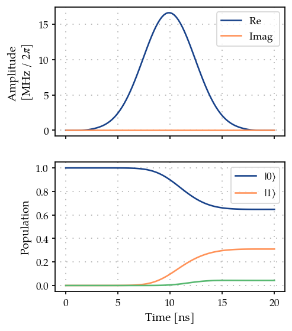
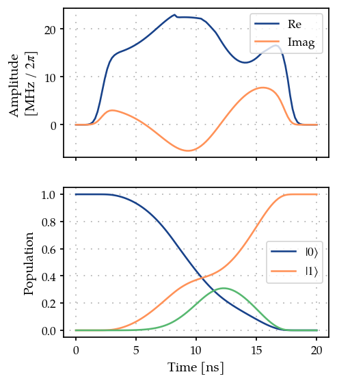

Single spin Part 3: Single qubit gate optimization using GRAPE
==============================================================

1. Generate a PWC pulse shape
-----------------------------

.. code:: ipython3

    import matplotlib.pyplot as plt
    import numpy as np
    
    from paraqeet.quantity import Quantity
    from paraqeet.signal.envelopes import GaussEnvelope
    from paraqeet.signal.pwc_generator import PWCGenerator

First, let’s generate a piecewise constant (PWC) pulse envelope for the
Gaussian pulse

.. code:: ipython3

    t_final = 20e-9
    tlist = np.linspace(0, t_final, 101)
    tone = GaussEnvelope(amplitude=Quantity(2 * np.pi / t_final / 3, -5 * np.pi / t_final, 5 * np.pi / t_final))
    tone.t_final.set_value(t_final)
    gen = PWCGenerator(envelopes=[tone], tlist=tlist)
    gen.multiply_flat_top = True

.. code:: ipython3

    params = gen.get_parameters()

.. code:: ipython3

    from plotting import plot_signal
    
    ts = np.linspace(0, t_final, 501)
    fig, ax = plt.subplots(1, figsize=(5, 3))
    plot_signal(tone, ts, ax, linestyle="-", label="Smooth")
    plot_signal(gen, ts, ax, linestyle="--", label="PWC")
    ax.legend(loc=1, frameon=True)
    plt.show()

.. image:: 04B_Single_qubit_gate_GRAPE_files/04B_Single_qubit_gate_GRAPE_6_0.png

2. Define Hamiltonian in the rotating frame of drive
----------------------------------------------------

Next, we setup the qubit system we want to control. We define the
Hamiltonian in the rotating frame of drive such that the pulse
oscillates slowly to apply GRAPE gradients.

The Hamiltonain in the rotating frame of the drive is given by -

.. math::  H(t) = \big(\omega_q - \omega_d\big) b^\dagger b -\frac{\alpha}{2} (b^\dagger)^2 b^2 + (\epsilon(t) b + \epsilon(t)^* b)

.. code:: ipython3

    from paraqeet.model.closed_system import ClosedSystem
    from paraqeet.model.rotating_frame_drive import RotatingFrameDrive
    from paraqeet.model.transmon import Transmon
    from paraqeet.quantity import Quantity
    
    freq = 7.86e9 * 2 * np.pi
    dims = 3
    anharm = -50e6 * 2 * np.pi
    offset = 5e6 * 2 * np.pi
    
    drive_freq = freq + offset
    qubit_freq = freq - drive_freq
    
    Drive = RotatingFrameDrive(gen)
    transmon = Transmon(
        frequency=Quantity(
            qubit_freq,
            1.2 * qubit_freq,
            0.8 * qubit_freq,
            unit="Hz",
            name="Frequency",
        ),
        anharmonicity=Quantity(anharm, 1.2 * anharm, 0.8 * anharm, unit="Hz", name="Anharmonicity"),
        drives=[Drive],
        dimension=dims,
    )
    
    model = ClosedSystem(transmon)

.. code:: ipython3

    from paraqeet.measurement.state_transfer_fidelity import StateTransferFidelityGRAPE
    from paraqeet.propagation.scipy_expm_grape import ScipyExpmGRAPE
    
    prop = ScipyExpmGRAPE(model, resolution=1e9)
    
    init = np.array([[1.0], [0.0], [0.0]])  # |0>
    target = np.array([[0.0], [1.0], [0.0]])  # |1>
    
    times = np.array([0.0, t_final])
    
    prop.set_initial_state(init)
    prop.set_target_state(target)
    
    prop.use_schirmer_derivative = True
    
    zeroone = StateTransferFidelityGRAPE(
        propagation=prop,
        initial_state=init,
        target_state=target,
    )

.. code:: ipython3

    from plotting import plot_signal_and_dynamics
    
    ts = np.linspace(0.0, t_final, 101)
    plot_signal_and_dynamics(gen, prop, ts, state_labels=[r"$|0\rangle$", r"$|1\rangle$"]);

As expected, we get a partial transfer and a low fidelity.

.. code:: ipython3

    zeroone.measure(times)

.. parsed-literal::

    0.7449176579124753

3. Optimization
---------------

We define an optimizer and link our fidelity measure as a goal function
and the parameters of the cosine tone and optimize just amplitude and
frequency, as in the state transfer example.

.. code:: ipython3

    from paraqeet.optimization_map import OptimizationMap
    from paraqeet.optimizers.scipy_optimizer_gradient import ScipyOptimizerGradient
    
    optmap = OptimizationMap()
    optmap.add(gen, params)
    opt = ScipyOptimizerGradient(zeroone, optimization_map=optmap)

.. code:: ipython3

    opt.optimize(gen.tlist)

.. parsed-literal::

    {'status': 1, 'value': 4.911978601640499e-09, 'iterations': 14, 'message': 'CONVERGENCE: NORM OF PROJECTED GRADIENT <= PGTOL'}

.. code:: ipython3

    plot_signal_and_dynamics(gen, prop, ts, state_labels=[r"$|0\rangle$", r"$|1\rangle$"]);

