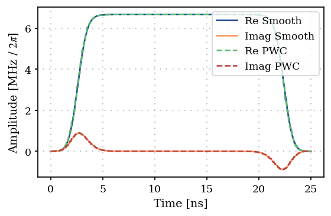
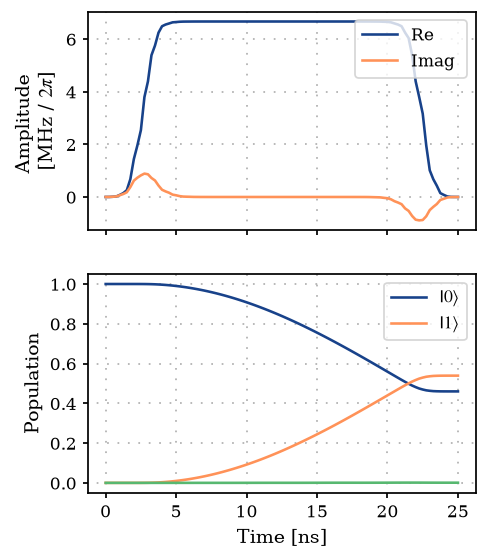
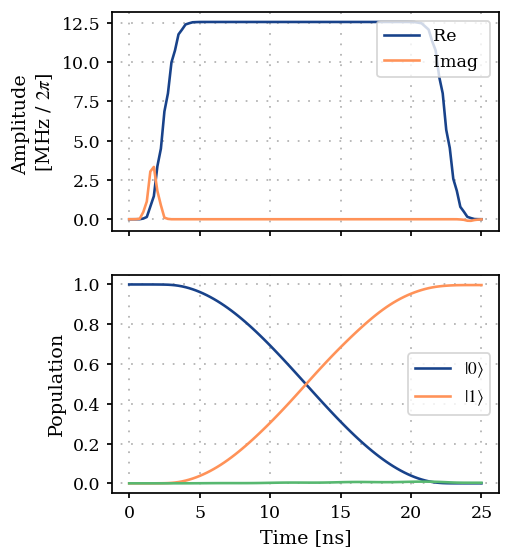

Single qubit gate optimization using GOAT over GRAPE
====================================================

This example optimizes a single-qubit gate with the GOAT-over-GRAPE
method, which combines GOAT (Machnes et al., 2018)
:cite:p:`machnes2018tunable` and GRAPE (Khaneja et al., 2005)
:cite:p:`khaneja2005optimal` as a gradient-based variant of the GROUP
method (Sørensen et al., 2018) :cite:p:`sorensen2018quantum`.

.. code:: ipython3

    import matplotlib.pyplot as plt
    import numpy as np
    
    from paraqeet.eom.schroedinger_equation import SchroedingerEquation
    from paraqeet.hamiltonian.drive import Drive
    from paraqeet.hamiltonian.transmon import TransmonHamiltonian
    from paraqeet.quantity import Quantity
    from paraqeet.signal.pwc_generator import PWCGenerator
    from paraqeet.signal.signal import DRAGMixer, FlatTopGaussianFilter

Setup
-----

Define Hamiltonian in the rotating frame of drive Next, we set up the
qubit system we want to control. We define the Hamiltonian in the
rotating frame of drive such that the pulse oscillates slowly to apply
GRAPE gradients.

The Hamiltonian in the rotating frame of the drive is given by -

.. math::  H(t) = \big(\omega_q - \omega_d\big) b^\dagger b -\frac{\alpha}{2} (b^\dagger)^2 b^2 + (\epsilon(t) b + \epsilon(t)^* b)

.. code:: ipython3

    freq = 4e9 * 2 * np.pi
    num_levels = 3
    anharm = -200e6 * 2 * np.pi
    offset = 2e6 * 2 * np.pi
    
    drive_freq = freq + offset
    qubit_freq = freq - drive_freq

.. code:: ipython3

    from paraqeet.signal.envelopes import FlatTopGaussianEnvelope
    
    t_final = 25e-9
    tlist = np.linspace(0, t_final, 151)
    
    tone = FlatTopGaussianEnvelope(
        amplitude=Quantity(np.pi / t_final / 3, -np.pi / t_final, np.pi / t_final, name="Amplitude"),
        t_up=Quantity(1e-9, 0.0, t_final, name="t_up"),
        t_down=Quantity(t_final - 1e-9, 0.0, t_final, name="t_down"),
        ramp_time=Quantity(2e-9, 0.5e-9, t_final, name="ramp_time"),
        t_final=Quantity(t_final, 0.9 * t_final, 1, 1 * t_final, name="t_final"),
    )
    
    drag_tone = DRAGMixer(
        tone,
        deltas=[Quantity(0.5 * anharm, min_value=3 * anharm, max_value=anharm / 3, unit="Hz", two_pi=True, name="Delta")],
    )
    
    filtered_tone = FlatTopGaussianFilter(drag_tone, t_final=Quantity(t_final, 0.0, 1.2 * t_final, name="t_final"))
    
    gen = PWCGenerator(envelopes=[filtered_tone], tlist=tlist)

.. code:: ipython3

    params = drag_tone.get_parameters()
    params

.. parsed-literal::

    [Amplitude: 4.19e+07,
     t_up: 1e-09,
     t_down: 2.4e-08,
     ramp_time: 2e-09,
     Delta: -100 MHz x 2pi]

.. code:: ipython3

    pwc_signal = gen.get_parameters()
    pwc_signal[0].set_limits(-4e9, 4e9)
    pwc_signal[1].set_limits(-4e9, 4e9)

.. code:: ipython3

    from plotting import plot_signal
    
    ts = np.linspace(0, t_final, 501)
    fig, ax = plt.subplots(1, figsize=(5, 3))
    plot_signal(filtered_tone, ts, ax, linestyle="-", label="Smooth")
    plot_signal(gen, ts, ax, linestyle="--", label="PWC")
    ax.legend(loc=1, frameon=True)
    plt.show()

.. code:: ipython3

    transmon_hamiltonian = TransmonHamiltonian(
        frequency=Quantity(
            qubit_freq,
            1.2 * qubit_freq,
            0.8 * qubit_freq,
            unit="Hz",
            name="Frequency",
        ),
        anharmonicity=Quantity(anharm, 1.2 * anharm, 0.8 * anharm, unit="Hz", name="Anharmonicity"),
        drives=[],
        num_levels=num_levels,
    )
    
    drive = Drive(transmon_hamiltonian.annihilation_op, gen, add_hermitian=True)
    transmon_hamiltonian.drives = [drive]
    
    model = SchroedingerEquation(
        hamiltonian_func=transmon_hamiltonian.get_value, hamiltonian_gradient_func=transmon_hamiltonian.get_gradient
    )

.. code:: ipython3

    from paraqeet.measurement.state_transfer_fidelity import StateTransferFidelityGRAPE
    from paraqeet.measurement.utils import overlap_state_vector
    from paraqeet.propagation import GRAPE, Expm
    from paraqeet.propagation.utils import grape_operator_sandwich_function_closed
    
    init = np.array([[1.0], [0.0], [0]])  # |0>
    target = np.array([[0.0], [1.0], [0]])  # |1>
    
    times = np.array([0.0, t_final])
    
    propagation = Expm(eom_func=model.get_value, resolution=1e9, initial_state=init)
    prop = GRAPE(
        propagation,
        eom_gradient_func=model.get_gradient,
        target_state=target,
        operator_sandwich_function=grape_operator_sandwich_function_closed,
    )
    
    zeroone = StateTransferFidelityGRAPE(
        propagation_func=prop.get_value,
        propagation_gradient_func=prop.get_gradient,
        target_state=target,
        overlap=overlap_state_vector,
    )

.. code:: ipython3

    from plotting import plot_signal_and_dynamics
    
    ts = np.linspace(0.0, t_final, 101)
    plot_signal_and_dynamics(gen, prop, ts, state_labels=[r"$|0\rangle$", r"$|1\rangle$"])

.. parsed-literal::

    array([<Axes: ylabel='Amplitude \n[MHz / $2\\pi$]'>,
           <Axes: xlabel='Time [ns]', ylabel='Population'>], dtype=object)

As expected, we get a partial transfer and a low fidelity.

.. code:: ipython3

    zeroone.get_value(times)

.. parsed-literal::

    Array(0.53928598, dtype=float64)

We define an optimizer and link our fidelity measure as a goal function
and the parameters of the cosine tone and optimize just amplitude and
frequency, as in the state transfer example.

.. code:: ipython3

    drag_tone.get_parameters()

.. parsed-literal::

    [Amplitude: 4.19e+07,
     t_up: 1e-09,
     t_down: 2.4e-08,
     ramp_time: 2e-09,
     Delta: -100 MHz x 2pi]

Optimization
------------

.. code:: ipython3

    from paraqeet.measurement.goat_over_grape import GOATOverGRAPE
    from paraqeet.optimization_map import OptimizationMap
    from paraqeet.optimizers.scipy_optimizer_gradient import ScipyOptimizerGradient
    
    optmap = OptimizationMap()
    optmap.add(filtered_tone)
    optmap.register_params_with_optimizables()
    
    goat = GOATOverGRAPE(zeroone, propagation_resolution=propagation.resolution, generators=[gen])
    
    optgrad = ScipyOptimizerGradient(measure_and_gradient_func=goat.get_value_and_gradient, optimization_map=optmap)

.. code:: ipython3

    optmap

.. parsed-literal::

    ==== <class 'paraqeet.signal.signal.FlatTopGaussianFilter'> ====
    [Amplitude: 4.19e+07, t_up: 1e-09, t_down: 2.4e-08, ramp_time: 2e-09, Delta: -100 MHz x 2pi]

.. code:: ipython3

    optgrad.optimize(np.array([0.0, t_final]))

.. parsed-literal::

    Iteration   10 | Infid = 2.656649e-03

.. parsed-literal::

    Iteration   20 | Infid = 2.636966e-03

.. parsed-literal::

    {'status': 1, 'value': 0.002594563362441238, 'iterations': 70, 'message': 'CONVERGENCE: RELATIVE REDUCTION OF F <= FACTR*EPSMCH'}

.. code:: ipython3

    plot_signal_and_dynamics(gen, prop, ts, state_labels=[r"$|0\rangle$", r"$|1\rangle$"])

.. parsed-literal::

    array([<Axes: ylabel='Amplitude \n[MHz / $2\\pi$]'>,
           <Axes: xlabel='Time [ns]', ylabel='Population'>], dtype=object)

References
----------

- **(Khaneja et al., 2005)** N. Khaneja et al., “Optimal control of
  coupled spin dynamics: design of NMR pulse sequences by gradient
  ascent algorithms,” *Journal of Magnetic Resonance* **172**, 296–305
  (2005).
- **(Machnes et al., 2018)** S. Machnes et al., “Tunable, flexible, and
  efficient optimization of control pulses for practical qubits,”
  *Physical Review Letters* **120**, 150401 (2018).
- **(Sørensen et al., 2018)** J. J. W. H. Sørensen et al., “Quantum
  optimal control in a chopped basis: Applications in control of
  Bose-Einstein condensates,” *Physical Review A* **98**, 022119 (2018).
