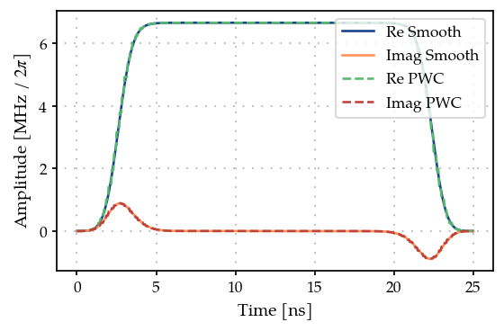
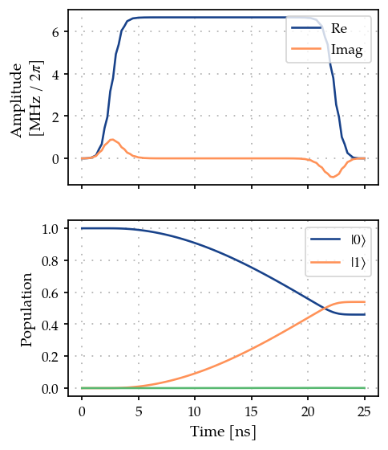
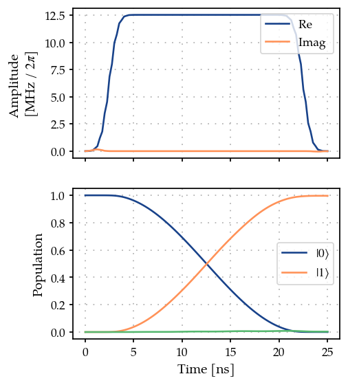

Single qubit gate optimization using GOAT over GRAPE
====================================================

.. code:: ipython3

    import matplotlib.pyplot as plt
    import numpy as np
    
    from paraqeet.signal.pwc_generator import PWCGenerator
    from paraqeet.signal.waveform import DRAGMixer

Setup
-----

Define Hamiltonian in the rotating frame of drive Next, we setup the
qubit system we want to control. We define the Hamiltonian in the
rotating frame of drive such that the pulse oscillates slowly to apply
GRAPE gradients.

The Hamiltonain in the rotating frame of the drive is given by -

.. math::  H(t) = \big(\omega_q - \omega_d\big) b^\dagger b -\frac{\alpha}{2} (b^\dagger)^2 b^2 + (\epsilon(t) b + \epsilon(t)^* b)

.. code:: ipython3

    from paraqeet.quantity import Quantity
    from paraqeet.model.closed_system import ClosedSystem
    from paraqeet.model.rotating_frame_drive import RotatingFrameDrive
    from paraqeet.model.transmon import Transmon
    
    
    freq = 4e9 * 2 * np.pi
    dims = 3
    anharm = -200e6 * 2 * np.pi
    offset = 2e6 * 2 * np.pi
    
    drive_freq = freq + offset
    qubit_freq = freq - drive_freq

First, let’s generate a piecewise constant (PWC) pulse envelope for a
Flattop Gaussian envelope (defined here with multiple parameters),

.. code:: ipython3

    from collections.abc import Callable
    from functools import partial
    
    from paraqeet.quantity import Array
    import jax.numpy as jnp
    
    from jax import jit
    from jax.scipy.special import erf
    from paraqeet.signal.envelopes import Envelope
    
    
    class FlatTopGaussianEnvelope(Envelope):
        """A flat-top Gaussian envelope."""
    
        def __init__(self, amplitude: Quantity, t_up: Quantity, t_down: Quantity, ramp_time: Quantity, t_final: Quantity):
            self._amplitude = amplitude
            self.__t_up = t_up
            self.__t_down = t_down
            self.__ramp_time = ramp_time
            self.t_final = t_final
    
            self._gradient_function: Callable | None = None
            self._grad_arg_nums: tuple[int, ...] = ()
    
        def get_parameters(self):
            """Get all parameters of the system."""
            return [self._amplitude, self.__t_up, self.__t_down, self.__ramp_time]
    
        @partial(jit, static_argnums=(0,))
        def _evaluate(self, amp: Array, t_up: Array, t_down: Array, ramp_time: Array, t: Array):
            rampUp = 1 + erf((t - t_up) / ramp_time)
            rampDown = 1 + erf((-t + t_down) / ramp_time)
            return jnp.squeeze(amp * rampUp * rampDown / 4)
    
        def compute_output(self, t: Array) -> Array:
            """Compute pulse shape."""
            amp = self._amplitude.get_value()
            t_up = self.__t_up.get_value()
            t_down = self.__t_down.get_value()
            ramp_time = self.__ramp_time.get_value()
            return self._evaluate(amp, t_up, t_down, ramp_time, t)

.. code:: ipython3

    t_final = 25e-9
    tlist = np.linspace(0, t_final, 151)
    
    tone = FlatTopGaussianEnvelope(
        amplitude=Quantity(np.pi / t_final / 3, -np.pi / t_final, np.pi / t_final, name="Amplitude"),
        t_up=Quantity(1e-9, 0.0, t_final, name="t_up"),
        t_down=Quantity(t_final - 1e-9, 0.0, t_final, name="t_down"),
        ramp_time=Quantity(2e-9, 0.5e-9, t_final, name="ramp_time"),
        t_final=Quantity(t_final, 0.9 * t_final, 1, 1 * t_final, name="t_final"),
    )
    
    drag_tone = DRAGMixer(
        tone,
        deltas=[Quantity(0.5 * anharm, min_value=3 * anharm, max_value=anharm / 3, unit="Hz", two_pi=True, name="Delta")],
        t_final=Quantity(t_final, 0.9 * t_final, 1, 1 * t_final, name="t_final"),
    )
    drag_tone.multiply_flat_top = True
    
    gen = PWCGenerator(envelopes=[drag_tone], tlist=tlist)

.. code:: ipython3

    params = drag_tone.get_parameters()
    params

.. parsed-literal::

    [Amplitude: 4.19e+07,
     t_up: 1e-09,
     t_down: 2.4e-08,
     ramp_time: 2e-09,
     Delta: -100 MHz x 2pi]

.. code:: ipython3

    pwc_signal = gen.get_parameters()
    pwc_signal[0].set_limits(-4e9, 4e9)
    pwc_signal[1].set_limits(-4e9, 4e9)

.. code:: ipython3

    from plotting import plot_signal
    
    ts = np.linspace(0, t_final, 501)
    fig, ax = plt.subplots(1, figsize=(5, 3))
    plot_signal(drag_tone, ts, ax, linestyle="-", label="Smooth")
    plot_signal(gen, ts, ax, linestyle="--", label="PWC")
    ax.legend(loc=1, frameon=True)
    plt.show()

.. code:: ipython3

    Drive = RotatingFrameDrive(gen)
    transmon = Transmon(
        frequency=Quantity(
            qubit_freq,
            1.2 * qubit_freq,
            0.8 * qubit_freq,
            unit="Hz",
            name="Frequency",
        ),
        anharmonicity=Quantity(anharm, 1.2 * anharm, 0.8 * anharm, unit="Hz", name="Anharmonicity"),
        drives=[Drive],
        dimension=dims,
    )
    
    model = ClosedSystem(transmon)

.. code:: ipython3

    from paraqeet.measurement.state_transfer_fidelity import StateTransferFidelityGRAPE
    from paraqeet.propagation.scipy_expm_grape import ScipyExpmGRAPE
    
    
    prop = ScipyExpmGRAPE(model, res=1e9)
    
    init = np.array([[1.0], [0.0], [0]])  # |0>
    target = np.array([[0.0], [1.0], [0]])  # |1>
    
    prop.set_initial_state(init)
    prop.target_state = target
    
    prop.use_schirmer_derivative = True
    
    zeroone = StateTransferFidelityGRAPE(
        propagation=prop,
        initial_state=init,
        target_state=target,
        times=tlist,
    )

.. code:: ipython3

    from plotting import plot_signal_and_dynamics
    
    ts = np.linspace(0.0, t_final, 101)
    plot_signal_and_dynamics(gen, prop, ts, state_labels=[r"$|0\rangle$", r"$|1\rangle$"]);

As expected, we get a partial transfer and a low fidelity.

.. code:: ipython3

    zeroone.measure()

.. parsed-literal::

    0.539179852263802

We define an optimizer and link our fidelity measure as a goal function
and the parameters of the cosine tone and optimize just amplitude and
frequency, as in the state transfer example.

.. code:: ipython3

    drag_tone.get_parameters()

.. parsed-literal::

    [Amplitude: 4.19e+07,
     t_up: 1e-09,
     t_down: 2.4e-08,
     ramp_time: 2e-09,
     Delta: -100 MHz x 2pi]

Optimization
------------

.. code:: ipython3

    from paraqeet.optimization_map import OptimizationMap
    from paraqeet.optimizers.scipy_optimizer_gradient import ScipyOptimizerGradient
    from paraqeet.optimizers.scipy_optimizer import ScipyOptimizer
    from paraqeet.measurement.goat_over_grape import GOATOverGRAPE
    
    
    optmap = OptimizationMap()
    optmap.add(drag_tone)
    optmap.register_params_with_optimizables()
    
    goat = GOATOverGRAPE(zeroone, generators=[gen], generators_order=[0])
    
    opt = ScipyOptimizer(goat, optimization_map=optmap)
    optgrad = ScipyOptimizerGradient(goat, optimization_map=optmap)

.. code:: ipython3

    optmap

.. parsed-literal::

    ==== <class 'paraqeet.signal.waveform.DRAGMixer'> ====
    [Amplitude: 4.19e+07, t_up: 1e-09, t_down: 2.4e-08, ramp_time: 2e-09, Delta: -100 MHz x 2pi]

.. code:: ipython3

    optgrad.optimize()

.. parsed-literal::

    {'status': 1, 'value': 0.0033746943604152646, 'iterations': 26, 'message': 'CONVERGENCE: RELATIVE REDUCTION OF F <= FACTR*EPSMCH'}

.. code:: ipython3

    plot_signal_and_dynamics(gen, prop, ts, state_labels=[r"$|0\rangle$", r"$|1\rangle$"]);

