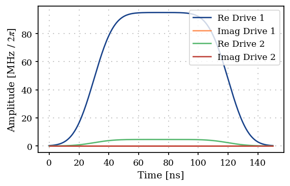
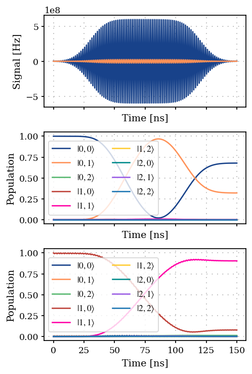
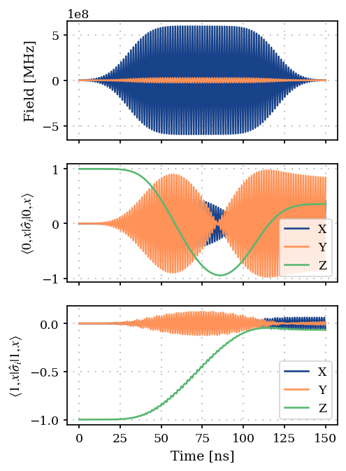
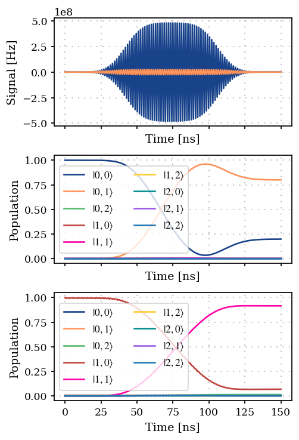
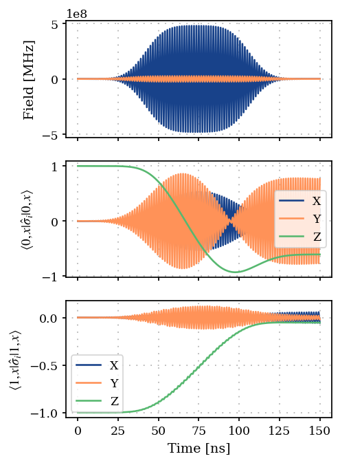

Gradient-based optimization of a cross-resonance gate between two transmons
===========================================================================

.. code:: ipython3

    import itertools
    
    import matplotlib.pyplot as plt
    import numpy as np
    
    from paraqeet.measurement.unitary_fidelity import UnitaryFidelity
    from paraqeet.model.composite_system import CompositeSystem
    from paraqeet.model.coupling import Coupling
    from paraqeet.model.drive import Drive
    from paraqeet.model.schroedinger_equation import SchroedingerEquation
    from paraqeet.model.transmon import Transmon
    from paraqeet.optimization_map import OptimizationMap
    from paraqeet.optimizers.scipy_optimizer_gradient import ScipyOptimizerGradient
    from paraqeet.propagation.propagation import Propagation
    from paraqeet.propagation.scipy_expm_goat import ScipyExpmGOAT
    from paraqeet.quantity import Quantity
    from paraqeet.signal.envelopes import FlatTopGaussianEnvelope
    from paraqeet.signal.iq_mixer import IQMixer
    
    np.set_printoptions(linewidth=400)

System Setup
------------

The system consists of two coupled transmons with three levels each. We
fix the transmon frequency and anharmonicity to values that don’t have
any unwanted frequency collisions. The coupling strength is fixed as
well. These parameters have to be specified as Quantities with a range,
but we will not pass them to the optimized in order to keep them fixed.
Additionally, the first transmon is driven at the frequency of the
second one to apply a cross-resonance (CR) gate. The second transmon is
driven to fix the phases of the gate.

Here the tone values are set such that the optimization process is fast.
Generally with a lot of parameters ``ScipyExpmGOAT`` (in its current
form), can take considerably long time.

.. code:: ipython3

    t_final = 150e-9
    tone1 = FlatTopGaussianEnvelope(
        amplitude=Quantity(
            190e6 * 2 * np.pi / 2,
            min_value=1e5 * 2 * np.pi,
            max_value=250e6 * 2 * np.pi,
            name="Amp",
            unit="Hz",
            two_pi=True,
        ),
        t_final=Quantity(
            t_final,
            min_value=10e-9,
            max_value=200e-9,
            unit="s",
            name="Gate time",
        ),
    )
    
    tone2 = FlatTopGaussianEnvelope(
        amplitude=Quantity(
            9.18e6 * 2 * np.pi / 2,
            min_value=1e5 * 2 * np.pi,
            max_value=250e6 * 2 * np.pi,
            name="Amp",
            unit="Hz",
            two_pi=True,
        ),
        t_final=Quantity(
            t_final,
            min_value=10e-9,
            max_value=200e-9,
            unit="s",
            name="Gate time",
        ),
    )
    
    
    tone2.t_final = Quantity(
        t_final,
        min_value=10e-9,
        max_value=200e-9,
        unit="s",
        name="Gate time",
    )
    
    print(tone1.get_parameters(), tone2.get_parameters())
    generator1 = IQMixer(
        envelopes=[tone1],
        frequency=Quantity(
            6.0002e9 * 2 * np.pi,
            min_value=5.5e9 * 2 * np.pi,
            max_value=6.20e9 * 2 * np.pi,
            name="Freq",
            unit="Hz",
            two_pi=True,
        ),
    )
    
    generator2 = IQMixer(
        envelopes=[tone2],
        frequency=Quantity(
            6.0002e9 * 2 * np.pi,
            min_value=5.5e9 * 2 * np.pi,
            max_value=6.20e9 * 2 * np.pi,
            name="Freq",
            unit="Hz",
            two_pi=True,
        ),
        phase=Quantity(
            value=-0.39720756,
            min_value=-np.pi,
            max_value=np.pi,
            unit="rad",
            name="Phase",
        ),
    )
    
    
    num_levels = 3
    transmon1 = Transmon(
        num_levels=num_levels,
        frequency=Quantity(
            5.5e9 * 2 * np.pi,
            5.2e9 * 2 * np.pi,
            5.9e9 * 2 * np.pi,
            "Hz",
            "Transmon 1 frequency",
            two_pi=True,
        ),
        anharmonicity=Quantity(
            -240e6 * 2 * np.pi,
            -250e6 * 2 * np.pi,
            -190e6 * 2 * np.pi,
            "Hz",
            "Transmon 1 anharmonicity",
            two_pi=True,
        ),
        drives=[],
    )
    
    drive_op1 = transmon1.annihilation_op + (transmon1.annihilation_op).conj().T
    drive1 = Drive(drive_op1, generator1)
    transmon1.drives = [drive1]
    
    transmon2 = Transmon(
        num_levels=num_levels,
        frequency=Quantity(
            6.0e9 * 2 * np.pi,
            5.9e9 * 2 * np.pi,
            6.1e9 * 2 * np.pi,
            "Hz",
            "Transmon 2 frequency",
            two_pi=True,
        ),
        anharmonicity=Quantity(
            -200e6 * 2 * np.pi,
            -210e6 * 2 * np.pi,
            -190e6 * 2 * np.pi,
            "Hz",
            "Transmon 2 anharmonicity",
            two_pi=True,
        ),
        drives=[],
    )
    
    drive_op2 = transmon2.annihilation_op + (transmon2.annihilation_op).conj().T
    drive2 = Drive(drive_op2, generator2)
    transmon2.drives = [drive2]
    
    coupling_op = np.kron(
        transmon1.annihilation_op + transmon1.annihilation_op.conj().T,
        transmon2.annihilation_op + transmon2.annihilation_op.conj().T,
    )
    coupling = Coupling(
        coupling_op,
        g_abs=Quantity(
            25e6 * 2 * np.pi,
            10e6 * 2 * np.pi,
            60e6 * 2 * np.pi,
            "Hz",
            "Coupling strength",
            two_pi=True,
        ),
    )
    hamiltonian = CompositeSystem([transmon1, transmon2], [coupling])

.. parsed-literal::

    [Amp: 95 MHz x 2pi, t_up: 30 ns, t_down: 120 ns, ramp_time: 15 ns] [Amp: 4.59 MHz x 2pi, t_up: 30 ns, t_down: 120 ns, ramp_time: 15 ns]

.. code:: ipython3

    (transmon2.frequency.get_value() - transmon1.frequency.get_value()) / (2 * np.pi)

.. parsed-literal::

    Array([5.e+08], dtype=float64)

.. code:: ipython3

    from plotting import plot_signal
    
    tlist = np.linspace(0, t_final, 201)
    fig, ax = plt.subplots(1, figsize=(5, 3))
    plot_signal(tone1, tlist, ax, linestyle="-", label="Drive 1")
    plot_signal(tone2, tlist, ax, linestyle="-", label="Drive 2")
    ax.legend(loc=1, frameon=True)
    plt.show()

We check the eigenvalues to make sure that there is no resonance while
idling.

.. code:: ipython3

    matrix = hamiltonian.get_value(np.array([0.0]))
    evals = np.linalg.eigvalsh(matrix)
    print("Energies in GHz: ", np.round(evals / 1e6) / 1e3 / (2 * np.pi))
    transitions = evals[1:] - evals[:-1]
    print(
        "Transition energies in GHz: ",
        np.round(transitions / 1e3) / 1e6 / (2 * np.pi),
    )
    matrix

.. parsed-literal::

    Energies in GHz:  [[-0.          5.49864413  6.00109628 10.75823753 11.49735309 11.80404466 16.7555141  17.30475781 22.56021318]]
    Transition energies in GHz:  []

.. parsed-literal::

    Array([[[0.00000000e+00+0.j, 6.22009913e+04+0.j, 0.00000000e+00+0.j, 1.39607610e+06+0.j, 1.57079633e+08+0.j, 0.00000000e+00+0.j, 0.00000000e+00+0.j, 0.00000000e+00+0.j, 0.00000000e+00+0.j],
            [6.22009913e+04+0.j, 3.76991118e+10+0.j, 8.79654856e+04+0.j, 1.57079633e+08+0.j, 1.39607610e+06+0.j, 2.22144147e+08+0.j, 0.00000000e+00+0.j, 0.00000000e+00+0.j, 0.00000000e+00+0.j],
            [0.00000000e+00+0.j, 8.79654856e+04+0.j, 7.41415866e+10+0.j, 0.00000000e+00+0.j, 2.22144147e+08+0.j, 1.39607610e+06+0.j, 0.00000000e+00+0.j, 0.00000000e+00+0.j, 0.00000000e+00+0.j],
            [1.39607610e+06+0.j, 1.57079633e+08+0.j, 0.00000000e+00+0.j, 3.45575192e+10+0.j, 6.22009913e+04+0.j, 0.00000000e+00+0.j, 1.97434975e+06+0.j, 2.22144147e+08+0.j, 0.00000000e+00+0.j],
            [1.57079633e+08+0.j, 1.39607610e+06+0.j, 2.22144147e+08+0.j, 6.22009913e+04+0.j, 7.22566310e+10+0.j, 8.79654856e+04+0.j, 2.22144147e+08+0.j, 1.97434975e+06+0.j, 3.14159265e+08+0.j],
            [0.00000000e+00+0.j, 2.22144147e+08+0.j, 1.39607610e+06+0.j, 0.00000000e+00+0.j, 8.79654856e+04+0.j, 1.08699106e+11+0.j, 0.00000000e+00+0.j, 3.14159265e+08+0.j, 1.97434975e+06+0.j],
            [0.00000000e+00+0.j, 0.00000000e+00+0.j, 0.00000000e+00+0.j, 1.97434975e+06+0.j, 2.22144147e+08+0.j, 0.00000000e+00+0.j, 6.76070739e+10+0.j, 6.22009913e+04+0.j, 0.00000000e+00+0.j],
            [0.00000000e+00+0.j, 0.00000000e+00+0.j, 0.00000000e+00+0.j, 2.22144147e+08+0.j, 1.97434975e+06+0.j, 3.14159265e+08+0.j, 6.22009913e+04+0.j, 1.05306186e+11+0.j, 8.79654856e+04+0.j],
            [0.00000000e+00+0.j, 0.00000000e+00+0.j, 0.00000000e+00+0.j, 0.00000000e+00+0.j, 3.14159265e+08+0.j, 1.97434975e+06+0.j, 0.00000000e+00+0.j, 8.79654856e+04+0.j, 1.41748661e+11+0.j]]], dtype=complex128)

Computing the gate fidelity
---------------------------

We select a propagation method, piecewise constant exponentiation, and
configure CR as a target gate.

.. code:: ipython3

    model = SchroedingerEquation(
        hamiltonian_func=hamiltonian.get_value,
        hamiltonian_and_gradient_func=hamiltonian.get_value_and_gradient,
    )
    
    # We need to pad the operators with zeros so we introduce a helper zero matrix
    dim = transmon1.dimension() * transmon2.dimension()
    padding = ((0, dim - 4), (0, dim - 4))
    
    pauli_x = np.array([[0.0, 1.0], [1.0, 0.0]])
    pauli_y = np.array([[0.0, -1.0j], [1.0j, 0.0]])
    pauli_z = np.array([[1.0, 0.0], [0.0, -1.0]])
    
    pauli_ix = np.pad(np.kron(np.identity(2), pauli_x), pad_width=padding, mode="constant", constant_values=0.0)
    pauli_iy = np.pad(np.kron(np.identity(2), pauli_y), pad_width=padding, mode="constant", constant_values=0.0)
    pauli_iz = np.pad(np.kron(np.identity(2), pauli_z), pad_width=padding, mode="constant", constant_values=0.0)
    
    pauli_zx = np.pad(
        np.exp(1j * np.pi / 4) * np.kron(pauli_z, pauli_x), pad_width=padding, mode="constant", constant_values=0.0
    )
    
    cr_gate = np.pad(
        np.array([[1.0, 0, 0, 0], [0, 1.0, 0, 0], [0, 0, 0, 1.0], [0, 0, 1.0, 0]]),
        pad_width=padding,
        mode="constant",
        constant_values=0.0,
    )
    
    cr_gate = pauli_zx @ cr_gate
    
    times = np.array([0.0, t_final])
    
    prop = ScipyExpmGOAT(
        eom_func=model.get_value,
        eom_and_grad_func=model.get_value_and_gradient,
        resolution=100e9,
        initial_state=np.identity(transmon1.dimension() * transmon2.dimension()),
    )
    
    gate_fid = UnitaryFidelity(
        propagation_func=prop.propagate,
        propagation_and_gradient_func=prop.get_value_and_gradient,
        gate=cr_gate,
    )
    gate_fid.measure(times)

.. parsed-literal::

    Array(0.03713341, dtype=float64)

.. code:: ipython3

    def plot_population(propagation: Propagation):
        """Plot the population from the Propagation object."""
        basis1 = [i for i in range(transmon1.dimension())]
        basis2 = [i for i in range(transmon2.dimension())]
        labels = [rf"$|{i},{j}\rangle$" for (i, j) in itertools.product(basis1, basis2)]
    
        signal1 = generator1.get_value(tlist)
        signal2 = generator2.get_value(tlist)
        states = propagation.propagate(tlist)
    
        _, ax = plt.subplots(3, figsize=(4, 6), sharex=True)
        ax[0].plot(tlist / 1e-9, signal1)
        ax[0].plot(tlist / 1e-9, signal2)
        ax[0].set_xlabel("Time [ns]")
        ax[0].set_ylabel("Signal [Hz]")
        ax[0].grid(True, linestyle=(1, (1, 5)), linewidth=1)
    
        ax[1].plot(tlist / 1e-9, np.abs(states)[:, :, 0] ** 2, label=labels)
        ax[1].set_xlabel("Time [ns]")
        ax[1].set_ylabel("Population")
        ax[1].legend(ncols=2)
        ax[1].grid(True, linestyle=(1, (1, 5)), linewidth=1)
    
        ax[2].plot(
            tlist / 1e-9,
            np.abs(states)[:, :, transmon2.dimension()] ** 2,
            label=labels,
        )
        ax[2].set_xlabel("Time [ns]")
        ax[2].set_ylabel("Population")
        ax[2].legend(ncols=2)
        ax[2].grid(True, linestyle=(1, (1, 5)), linewidth=1)
    
        plt.tight_layout()
        plt.show()
    
    
    plot_population(prop)

.. code:: ipython3

    def expecation_value(Op, states):
        """Get the expected value."""
        ex = []
        for state in states:
            ex.append(np.real(state.conj() @ Op @ state.T))
        return ex
    
    
    def plot_pauli():
        """Plot the Pauli operators."""
        states = prop.propagate(tlist)
        sig1 = generator1.get_value(tlist)
        sig2 = generator2.get_value(tlist)
    
        fig, ax = plt.subplots(3, figsize=(4, 6), sharex=True)
        ax[0].plot(tlist / 1e-9, sig1)
        ax[0].plot(tlist / 1e-9, sig2)
        ax[0].set_ylabel("Field [MHz]")
        ax[0].grid(True, linestyle=(1, (1, 5)), linewidth=1)
    
        ax[1].plot(tlist / 1e-9, expecation_value(pauli_ix, states[:, :, 0]))
        ax[1].plot(tlist / 1e-9, expecation_value(pauli_iy, states[:, :, 0]))
        ax[1].plot(tlist / 1e-9, expecation_value(pauli_iz, states[:, :, 0]))
        ax[1].set_ylabel(r"$\langle 0, x|\hat\sigma_i|0, x\rangle$")
        ax[1].legend(["X", "Y", "Z"])
        ax[1].grid(True, linestyle=(1, (1, 5)), linewidth=1)
    
        ax[2].plot(tlist / 1e-9, expecation_value(pauli_ix, states[:, :, transmon2.dimension()]))
        ax[2].plot(tlist / 1e-9, expecation_value(pauli_iy, states[:, :, transmon2.dimension()]))
        ax[2].plot(tlist / 1e-9, expecation_value(pauli_iz, states[:, :, transmon2.dimension()]))
        ax[2].set_ylabel(r"$\langle 1, x|\hat\sigma_i|1, x\rangle$")
        ax[-1].set_xlabel("Time [ns]")
        ax[2].legend(["X", "Y", "Z"])
        ax[2].grid(True, linestyle=(1, (1, 5)), linewidth=1)
    
        return fig, ax
    
    
    plot_pauli()

.. parsed-literal::

    (<Figure size 500x750 with 3 Axes>,
     array([<Axes: ylabel='Field [MHz]'>, <Axes: ylabel='$\\langle 0, x|\\hat\\sigma_i|0, x\\rangle$'>, <Axes: xlabel='Time [ns]', ylabel='$\\langle 1, x|\\hat\\sigma_i|1, x\\rangle$'>], dtype=object))

Optimization
------------

We define an optimizer and link our fidelity measure as a goal function.
The only optimizable parameter is the frequency of transmon 1.

.. code:: ipython3

    tone1.get_parameters()

.. parsed-literal::

    [Amp: 95 MHz x 2pi, t_up: 30 ns, t_down: 120 ns, ramp_time: 15 ns]

.. code:: ipython3

    optmap = OptimizationMap()
    optmap.add(tone1)
    print(optmap)
    
    opt = ScipyOptimizerGradient(measure_and_gradient_func=gate_fid.get_value_and_gradient, optimization_map=optmap)
    opt.set_options({"ftol": 0.1, "maxls": 50, "gtol": 1e-8})

.. parsed-literal::

    ==== <class 'paraqeet.signal.envelopes.FlatTopGaussianEnvelope'> ====
    [Amp: 95 MHz x 2pi, t_up: 30 ns, t_down: 120 ns, ramp_time: 15 ns]
    
    

.. code:: ipython3

    optmap

.. parsed-literal::

    ==== <class 'paraqeet.signal.envelopes.FlatTopGaussianEnvelope'> ====
    [Amp: 95 MHz x 2pi, t_up: 30 ns, t_down: 120 ns, ramp_time: 15 ns]

.. code:: ipython3

    opt.optimize(times)

.. parsed-literal::

    Iteration    1 | Infid = 9.362616e-01

.. parsed-literal::

    {'status': 1, 'value': 0.9362615819622282, 'iterations': 2, 'message': 'CONVERGENCE: RELATIVE REDUCTION OF F <= FACTR*EPSMCH'}

.. code:: ipython3

    plot_population(prop)

.. code:: ipython3

    plot_pauli()

.. parsed-literal::

    (<Figure size 500x750 with 3 Axes>,
     array([<Axes: ylabel='Field [MHz]'>, <Axes: ylabel='$\\langle 0, x|\\hat\\sigma_i|0, x\\rangle$'>, <Axes: xlabel='Time [ns]', ylabel='$\\langle 1, x|\\hat\\sigma_i|1, x\\rangle$'>], dtype=object))

