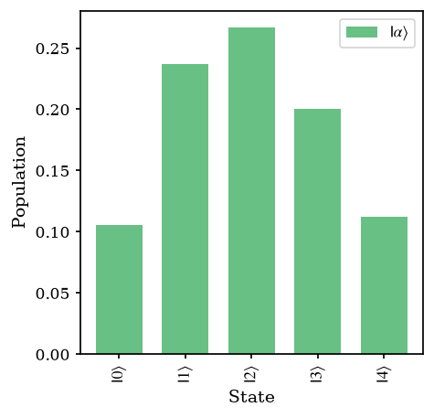
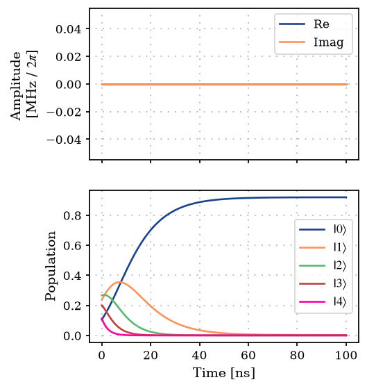
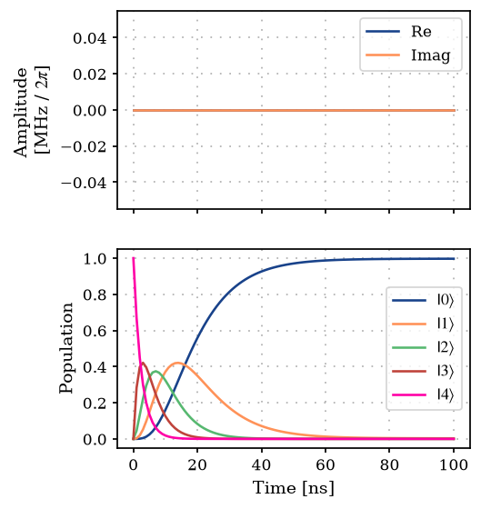
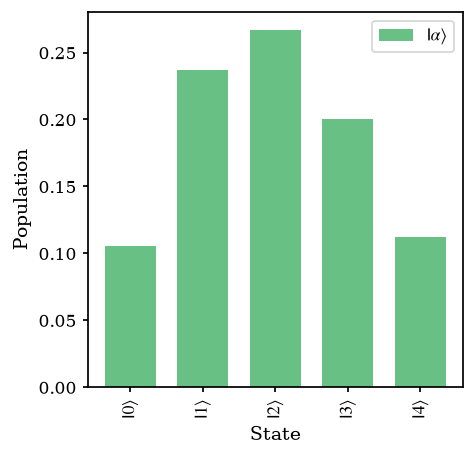

Decay of coherent state of a resonator
======================================

This is an example demonstrating open system simulation methods -
exponentiation of the Lindblad (Lindblad, 1976) (Manzano, 2020)
superoperator and ODE solver. We consider a simple model of decay of a
coherent state in a resonator for this example.

.. code:: ipython3

    import jax.numpy as jnp
    import matplotlib.pyplot as plt
    import numpy as np
    
    from paraqeet.eom.master_equation import MasterEquation
    from paraqeet.hamiltonian.drive import Drive
    from paraqeet.hamiltonian.resonator import Resonator, ResonatorHamiltonian
    from paraqeet.quantity import Quantity
    from paraqeet.signal.envelopes import ZeroEnvelope
    from paraqeet.signal.iq_mixer import IQMixer

1. Using ``Expm``
-----------------

Exponentiating the full Lindbladian super-operator

.. code:: ipython3

    tone = ZeroEnvelope()
    gen = IQMixer(envelopes=[tone])

.. code:: ipython3

    freq = 6.02e9 * 2 * np.pi
    num_fock = 5
    
    resonator_hamiltonian = ResonatorHamiltonian(
        frequency=Quantity(freq, 0.8 * freq, 1.2 * freq),
        drives=[],
        num_fock=num_fock,
    )
    
    drive_op = resonator_hamiltonian.annihilation_op + (resonator_hamiltonian.annihilation_op).conj().T
    drive = Drive(drive_op, gen)
    resonator_hamiltonian.drives = [drive]
    
    open_resonator = Resonator(
        hamiltonian=resonator_hamiltonian,
        t1=Quantity(value=10e-9, min_value=10e-9, max_value=1000e-9, unit="s"),
        t2star=Quantity(value=50e-7, min_value=10e-9, max_value=100e-6, unit="s"),
        temp=Quantity(value=50e-3, min_value=10e-3, max_value=10e-2, unit="K"),
    )
    
    model = MasterEquation(
        hamiltonian_func=resonator_hamiltonian.get_value,
        hamiltonian_gradient_func=resonator_hamiltonian.get_gradient,
        jump_operators=open_resonator.get_jump_operators(),
    )

1. Fock state decay -
~~~~~~~~~~~~~~~~~~~~~

.. code:: ipython3

    def generate_basis_state(dim: int, index, dm=False):
        """Generate a basis state for one subsystem."""
        if index >= dim:
            raise Exception("Index has to be less than dimension")
    
        state = np.zeros(dim)
        state[index] = 1
    
        state = jnp.reshape(state, (-1, 1))
    
        if dm:
            state = state @ state.conj().T
        return state
    
    
    init_dm = generate_basis_state(num_fock, 4, dm=True)
    init_dm

.. parsed-literal::

    array([[0., 0., 0., 0., 0.],
           [0., 0., 0., 0., 0.],
           [0., 0., 0., 0., 0.],
           [0., 0., 0., 0., 0.],
           [0., 0., 0., 0., 1.]])

.. code:: ipython3

    from paraqeet.propagation.expm import Expm
    from paraqeet.propagation.utils import convert_dm_to_vec
    
    t_final = 100e-9
    ts = np.linspace(0, t_final, 101)
    
    prop = Expm(eom_func=model.get_value, resolution=100e9, initial_state=convert_dm_to_vec(init_dm))

.. code:: ipython3

    from plotting import plot_signal_and_dynamics
    
    ts = np.linspace(0.0, t_final, 101)
    plot_signal_and_dynamics(
        gen, prop, ts, state_labels=[rf"$|{i}\rangle$" for i in range(num_fock)], open_system=True, vectorized_dm=True
    )

.. parsed-literal::

    array([<Axes: ylabel='Amplitude \n[MHz / $2\\pi$]'>, <Axes: xlabel='Time [ns]', ylabel='Population'>], dtype=object)

.. image:: 06_Resonator_decay_files/06_Resonator_decay_9_1.png

2. Coherent state decay -
~~~~~~~~~~~~~~~~~~~~~~~~~

.. code:: ipython3

    from jax import vmap
    from jax.scipy.special import factorial
    
    
    def calculate_populations(states, dm=False):
        """Calculate state populations from density matrices and vectorized dm."""
        if len(states.shape) > 2:
            if dm:
                pops = jnp.abs(vmap(jnp.diag, in_axes=0)(states))
            else:
                pops = jnp.abs(states[:, :, 0]) ** 2
                pops = jnp.reshape(pops, [pops.shape[0], pops.shape[1]])
        else:
            if dm:
                pops = jnp.diag(states)
            else:
                pops = jnp.abs(states) ** 2
        return pops
    
    
    def generate_coherent_state(dim, alpha, dm=False):
        """Generate a coherent state for a given alpha."""
        state = generate_basis_state(dim, 0, dm=False)
        for n in range(1, dim):
            state += ((alpha**n) / jnp.sqrt(factorial(n))) * generate_basis_state(dim, n, dm=False)
    
        state = jnp.exp(-0.5 * jnp.abs(alpha) ** 2) * state
    
        if dm:
            state = state @ state.conj().T
        return state
    
    
    coherent_state = generate_coherent_state(num_fock, 1.5, dm=True)

Plot coherent state populations

.. code:: ipython3

    def plot_population_distribution(
        states,
        dims,
        state_labels,
        dm=False,
        labels=None,
        xticks_spacing=3,
        grid=True,
        title="",
        colors=None,
        alpha=1.0,
        grid_alpha=0.7,
        figsize=(3, 3),
        show_legend=True,
        barwidth=None,
    ):
        """Plot state occupation as a bar plot."""
        pops = []
        for i in range(len(states)):
            pops.append(calculate_populations(states[i], dm=dm))
    
        def get_plot_params_dict(index):
            plot_parms_dict = {"alpha": alpha}
            if colors is not None:
                plot_parms_dict["color"] = colors[index]
            if labels is not None:
                plot_parms_dict["label"] = labels[index]
            if barwidth is not None:
                plot_parms_dict["width"] = barwidth
            return plot_parms_dict
    
        fig = plt.figure(figsize=figsize)
        ax = fig.add_axes([0, 0, 1, 1])
    
        for i in range(len(states)):
            ax.bar(range(len(state_labels)), pops[i], **get_plot_params_dict(i))
    
        xticks_latex = []
        for i in state_labels:
            if len(dims) > 1:
                xticks_latex.append(rf"$|{i}\rangle$")
            else:
                xticks_latex.append(rf"$|{i[0]}\rangle$")
    
        ax.set_xticks(
            ticks=range(len(state_labels))[::xticks_spacing],
            labels=xticks_latex[::xticks_spacing],
            rotation="vertical",
        )
    
        if show_legend:
            ax.legend()
    
        if grid:
            ax.grid(grid, linestyle=":", alpha=grid_alpha)
        ax.set_title(title)
        ax.set_xlabel("State")
        ax.set_ylabel("Population")

.. code:: ipython3

    state_labels = [(i,) for i in range(num_fock)]
    
    plot_population_distribution(
        states=[coherent_state],
        dims=(num_fock,),
        state_labels=state_labels,
        dm=True,
        labels=[r"$|\alpha\rangle$"],
        grid=False,
        colors=["#57b977"],
        alpha=0.9,
        xticks_spacing=1,
        barwidth=0.7,
    )

.. code:: ipython3

    t_final = 100e-9
    ts = np.linspace(0, t_final, 101)
    
    prop = Expm(eom_func=model.get_value, resolution=100e9, initial_state=convert_dm_to_vec(coherent_state))
    plot_signal_and_dynamics(
        gen, prop, ts, state_labels=[rf"$|{i}\rangle$" for i in range(num_fock)], open_system=True, vectorized_dm=True
    )

.. parsed-literal::

    array([<Axes: ylabel='Amplitude \n[MHz / $2\\pi$]'>, <Axes: xlabel='Time [ns]', ylabel='Population'>], dtype=object)

2. Using ``Vern7`` (Verner, 2010)
---------------------------------

Using ODE solver to compute the state

1. Fock state decay -
~~~~~~~~~~~~~~~~~~~~~

.. code:: ipython3

    from paraqeet.propagation.utils import lindblad_step
    from paraqeet.propagation.vern7 import Vern7
    
    t_final = 100e-9
    ts = np.linspace(0, t_final, 101)
    init_dm = generate_basis_state(num_fock, 4, dm=True)
    
    prop = Vern7(
        eom_func=model.get_eom_ode_propagation,
        resolution=100e9,
        initial_state=init_dm,
        step_function=lindblad_step,
        jump_operators=open_resonator.get_jump_operators(),
    )
    
    plot_signal_and_dynamics(gen, prop, ts, state_labels=[rf"$|{i}\rangle$" for i in range(num_fock)], open_system=True)

.. parsed-literal::

    array([<Axes: ylabel='Amplitude \n[MHz / $2\\pi$]'>, <Axes: xlabel='Time [ns]', ylabel='Population'>], dtype=object)

2. Coherent state decay
~~~~~~~~~~~~~~~~~~~~~~~

.. code:: ipython3

    coherent_state = generate_coherent_state(num_fock, 1.5, dm=True)
    
    state_labels = [(i,) for i in range(num_fock)]
    
    plot_population_distribution(
        states=[coherent_state],
        dims=(num_fock,),
        state_labels=state_labels,
        dm=True,
        labels=[r"$|\alpha\rangle$"],
        grid=False,
        colors=["#57b977"],
        alpha=0.9,
        xticks_spacing=1,
        barwidth=0.7,
    )

.. code:: ipython3

    t_final = 100e-9
    ts = np.linspace(0, t_final, 101)
    
    prop = Vern7(
        eom_func=model.get_eom_ode_propagation,
        resolution=100e9,
        initial_state=coherent_state,
        step_function=lindblad_step,
        jump_operators=open_resonator.get_jump_operators(),
    )
    
    plot_signal_and_dynamics(gen, prop, ts, state_labels=[rf"$|{i}\rangle$" for i in range(num_fock)], open_system=True)

.. parsed-literal::

    array([<Axes: ylabel='Amplitude \n[MHz / $2\\pi$]'>, <Axes: xlabel='Time [ns]', ylabel='Population'>], dtype=object)

.. image:: 06_Resonator_decay_files/06_Resonator_decay_21_1.png

References
----------

-  **(Lindblad, 1976)** G. Lindblad, “On the generators of quantum
   dynamical semigroups,” *Communications in Mathematical Physics*
   **48**, 119–130 (1976).
-  **(Manzano, 2020)** D. Manzano, “A short introduction to the Lindblad
   master equation,” *AIP Advances* **10**, 025106 (2020).
-  **(Verner, 2010)** J. H. Verner, “Numerically optimal Runge–Kutta
   pairs with interpolants,” *Numerical Algorithms* **53**, 383–396
   (2010).
