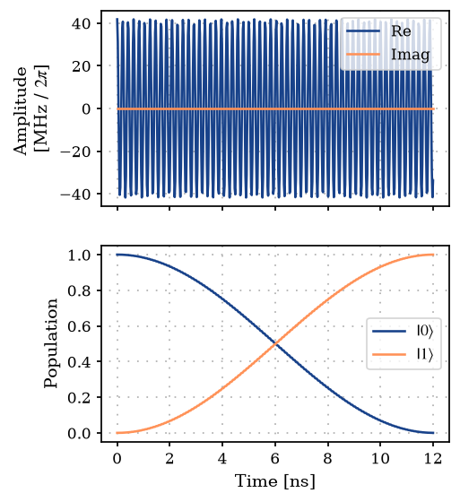

Using a custom Hamiltonian function with ParaQeet
=================================================

In this example we demonstrate how a custom Hamiltonian function
``H(t)`` can be used to simulate and optimize quantum systems.

.. code:: ipython3

    import jax.numpy as jnp
    
    import paraqeet as pq

1. Define the parameters, Hamiltonian function and gradient functions
---------------------------------------------------------------------

Define a Hamiltonian as a function of time and optimizable parameters.
The optimizable parameters need to be of the type ``pq.Quantity``.

Here we define a two-level system (TLS) Hamiltonian, with a cosine drive
(with optimizable parameters Amplitude and Frequency). The cosine
envelope function can be created by constructing the class
``CosEnvelope``. This can automatically provide gradient values, thus
eliminating the need to manually write the gradient of the function.

The Hamiltonian in this example is given by

.. math:: H(t) = \frac{\omega}{2} \sigma_z + u(A, \omega_d, t) \sigma_x, 

with :math:`u(A, \omega_d, t) = A\cos(\omega_d t)`.

.. code:: ipython3

    from paraqeet.signal.envelopes import Envelope
    
    amplitude = pq.Quantity(
        value=jnp.array(1.55e8),
        min_value=jnp.array(0.0),
        max_value=jnp.array(5 * 1e8),
        unit="Hz",
        name="Amplitude",
        two_pi=True,
    )
    
    frequency = pq.Quantity(
        value=jnp.array(4.8e9 * 2 * jnp.pi),
        min_value=jnp.array(0.8 * 4.8e9 * 2 * jnp.pi),
        max_value=jnp.array(1.2 * 4.8e9 * 2 * jnp.pi),
        unit="Hz",
        name="lo_freq",
        two_pi=True,
    )
    
    t_final = 12e-9
    t_final_qty = pq.Quantity(
        value=jnp.array(t_final),
        min_value=jnp.array(0.8 * t_final),
        max_value=jnp.array(1.2 * t_final),
        unit="s",
        name="t_final",
    )
    
    tls_freq = 4.8e9 * 2 * jnp.pi
    
    
    class CosEnvelope(Envelope):
        """Cosine envelope."""
    
        def __init__(self, amplitude, frequency, t_final=None):
            super().__init__(amplitude, t_final)
            self.frequency = frequency
    
        def get_parameters(self):
            """Return parameters amplitude and frequency"""
            return [self.amplitude, self.frequency]
    
        def _evaluate(self, amp, freq, t: pq.Array):
            """Define a cosine envelope."""
            return amp * jnp.cos(freq * t)
    
        def get_value(self, times):
            """Return value of the Envelope."""
            amp = self.amplitude.get_value()
            freq = self.frequency.get_value()
            return self._evaluate(amp, freq, times)
    
    
    cos_env = CosEnvelope(amplitude, frequency, t_final)
    
    
    def tls_hamiltonian(t: pq.Array):
        """Define a Two level system Hamiltonian."""
        return 0.5 * tls_freq * sigma_z + sigma_x * (cos_env.get_value(t).reshape((-1, 1, 1)))
    
    
    sigma_x = jnp.expand_dims(jnp.array([[0j, 1], [1, 0]]), axis=0)
    sigma_z = jnp.expand_dims(jnp.diag(jnp.array([1.0, -1.0])), axis=0)

For cases where the gradients of the Hamiltonian are not required, e.g.,
for state propagation and gradient-free optimization, the
``hamiltonian_and_gradient_func`` can be defined by any function. Here
we define a function that raises an exception when it is called.

.. code:: ipython3

    from paraqeet.eom.schroedinger_equation import SchroedingerEquation
    
    
    def ham_grad(t):
        """Gradient of the Hamiltonian. Raises exception when called."""
        raise Exception("Hamiltonian gradients have not been defined.")
    
    
    model = SchroedingerEquation(hamiltonian_func=tls_hamiltonian, hamiltonian_gradient_func=ham_grad)

2. Define propagation method and measurement function
-----------------------------------------------------

Here we pick the standard ``Expm`` method for propagation, add gradients
to it with ``GOAT``, and use ``StateTransferFidelity`` as our
measurement function

.. code:: ipython3

    from paraqeet.measurement.state_transfer_fidelity import StateTransferFidelity
    from paraqeet.measurement.utils import overlap_state_vector
    from paraqeet.propagation import GOAT, Expm
    
    init = jnp.array([[1.0], [0]])  # |0>
    target = jnp.array([[0.0], [1]])  # |1>
    
    prop = GOAT(
        Expm(eom_func=model.get_value, resolution=100e9, initial_state=init),
        eom_gradient_func=model.get_gradient,
    )
    times = jnp.array([0.0, t_final])
    
    zeroone = StateTransferFidelity(
        propagation_func=prop.get_value,
        propagation_gradient_func=prop.get_gradient,
        target_state=target,
        overlap=overlap_state_vector,
    )

.. code:: ipython3

    from plotting import plot_signal_and_dynamics
    
    ts = jnp.linspace(0.0, t_final, 501)
    plot_signal_and_dynamics(cos_env, prop, ts, state_labels=[r"$|0\rangle$", r"$|1\rangle$"])

.. parsed-literal::

    array([<Axes: ylabel='Amplitude \n[MHz / $2\\pi$]'>,
           <Axes: xlabel='Time [ns]', ylabel='Population'>], dtype=object)

.. image:: 07A_Custom_Hamiltonian_files/07A_Custom_Hamiltonian_10_1.png

3. Gradient based optimization
------------------------------

While using the above setup one can perform gradient-free optimization.
To do a gradient-based optimization, we need to provide the gradient of
the Hamiltonian wrt each parameter in the Hamiltonian function.

These gradient functions can be written as analytical functions or
constructed using automatic differentiation using ``jax.grad``.

Here we demonstrate both cases.

1. Analytical functions for gradient of the Hamiltonian.

.. code:: ipython3

    def grad_amp(t: pq.Array, freq):
        """Gradient of Hamiltonian wrt amplitude."""
        return sigma_x * (jnp.cos(freq * t)).reshape((-1, 1, 1))
    
    
    def grad_frequency(t: pq.Array, amp, freq):
        """Gradient of Hamiltonian wrt frequency."""
        return -1 * sigma_x * (amp * t * jnp.sin(freq * t)).reshape((-1, 1, 1))
    
    
    def grad_tls_hamiltonian(t: pq.Array):
        """Value and gradient of the TLS Hamiltonian."""
        pulse_amp = amplitude.get_value()
        pulse_freq = frequency.get_value()
        ham_grads = jnp.stack([grad_amp(t, pulse_freq), grad_frequency(t, pulse_amp, pulse_freq)], axis=1)
        return ham_grads

2. Gradient functions using automatic differentiation

.. code:: ipython3

    def grad_tls_hamiltonian_AD(t: pq.Array):
        """Value and gradient of the Hamiltonian evaluated using AD."""
        _, grads = cos_env.get_value_and_gradient(t)
        ham_grads = jnp.stack(
            [grads[:, 0].reshape((-1, 1, 1)) * sigma_x, grads[:, 1].reshape((-1, 1, 1)) * sigma_x], axis=1
        )
        return ham_grads

Finally we can redefine the model (and propagation and measurement
function) with the updated ``hamiltonian_and_gradient_func``.

.. code:: ipython3

    model = SchroedingerEquation(hamiltonian_func=tls_hamiltonian, hamiltonian_gradient_func=grad_tls_hamiltonian)
    
    prop = GOAT(
        Expm(eom_func=model.get_value, resolution=100e9, initial_state=init),
        eom_gradient_func=model.get_gradient,
    )
    times = jnp.array([0.0, t_final])
    
    zeroone = StateTransferFidelity(
        propagation_func=prop.get_value,
        propagation_gradient_func=prop.get_gradient,
        target_state=target,
        overlap=overlap_state_vector,
    )

.. code:: ipython3

    zeroone.get_value(times)

.. parsed-literal::

    Array(0.64040275, dtype=float64)

.. code:: ipython3

    cos_env.get_parameters()

.. parsed-literal::

    [Amplitude: 24.7 MHz x 2pi, lo_freq: 4.8 GHz x 2pi]

4. Create optmap and optimize
-----------------------------

.. code:: ipython3

    from paraqeet.optimization_map import OptimizationMap
    from paraqeet.optimizers.scipy_optimizer_gradient import ScipyOptimizerGradient
    
    optmap = OptimizationMap()
    optmap.add(cos_env)
    opt = ScipyOptimizerGradient(measure_and_gradient_func=zeroone.get_value_and_gradient, optimization_map=optmap)

.. code:: ipython3

    opt.optimize(times)

.. parsed-literal::

    {'status': 1, 'value': 3.3306690738754696e-15, 'iterations': 10, 'message': 'CONVERGENCE: NORM OF PROJECTED GRADIENT <= PGTOL'}

.. code:: ipython3

    plot_signal_and_dynamics(cos_env, prop, ts, state_labels=[r"$|0\rangle$", r"$|1\rangle$"])

.. parsed-literal::

    array([<Axes: ylabel='Amplitude \n[MHz / $2\\pi$]'>,
           <Axes: xlabel='Time [ns]', ylabel='Population'>], dtype=object)

.. code:: ipython3

    zeroone.get_value(times)

.. parsed-literal::

    Array(1., dtype=float64)

