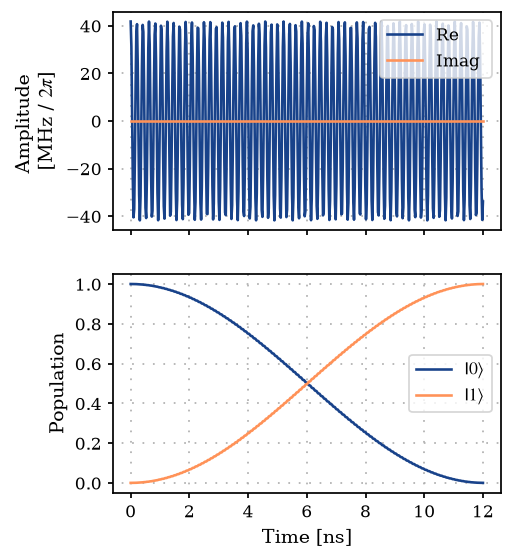

Using QuTiP with ParaQeet
=========================

In this example we demonstrate how QuTiP (Lambert et al., 2026) objects
could be used for modeling a quantum system, and combined with ParaQeet
for propagation and optimization tasks. Here we follow the same example
as before, of a state preparation task, but use QuTiP functions for
modeling the system.

.. code:: ipython3

    import jax.numpy as jnp
    import qutip as qt
    import qutip_jax
    
    import paraqeet as pq
    
    qutip_jax.set_as_default()

Here we use the `qutip-jax <https://github.com/qutip/qutip-jax>`__
package for better integration with ParaQeet, as ParaQeet deals with
pure JAX objects.

1. Define the parameters, Hamiltonian function and gradient functions
---------------------------------------------------------------------

Similar to the previous example, here we also define a ``CosEnvelope``
as our pulse ansatz.

The Hamiltonian in this example is, similarly, given by

.. math:: H(t) = \frac{\omega}{2} \sigma_z + u(A, \omega_d, t) \sigma_x, 

with :math:`u(A, \omega_d, t) = A\cos(\omega_d t)`.

.. code:: ipython3

    from paraqeet.signal.envelopes import Envelope
    
    amplitude = pq.Quantity(
        value=jnp.array(1.55e8),
        min_value=jnp.array(0.0),
        max_value=jnp.array(5 * 1e8),
        unit="Hz",
        name="Amplitude",
        two_pi=True,
    )
    
    frequency = pq.Quantity(
        value=jnp.array(4.8e9 * 2 * jnp.pi),
        min_value=jnp.array(0.8 * 4.8e9 * 2 * jnp.pi),
        max_value=jnp.array(1.2 * 4.8e9 * 2 * jnp.pi),
        unit="Hz",
        name="lo_freq",
        two_pi=True,
    )
    
    t_final = 12e-9
    t_final_qty = pq.Quantity(
        value=jnp.array(t_final),
        min_value=jnp.array(0.8 * t_final),
        max_value=jnp.array(1.2 * t_final),
        unit="s",
        name="t_final",
    )
    
    tls_freq = 4.8e9 * 2 * jnp.pi
    
    
    class CosEnvelope(Envelope):
        """Cosine envelope."""
    
        def __init__(self, amplitude, frequency, t_final=None):
            super().__init__(amplitude, t_final)
            self.frequency = frequency
    
        def get_parameters(self):
            """Return parameters amplitude and frequency"""
            return [self.amplitude, self.frequency]
    
        def _evaluate(self, amp, freq, t: pq.Array):
            """Define a cosine envelope."""
            return amp * jnp.cos(freq * t)
    
        def get_value(self, times):
            """Return value of the Envelope."""
            amp = self.amplitude.get_value()
            freq = self.frequency.get_value()
            return self._evaluate(amp, freq, times)
    
    
    cos_env = CosEnvelope(amplitude, frequency, t_final)
    
    
    # We define a H(t) for a single time-point t using QuTiP and pass it to the qt_func_to_jax_func wrapper
    # to convert into a JAX function which supports vectorized time-points as input.
    def tls_hamiltonian(t: float):
        """Define a Two level system Hamiltonian."""
        return 0.5 * tls_freq * qt.sigmaz() + qt.sigmax() * cos_env.get_value(t)

.. code:: ipython3

    tls_hamiltonian(0.0)

.. math::

    Quantum object: dims=[[2], [2]], shape=(2, 2), type='oper', dtype=JaxArray, isherm=True$$\left(\begin{array}{cc}1.508\times10^{ 10 } & 1.550\times10^{ 8 }\\1.550\times10^{ 8 } & -1.508\times10^{ 10 }\end{array}\right)

We can see that the output of the tls_hamiltonian is a ``Qobj``. For
working with ParaQeet we convert the Hamiltonian function to a
JAX-compatible function by using the wrapper function
``qt_func_to_jax_func``.

.. code:: ipython3

    from paraqeet.hamiltonian.utils import qt_func_to_jax_func
    
    jax_ham_func = qt_func_to_jax_func(tls_hamiltonian)
    jax_ham_func(jnp.array([0.0, 1e-9]))

.. parsed-literal::

    Array([[[ 1.508e+10+0.j,  1.550e+08+0.j],
            [ 1.550e+08+0.j, -1.508e+10+0.j]],
    
           [[ 1.508e+10+0.j,  4.790e+07+0.j],
            [ 4.790e+07+0.j, -1.508e+10+0.j]]], dtype=complex128)

The ``jax_ham_func`` now works with a batch of time points and returns
the Hamiltonian as a JAX ``Array`` for each time point.

Similar to the previous example, for cases where the gradients of the
Hamiltonian are not required, e.g., for state propagation and
gradient-free optimization, the ``hamiltonian_and_gradient_func`` can be
defined by any function. Here we define a function that raises an
exception when it is called.

.. code:: ipython3

    from paraqeet.eom.schroedinger_equation import SchroedingerEquation
    
    
    def ham_grad(t):
        """Gradient of the Hamiltonian. Raises exception when called."""
        raise Exception("Hamiltonian gradients have not been defined.")
    
    
    model = SchroedingerEquation(hamiltonian_func=jax_ham_func, hamiltonian_gradient_func=ham_grad)

2. Define propagation method and measurement function
-----------------------------------------------------

Here we pick the standard ``Expm`` method for propagation, add gradients
to it with ``GOAT``, and use ``UnitaryFidelity`` as our measurement
function. We start from the identity matrix with the goal to prepare the
Hadamard gate.

.. code:: ipython3

    from paraqeet.hamiltonian.utils import qobj_to_array
    from paraqeet.measurement.fidelity import Fidelity
    from paraqeet.measurement.utils import gate_fidelity, overlap_state_vector
    from paraqeet.propagation import GOAT, Expm
    
    init_qobj = qt.basis(2, 0)  # |0>
    target_qobj = qt.basis(2, 1)  # |1>
    
    # Convert Qobj to jax Array
    init = qobj_to_array(init_qobj)
    target = qobj_to_array(target_qobj)
    
    prop = GOAT(
        Expm(eom_func=model.get_value, resolution=100e9, initial_state=init),
        eom_gradient_func=model.get_gradient,
    )
    times = jnp.array([0.0, t_final])
    
    zeroone = Fidelity(
        propagation_func=prop.get_value,
        propagation_gradient_func=prop.get_gradient,
        target_states=target,
        overlap=overlap_state_vector,
        fid=gate_fidelity,
    )

.. code:: ipython3

    from plotting import plot_signal_and_dynamics
    
    ts = jnp.linspace(0.0, t_final, 501)
    plot_signal_and_dynamics(cos_env, prop, ts, state_labels=[r"$|0\rangle$", r"$|1\rangle$"])

.. parsed-literal::

    array([<Axes: ylabel='Amplitude \n[MHz / $2\\pi$]'>, <Axes: xlabel='Time [ns]', ylabel='Population'>], dtype=object)

.. image:: 07B_Modeling_using_QuTiP_files/07B_Modeling_using_QuTiP_15_1.png

.. code:: ipython3

    zeroone.get_value(times)

.. parsed-literal::

    0.6404027521371738

3. Gradient based optimization
------------------------------

For gradient-based optimization let’s define the gradient of the
Hamiltonian function also using QuTiP objects.

.. code:: ipython3

    def grad_tls_hamiltonian(t: pq.Array):
        """Value and gradient of the TLS Hamiltonian."""
        _, grads = cos_env.get_value_and_gradient(t)
        sigma_x = qobj_to_array(qt.sigmax())
        ham_grads = jnp.stack(
            [grads[:, 0].reshape((-1, 1, 1)) * sigma_x, grads[:, 1].reshape((-1, 1, 1)) * sigma_x], axis=1
        )
        return ham_grads

Finally we can redefine the model (and propagation and measurement
function) with the updated ``hamiltonian_and_gradient_func``.

.. code:: ipython3

    model = SchroedingerEquation(hamiltonian_func=jax_ham_func, hamiltonian_gradient_func=grad_tls_hamiltonian)
    
    prop = GOAT(
        Expm(eom_func=model.get_value, resolution=100e9, initial_state=init),
        eom_gradient_func=model.get_gradient,
    )
    times = jnp.array([0.0, t_final])
    
    zeroone = Fidelity(
        propagation_func=prop.get_value,
        propagation_gradient_func=prop.get_gradient,
        target_states=target,
        overlap=overlap_state_vector,
        fid=gate_fidelity,
    )

.. code:: ipython3

    zeroone.get_value(times)

.. parsed-literal::

    0.6404027521371738

.. code:: ipython3

    cos_env.get_parameters()

.. parsed-literal::

    [Amplitude: 24.7 MHz x 2pi, lo_freq: 4.8 GHz x 2pi]

4. Create optmap and optimize
-----------------------------

.. code:: ipython3

    from paraqeet.optimization_map import OptimizationMap
    from paraqeet.optimizers.scipy_optimizer_gradient import ScipyOptimizerGradient
    
    optmap = OptimizationMap()
    optmap.add(cos_env)
    opt = ScipyOptimizerGradient(measure_and_gradient_func=zeroone.get_value_and_gradient, optimization_map=optmap)

.. code:: ipython3

    opt.optimize(times)

.. parsed-literal::

    {'status': 1, 'value': 3.774758283725532e-15, 'iterations': 10, 'message': 'CONVERGENCE: NORM OF PROJECTED GRADIENT <= PGTOL'}

.. code:: ipython3

    plot_signal_and_dynamics(cos_env, prop, ts, state_labels=[r"$|0\rangle$", r"$|1\rangle$"])

.. parsed-literal::

    array([<Axes: ylabel='Amplitude \n[MHz / $2\\pi$]'>, <Axes: xlabel='Time [ns]', ylabel='Population'>], dtype=object)

.. code:: ipython3

    zeroone.get_value(times)

.. parsed-literal::

    0.9999999999999962

References
----------

-  **(Lambert et al., 2026)** N. Lambert et al., “QuTiP 5: The quantum
   toolbox in Python,” *Physics Reports* **1153**, 1–62 (2026).
