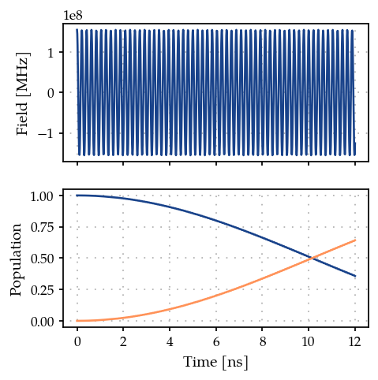
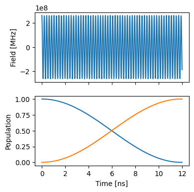

Using a custom Hamiltonian function with ParaQeet
=================================================

In this example we demonstrate how a custom Hamiltonian function
``H(t, params)`` can be used to simulate and optimise quantum systems.

.. code:: ipython3

    import matplotlib.pyplot as plt
    import jax.numpy as jnp
    import paraqeet as pq

1. Define the parameters, Hamiltonian function and gradient functions
---------------------------------------------------------------------

Define a Hamiltonian as a function of time and optimisable parameters.
The optimisable paramter need to be of the type ``pq.Quantity``.

Here we define a two level system (TLS) Hamiltonian, with a cosine drive
(with optimisable paramters Amplitude and Frequency).

.. code:: ipython3

    amplitude = pq.Quantity(
        value=jnp.array(1.55e8),
        min_value=jnp.array(0.0),
        max_value=jnp.array(5 * 1e8),
        unit="Hz",
        name="Amplitude",
        two_pi=True,
    )
    
    frequency = pq.Quantity(
        value=jnp.array(4.8e9 * 2 * jnp.pi),
        min_value=jnp.array(0.8 * 4.8e9 * 2 * jnp.pi),
        max_value=jnp.array(1.2 * 4.8e9 * 2 * jnp.pi),
        unit="Hz",
        name="lo_freq",
        two_pi=True,
    )
    
    
    def cos_envelope(t: pq.Array, amp, freq):
        """Define a cosine envelope."""
        return amp * jnp.cos(freq * t)
    
    
    def tls_hamiltonian(t: pq.Array, amp, freq):
        """Define a Two level system Hamiltonian."""
        return 0.5 * freq * sigma_z + sigma_x * cos_envelope(t, amp, freq)
    
    
    sigma_x = jnp.array([[0j, 1], [1, 0]])
    sigma_z = jnp.diag(jnp.array([1.0, -1.0]))
    freq = 4.8e9 * 2 * jnp.pi

.. code:: ipython3

    from paraqeet.model.custom_hamiltonian import CustomHamiltonian
    from paraqeet.model.closed_system import ClosedSystem
    
    tls = CustomHamiltonian(
        hamiltonian_function=tls_hamiltonian,
        parameters=[amplitude, frequency],
    )
    model = ClosedSystem(tls)

2. Define propagation method and measurement function
-----------------------------------------------------

Here we pick the standard ``ScipyExpmGOAT`` method for propagation and
``StateTransferFidelity`` as our measurement function

.. code:: ipython3

    from paraqeet.measurement.state_transfer_fidelity import StateTransferFidelity
    from paraqeet.propagation.scipy_expm_goat import ScipyExpmGOAT
    
    t_final = 12e-9
    
    prop = ScipyExpmGOAT(model, res=100e9)
    
    init = jnp.array([[1.0], [0]])  # |0>
    target = jnp.array([[0.0], [1]])  # |1>
    zeroone = StateTransferFidelity(
        propagation=prop,
        initial_state=init,
        target_state=target,
        times=jnp.array([0.0, t_final]),
    )

.. code:: ipython3

    import plotting  # import the configuration from plotting
    
    
    def make_plot():
        """Plot the signal."""
        ts = jnp.linspace(0, t_final, 1001)
        states = jnp.reshape(prop.propagate(ts), (-1, 2))
        sig = cos_envelope(ts, amp=amplitude.get_value()[0], freq=frequency.get_value()[0])
    
        fig, ax = plt.subplots(2, figsize=(4, 4), sharex=True)
        ax[0].plot(ts / 1e-9, sig)
        ax[0].set_ylabel("Field [MHz]")
        ax[0].grid(True, linestyle=(1, (1, 5)), linewidth=1)
    
        ax[1].plot(ts / 1e-9, jnp.abs(states) ** 2)
        ax[1].set_ylabel("Population")
        ax[1].grid(True, linestyle=(1, (1, 5)), linewidth=1)
    
        ax[-1].set_xlabel("Time [ns]")
        return fig, ax
    
    
    make_plot()

.. parsed-literal::

    (<Figure size 500x500 with 2 Axes>,
     array([<Axes: ylabel='Field [MHz]'>,
            <Axes: xlabel='Time [ns]', ylabel='Population'>], dtype=object))

3. Gradient based optimisation
------------------------------

While using the above setup one can perform gradient free optimisation.
To do a gradient based optimisation, we need to provide the gradient of
the Hamiltonian wrt each parameter in the Hamiltonian function.

These gradient functions can be written as analytical functions or
constructed using automatic differentiation using ``jax.grad``.

Here we demonstrate both the cases.

1. Analytical functions for gradient of the Hamiltonian.

.. code:: ipython3

    def grad_amp(t: pq.Array, amp, freq):
        """Gradient of Hamiltonian wrt amplitude."""
        return sigma_x * jnp.cos(freq * t)
    
    
    def grad_frequency(t: pq.Array, amp, freq):
        """Gradient of Hamiltonian wrt frequency."""
        return -1 * sigma_x * amp * t * jnp.sin(freq * t)
    
    
    analytical_grad_funcs = [grad_amp, grad_frequency]
    tls.gradient_functions = analytical_grad_funcs

2. Gradient functions using Automatic differentiation

.. code:: ipython3

    from jax import grad
    
    # env_grads(t, amp, freq) returns a tuple of gradients wrt amp and freq
    env_grads = grad(cos_envelope, argnums=(1, 2))
    
    
    def grad_amp(t, amp, freq):
        """Gradient of Hamiltonian wrt amplitude."""
        return sigma_x * env_grads(t, amp, freq)[0]
    
    
    def grad_freq(t, amp, freq):
        """Gradient of Hamiltonian wrt frequency."""
        return sigma_x * env_grads(t, amp, freq)[1]
    
    
    tls.gradient_functions = [grad_amp, grad_freq]

.. code:: ipython3

    zeroone.measure()

.. parsed-literal::

    0.6404027521371757

4. Create optmap and optimise
-----------------------------

.. code:: ipython3

    from paraqeet.optimisation_map import OptimisationMap
    from paraqeet.optimisers.scipy_optimiser_gradient import ScipyOptimiserGradient
    
    optmap = OptimisationMap()
    optmap.add(tls)
    opt = ScipyOptimiserGradient(zeroone, optimisation_map=optmap)

.. code:: ipython3

    opt.optimise()

.. parsed-literal::

    {'status': 1, 'value': 1.4876988529977098e-14, 'iterations': 9, 'message': 'CONVERGENCE: NORM OF PROJECTED GRADIENT <= PGTOL'}

.. code:: ipython3

    make_plot()

.. parsed-literal::

    (<Figure size 500x500 with 2 Axes>,
     array([<Axes: ylabel='Field [MHz]'>,
            <Axes: xlabel='Time [ns]', ylabel='Population'>], dtype=object))

