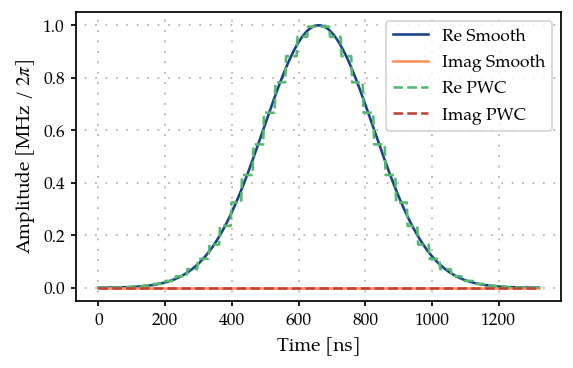
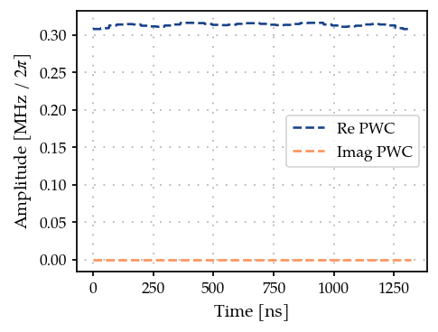

Constrain piece-wise constant pulses to vary smoothly
=====================================================

.. code:: ipython3

    import numpy as np
    import matplotlib.pyplot as plt
    
    from paraqeet.quantity import Quantity
    from paraqeet.signal.envelopes import GaussEnvelope
    from paraqeet.signal.pwc_generator import PWCGenerator
    from paraqeet.measurement.smoothness import Smoothness
    from paraqeet.optimization_map import OptimizationMap
    from paraqeet.optimizers.scipy_optimizer_gradient import ScipyOptimizerGradient

.. code:: ipython3

    delta_sampling = 33e-9
    n_pwc = 40  # number of piecewise constants in the pulse
    t_final = n_pwc * delta_sampling  # for now just set up for trying
    tlist = np.linspace(0, t_final, n_pwc + 1)
    eps_qubit = 2 * np.pi * 1.0  # initial amplitude of the qubit (in MHz)
    eps_max_qubit = 5 * eps_qubit  # maximum amplitude of the resonator (in MHz)
    tone_qubit = GaussEnvelope(
        amplitude=Quantity(eps_qubit * 1e6, -eps_max_qubit * 1e6, eps_max_qubit * 1e6),
        t_final=Quantity(t_final, 1 / 2 * t_final, 2 * t_final),
    )
    gen_qubit = PWCGenerator(envelopes=[tone_qubit], max_amplitude=eps_max_qubit * 1e6, tlist=tlist)

.. code:: ipython3

    from plotting import plot_signal
    
    ts = np.linspace(0, t_final, 501)
    fig, ax = plt.subplots(1, figsize=(5, 3))
    plot_signal(tone_qubit, ts, ax, linestyle="-", label="Smooth")
    plot_signal(gen_qubit, ts, ax, linestyle="--", label="PWC")
    ax.legend(loc=1, frameon=True)
    plt.show()

.. code:: ipython3

    optmap = OptimizationMap()
    optmap.add(gen_qubit, gen_qubit.get_parameters())
    
    # We add dummy parameters to check if the gradient is computed
    # correctly by padding zeros
    # optmap.add(tone_qubit, tone_qubit.get_parameters())
    optmap.register_params_with_optimizables()

.. code:: ipython3

    smoothness = Smoothness(pwc_generator=gen_qubit)

We can check that the gradient has the correct shape

.. code:: ipython3

    print(smoothness.measure_with_gradient()[1].shape)

.. parsed-literal::

    (80,)

.. code:: ipython3

    opt = ScipyOptimizerGradient(smoothness, optimization_map=optmap)
    max_iter = 200
    opt.set_options({"maxiter": max_iter})

.. code:: ipython3

    opt.optimize()

.. parsed-literal::

    {'status': 1, 'value': 1.8438155335864792e-08, 'iterations': 15, 'message': 'CONVERGENCE: NORM OF PROJECTED GRADIENT <= PGTOL'}

.. code:: ipython3

    smoothness.measure()

.. parsed-literal::

    0.9999999815618447

.. code:: ipython3

    smoothness.measure_with_gradient()

.. parsed-literal::

    (0.9999999815618447,
     Array([ 9.29053612e-14,  2.07661214e-13, -1.98912979e-13, -5.70798606e-14,
            -8.65882301e-14, -9.38920408e-14,  5.79057140e-14,  4.16652832e-14,
             1.73505745e-13, -2.70482385e-14,  7.20441408e-14, -1.86976502e-13,
            -2.12695167e-14, -7.15428687e-14,  1.95900735e-15,  6.48107118e-14,
             8.08025679e-14,  4.28865051e-14, -2.21246235e-14, -7.07113902e-14,
            -7.07113902e-14, -2.21246235e-14,  4.28865051e-14,  8.08025679e-14,
             6.48107118e-14,  1.95900735e-15, -7.15428687e-14, -2.12695167e-14,
            -1.86976502e-13,  7.20441408e-14, -2.70482385e-14,  1.73505745e-13,
             4.16652832e-14,  5.79057140e-14, -9.38920408e-14, -8.65882301e-14,
            -5.70798606e-14, -1.98912979e-13,  2.07661214e-13,  9.29053612e-14,
            -0.00000000e+00, -0.00000000e+00, -0.00000000e+00, -0.00000000e+00,
            -0.00000000e+00, -0.00000000e+00, -0.00000000e+00, -0.00000000e+00,
            -0.00000000e+00, -0.00000000e+00, -0.00000000e+00, -0.00000000e+00,
            -0.00000000e+00, -0.00000000e+00, -0.00000000e+00, -0.00000000e+00,
            -0.00000000e+00, -0.00000000e+00, -0.00000000e+00, -0.00000000e+00,
            -0.00000000e+00, -0.00000000e+00, -0.00000000e+00, -0.00000000e+00,
            -0.00000000e+00, -0.00000000e+00, -0.00000000e+00, -0.00000000e+00,
            -0.00000000e+00, -0.00000000e+00, -0.00000000e+00, -0.00000000e+00,
            -0.00000000e+00, -0.00000000e+00, -0.00000000e+00, -0.00000000e+00,
            -0.00000000e+00, -0.00000000e+00, -0.00000000e+00, -0.00000000e+00],      dtype=float64))

.. code:: ipython3

    plot_signal(gen_qubit, ts, linestyle="--", label="PWC");

As expected obtain a flat pulse.
