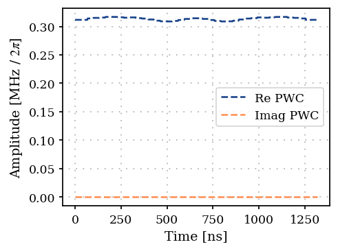

Constrain piece-wise constant pulses to vary smoothly
=====================================================

.. code:: ipython3

    import matplotlib.pyplot as plt
    import numpy as np
    
    from paraqeet.measurement.smoothness import Smoothness
    from paraqeet.optimization_map import OptimizationMap
    from paraqeet.optimizers.scipy_optimizer_gradient import ScipyOptimizerGradient
    from paraqeet.quantity import Quantity
    from paraqeet.signal.envelopes import GaussEnvelope
    from paraqeet.signal.pwc_generator import PWCGenerator

.. code:: ipython3

    delta_sampling = 33e-9
    n_pwc = 40  # number of piecewise constants in the pulse
    t_final = n_pwc * delta_sampling  # for now just set up for trying
    tlist = np.linspace(0, t_final, n_pwc + 1)
    eps_qubit = 2 * np.pi * 1.0  # initial amplitude of the qubit (in MHz)
    eps_max_qubit = 5 * eps_qubit  # maximum amplitude of the resonator (in MHz)
    tone_qubit = GaussEnvelope(
        amplitude=Quantity(eps_qubit * 1e6, -eps_max_qubit * 1e6, eps_max_qubit * 1e6),
        t_final=Quantity(t_final, 1 / 2 * t_final, 2 * t_final),
    )
    gen_qubit = PWCGenerator(envelopes=[tone_qubit], max_amplitude=eps_max_qubit * 1e6, tlist=tlist)

.. code:: ipython3

    from plotting import plot_signal
    
    ts = np.linspace(0, t_final, 501)
    fig, ax = plt.subplots(1, figsize=(5, 3))
    plot_signal(tone_qubit, ts, ax, linestyle="-", label="Smooth")
    plot_signal(gen_qubit, ts, ax, linestyle="--", label="PWC")
    ax.legend(loc=1, frameon=True)
    plt.show()

.. image:: 08A_Smoothness_measure_files/08A_Smoothness_measure_3_0.png

.. code:: ipython3

    optmap = OptimizationMap()
    optmap.add(gen_qubit, gen_qubit.get_parameters())
    
    # We add dummy parameters to check if the gradient is computed
    # correctly by padding zeros
    # optmap.add(tone_qubit, tone_qubit.get_parameters())
    optmap.register_params_with_optimizables()

.. code:: ipython3

    smoothness = Smoothness(pwc_generator=gen_qubit)

We can check that the gradient has the correct shape

.. code:: ipython3

    print(smoothness.get_value_and_gradient(tlist)[1].shape)

.. parsed-literal::

    (80,)

.. code:: ipython3

    opt = ScipyOptimizerGradient(measure_and_gradient_func=smoothness.get_value_and_gradient, optimization_map=optmap)
    max_iter = 200
    opt.set_options({"maxiter": max_iter})

.. code:: ipython3

    opt.optimize(ts)

.. parsed-literal::

    Iteration   10 | Infid = 3.831392e-08

.. parsed-literal::

    {'status': 1, 'value': 1.1649151643311484e-09, 'iterations': 20, 'message': 'CONVERGENCE: NORM OF PROJECTED GRADIENT <= PGTOL'}

.. code:: ipython3

    smoothness.measure(ts)

.. parsed-literal::

    Array(1., dtype=float64)

.. code:: ipython3

    smoothness.get_value_and_gradient(ts)

.. parsed-literal::

    (Array(1., dtype=float64),
     Array([-1.00058440e-14,  2.15090019e-13, -1.21393926e-13, -3.56757831e-14,
             4.32685927e-14, -9.68587243e-14, -4.40413453e-14, -1.06365887e-14,
             1.05700111e-13, -1.52029507e-13,  4.58424060e-14, -7.35246762e-14,
            -3.52732230e-14,  7.81778245e-14,  7.35808110e-14,  8.99784498e-14,
             6.62109772e-14,  1.02326266e-14, -5.34368855e-14, -9.52053143e-14,
            -9.52053143e-14, -5.34368855e-14,  1.02326266e-14,  6.62109772e-14,
             8.99784498e-14,  7.35808110e-14,  7.81778245e-14, -3.52732230e-14,
            -7.35246762e-14,  4.58424060e-14, -1.52029507e-13,  1.05700111e-13,
            -1.06365887e-14, -4.40413453e-14, -9.68587243e-14,  4.32685927e-14,
            -3.56757831e-14, -1.21393926e-13,  2.15090019e-13, -1.00058440e-14,
            -0.00000000e+00, -0.00000000e+00, -0.00000000e+00, -0.00000000e+00,
            -0.00000000e+00, -0.00000000e+00, -0.00000000e+00, -0.00000000e+00,
            -0.00000000e+00, -0.00000000e+00, -0.00000000e+00, -0.00000000e+00,
            -0.00000000e+00, -0.00000000e+00, -0.00000000e+00, -0.00000000e+00,
            -0.00000000e+00, -0.00000000e+00, -0.00000000e+00, -0.00000000e+00,
            -0.00000000e+00, -0.00000000e+00, -0.00000000e+00, -0.00000000e+00,
            -0.00000000e+00, -0.00000000e+00, -0.00000000e+00, -0.00000000e+00,
            -0.00000000e+00, -0.00000000e+00, -0.00000000e+00, -0.00000000e+00,
            -0.00000000e+00, -0.00000000e+00, -0.00000000e+00, -0.00000000e+00,
            -0.00000000e+00, -0.00000000e+00, -0.00000000e+00, -0.00000000e+00],      dtype=float64))

.. code:: ipython3

    plot_signal(gen_qubit, ts, linestyle="--", label="PWC")

.. parsed-literal::

    <Axes: xlabel='Time [ns]', ylabel='Amplitude [MHz / $2\\pi$]'>

As expected obtain a flat pulse.
