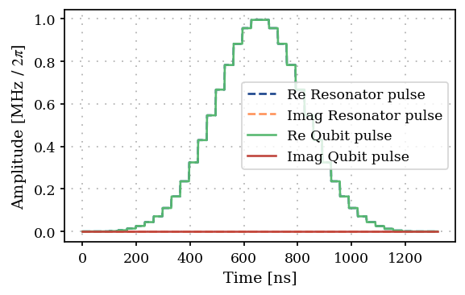
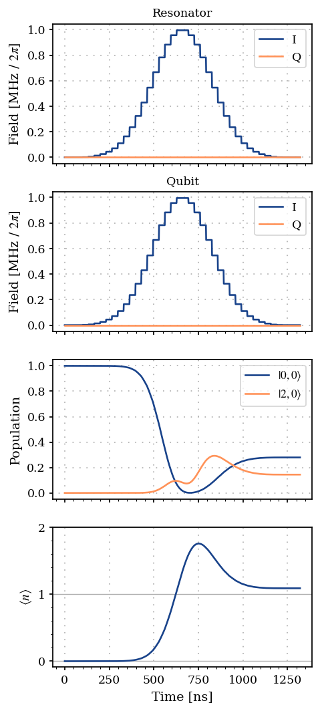
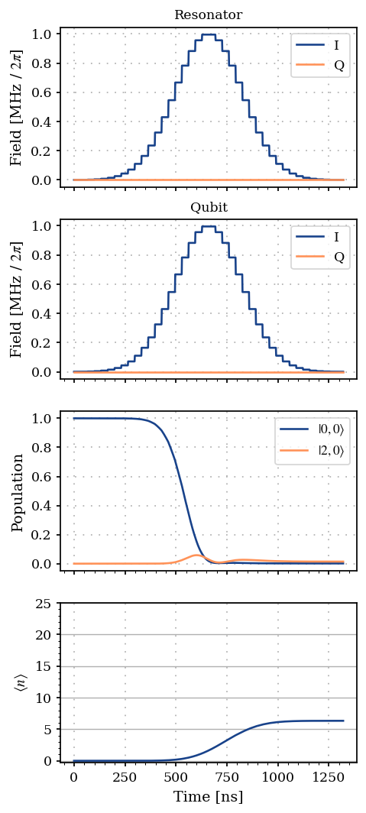
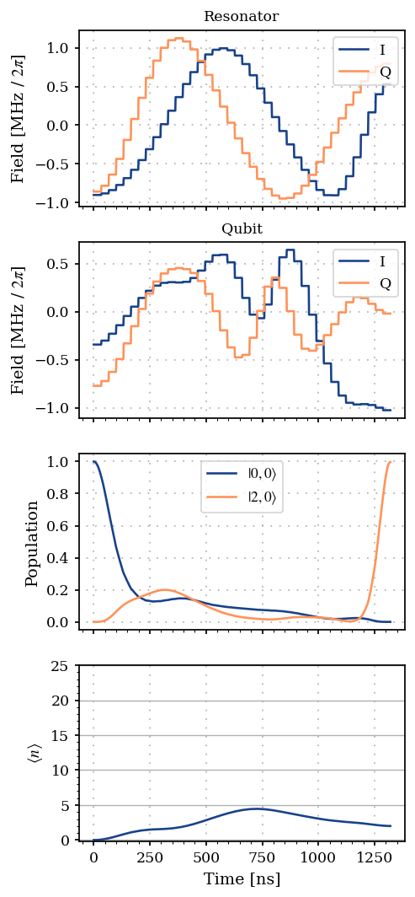

Arbitrary bosonic state preparation using GRAPE
===============================================

In this notebook, we implement a standard application of GRAPE, namely
the preparation of an arbitrary state of a bosonic mode, such a resonant
mode of a microwave cavity. In the notebook, we mostly follow the
optimization strategy of [Heeres2017]. The parameters are taken from
[Eickbusch2022] Table S1, without considering the anharmonicity for
simplicity and with the exception of the dispersive shift taken to be
:math:`10` times larger for simulation purposes. Our starting point is
the well-known Jaynes-Cummings Hamiltonian in the dispersive regime,
which describes an interaction of a qubit with a single bosonic mode
when the characteristic qubit frequency :math:`\omega_{q}` is far
detuned from the one of the resonator :math:`\omega_{r}` (see for
instance [Blais2021] for more details)

.. math::

   H_{\mathrm{disp}} = \omega_{r} a^{\dagger} a + \frac{\omega_{q}}{2} \sigma_z + \chi \sigma_z a^{\dagger} a,

where we set :math:`\hbar = 1`. The parameter :math:`\chi` is the
dispersive shift, which represents a qubit-state-dependent shift of the
frequency of the resonator. Note that we set conventionally
:math:`\sigma_z = | e \rangle \langle e | - |g \rangle \langle g |`,
with :math:`|e \rangle, |g \rangle` the excited and ground state of the
qubit, respectively. We additionally introduce a drive Hamiltonian on
both the qubit and the resonator mode, which we write directly within
the rotating wave approximation

.. math::

   H_{d, r}(t) = \varepsilon_{r}(t) e^{i \omega_{d, r} t} a + \varepsilon_{r}^*(t) e^{-i \omega_{d, r} t} a^{\dagger} , \quad H_{d, q}(t) = \varepsilon_{q}(t) e^{i \omega_{d, q} t} \sigma_- + \varepsilon_{q}^*(t) e^{-i \omega_{d, q} t} \sigma_+.

The total Hamiltonian is

.. math::

   H(t) = H_{\mathrm{disp}} + H_{d, r}(t) + H_{d, q}(t).

We assume that the qubit and the resonator are both driven resonantly,
i.e., :math:`\omega_{d, q} = \omega_q` and
:math:`\omega_{d,r}=\omega_r`, and work in the interaction picture
(rotating frame) with reference Hamiltonian

.. math::

   H_{\mathrm{ref}} = \omega_{r} a^{\dagger} a + \frac{\omega_{q}}{2} \sigma_z,

so that the Hamiltonian in the interaction picture is

.. math::

   H_{I}(t) = e^{i H_{\mathrm{ref}} t} (H(t) - H_{\mathrm{ref}}) e^{-i H_{\mathrm{ref}} t} = \chi \sigma_z a^{\dagger} a + \varepsilon_{r}(t) a + \varepsilon_{r}^*(t) a^{\dagger}  + \varepsilon_{q}(t) \sigma_- + \varepsilon_{q}^*(t) \sigma_+,

Our goal is to prepare the resonator in a Fock state
:math:`| n \rangle, \, n \in \mathbb{N}`, while keeping the qubit in the
ground state :math:`| g \rangle`. Thus, the target state is

.. math::

   | \Psi_{\mathrm{target}} \rangle = |n, g \rangle.

In the notebook, :math:`n` is set to :math:`2` as an example. We assume
that the system starts in the initial state

.. math::

   | \Psi_{\mathrm{initial}} \rangle = |0, g \rangle.

Let :math:`\varepsilon(t) = (\varepsilon_{r}(t), \varepsilon_{q}(t))`.
For a fixed time :math:`T`, the system evolves to a state
:math:`| \Psi(T; \varepsilon(t)) \rangle = U(T; \varepsilon(t)) | \Psi_{\mathrm{initial}} \rangle`.
We thus want to maximize the state fidelity, i.e., the overlap between
:math:`| \Psi_{\mathrm{target}} \rangle` and :math:`| \Psi(t) \rangle`:

.. math::

   \mathcal{F}(\varepsilon(t))  = | \langle \Psi(T; \varepsilon(t) ) )| \Psi_{\mathrm{target}} \rangle|^2.

In GRAPE we consider piecewise constant pulses with time step
:math:`\Delta t`. Each constant can take values in a certain subset
:math:`\mathcal{I} \in \mathbb{C}`. We denote by :math:`R` the range of
the piecewise constant pulse, i.e.,
:math:`R = \mathrm{max}_{\varepsilon, \varepsilon' \in \mathcal{I}} | \varepsilon - \varepsilon'|`.
Thus, in what follows :math:`R_r` and :math:`R_q` represent the range of
the resonator and qubit pulses, respectively.

.. code:: ipython3

    import matplotlib.pyplot as plt
    import numpy as np
    
    from paraqeet.measurement.smoothness import Smoothness
    from paraqeet.measurement.state_transfer_fidelity import StateTransferFidelityGRAPE
    from paraqeet.measurement.weighted_sum_goal import WeightedSumGoal
    from paraqeet.model.composite_system import CompositeSystem
    from paraqeet.model.coupling import Coupling
    from paraqeet.model.drive import Drive
    from paraqeet.model.qubit import Qubit
    from paraqeet.model.resonator import Resonator
    from paraqeet.model.schroedinger_equation import SchroedingerEquation
    from paraqeet.optimization_map import OptimizationMap
    from paraqeet.optimizers.scipy_optimizer_gradient import ScipyOptimizerGradient
    from paraqeet.propagation.scipy_expm_grape import ScipyExpmGRAPE
    from paraqeet.quantity import Quantity
    from paraqeet.signal.envelopes import GaussEnvelope
    from paraqeet.signal.pwc_generator import PWCGenerator

We initialize our pulses as simple Gaussian envelopes. Additionally, we
require fix ranges for the minimum and maximum amplitudes.

.. code:: ipython3

    # in seconds (See Eickbusch et al https://arxiv.org/abs/2111.06414 S9 A)
    delta_sampling = 33e-9
    n_pwc = 40  # number of piecewise constants in the pulse
    t_final = n_pwc * delta_sampling  # for now just set up for trying
    tlist = np.linspace(0, t_final, n_pwc + 1)
    eps_res = 2 * np.pi * 1.0  # initial amplitude of the resonator (in MHz)
    eps_max_res = 5 * eps_res  # maximum amplitude of the resonator (in MHz)
    eps_qubit = 2 * np.pi * 1.0  # initial amplitude of the qubit (in MHz)
    eps_max_qubit = 5 * eps_qubit  # maximum amplitude of the resonator (in MHz)
    tone_res = GaussEnvelope(
        amplitude=Quantity(eps_res * 1e6, -eps_max_res * 1e6, eps_max_res * 1e6),
        t_final=Quantity(t_final, 1 / 2 * t_final, 2 * t_final),
    )
    tone_qubit = GaussEnvelope(
        amplitude=Quantity(eps_qubit * 1e6, -eps_max_qubit * 1e6, eps_max_qubit * 1e6),
        t_final=Quantity(t_final, 1 / 2 * t_final, 2 * t_final),
    )
    gen_res = PWCGenerator(envelopes=[tone_res], tlist=tlist)
    gen_res.multiply_flat_top = True
    
    gen_qubit = PWCGenerator(envelopes=[tone_qubit], tlist=tlist)
    gen_qubit.multiply_flat_top = True

We plot the resonator tone and compare it to its smooth version.
Similarly one can plot the qubit tone.

.. code:: ipython3

    from plotting import plot_signal
    
    ts = np.linspace(0, t_final, 1001)
    fig, ax = plt.subplots(1, figsize=(5, 3))
    
    plot_signal(gen_res, ts, ax, linestyle="--", label="Resonator pulse")
    plot_signal(gen_qubit, ts, ax, linestyle="-", label="Qubit pulse")
    
    plt.legend()
    plt.show()

We define qubit and resonator parameters, as well as the list of
different Fock truncation numbers. We also set the target Fock state.

For now we set the Fock-state truncation at small values (3 and 4) for
testing the method. Later we demonstrate the method with (30 and 31)
levels in the resonator.

.. code:: ipython3

    # Increasing the number of Fock states gives a more realistic scenario, at the price of increasing the simulation time
    n_fock_truncation_list = [3, 4]
    fock_target = 2
    n_times = 1001
    
    omega_range_factor = 1e-3  # just for initialization of the Quantity object
    omega_res = 2 * np.pi * 5.26e9
    omega_qubit = 2 * np.pi * 6.65e9
    
    omega_drive_res = omega_res
    omega_drive_qubit = omega_qubit
    
    detuning_drive_res = omega_res - omega_drive_res
    detuning_drive_qubit = omega_qubit - omega_drive_qubit

Due to the infinite-dimensional nature of the Hilbert space of the
resonator, it is necessary to introduce a Fock state truncation number
:math:`N_{\mathrm{T}}`. This creates the problem that given certain
pulses :math:`\mathcal{F}` depends on the choice of
:math:`N_{\mathrm{T}}`. Following [Heeres2017], we thus consider
:math:`N_{\mathrm{T}} \in \{N_{\mathrm{T}}^{(\mathrm{min})}, N_{\mathrm{T}}^{(\mathrm{min})} + 1, \dots, N_{\mathrm{T}}^{(\mathrm{max})} \}`,
and introduce a penalty when having different values of fidelities for
different truncation numbers. Thus, we create different systems, and
accordingly fidelity measures, for the different Fock truncation
numbers.

.. code:: ipython3

    from paraqeet.measurement.utils import overlap_state_vector
    from paraqeet.propagation.utils import grape_operator_sandwich_function_closed
    
    
    def create_experiment(n_fock_truncation_list, fock_target):
        """
        Create the initial and target states, for the given Fock numbers.
        Also create the propagations and measurements for the given truncation numbers and target Fock states.
        """
        resonator_list = []
        coupling_list = []
        model_list = []
        hamiltonian_list = []
        prop_list = []
        initial_state_list = []
        target_state_list = []
        fock_number_op_list = []
        fid_list = []
    
        qubit = Qubit(
            frequency=Quantity(
                value=detuning_drive_qubit,
                min_value=-omega_range_factor * omega_qubit,
                max_value=omega_range_factor * omega_qubit,
            ),
            drives=[],
        )
    
        drive_qubit = Drive(qubit.sigma_minus, gen_qubit, add_hermitian=True)
        qubit.drives = [drive_qubit]
    
        ground_state_qubit = np.array([[0.0], [1.0]])
    
        # We take it to be 10 times the value in Eickbusch et al to speed up the simulation
        chi = 2 * np.pi * 32.81e3 * 10
    
        for n in n_fock_truncation_list:
            resonator = Resonator(
                frequency=Quantity(
                    value=detuning_drive_res,
                    min_value=-omega_range_factor * omega_res,
                    max_value=omega_range_factor * omega_res,
                ),
                num_fock=n,
                drives=[],
            )
    
            drive_res = Drive(resonator.annihilation_op, gen_res, add_hermitian=True)
            resonator.drives = [drive_res]
    
            resonator_list.append(resonator)
    
            coupling_op = np.kron(resonator.num_op, np.array([[1.0, 0.0], [0.0, -1.0]]))
            coupling = Coupling(
                coupling_op,
                g_abs=Quantity(value=chi, min_value=chi / 2, max_value=2 * chi),
            )
            coupling_list.append(coupling)
            ham = CompositeSystem([resonator, qubit], [coupling])
            hamiltonian_list.append(ham)
            model = SchroedingerEquation(
                hamiltonian_func=ham.get_value, hamiltonian_and_gradient_func=ham.get_value_and_gradient
            )
            model_list.append(model)
    
            initial_res_state = np.zeros([n, 1], dtype=complex)
            initial_res_state[0, 0] = 1  # vacuum state
            initial_state = np.kron(initial_res_state, ground_state_qubit)
            initial_state_list.append(initial_state)
    
            target_res_state = np.zeros([n, 1], dtype=complex)
            target_res_state[fock_target, 0] = 1
            target_state = np.kron(target_res_state, ground_state_qubit)
            target_state_list.append(target_state)
    
            n_op = np.kron(np.diag([x for x in range(n)]), np.identity(2))
            fock_number_op_list.append(n_op)
    
            prop = ScipyExpmGRAPE(
                eom_func=model.get_value,
                eom_and_grad_func=model.get_value_and_gradient,
                resolution=1e9,
                initial_state=initial_state,
                target_state=target_state,
                operator_sandwich_function=grape_operator_sandwich_function_closed,
            )
            prop.schirmer_derivative = True
    
            prop_list.append(prop)
    
            fid = StateTransferFidelityGRAPE(
                propagation_func=prop.propagate,
                propagation_and_gradient_func=prop.get_value_and_gradient,
                target_state=target_state,
                overlap=overlap_state_vector,
            )
    
            fid_list.append(fid)
    
        return initial_state_list, target_state_list, fock_number_op_list, prop_list, fid_list
    
    
    initial_state_list, target_state_list, fock_number_op_list, prop_list, meas_list = create_experiment(
        n_fock_truncation_list, fock_target
    )

Furthermore, following [Heeres2017] we also introduce a penalty for
non-smooth pulses. In particular, we consider the (normalized) sum of
consecutive square differences of the pulse pixels as cost function (see
Eqs. 21 in the supplementary material of [Heeres2017]) for both the
resonator and the qubit pulses:

.. math:: g_{\mathrm{smooth}, r} (\varepsilon(t)) = 1.0 - \frac{1}{(N_{\mathrm{PWC}} - 1) R_r^2}\sum_{n=0}^{N_{\mathrm{PWC}} - 1} | \varepsilon_{r}((n+1) \Delta t) - \varepsilon_{r}((n) \Delta t) |^2,

.. math:: \quad g_{\mathrm{smooth}, q} (\varepsilon(t)) = 1.0- \frac{1}{(N_{\mathrm{PWC}} - 1) R_q^2} \sum_{n=0}^{N_{\mathrm{PWC}} - 1} | \varepsilon_{q}((n+1) \Delta t) - \varepsilon_{q}((n) \Delta t) |^2

.. code:: ipython3

    res_smoothness = Smoothness(pwc_generator=gen_res)
    qubit_smoothness = Smoothness(pwc_generator=gen_qubit)
    meas_list.append(res_smoothness)
    meas_list.append(qubit_smoothness)

We consider as cost function of the form

.. math::

   C(\varepsilon(t) ) = w_1 \sum_{N = N_{\mathrm{T}}^{(\mathrm{min})}}^{ N_{\mathrm{T}}^{(\mathrm{max})}} \mathcal{F}_{N} (\varepsilon(t) ) + w_2 g_{\mathrm{smooth}, r} (\varepsilon(t)) + w_3 g_{\mathrm{smooth}, q} (\varepsilon(t))   - \frac{w_4}{2} \sum_{N, N' = N_{\mathrm{T}}^{(\mathrm{min})}}^{ N_{\mathrm{T}}^{(\mathrm{max})}} \left[\mathcal{F}_{N}(\varepsilon(t))- \mathcal{F}_{N'} (\varepsilon(t) ) \right]^2,

that we want to maximize. This cost weighted cost function can be
constructed using the class WeightedSumGoal.

.. code:: ipython3

    weights = np.array([1.0 for _ in range(len(meas_list))])
    weights[-1] = 10.0
    weights[-2] = 10.0
    weight_sum_of_squares = -0.05
    total_sum_of_weights = np.sum(weights) + weight_sum_of_squares
    weights = weights / total_sum_of_weights
    weight_sum_of_squares = weight_sum_of_squares / total_sum_of_weights
    meas_list_bool = [True for meas in meas_list]
    meas_list_bool[-1] = False
    meas_list_bool[-2] = False
    sum_of_squares_options = {"weight": weight_sum_of_squares, "meas_bool": meas_list_bool}
    
    goal = WeightedSumGoal(meas_list, weights, sum_of_squares_options=sum_of_squares_options)

We can plot the initial pulses, as well as the corresponding relevant
dynamics.

.. code:: ipython3

    def plot_states_and_fock_number(item=0):
        """Plot the states."""
        ts = np.linspace(0, t_final, n_times)
        states = prop_list[item].propagate(ts)
        sig_res = gen_res.get_value(ts)
        sig_qubit = gen_qubit.get_value(ts)
        pop_initial_state = (np.abs(initial_state_list[item].conj().T @ states) ** 2).flatten()
        pop_target_state = (np.abs(target_state_list[item].conj().T @ states) ** 2).flatten()
    
        pop_initial_state = (np.abs(initial_state_list[item].conj().T @ states) ** 2).flatten()
    
        n_fock_avg = np.zeros(n_times, dtype=float)
        for k in range(n_times):
            n_fock_avg[k] = np.real((states[k].conj().T @ fock_number_op_list[item] @ states[k])[0, 0])
    
        _, ax = plt.subplots(4, figsize=(4, 10), sharex=True)
        ax[0].plot(ts / 1e-9, np.real(sig_res) / 1e6 / (2 * np.pi), label="I")
        ax[0].plot(ts / 1e-9, np.imag(sig_res) / 1e6 / (2 * np.pi), label="Q")
        ax[0].legend(loc=1)
        ax[0].set_ylabel(r"Field [MHz / $2\pi$]")
        ax[0].set_title("Resonator")
        ax[0].grid(True, linestyle=(1, (1, 5)), linewidth=1)
    
        ax[1].plot(ts / 1e-9, np.real(sig_qubit) / 1e6 / (2 * np.pi), label="I")
        ax[1].plot(ts / 1e-9, np.imag(sig_qubit) / 1e6 / (2 * np.pi), label="Q")
        ax[1].legend(loc=1)
        ax[1].set_ylabel(r"Field [MHz / $2\pi$]")
        ax[1].set_title("Qubit")
        ax[1].grid(True, linestyle=(1, (1, 5)), linewidth=1)
    
        ax[2].plot(ts / 1e-9, pop_initial_state, label="$|0,0 \\rangle$")
        ax[2].plot(ts / 1e-9, pop_target_state, label="$|2, 0 \\rangle$")
        ax[2].legend(loc="best")
        ax[2].set_ylabel("Population")
        ax[2].grid(True, linestyle=(1, (1, 5)), linewidth=1)
    
        ax[3].plot(ts / 1e-9, n_fock_avg)
        ax[3].set_ylabel("$\\langle n \\rangle$")
        if n_fock_truncation_list[item] < 10:
            y_fock_ticks = np.arange(n_fock_truncation_list[item])
        else:
            y_fock_ticks = np.arange(n_fock_truncation_list[item])[::5]
        ax[3].set_yticks(y_fock_ticks)
        ax[3].grid(axis="y", which="major")
        ax[3].minorticks_on()
        ax[3].grid(True, axis="x", linestyle=(1, (1, 5)), linewidth=1)
    
        ax[-1].set_xlabel("Time [ns]")
        plt.show()
    
    
    plot_states_and_fock_number()

We can compute the fidelities for the different truncation numbers

.. code:: ipython3

    print(f"Fidelity at N_T={n_fock_truncation_list[0]} = {meas_list[0].measure(tlist)}")
    print(f"Fidelity at N_T={n_fock_truncation_list[1]} = {meas_list[1].measure(tlist)}")

.. parsed-literal::

    Fidelity at N_T=3 = 0.14410356849601133

.. parsed-literal::

    Fidelity at N_T=4 = 0.06788860193208278

which are quite poor! We now proceed with the pulse optimization.

.. code:: ipython3

    max_iter = 1000  # set to 1000 for a good result; set to 10 for a quick example
    optmap = OptimizationMap()
    optmap.add(gen_res, gen_res.get_parameters())
    optmap.add(gen_qubit, gen_qubit.get_parameters())
    opt = ScipyOptimizerGradient(measure_and_gradient_func=goal.get_value_and_gradient, optimization_map=optmap)
    opt.set_options({"maxfun": max_iter})
    optmap.register_params_with_optimizables()

.. code:: ipython3

    optmap

.. parsed-literal::

    ==== <class 'paraqeet.signal.pwc_generator.PWCGenerator'> ====
    [Inphase: [3.13e+03, 6.69e+03, 1.37e+04, 2.71e+04, 5.15e+04, 9.38e+04, 1.64e+05, 2.76e+05, 4.46e+05, 6.93e+05, 1.03e+06, 1.48e+06, 2.04e+06, 2.7e+06, 3.43e+06, 4.19e+06, 4.92e+06, 5.54e+06, 6.01e+06, 6.25e+06, 6.25e+06, 6.01e+06, 5.54e+06, 4.92e+06, 4.19e+06, 3.43e+06, 2.7e+06, 2.04e+06, 1.48e+06, 1.03e+06, 6.93e+05, 4.46e+05, 2.76e+05, 1.64e+05, 9.38e+04, 5.15e+04, 2.71e+04, 1.37e+04, 6.69e+03, 3.13e+03], out-of-phase: [0, 0, 0, 0, 0, 0, 0, 0, 0, 0, 0, 0, 0, 0, 0, 0, 0, 0, 0, 0, 0, 0, 0, 0, 0, 0, 0, 0, 0, 0, 0, 0, 0, 0, 0, 0, 0, 0, 0, 0]]
    
    ==== <class 'paraqeet.signal.pwc_generator.PWCGenerator'> ====
    [Inphase: [3.13e+03, 6.69e+03, 1.37e+04, 2.71e+04, 5.15e+04, 9.38e+04, 1.64e+05, 2.76e+05, 4.46e+05, 6.93e+05, 1.03e+06, 1.48e+06, 2.04e+06, 2.7e+06, 3.43e+06, 4.19e+06, 4.92e+06, 5.54e+06, 6.01e+06, 6.25e+06, 6.25e+06, 6.01e+06, 5.54e+06, 4.92e+06, 4.19e+06, 3.43e+06, 2.7e+06, 2.04e+06, 1.48e+06, 1.03e+06, 6.93e+05, 4.46e+05, 2.76e+05, 1.64e+05, 9.38e+04, 5.15e+04, 2.71e+04, 1.37e+04, 6.69e+03, 3.13e+03], out-of-phase: [0, 0, 0, 0, 0, 0, 0, 0, 0, 0, 0, 0, 0, 0, 0, 0, 0, 0, 0, 0, 0, 0, 0, 0, 0, 0, 0, 0, 0, 0, 0, 0, 0, 0, 0, 0, 0, 0, 0, 0]]

.. code:: ipython3

    %%time
    opt.optimize(gen_res.tlist)

.. parsed-literal::

    Iteration    1 | Infid = 7.512444e-02

.. parsed-literal::

    Iteration    2 | Infid = 5.031904e-02

.. parsed-literal::

    Iteration    3 | Infid = 4.406652e-02

.. parsed-literal::

    Iteration    4 | Infid = 3.527468e-02

.. parsed-literal::

    Iteration    5 | Infid = 3.374357e-02
    Iteration    6 | Infid = 3.168938e-02

.. parsed-literal::

    Iteration    7 | Infid = 2.915820e-02
    Iteration    8 | Infid = 2.752976e-02

.. parsed-literal::

    Iteration    9 | Infid = 2.539453e-02

.. parsed-literal::

    Iteration   10 | Infid = 2.439131e-02
    Iteration   11 | Infid = 2.368313e-02

.. parsed-literal::

    Iteration   12 | Infid = 2.340291e-02
    Iteration   13 | Infid = 2.317082e-02

.. parsed-literal::

    Iteration   14 | Infid = 2.296244e-02
    Iteration   15 | Infid = 2.248801e-02

.. parsed-literal::

    Iteration   16 | Infid = 2.196096e-02
    Iteration   17 | Infid = 2.132276e-02

.. parsed-literal::

    Iteration   18 | Infid = 2.089174e-02
    Iteration   19 | Infid = 2.057262e-02

.. parsed-literal::

    Iteration   20 | Infid = 2.040161e-02
    Iteration   21 | Infid = 2.021830e-02

.. parsed-literal::

    Iteration   22 | Infid = 2.002020e-02
    Iteration   23 | Infid = 1.975801e-02

.. parsed-literal::

    Iteration   24 | Infid = 1.955072e-02
    Iteration   25 | Infid = 1.902598e-02

.. parsed-literal::

    Iteration   26 | Infid = 1.872822e-02
    Iteration   27 | Infid = 1.811527e-02

.. parsed-literal::

    Iteration   28 | Infid = 1.783588e-02
    Iteration   29 | Infid = 1.763135e-02

.. parsed-literal::

    Iteration   30 | Infid = 1.743383e-02
    Iteration   31 | Infid = 1.672234e-02

.. parsed-literal::

    Iteration   32 | Infid = 1.652653e-02
    Iteration   33 | Infid = 1.632216e-02

.. parsed-literal::

    Iteration   34 | Infid = 1.618569e-02
    Iteration   35 | Infid = 1.588873e-02

.. parsed-literal::

    Iteration   36 | Infid = 1.547552e-02
    Iteration   37 | Infid = 1.523612e-02

.. parsed-literal::

    Iteration   38 | Infid = 1.503371e-02
    Iteration   39 | Infid = 1.473043e-02

.. parsed-literal::

    Iteration   40 | Infid = 1.440551e-02
    Iteration   41 | Infid = 1.423559e-02

.. parsed-literal::

    Iteration   42 | Infid = 1.408477e-02
    Iteration   43 | Infid = 1.387844e-02

.. parsed-literal::

    Iteration   44 | Infid = 1.376738e-02
    Iteration   45 | Infid = 1.352460e-02

.. parsed-literal::

    Iteration   46 | Infid = 1.331534e-02
    Iteration   47 | Infid = 1.307242e-02

.. parsed-literal::

    Iteration   48 | Infid = 1.290104e-02
    Iteration   49 | Infid = 1.279591e-02

.. parsed-literal::

    Iteration   50 | Infid = 1.265304e-02
    Iteration   51 | Infid = 1.249654e-02

.. parsed-literal::

    Iteration   52 | Infid = 1.230757e-02
    Iteration   53 | Infid = 1.220765e-02

.. parsed-literal::

    Iteration   54 | Infid = 1.210934e-02
    Iteration   55 | Infid = 1.203399e-02

.. parsed-literal::

    Iteration   56 | Infid = 1.193770e-02
    Iteration   57 | Infid = 1.183731e-02

.. parsed-literal::

    Iteration   58 | Infid = 1.167630e-02
    Iteration   59 | Infid = 1.158985e-02

.. parsed-literal::

    Iteration   60 | Infid = 1.150580e-02
    Iteration   61 | Infid = 1.146314e-02

.. parsed-literal::

    Iteration   62 | Infid = 1.141814e-02
    Iteration   63 | Infid = 1.134763e-02

.. parsed-literal::

    Iteration   64 | Infid = 1.129041e-02
    Iteration   65 | Infid = 1.119045e-02

.. parsed-literal::

    Iteration   66 | Infid = 1.110536e-02
    Iteration   67 | Infid = 1.100244e-02

.. parsed-literal::

    Iteration   68 | Infid = 1.092810e-02
    Iteration   69 | Infid = 1.077751e-02

.. parsed-literal::

    Iteration   70 | Infid = 1.068317e-02
    Iteration   71 | Infid = 1.059483e-02

.. parsed-literal::

    Iteration   72 | Infid = 1.052030e-02
    Iteration   73 | Infid = 1.046232e-02

.. parsed-literal::

    Iteration   74 | Infid = 1.041794e-02
    Iteration   75 | Infid = 1.036487e-02

.. parsed-literal::

    Iteration   76 | Infid = 1.029931e-02
    Iteration   77 | Infid = 1.020368e-02

.. parsed-literal::

    Iteration   78 | Infid = 1.011286e-02
    Iteration   79 | Infid = 9.961763e-03

.. parsed-literal::

    Iteration   80 | Infid = 9.866069e-03
    Iteration   81 | Infid = 9.756109e-03

.. parsed-literal::

    Iteration   82 | Infid = 9.682393e-03
    Iteration   83 | Infid = 9.604229e-03

.. parsed-literal::

    Iteration   84 | Infid = 9.555199e-03
    Iteration   85 | Infid = 9.459711e-03

.. parsed-literal::

    Iteration   86 | Infid = 9.456062e-03
    Iteration   87 | Infid = 9.422072e-03

.. parsed-literal::

    Iteration   88 | Infid = 9.400056e-03
    Iteration   89 | Infid = 9.346790e-03

.. parsed-literal::

    Iteration   90 | Infid = 9.278842e-03
    Iteration   91 | Infid = 9.183736e-03

.. parsed-literal::

    Iteration   92 | Infid = 9.151191e-03
    Iteration   93 | Infid = 9.118878e-03

.. parsed-literal::

    Iteration   94 | Infid = 9.097675e-03
    Iteration   95 | Infid = 9.094758e-03

.. parsed-literal::

    Iteration   96 | Infid = 9.066426e-03
    Iteration   97 | Infid = 9.045574e-03

.. parsed-literal::

    Iteration   98 | Infid = 9.008731e-03
    Iteration   99 | Infid = 8.990386e-03

.. parsed-literal::

    Iteration  100 | Infid = 8.957961e-03
    Iteration  101 | Infid = 8.931303e-03

.. parsed-literal::

    Iteration  102 | Infid = 8.918195e-03
    Iteration  103 | Infid = 8.899062e-03

.. parsed-literal::

    Iteration  104 | Infid = 8.890180e-03
    Iteration  105 | Infid = 8.871075e-03

.. parsed-literal::

    Iteration  106 | Infid = 8.869388e-03
    Iteration  107 | Infid = 8.866953e-03

.. parsed-literal::

    Iteration  108 | Infid = 8.849953e-03
    Iteration  109 | Infid = 8.835795e-03

.. parsed-literal::

    Iteration  110 | Infid = 8.819450e-03

.. parsed-literal::

    Iteration  111 | Infid = 8.813560e-03
    Iteration  112 | Infid = 8.807260e-03

.. parsed-literal::

    Iteration  113 | Infid = 8.806545e-03
    Iteration  114 | Infid = 8.769565e-03

.. parsed-literal::

    Iteration  115 | Infid = 8.769087e-03
    Iteration  116 | Infid = 8.765871e-03

.. parsed-literal::

    Iteration  117 | Infid = 8.765271e-03
    Iteration  118 | Infid = 8.758241e-03

.. parsed-literal::

    Iteration  119 | Infid = 8.754932e-03
    Iteration  120 | Infid = 8.717414e-03

.. parsed-literal::

    Iteration  121 | Infid = 8.689649e-03
    Iteration  122 | Infid = 8.684604e-03

.. parsed-literal::

    Iteration  123 | Infid = 8.669165e-03
    Iteration  124 | Infid = 8.640473e-03

.. parsed-literal::

    Iteration  125 | Infid = 8.621283e-03

.. parsed-literal::

    Iteration  126 | Infid = 8.606029e-03
    Iteration  127 | Infid = 8.591566e-03

.. parsed-literal::

    Iteration  128 | Infid = 8.567417e-03
    Iteration  129 | Infid = 8.534535e-03

.. parsed-literal::

    Iteration  130 | Infid = 8.489190e-03

.. parsed-literal::

    Iteration  131 | Infid = 8.428879e-03
    Iteration  132 | Infid = 8.347582e-03

.. parsed-literal::

    Iteration  133 | Infid = 8.209436e-03
    Iteration  134 | Infid = 8.125517e-03

.. parsed-literal::

    Iteration  135 | Infid = 8.015497e-03
    Iteration  136 | Infid = 7.957756e-03

.. parsed-literal::

    Iteration  137 | Infid = 7.833086e-03
    Iteration  138 | Infid = 7.714895e-03

.. parsed-literal::

    Iteration  139 | Infid = 7.651776e-03
    Iteration  140 | Infid = 7.577569e-03

.. parsed-literal::

    Iteration  141 | Infid = 7.527516e-03
    Iteration  142 | Infid = 7.485708e-03

.. parsed-literal::

    Iteration  143 | Infid = 7.396958e-03
    Iteration  144 | Infid = 7.285680e-03

.. parsed-literal::

    Iteration  145 | Infid = 7.197186e-03
    Iteration  146 | Infid = 7.159358e-03

.. parsed-literal::

    Iteration  147 | Infid = 7.110838e-03
    Iteration  148 | Infid = 7.023578e-03

.. parsed-literal::

    Iteration  149 | Infid = 6.949155e-03
    Iteration  150 | Infid = 6.873132e-03

.. parsed-literal::

    Iteration  151 | Infid = 6.751581e-03
    Iteration  152 | Infid = 6.681359e-03

.. parsed-literal::

    Iteration  153 | Infid = 6.660052e-03
    Iteration  154 | Infid = 6.645100e-03

.. parsed-literal::

    Iteration  155 | Infid = 6.634905e-03
    Iteration  156 | Infid = 6.596955e-03

.. parsed-literal::

    Iteration  157 | Infid = 6.558452e-03
    Iteration  158 | Infid = 6.542253e-03

.. parsed-literal::

    Iteration  159 | Infid = 6.522821e-03
    Iteration  160 | Infid = 6.504676e-03

.. parsed-literal::

    Iteration  161 | Infid = 6.469758e-03
    Iteration  162 | Infid = 6.445351e-03

.. parsed-literal::

    Iteration  163 | Infid = 6.419294e-03

.. parsed-literal::

    Iteration  164 | Infid = 6.419233e-03
    Iteration  165 | Infid = 6.415202e-03

.. parsed-literal::

    Iteration  166 | Infid = 6.406906e-03
    Iteration  167 | Infid = 6.396318e-03

.. parsed-literal::

    Iteration  168 | Infid = 6.365650e-03
    Iteration  169 | Infid = 6.360603e-03

.. parsed-literal::

    Iteration  170 | Infid = 6.358210e-03
    Iteration  171 | Infid = 6.353322e-03

.. parsed-literal::

    Iteration  172 | Infid = 6.350947e-03

.. parsed-literal::

    Iteration  173 | Infid = 6.350005e-03

.. parsed-literal::

    Iteration  174 | Infid = 6.348001e-03

.. parsed-literal::

    Iteration  175 | Infid = 6.346732e-03

.. parsed-literal::

    Iteration  176 | Infid = 6.346708e-03

.. parsed-literal::

    Iteration  177 | Infid = 6.346536e-03

.. parsed-literal::

    Iteration  178 | Infid = 6.346485e-03

.. parsed-literal::

    Iteration  179 | Infid = 6.346390e-03

.. parsed-literal::

    Iteration  180 | Infid = 6.346306e-03

.. parsed-literal::

    Iteration  181 | Infid = 6.346252e-03

.. parsed-literal::

    Iteration  182 | Infid = 6.346079e-03

.. parsed-literal::

    Iteration  183 | Infid = 6.345997e-03

.. parsed-literal::

    Iteration  184 | Infid = 6.345293e-03

.. parsed-literal::

    Iteration  185 | Infid = 6.345254e-03

.. parsed-literal::

    Iteration  186 | Infid = 6.345131e-03

.. parsed-literal::

    Iteration  187 | Infid = 6.344848e-03

.. parsed-literal::

    Iteration  188 | Infid = 6.344582e-03

.. parsed-literal::

    Iteration  189 | Infid = 6.344291e-03

.. parsed-literal::

    Iteration  190 | Infid = 6.344228e-03

.. parsed-literal::

    Iteration  191 | Infid = 6.344137e-03

.. parsed-literal::

    Iteration  192 | Infid = 6.343878e-03
    Iteration  193 | Infid = 6.342897e-03

.. parsed-literal::

    Iteration  194 | Infid = 6.342105e-03
    Iteration  195 | Infid = 6.338039e-03

.. parsed-literal::

    Iteration  196 | Infid = 6.335347e-03
    Iteration  197 | Infid = 6.329515e-03

.. parsed-literal::

    Iteration  198 | Infid = 6.325169e-03
    Iteration  199 | Infid = 6.321436e-03

.. parsed-literal::

    Iteration  200 | Infid = 6.317264e-03
    Iteration  201 | Infid = 6.316019e-03

.. parsed-literal::

    Iteration  202 | Infid = 6.314104e-03
    Iteration  203 | Infid = 6.310945e-03

.. parsed-literal::

    Iteration  204 | Infid = 6.308966e-03
    Iteration  205 | Infid = 6.308604e-03

.. parsed-literal::

    Iteration  206 | Infid = 6.308243e-03
    Iteration  207 | Infid = 6.307529e-03

.. parsed-literal::

    Iteration  208 | Infid = 6.306475e-03
    Iteration  209 | Infid = 6.304991e-03

.. parsed-literal::

    Iteration  210 | Infid = 6.303172e-03
    Iteration  211 | Infid = 6.300185e-03

.. parsed-literal::

    Iteration  212 | Infid = 6.299240e-03
    Iteration  213 | Infid = 6.297275e-03

.. parsed-literal::

    Iteration  214 | Infid = 6.296201e-03
    Iteration  215 | Infid = 6.294943e-03

.. parsed-literal::

    Iteration  216 | Infid = 6.293509e-03

.. parsed-literal::

    Iteration  217 | Infid = 6.292613e-03
    Iteration  218 | Infid = 6.291196e-03

.. parsed-literal::

    Iteration  219 | Infid = 6.290680e-03
    Iteration  220 | Infid = 6.290578e-03

.. parsed-literal::

    Iteration  221 | Infid = 6.290574e-03

.. parsed-literal::

    Iteration  222 | Infid = 6.290574e-03
    CPU times: user 5min 38s, sys: 4.78 s, total: 5min 43s
    Wall time: 1min 3s

.. parsed-literal::

    {'status': 1, 'value': 0.006290573682487199, 'iterations': 331, 'message': 'CONVERGENCE: RELATIVE REDUCTION OF F <= FACTR*EPSMCH'}

We can now plot the new pulses and the corresponding dynamics. If the
number of iterations (max_iter) is chosen to be large enough, we should
see an improvement.

.. code:: ipython3

    plot_states_and_fock_number()

.. image:: 08B_Bosonic_grape_state_preparation_files/08B_Bosonic_grape_state_preparation_23_0.png

The new fidelities are

.. code:: ipython3

    print(f"Fidelity at N_T={n_fock_truncation_list[0]} = {meas_list[0].measure(tlist)}")
    print(f"Fidelity at N_T={n_fock_truncation_list[1]} = {meas_list[1].measure(tlist)}")

.. parsed-literal::

    Fidelity at N_T=3 = 0.9430944125477283
    Fidelity at N_T=4 = 0.9338464705569888

Setting truncation to higher values
-----------------------------------

Here we increase the system truncation to 30 and 31 levels and rerun the
entire simulation.

*Note - The following takes about 10-15 mins to run on an AMD-EPYC Milan
processor with 128 cores and 256GB RAM (might take more depending on the
number of CPU cores available).*

We first reset the generator parameters (by redefining them), and
redefine the resonator with higher truncation numbers.

.. code:: ipython3

    # in seconds (See Eickbusch et al https://arxiv.org/abs/2111.06414 S9 A)
    delta_sampling = 33e-9
    n_pwc = 40  # number of piecewiise constants in the pulse
    t_final = n_pwc * delta_sampling  # for now just set up for trying
    tlist = np.linspace(0, t_final, n_pwc + 1)
    eps_res = 2 * np.pi * 1.0  # initial amplitude of the resonator (in MHz)
    eps_max_res = 5 * eps_res  # maximum amplitude of the resonator (in MHz)
    eps_qubit = 2 * np.pi * 1.0  # initial amplitude of the qubit (in MHz)
    eps_max_qubit = 5 * eps_qubit  # maximum amplitude of the resonator (in MHz)
    tone_res = GaussEnvelope(
        amplitude=Quantity(eps_res * 1e6, -eps_max_res * 1e6, eps_max_res * 1e6),
        t_final=Quantity(t_final, 1 / 2 * t_final, 2 * t_final),
    )
    tone_qubit = GaussEnvelope(
        amplitude=Quantity(eps_qubit * 1e6, -eps_max_qubit * 1e6, eps_max_qubit * 1e6),
        t_final=Quantity(t_final, 1 / 2 * t_final, 2 * t_final),
    )
    gen_res = PWCGenerator(envelopes=[tone_res], tlist=tlist)
    gen_qubit = PWCGenerator(envelopes=[tone_qubit], tlist=tlist)

.. code:: ipython3

    n_fock_truncation_list = [30, 31]
    fock_target = 2
    n_times = 1001
    
    omega_range_factor = 1e-3  # just for initialization of the Quantity object
    omega_res = 2 * np.pi * 5.26e9
    omega_qubit = 2 * np.pi * 6.65e9
    
    omega_drive_res = omega_res
    omega_drive_qubit = omega_qubit
    
    detuning_drive_res = omega_res - omega_drive_res
    detuning_drive_qubit = omega_qubit - omega_drive_qubit
    
    initial_state_list, target_state_list, fock_number_op_list, prop_list, meas_list = create_experiment(
        n_fock_truncation_list, fock_target
    )

lets also add the smoothness penalty to the measurement

.. code:: ipython3

    res_smoothness = Smoothness(pwc_generator=gen_res)
    qubit_smoothness = Smoothness(pwc_generator=gen_qubit)
    meas_list.append(res_smoothness)
    meas_list.append(qubit_smoothness)
    
    weights = np.array([1.0 for _ in range(len(meas_list))])
    weights[-1] = 10.0
    weights[-2] = 10.0
    weight_sum_of_squares = -0.05
    total_sum_of_weights = np.sum(weights) + weight_sum_of_squares
    weights = weights / total_sum_of_weights
    weight_sum_of_squares = weight_sum_of_squares / total_sum_of_weights
    meas_list_bool = [True for meas in meas_list]
    meas_list_bool[-1] = False
    meas_list_bool[-2] = False
    sum_of_squares_options = {"weight": weight_sum_of_squares, "meas_bool": meas_list_bool}
    
    goal = WeightedSumGoal(meas_list, weights, sum_of_squares_options=sum_of_squares_options)

And then plot the dynamics of the resonator under the unoptimized pulse

.. code:: ipython3

    plot_states_and_fock_number()

Initial fidelity before optimization

.. code:: ipython3

    print(f"Fidelity at N_T={n_fock_truncation_list[0]} = {meas_list[0].measure(tlist)}")
    print(f"Fidelity at N_T={n_fock_truncation_list[1]} = {meas_list[1].measure(tlist)}")

.. parsed-literal::

    Fidelity at N_T=30 = 0.014283963209938409

.. parsed-literal::

    Fidelity at N_T=31 = 0.01428396320993834

We redefine the optimizer and perform the optimization again with higher
truncation numbers

.. code:: ipython3

    max_iter = 1000  # set to 1000 for a good result; set to 10 for a quick example
    optmap = OptimizationMap()
    optmap.add(gen_res, gen_res.get_parameters())
    optmap.add(gen_qubit, gen_qubit.get_parameters())
    opt = ScipyOptimizerGradient(measure_and_gradient_func=goal.get_value_and_gradient, optimization_map=optmap)
    opt.set_options({"maxfun": max_iter})
    optmap.register_params_with_optimizables()

.. code:: ipython3

    %%time
    opt.optimize(gen_res.tlist)

.. parsed-literal::

    Iteration    1 | Infid = 8.758738e-02

.. parsed-literal::

    Iteration    2 | Infid = 6.722729e-02

.. parsed-literal::

    Iteration    3 | Infid = 6.707023e-02

.. parsed-literal::

    Iteration    4 | Infid = 6.601089e-02

.. parsed-literal::

    Iteration    5 | Infid = 6.471749e-02

.. parsed-literal::

    Iteration    6 | Infid = 6.458180e-02

.. parsed-literal::

    Iteration    7 | Infid = 6.437887e-02

.. parsed-literal::

    Iteration    8 | Infid = 6.191268e-02

.. parsed-literal::

    Iteration    9 | Infid = 6.161934e-02

.. parsed-literal::

    Iteration   10 | Infid = 6.048814e-02

.. parsed-literal::

    Iteration   11 | Infid = 5.761800e-02

.. parsed-literal::

    Iteration   12 | Infid = 5.513547e-02

.. parsed-literal::

    Iteration   13 | Infid = 5.225444e-02

.. parsed-literal::

    Iteration   14 | Infid = 5.083817e-02

.. parsed-literal::

    Iteration   15 | Infid = 4.813845e-02

.. parsed-literal::

    Iteration   16 | Infid = 4.383903e-02

.. parsed-literal::

    Iteration   17 | Infid = 4.191476e-02

.. parsed-literal::

    Iteration   18 | Infid = 4.005760e-02

.. parsed-literal::

    Iteration   19 | Infid = 3.888437e-02

.. parsed-literal::

    Iteration   20 | Infid = 3.681416e-02

.. parsed-literal::

    Iteration   21 | Infid = 3.643059e-02

.. parsed-literal::

    Iteration   22 | Infid = 3.300845e-02

.. parsed-literal::

    Iteration   23 | Infid = 2.922549e-02

.. parsed-literal::

    Iteration   24 | Infid = 2.708453e-02

.. parsed-literal::

    Iteration   25 | Infid = 2.425545e-02

.. parsed-literal::

    Iteration   26 | Infid = 2.320044e-02

.. parsed-literal::

    Iteration   27 | Infid = 2.263870e-02

.. parsed-literal::

    Iteration   28 | Infid = 2.154457e-02

.. parsed-literal::

    Iteration   29 | Infid = 2.023587e-02

.. parsed-literal::

    Iteration   30 | Infid = 1.993010e-02

.. parsed-literal::

    Iteration   31 | Infid = 1.886634e-02

.. parsed-literal::

    Iteration   32 | Infid = 1.807650e-02

.. parsed-literal::

    Iteration   33 | Infid = 1.646709e-02

.. parsed-literal::

    Iteration   34 | Infid = 1.541453e-02

.. parsed-literal::

    Iteration   35 | Infid = 1.487426e-02

.. parsed-literal::

    Iteration   36 | Infid = 1.445240e-02

.. parsed-literal::

    Iteration   37 | Infid = 1.347545e-02

.. parsed-literal::

    Iteration   38 | Infid = 1.280177e-02

.. parsed-literal::

    Iteration   39 | Infid = 1.233974e-02

.. parsed-literal::

    Iteration   40 | Infid = 1.190620e-02

.. parsed-literal::

    Iteration   41 | Infid = 1.148236e-02

.. parsed-literal::

    Iteration   42 | Infid = 1.111062e-02

.. parsed-literal::

    Iteration   43 | Infid = 1.084136e-02

.. parsed-literal::

    Iteration   44 | Infid = 1.065175e-02

.. parsed-literal::

    Iteration   45 | Infid = 1.031585e-02

.. parsed-literal::

    Iteration   46 | Infid = 9.525830e-03

.. parsed-literal::

    Iteration   47 | Infid = 8.706516e-03

.. parsed-literal::

    Iteration   48 | Infid = 7.956898e-03

.. parsed-literal::

    Iteration   49 | Infid = 7.415995e-03

.. parsed-literal::

    Iteration   50 | Infid = 7.167273e-03

.. parsed-literal::

    Iteration   51 | Infid = 6.985246e-03

.. parsed-literal::

    Iteration   52 | Infid = 6.856636e-03

.. parsed-literal::

    Iteration   53 | Infid = 6.656487e-03

.. parsed-literal::

    Iteration   54 | Infid = 6.482867e-03

.. parsed-literal::

    Iteration   55 | Infid = 6.378202e-03

.. parsed-literal::

    Iteration   56 | Infid = 6.247747e-03

.. parsed-literal::

    Iteration   57 | Infid = 5.657662e-03

.. parsed-literal::

    Iteration   58 | Infid = 5.460885e-03

.. parsed-literal::

    Iteration   59 | Infid = 5.330598e-03

.. parsed-literal::

    Iteration   60 | Infid = 5.244490e-03

.. parsed-literal::

    Iteration   61 | Infid = 5.102684e-03

.. parsed-literal::

    Iteration   62 | Infid = 4.742411e-03

.. parsed-literal::

    Iteration   63 | Infid = 4.647173e-03

.. parsed-literal::

    Iteration   64 | Infid = 4.370680e-03

.. parsed-literal::

    Iteration   65 | Infid = 4.188105e-03

.. parsed-literal::

    Iteration   66 | Infid = 4.095762e-03

.. parsed-literal::

    Iteration   67 | Infid = 3.906412e-03

.. parsed-literal::

    Iteration   68 | Infid = 3.843427e-03

.. parsed-literal::

    Iteration   69 | Infid = 3.667906e-03

.. parsed-literal::

    Iteration   70 | Infid = 3.519383e-03

.. parsed-literal::

    Iteration   71 | Infid = 3.423818e-03

.. parsed-literal::

    Iteration   72 | Infid = 3.306758e-03

.. parsed-literal::

    Iteration   73 | Infid = 3.245693e-03

.. parsed-literal::

    Iteration   74 | Infid = 3.070346e-03

.. parsed-literal::

    Iteration   75 | Infid = 2.959267e-03

.. parsed-literal::

    Iteration   76 | Infid = 2.865273e-03

.. parsed-literal::

    Iteration   77 | Infid = 2.758332e-03

.. parsed-literal::

    Iteration   78 | Infid = 2.745620e-03

.. parsed-literal::

    Iteration   79 | Infid = 2.680295e-03

.. parsed-literal::

    Iteration   80 | Infid = 2.641249e-03

.. parsed-literal::

    Iteration   81 | Infid = 2.582226e-03

.. parsed-literal::

    Iteration   82 | Infid = 2.524466e-03

.. parsed-literal::

    Iteration   83 | Infid = 2.504946e-03

.. parsed-literal::

    Iteration   84 | Infid = 2.442243e-03

.. parsed-literal::

    Iteration   85 | Infid = 2.420753e-03

.. parsed-literal::

    Iteration   86 | Infid = 2.401176e-03

.. parsed-literal::

    Iteration   87 | Infid = 2.368109e-03

.. parsed-literal::

    Iteration   88 | Infid = 2.318161e-03

.. parsed-literal::

    Iteration   89 | Infid = 2.250510e-03

.. parsed-literal::

    Iteration   90 | Infid = 2.228803e-03

.. parsed-literal::

    Iteration   91 | Infid = 2.196542e-03

.. parsed-literal::

    Iteration   92 | Infid = 2.190144e-03

.. parsed-literal::

    Iteration   93 | Infid = 2.182090e-03

.. parsed-literal::

    Iteration   94 | Infid = 2.164179e-03

.. parsed-literal::

    Iteration   95 | Infid = 2.142385e-03

.. parsed-literal::

    Iteration   96 | Infid = 2.122054e-03

.. parsed-literal::

    Iteration   97 | Infid = 2.104557e-03

.. parsed-literal::

    Iteration   98 | Infid = 2.090804e-03

.. parsed-literal::

    Iteration   99 | Infid = 2.080425e-03

.. parsed-literal::

    Iteration  100 | Infid = 2.057783e-03

.. parsed-literal::

    Iteration  101 | Infid = 2.044189e-03

.. parsed-literal::

    Iteration  102 | Infid = 2.027290e-03

.. parsed-literal::

    Iteration  103 | Infid = 2.017383e-03

.. parsed-literal::

    Iteration  104 | Infid = 2.006760e-03

.. parsed-literal::

    Iteration  105 | Infid = 1.981224e-03

.. parsed-literal::

    Iteration  106 | Infid = 1.953805e-03

.. parsed-literal::

    Iteration  107 | Infid = 1.951544e-03

.. parsed-literal::

    Iteration  108 | Infid = 1.936518e-03

.. parsed-literal::

    Iteration  109 | Infid = 1.930449e-03

.. parsed-literal::

    Iteration  110 | Infid = 1.921851e-03

.. parsed-literal::

    Iteration  111 | Infid = 1.907505e-03

.. parsed-literal::

    Iteration  112 | Infid = 1.898488e-03

.. parsed-literal::

    Iteration  113 | Infid = 1.871358e-03

.. parsed-literal::

    Iteration  114 | Infid = 1.858896e-03

.. parsed-literal::

    Iteration  115 | Infid = 1.845551e-03

.. parsed-literal::

    Iteration  116 | Infid = 1.828852e-03

.. parsed-literal::

    Iteration  117 | Infid = 1.806610e-03

.. parsed-literal::

    Iteration  118 | Infid = 1.795222e-03

.. parsed-literal::

    Iteration  119 | Infid = 1.789448e-03

.. parsed-literal::

    Iteration  120 | Infid = 1.783082e-03

.. parsed-literal::

    Iteration  121 | Infid = 1.778212e-03

.. parsed-literal::

    Iteration  122 | Infid = 1.770160e-03

.. parsed-literal::

    Iteration  123 | Infid = 1.764205e-03

.. parsed-literal::

    Iteration  124 | Infid = 1.751637e-03

.. parsed-literal::

    Iteration  125 | Infid = 1.749539e-03

.. parsed-literal::

    Iteration  126 | Infid = 1.745112e-03

.. parsed-literal::

    Iteration  127 | Infid = 1.743248e-03

.. parsed-literal::

    Iteration  128 | Infid = 1.740444e-03

.. parsed-literal::

    Iteration  129 | Infid = 1.737416e-03

.. parsed-literal::

    Iteration  130 | Infid = 1.734744e-03

.. parsed-literal::

    Iteration  131 | Infid = 1.731196e-03

.. parsed-literal::

    Iteration  132 | Infid = 1.727859e-03

.. parsed-literal::

    Iteration  133 | Infid = 1.725023e-03

.. parsed-literal::

    Iteration  134 | Infid = 1.719484e-03

.. parsed-literal::

    Iteration  135 | Infid = 1.712575e-03

.. parsed-literal::

    Iteration  136 | Infid = 1.707563e-03

.. parsed-literal::

    Iteration  137 | Infid = 1.704921e-03

.. parsed-literal::

    Iteration  138 | Infid = 1.702760e-03

.. parsed-literal::

    Iteration  139 | Infid = 1.700831e-03

.. parsed-literal::

    Iteration  140 | Infid = 1.697428e-03

.. parsed-literal::

    Iteration  141 | Infid = 1.694044e-03

.. parsed-literal::

    Iteration  142 | Infid = 1.692289e-03

.. parsed-literal::

    Iteration  143 | Infid = 1.689032e-03

.. parsed-literal::

    Iteration  144 | Infid = 1.684903e-03

.. parsed-literal::

    Iteration  145 | Infid = 1.681676e-03

.. parsed-literal::

    Iteration  146 | Infid = 1.679471e-03

.. parsed-literal::

    Iteration  147 | Infid = 1.677818e-03

.. parsed-literal::

    Iteration  148 | Infid = 1.675469e-03

.. parsed-literal::

    Iteration  149 | Infid = 1.667819e-03

.. parsed-literal::

    Iteration  150 | Infid = 1.666315e-03

.. parsed-literal::

    Iteration  151 | Infid = 1.661052e-03

.. parsed-literal::

    Iteration  152 | Infid = 1.655910e-03

.. parsed-literal::

    Iteration  153 | Infid = 1.653333e-03

.. parsed-literal::

    Iteration  154 | Infid = 1.651428e-03

.. parsed-literal::

    Iteration  155 | Infid = 1.649849e-03

.. parsed-literal::

    Iteration  156 | Infid = 1.647007e-03

.. parsed-literal::

    Iteration  157 | Infid = 1.644230e-03

.. parsed-literal::

    Iteration  158 | Infid = 1.641381e-03

.. parsed-literal::

    Iteration  159 | Infid = 1.639761e-03

.. parsed-literal::

    Iteration  160 | Infid = 1.638147e-03

.. parsed-literal::

    Iteration  161 | Infid = 1.636662e-03

.. parsed-literal::

    Iteration  162 | Infid = 1.636349e-03

.. parsed-literal::

    Iteration  163 | Infid = 1.632015e-03

.. parsed-literal::

    Iteration  164 | Infid = 1.629918e-03

.. parsed-literal::

    Iteration  165 | Infid = 1.628039e-03

.. parsed-literal::

    Iteration  166 | Infid = 1.626068e-03

.. parsed-literal::

    Iteration  167 | Infid = 1.622834e-03

.. parsed-literal::

    Iteration  168 | Infid = 1.619902e-03

.. parsed-literal::

    Iteration  169 | Infid = 1.618978e-03

.. parsed-literal::

    Iteration  170 | Infid = 1.617787e-03

.. parsed-literal::

    Iteration  171 | Infid = 1.617145e-03

.. parsed-literal::

    Iteration  172 | Infid = 1.615902e-03

.. parsed-literal::

    Iteration  173 | Infid = 1.614623e-03

.. parsed-literal::

    Iteration  174 | Infid = 1.613755e-03

.. parsed-literal::

    Iteration  175 | Infid = 1.611017e-03

.. parsed-literal::

    Iteration  176 | Infid = 1.608913e-03

.. parsed-literal::

    Iteration  177 | Infid = 1.605272e-03

.. parsed-literal::

    Iteration  178 | Infid = 1.604159e-03

.. parsed-literal::

    Iteration  179 | Infid = 1.602350e-03

.. parsed-literal::

    Iteration  180 | Infid = 1.600568e-03

.. parsed-literal::

    Iteration  181 | Infid = 1.600159e-03

.. parsed-literal::

    Iteration  182 | Infid = 1.598855e-03

.. parsed-literal::

    Iteration  183 | Infid = 1.597716e-03

.. parsed-literal::

    Iteration  184 | Infid = 1.595544e-03

.. parsed-literal::

    Iteration  185 | Infid = 1.593437e-03

.. parsed-literal::

    Iteration  186 | Infid = 1.592333e-03

.. parsed-literal::

    Iteration  187 | Infid = 1.590363e-03

.. parsed-literal::

    Iteration  188 | Infid = 1.586324e-03

.. parsed-literal::

    Iteration  189 | Infid = 1.583871e-03

.. parsed-literal::

    Iteration  190 | Infid = 1.579511e-03

.. parsed-literal::

    Iteration  191 | Infid = 1.576868e-03

.. parsed-literal::

    Iteration  192 | Infid = 1.575354e-03

.. parsed-literal::

    Iteration  193 | Infid = 1.573177e-03

.. parsed-literal::

    Iteration  194 | Infid = 1.572169e-03

.. parsed-literal::

    Iteration  195 | Infid = 1.569504e-03

.. parsed-literal::

    Iteration  196 | Infid = 1.564809e-03

.. parsed-literal::

    Iteration  197 | Infid = 1.561584e-03

.. parsed-literal::

    Iteration  198 | Infid = 1.555213e-03

.. parsed-literal::

    Iteration  199 | Infid = 1.550748e-03

.. parsed-literal::

    Iteration  200 | Infid = 1.548801e-03

.. parsed-literal::

    Iteration  201 | Infid = 1.544859e-03

.. parsed-literal::

    Iteration  202 | Infid = 1.536731e-03

.. parsed-literal::

    Iteration  203 | Infid = 1.535205e-03

.. parsed-literal::

    Iteration  204 | Infid = 1.528737e-03

.. parsed-literal::

    Iteration  205 | Infid = 1.520207e-03

.. parsed-literal::

    Iteration  206 | Infid = 1.507918e-03

.. parsed-literal::

    Iteration  207 | Infid = 1.505333e-03

.. parsed-literal::

    Iteration  208 | Infid = 1.502088e-03

.. parsed-literal::

    Iteration  209 | Infid = 1.498239e-03

.. parsed-literal::

    Iteration  210 | Infid = 1.494371e-03

.. parsed-literal::

    Iteration  211 | Infid = 1.485222e-03

.. parsed-literal::

    Iteration  212 | Infid = 1.479928e-03

.. parsed-literal::

    Iteration  213 | Infid = 1.468672e-03

.. parsed-literal::

    Iteration  214 | Infid = 1.457685e-03

.. parsed-literal::

    Iteration  215 | Infid = 1.450751e-03

.. parsed-literal::

    Iteration  216 | Infid = 1.444463e-03

.. parsed-literal::

    Iteration  217 | Infid = 1.437169e-03

.. parsed-literal::

    Iteration  218 | Infid = 1.428326e-03

.. parsed-literal::

    Iteration  219 | Infid = 1.417811e-03

.. parsed-literal::

    Iteration  220 | Infid = 1.401205e-03

.. parsed-literal::

    Iteration  221 | Infid = 1.398738e-03

.. parsed-literal::

    Iteration  222 | Infid = 1.384934e-03

.. parsed-literal::

    Iteration  223 | Infid = 1.381624e-03

.. parsed-literal::

    Iteration  224 | Infid = 1.375836e-03

.. parsed-literal::

    Iteration  225 | Infid = 1.370440e-03

.. parsed-literal::

    Iteration  226 | Infid = 1.360317e-03

.. parsed-literal::

    Iteration  227 | Infid = 1.354628e-03

.. parsed-literal::

    Iteration  228 | Infid = 1.341919e-03

.. parsed-literal::

    Iteration  229 | Infid = 1.318360e-03

.. parsed-literal::

    Iteration  230 | Infid = 1.306125e-03

.. parsed-literal::

    Iteration  231 | Infid = 1.287197e-03

.. parsed-literal::

    Iteration  232 | Infid = 1.278396e-03

.. parsed-literal::

    Iteration  233 | Infid = 1.256134e-03

.. parsed-literal::

    Iteration  234 | Infid = 1.247756e-03

.. parsed-literal::

    Iteration  235 | Infid = 1.238146e-03

.. parsed-literal::

    Iteration  236 | Infid = 1.227071e-03

.. parsed-literal::

    Iteration  237 | Infid = 1.217436e-03

.. parsed-literal::

    Iteration  238 | Infid = 1.195529e-03

.. parsed-literal::

    Iteration  239 | Infid = 1.190373e-03

.. parsed-literal::

    Iteration  240 | Infid = 1.183586e-03

.. parsed-literal::

    Iteration  241 | Infid = 1.171755e-03

.. parsed-literal::

    Iteration  242 | Infid = 1.164410e-03

.. parsed-literal::

    Iteration  243 | Infid = 1.147376e-03

.. parsed-literal::

    Iteration  244 | Infid = 1.132958e-03

.. parsed-literal::

    Iteration  245 | Infid = 1.120881e-03

.. parsed-literal::

    Iteration  246 | Infid = 1.101636e-03

.. parsed-literal::

    Iteration  247 | Infid = 1.090140e-03

.. parsed-literal::

    Iteration  248 | Infid = 1.079308e-03

.. parsed-literal::

    Iteration  249 | Infid = 1.071372e-03

.. parsed-literal::

    Iteration  250 | Infid = 1.058329e-03

.. parsed-literal::

    Iteration  251 | Infid = 1.041876e-03

.. parsed-literal::

    Iteration  252 | Infid = 1.030983e-03

.. parsed-literal::

    Iteration  253 | Infid = 1.022269e-03

.. parsed-literal::

    Iteration  254 | Infid = 1.010545e-03

.. parsed-literal::

    Iteration  255 | Infid = 1.000635e-03

.. parsed-literal::

    Iteration  256 | Infid = 9.895322e-04

.. parsed-literal::

    Iteration  257 | Infid = 9.834515e-04

.. parsed-literal::

    Iteration  258 | Infid = 9.769642e-04

.. parsed-literal::

    Iteration  259 | Infid = 9.638396e-04

.. parsed-literal::

    Iteration  260 | Infid = 9.530517e-04

.. parsed-literal::

    Iteration  261 | Infid = 9.293043e-04

.. parsed-literal::

    Iteration  262 | Infid = 9.126725e-04

.. parsed-literal::

    Iteration  263 | Infid = 8.970358e-04

.. parsed-literal::

    Iteration  264 | Infid = 8.846744e-04

.. parsed-literal::

    Iteration  265 | Infid = 8.594032e-04

.. parsed-literal::

    Iteration  266 | Infid = 8.521243e-04

.. parsed-literal::

    Iteration  267 | Infid = 8.422577e-04

.. parsed-literal::

    Iteration  268 | Infid = 8.320883e-04

.. parsed-literal::

    Iteration  269 | Infid = 8.186053e-04

.. parsed-literal::

    Iteration  270 | Infid = 7.950527e-04

.. parsed-literal::

    Iteration  271 | Infid = 7.612186e-04

.. parsed-literal::

    Iteration  272 | Infid = 7.525507e-04

.. parsed-literal::

    Iteration  273 | Infid = 7.200589e-04

.. parsed-literal::

    Iteration  274 | Infid = 7.117468e-04

.. parsed-literal::

    Iteration  275 | Infid = 6.986879e-04

.. parsed-literal::

    Iteration  276 | Infid = 6.923179e-04

.. parsed-literal::

    Iteration  277 | Infid = 6.817457e-04

.. parsed-literal::

    Iteration  278 | Infid = 6.728589e-04

.. parsed-literal::

    Iteration  279 | Infid = 6.624822e-04

.. parsed-literal::

    Iteration  280 | Infid = 6.536310e-04

.. parsed-literal::

    Iteration  281 | Infid = 6.388292e-04

.. parsed-literal::

    Iteration  282 | Infid = 6.178724e-04

.. parsed-literal::

    Iteration  283 | Infid = 6.047191e-04

.. parsed-literal::

    Iteration  284 | Infid = 5.985030e-04

.. parsed-literal::

    Iteration  285 | Infid = 5.895433e-04

.. parsed-literal::

    Iteration  286 | Infid = 5.864539e-04

.. parsed-literal::

    Iteration  287 | Infid = 5.809632e-04

.. parsed-literal::

    Iteration  288 | Infid = 5.746371e-04

.. parsed-literal::

    Iteration  289 | Infid = 5.667737e-04

.. parsed-literal::

    Iteration  290 | Infid = 5.549863e-04

.. parsed-literal::

    Iteration  291 | Infid = 5.526679e-04

.. parsed-literal::

    Iteration  292 | Infid = 5.466114e-04

.. parsed-literal::

    Iteration  293 | Infid = 5.442873e-04

.. parsed-literal::

    Iteration  294 | Infid = 5.399280e-04

.. parsed-literal::

    Iteration  295 | Infid = 5.341613e-04

.. parsed-literal::

    Iteration  296 | Infid = 5.285873e-04

.. parsed-literal::

    Iteration  297 | Infid = 5.222706e-04

.. parsed-literal::

    Iteration  298 | Infid = 5.197839e-04

.. parsed-literal::

    Iteration  299 | Infid = 5.168267e-04

.. parsed-literal::

    Iteration  300 | Infid = 5.135242e-04

.. parsed-literal::

    Iteration  301 | Infid = 5.101630e-04

.. parsed-literal::

    Iteration  302 | Infid = 5.061127e-04

.. parsed-literal::

    Iteration  303 | Infid = 5.059640e-04

.. parsed-literal::

    Iteration  304 | Infid = 5.037683e-04

.. parsed-literal::

    Iteration  305 | Infid = 5.026050e-04

.. parsed-literal::

    Iteration  306 | Infid = 5.010615e-04

.. parsed-literal::

    Iteration  307 | Infid = 4.996766e-04

.. parsed-literal::

    Iteration  308 | Infid = 4.955478e-04

.. parsed-literal::

    Iteration  309 | Infid = 4.938527e-04

.. parsed-literal::

    Iteration  310 | Infid = 4.902998e-04

.. parsed-literal::

    Iteration  311 | Infid = 4.887825e-04

.. parsed-literal::

    Iteration  312 | Infid = 4.870917e-04

.. parsed-literal::

    Iteration  313 | Infid = 4.863358e-04

.. parsed-literal::

    Iteration  314 | Infid = 4.840631e-04

.. parsed-literal::

    Iteration  315 | Infid = 4.831036e-04

.. parsed-literal::

    Iteration  316 | Infid = 4.812877e-04

.. parsed-literal::

    Iteration  317 | Infid = 4.785341e-04

.. parsed-literal::

    Iteration  318 | Infid = 4.779536e-04

.. parsed-literal::

    Iteration  319 | Infid = 4.758272e-04

.. parsed-literal::

    Iteration  320 | Infid = 4.749865e-04

.. parsed-literal::

    Iteration  321 | Infid = 4.734587e-04

.. parsed-literal::

    Iteration  322 | Infid = 4.717847e-04

.. parsed-literal::

    Iteration  323 | Infid = 4.705318e-04

.. parsed-literal::

    Iteration  324 | Infid = 4.690708e-04

.. parsed-literal::

    Iteration  325 | Infid = 4.682072e-04

.. parsed-literal::

    Iteration  326 | Infid = 4.652224e-04

.. parsed-literal::

    Iteration  327 | Infid = 4.626675e-04

.. parsed-literal::

    Iteration  328 | Infid = 4.612294e-04

.. parsed-literal::

    Iteration  329 | Infid = 4.590342e-04

.. parsed-literal::

    Iteration  330 | Infid = 4.583107e-04

.. parsed-literal::

    Iteration  331 | Infid = 4.571728e-04

.. parsed-literal::

    Iteration  332 | Infid = 4.553147e-04

.. parsed-literal::

    Iteration  333 | Infid = 4.485832e-04

.. parsed-literal::

    Iteration  334 | Infid = 4.484200e-04

.. parsed-literal::

    Iteration  335 | Infid = 4.445780e-04

.. parsed-literal::

    Iteration  336 | Infid = 4.437349e-04

.. parsed-literal::

    Iteration  337 | Infid = 4.424942e-04

.. parsed-literal::

    Iteration  338 | Infid = 4.398593e-04

.. parsed-literal::

    Iteration  339 | Infid = 4.385915e-04

.. parsed-literal::

    Iteration  340 | Infid = 4.358038e-04

.. parsed-literal::

    Iteration  341 | Infid = 4.343069e-04

.. parsed-literal::

    Iteration  342 | Infid = 4.325059e-04

.. parsed-literal::

    Iteration  343 | Infid = 4.294461e-04

.. parsed-literal::

    Iteration  344 | Infid = 4.280507e-04

.. parsed-literal::

    Iteration  345 | Infid = 4.262910e-04

.. parsed-literal::

    Iteration  346 | Infid = 4.254139e-04

.. parsed-literal::

    Iteration  347 | Infid = 4.247636e-04

.. parsed-literal::

    Iteration  348 | Infid = 4.237586e-04

.. parsed-literal::

    Iteration  349 | Infid = 4.221844e-04

.. parsed-literal::

    Iteration  350 | Infid = 4.213047e-04

.. parsed-literal::

    Iteration  351 | Infid = 4.198882e-04

.. parsed-literal::

    Iteration  352 | Infid = 4.193690e-04

.. parsed-literal::

    Iteration  353 | Infid = 4.179394e-04

.. parsed-literal::

    Iteration  354 | Infid = 4.163969e-04

.. parsed-literal::

    Iteration  355 | Infid = 4.153388e-04

.. parsed-literal::

    Iteration  356 | Infid = 4.147322e-04

.. parsed-literal::

    Iteration  357 | Infid = 4.139619e-04

.. parsed-literal::

    Iteration  358 | Infid = 4.134210e-04

.. parsed-literal::

    Iteration  359 | Infid = 4.126788e-04

.. parsed-literal::

    Iteration  360 | Infid = 4.123568e-04

.. parsed-literal::

    Iteration  361 | Infid = 4.117887e-04

.. parsed-literal::

    Iteration  362 | Infid = 4.110182e-04

.. parsed-literal::

    Iteration  363 | Infid = 4.104043e-04

.. parsed-literal::

    Iteration  364 | Infid = 4.096169e-04

.. parsed-literal::

    Iteration  365 | Infid = 4.092776e-04

.. parsed-literal::

    Iteration  366 | Infid = 4.085404e-04

.. parsed-literal::

    Iteration  367 | Infid = 4.081672e-04

.. parsed-literal::

    Iteration  368 | Infid = 4.080111e-04

.. parsed-literal::

    Iteration  369 | Infid = 4.076330e-04

.. parsed-literal::

    Iteration  370 | Infid = 4.068390e-04

.. parsed-literal::

    Iteration  371 | Infid = 4.066682e-04

.. parsed-literal::

    Iteration  372 | Infid = 4.059391e-04

.. parsed-literal::

    Iteration  373 | Infid = 4.055374e-04

.. parsed-literal::

    Iteration  374 | Infid = 4.052544e-04

.. parsed-literal::

    Iteration  375 | Infid = 4.048962e-04

.. parsed-literal::

    Iteration  376 | Infid = 4.046776e-04

.. parsed-literal::

    Iteration  377 | Infid = 4.043398e-04

.. parsed-literal::

    Iteration  378 | Infid = 4.040385e-04

.. parsed-literal::

    Iteration  379 | Infid = 4.038526e-04

.. parsed-literal::

    Iteration  380 | Infid = 4.036965e-04

.. parsed-literal::

    Iteration  381 | Infid = 4.035930e-04

.. parsed-literal::

    Iteration  382 | Infid = 4.034074e-04

.. parsed-literal::

    Iteration  383 | Infid = 4.029822e-04

.. parsed-literal::

    Iteration  384 | Infid = 4.027974e-04

.. parsed-literal::

    Iteration  385 | Infid = 4.023291e-04

.. parsed-literal::

    Iteration  386 | Infid = 4.021679e-04

.. parsed-literal::

    Iteration  387 | Infid = 4.020634e-04

.. parsed-literal::

    Iteration  388 | Infid = 4.019655e-04

.. parsed-literal::

    Iteration  389 | Infid = 4.018737e-04

.. parsed-literal::

    Iteration  390 | Infid = 4.017121e-04

.. parsed-literal::

    Iteration  391 | Infid = 4.015518e-04

.. parsed-literal::

    Iteration  392 | Infid = 4.014996e-04

.. parsed-literal::

    Iteration  393 | Infid = 4.012917e-04

.. parsed-literal::

    Iteration  394 | Infid = 4.011843e-04

.. parsed-literal::

    Iteration  395 | Infid = 4.010700e-04

.. parsed-literal::

    Iteration  396 | Infid = 4.008905e-04

.. parsed-literal::

    Iteration  397 | Infid = 4.006405e-04

.. parsed-literal::

    Iteration  398 | Infid = 4.005467e-04

.. parsed-literal::

    Iteration  399 | Infid = 4.004563e-04

.. parsed-literal::

    Iteration  400 | Infid = 4.004207e-04

.. parsed-literal::

    Iteration  401 | Infid = 4.003768e-04

.. parsed-literal::

    Iteration  402 | Infid = 4.002839e-04

.. parsed-literal::

    Iteration  403 | Infid = 4.002248e-04

.. parsed-literal::

    Iteration  404 | Infid = 4.001309e-04

.. parsed-literal::

    Iteration  405 | Infid = 4.000901e-04

.. parsed-literal::

    Iteration  406 | Infid = 4.000421e-04

.. parsed-literal::

    Iteration  407 | Infid = 3.999950e-04

.. parsed-literal::

    Iteration  408 | Infid = 3.999631e-04

.. parsed-literal::

    Iteration  409 | Infid = 3.998525e-04

.. parsed-literal::

    Iteration  410 | Infid = 3.998149e-04

.. parsed-literal::

    Iteration  411 | Infid = 3.997400e-04

.. parsed-literal::

    Iteration  412 | Infid = 3.996997e-04

.. parsed-literal::

    Iteration  413 | Infid = 3.996665e-04

.. parsed-literal::

    Iteration  414 | Infid = 3.996515e-04

.. parsed-literal::

    Iteration  415 | Infid = 3.995997e-04

.. parsed-literal::

    Iteration  416 | Infid = 3.995548e-04

.. parsed-literal::

    Iteration  417 | Infid = 3.995419e-04

.. parsed-literal::

    Iteration  418 | Infid = 3.995095e-04

.. parsed-literal::

    Iteration  419 | Infid = 3.994973e-04

.. parsed-literal::

    Iteration  420 | Infid = 3.994838e-04

.. parsed-literal::

    Iteration  421 | Infid = 3.994563e-04

.. parsed-literal::

    Iteration  422 | Infid = 3.994012e-04

.. parsed-literal::

    Iteration  423 | Infid = 3.993818e-04

.. parsed-literal::

    Iteration  424 | Infid = 3.993425e-04

.. parsed-literal::

    Iteration  425 | Infid = 3.993408e-04
    CPU times: user 21d 22h 5min 9s, sys: 50min 12s, total: 21d 22h 55min 22s
    Wall time: 8h 24min 20s

.. parsed-literal::

    {'status': 1, 'value': 0.0003993407905604762, 'iterations': 485, 'message': 'CONVERGENCE: RELATIVE REDUCTION OF F <= FACTR*EPSMCH'}

The new fidelities are

.. code:: ipython3

    print(f"Fidelity at N_T={n_fock_truncation_list[0]} = {meas_list[0].measure(tlist)}")
    print(f"Fidelity at N_T={n_fock_truncation_list[1]} = {meas_list[1].measure(tlist)}")

.. parsed-literal::

    Fidelity at N_T=30 = 0.9969665504545777

.. parsed-literal::

    Fidelity at N_T=31 = 0.9969665504640427

And the dynamics of the system under these optimized pulses looks like
the following

.. code:: ipython3

    plot_states_and_fock_number()

References
----------

| [Heeres2017] R. Heeres et al., “Implementing a universal gate set on a
  logical qubit encoded in an oscillator”, Nature Communications 8, 94
  (2017)
| [Eickbusch2022] A. Eickbusch et al., “Fast Universal Control of an
  Oscillator with Weak Dispersive Coupling to a Qubit”, Nature Physics
  18, 1464–1469 (2022)
| [Blais2021] A. Blais, A. Grimsmo, S. Girvin and A. Wallraff, “Circuit
  quantum electrodynamics”, Review of Modern Physics 93, 025005 (2021)
