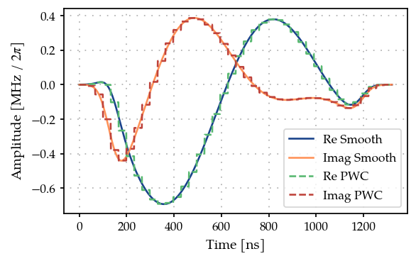
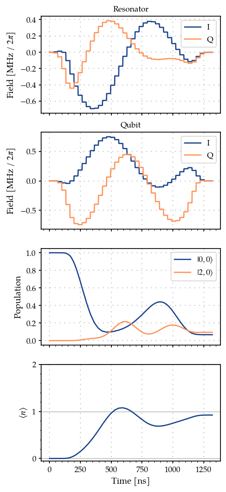
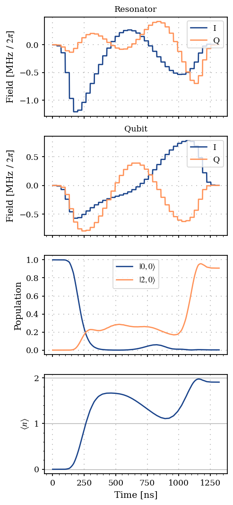
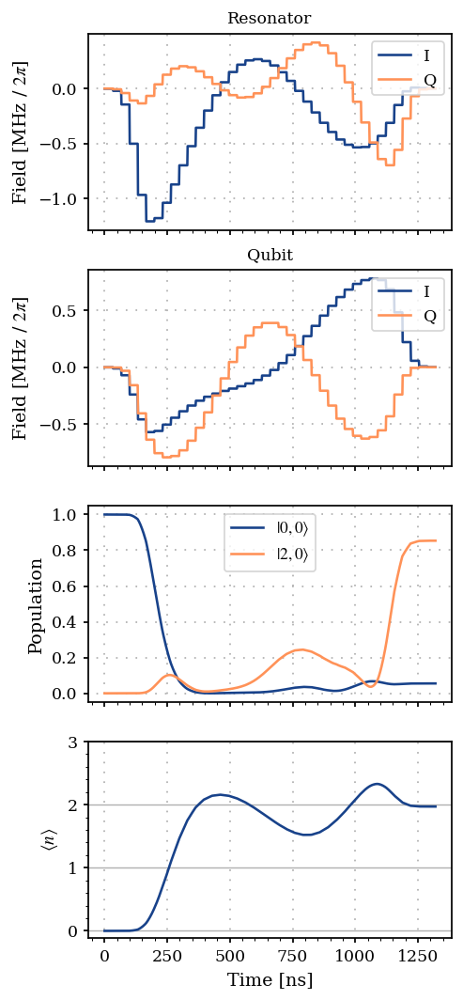
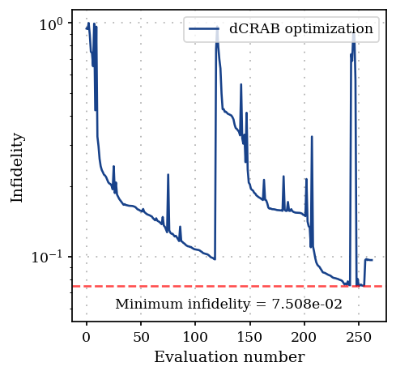
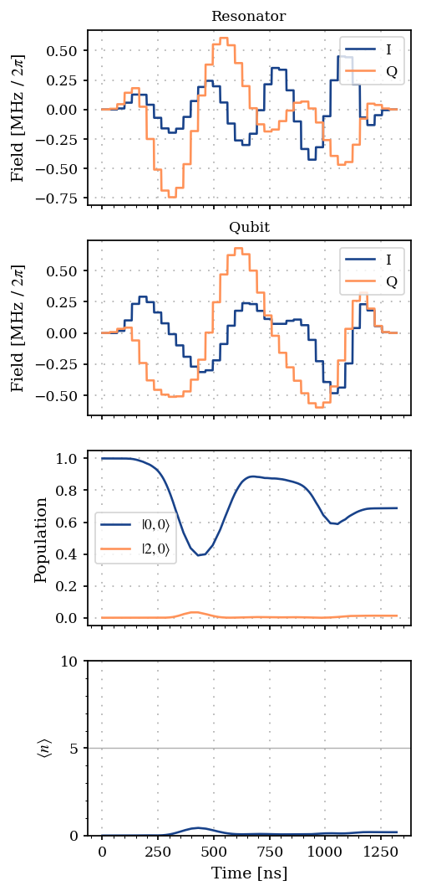
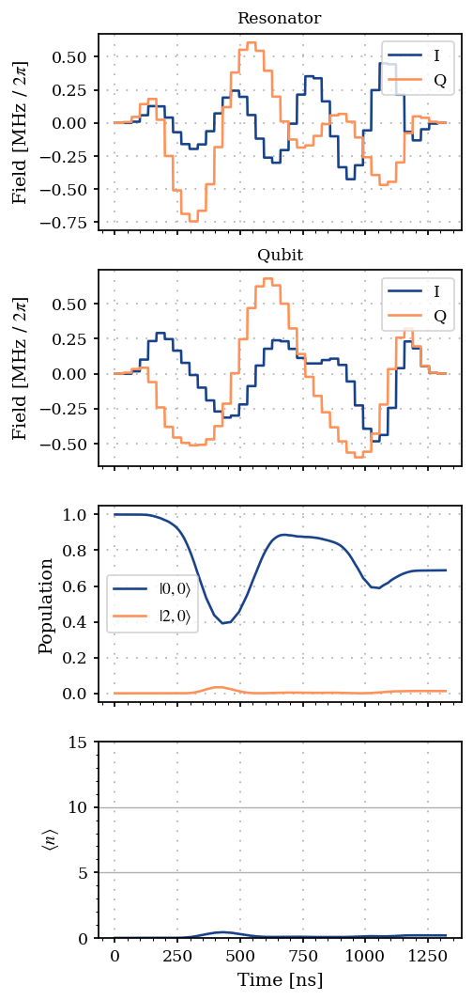
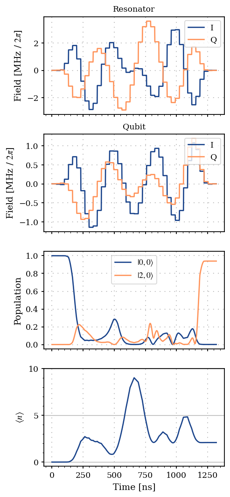
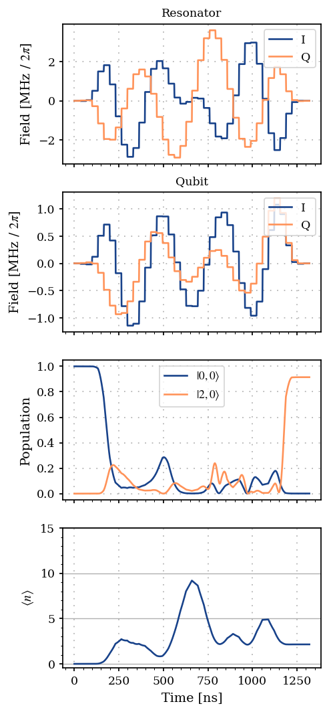
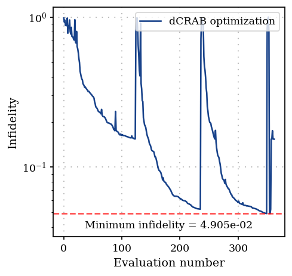

Arbitrary bosonic state preparation using smooth pulses: Gradient-based dCRAB optimization using GOAT over GRAPE method
=======================================================================================================================

In this example we solve the task in the previous example of preparing
an arbitrary bosonic state, but using smooth functions as the basis.
Here we perform a gradient-based dCRAB optimization, by using the
*GOAToverGRAPE* (combining GOAT (Machnes et al., 2018)
:cite:p:`machnes2018tunable` and GRAPE (Khaneja et al., 2005)
:cite:p:`khaneja2005optimal`) (or the GROUP (Sørensen et al., 2018)
:cite:p:`sorensen2018quantum`) method.

.. code:: ipython3

    import matplotlib.pyplot as plt
    import numpy as np
    
    from paraqeet.eom.schroedinger_equation import SchroedingerEquation
    from paraqeet.file_logger import FileLogger
    from paraqeet.hamiltonian.composite_hamiltonian import CompositeHamiltonian
    from paraqeet.hamiltonian.coupling import Coupling
    from paraqeet.hamiltonian.drive import Drive
    from paraqeet.hamiltonian.qubit import QubitHamiltonian
    from paraqeet.hamiltonian.resonator import ResonatorHamiltonian
    from paraqeet.measurement.goat_over_grape import GOATOverGRAPE
    from paraqeet.measurement.state_transfer_fidelity import StateTransferFidelityGRAPE
    from paraqeet.measurement.weighted_sum_goal import WeightedSumGoal
    from paraqeet.optimization_map import OptimizationMap
    from paraqeet.optimizers.dcrab_optimizer_gradient import DCRABOptimizerGradient
    from paraqeet.propagation import GRAPE, Expm
    from paraqeet.quantity import Quantity
    from paraqeet.signal.envelopes import DCRABEnvelope
    from paraqeet.signal.pwc_generator import PWCGenerator
    from paraqeet.signal.signal import FlatTopGaussianFilter

Following the dCRAB optimization (Müller et al., 2022)
:cite:p:`muller2022one`, we initialize our pulses in the frequency
domain by using the ``DCRABEnvelope``. Further, we use a flat-top
Gaussian filter on top to ensure that the pulses start and end at zero.
And we use a ``PWCGenerator`` to generate the piece-wise constant signal
required for the ``GOAToverGRAPE`` method.

.. code:: ipython3

    # in seconds (See Eickbusch et al https://arxiv.org/abs/2111.06414 S9 A)
    delta_sampling = 33e-9
    n_pwc = 40  # number of piecewise constants in the pulse
    t_final = n_pwc * delta_sampling  # for now just set up for trying
    tlist = np.linspace(0, t_final, n_pwc + 1)
    eps_res = 3 * np.pi * 1.0  # initial amplitude of the resonator (in MHz)
    eps_max_res = 5 * eps_res  # maximum amplitude of the resonator (in MHz)
    eps_qubit = 3 * np.pi * 1.0  # initial amplitude of the qubit (in MHz)
    eps_max_qubit = 5 * eps_qubit  # maximum amplitude of the resonator (in MHz)
    
    tone_res = DCRABEnvelope(
        num_components=2,
        max_frequency=2 * np.pi * 2.0,
        amplitude=Quantity(eps_res * 1e6, -eps_max_res * 1e6, eps_max_res * 1e6, name="Amplitude CRAB resonator"),
        t_final=Quantity(t_final, 1 / 2 * t_final, 2 * t_final, name="t_final CRAB resonator"),
        seed=46874,
    )
    
    smooth_tone_res = FlatTopGaussianFilter(
        envelopes=tone_res, t_final=Quantity(t_final, 1 / 2 * t_final, 2 * t_final, name="t_final")
    )
    
    tone_qubit = DCRABEnvelope(
        num_components=2,
        max_frequency=2 * np.pi * 2.0,
        amplitude=Quantity(eps_qubit * 1e6, -eps_max_qubit * 1e6, eps_max_qubit * 1e6, name="Amplitude CRAB qubit"),
        t_final=Quantity(t_final, 1 / 2 * t_final, 2 * t_final, name="t_final CRAB qubit"),
        seed=189841,
    )
    
    smooth_tone_qubit = FlatTopGaussianFilter(
        envelopes=tone_qubit, t_final=Quantity(t_final, 1 / 2 * t_final, 2 * t_final, name="t_final")
    )
    
    gen_res = PWCGenerator(envelopes=[smooth_tone_res], tlist=tlist, max_amplitude=2 * eps_max_res * 1e6)
    gen_qubit = PWCGenerator(envelopes=[smooth_tone_qubit], tlist=tlist, max_amplitude=2 * eps_max_qubit * 1e6)

Here we plot the resonator tone and compare it to its smooth version.
Similarly one can plot the qubit tone.

.. code:: ipython3

    from plotting import plot_signal
    
    ts = np.linspace(0, t_final, 1001)
    fig, ax = plt.subplots(1, figsize=(5, 3))
    
    plot_signal(smooth_tone_res, ts, ax, linestyle="-", label="Smooth")
    plot_signal(gen_res, ts, ax, linestyle="--", label="PWC")
    
    plt.legend()
    plt.show()

Like the previous example, we define qubit and resonator parameters, as
well as the list of different Fock truncation numbers. We also set the
target Fock state.

For now we set the Fock-state truncation at small values (3 and 4) for
testing the method. Later we demonstrate the method with (30 and 31)
levels in the resonator.

.. code:: ipython3

    # Increasing the number of Fock states gives a more realistic scenario, at the price of increasing the simulation time
    n_fock_truncation_list = [3, 4]
    fock_target = 2
    n_times = 1001
    
    omega_range_factor = 1e-3  # just for initialization of the Quantity object
    omega_res = 2 * np.pi * 5.26e9
    omega_qubit = 2 * np.pi * 6.65e9
    
    omega_drive_res = omega_res
    omega_drive_qubit = omega_qubit
    
    detuning_drive_res = omega_res - omega_drive_res
    detuning_drive_qubit = omega_qubit - omega_drive_qubit

Similar to the previous example, following (Heeres et al., 2017)
:cite:p:`heeres2017implementing`, we thus consider
:math:`N_{\mathrm{T}} \in \{N_{\mathrm{T}}^{(\mathrm{min})}, N_{\mathrm{T}}^{(\mathrm{min})} + 1, \dots, N_{\mathrm{T}}^{(\mathrm{max})} \}`,
and introduce a penalty when having different values of fidelities for
different truncation numbers. Thus, we create different systems, and
accordingly fidelity measures, for the different Fock truncation
numbers.

.. code:: ipython3

    from paraqeet.measurement.utils import overlap_state_vector
    from paraqeet.propagation.utils import grape_operator_sandwich_function_closed
    
    
    def create_experiment(n_fock_truncation_list, fock_target):
        """
        Create the initial and target states, for the given Fock numbers.
        Also create the propagations and measurements for the given truncation numbers and target Fock states.
        """
        resonator_list = []
        coupling_list = []
        model_list = []
        hamiltonian_list = []
        prop_list = []
        initial_state_list = []
        target_state_list = []
        fock_number_op_list = []
        dcrab_fid_list = []
    
        qubit_hamiltonian = QubitHamiltonian(
            frequency=Quantity(
                value=detuning_drive_qubit,
                min_value=-omega_range_factor * omega_qubit,
                max_value=omega_range_factor * omega_qubit,
            ),
            drives=[],
        )
    
        drive_qubit = Drive(qubit_hamiltonian.sigma_minus, gen_qubit, add_hermitian=True)
        qubit_hamiltonian.drives = [drive_qubit]
    
        ground_state_qubit = np.array([[0.0], [1.0]])
    
        # We take it to be 10 times the value in Eickbusch et al to speed up the simulation
        chi = 2 * np.pi * 32.81e3 * 10
    
        for n in n_fock_truncation_list:
            resonator_hamiltonian = ResonatorHamiltonian(
                frequency=Quantity(
                    value=detuning_drive_res,
                    min_value=-omega_range_factor * omega_res,
                    max_value=omega_range_factor * omega_res,
                ),
                num_fock=n,
                drives=[],
            )
    
            drive_res = Drive(resonator_hamiltonian.annihilation_op, gen_res, add_hermitian=True)
            resonator_hamiltonian.drives = [drive_res]
    
            resonator_list.append(resonator_hamiltonian)
            coupling_op = np.kron(resonator_hamiltonian.num_op, np.array([[1.0, 0.0], [0.0, -1.0]]))
            coupling = Coupling(
                coupling_op,
                g_abs=Quantity(value=chi, min_value=chi / 2, max_value=2 * chi),
            )
            coupling_list.append(coupling)
    
            coupling_list.append(coupling)
            ham = CompositeHamiltonian([resonator_hamiltonian, qubit_hamiltonian], [coupling])
            hamiltonian_list.append(ham)
            model = SchroedingerEquation(hamiltonian_func=ham.get_value, hamiltonian_gradient_func=ham.get_gradient)
            model_list.append(model)
    
            initial_res_state = np.zeros([n, 1], dtype=complex)
            initial_res_state[0, 0] = 1  # vacuum state
            initial_state = np.kron(initial_res_state, ground_state_qubit)
            initial_state_list.append(initial_state)
    
            target_res_state = np.zeros([n, 1], dtype=complex)
            target_res_state[fock_target, 0] = 1
            target_state = np.kron(target_res_state, ground_state_qubit)
            target_state_list.append(target_state)
    
            n_op = np.kron(np.diag([x for x in range(n)]), np.identity(2))
            fock_number_op_list.append(n_op)
    
            # Propagation dt has to be less than `delta_sampling = 33e-9`. Set dt = 30e-9.
            propagation = Expm(eom_func=model.get_value, resolution=1 / (30e-9), initial_state=initial_state)
            prop = GRAPE(
                propagation,
                eom_gradient_func=model.get_gradient,
                target_state=target_state,
                operator_sandwich_function=grape_operator_sandwich_function_closed,
                frechet_derivative=True
            )
    
            prop_list.append(prop)
    
            fid = StateTransferFidelityGRAPE(
                propagation_func=prop.get_value,
                propagation_gradient_func=prop.get_gradient,
                target_state=target_state,
                overlap=overlap_state_vector,
            )
            goat_over_grape_fid = GOATOverGRAPE(
                fid, generators=[gen_res, gen_qubit], propagation_resolution=propagation.resolution
            )
            dcrab_fid_list.append(goat_over_grape_fid)
    
        return initial_state_list, target_state_list, fock_number_op_list, prop_list, dcrab_fid_list
    
    
    initial_state_list, target_state_list, fock_number_op_list, prop_list, dcrab_meas_list = create_experiment(
        n_fock_truncation_list, fock_target
    )

We consider a cost function of the form

.. math::

   C(\varepsilon(t) ) = w_1 \sum_{N = N_{\mathrm{T}}^{(\mathrm{min})}}^{ N_{\mathrm{T}}^{(\mathrm{max})}} \mathcal{F}_{N} (\varepsilon(t) )   - \frac{w_2}{2} \sum_{N, N' = N_{\mathrm{T}}^{(\mathrm{min})}}^{ N_{\mathrm{T}}^{(\mathrm{max})}} \left[\mathcal{F}_{N}(\varepsilon(t))- \mathcal{F}_{N'} (\varepsilon(t) ) \right]^2,

that we want to maximize. This weighted cost function can be constructed
using the class WeightedSumGoal.

*Note - As we consider smooth pulses as our basis function, we do not
need to add additional smoothness cost to the goal function.*

.. code:: ipython3

    weights = np.array([1.0 for _ in range(len(dcrab_meas_list))])
    weight_sum_of_squares = -0.05
    total_sum_of_weights = np.sum(weights) + weight_sum_of_squares
    weights = weights / total_sum_of_weights
    weight_sum_of_squares = weight_sum_of_squares / total_sum_of_weights
    dcrab_meas_list_bool = [True for meas in dcrab_meas_list]
    sum_of_squares_options = {"weight": weight_sum_of_squares, "meas_bool": dcrab_meas_list_bool}
    
    dcrab_goal = WeightedSumGoal(dcrab_meas_list, weights, sum_of_squares_options=sum_of_squares_options)

We can plot the initial pulses, as well as the corresponding relevant
dynamics.

.. code:: ipython3

    def plot_states_and_fock_number(item=0):
        """Plot the states."""
        ts = np.linspace(0, t_final, n_times)
        states = prop_list[item].get_value(ts)
        sig_res = gen_res.get_value(ts)
        sig_qubit = gen_qubit.get_value(ts)
        pop_initial_state = (np.abs(initial_state_list[item].conj().T @ states) ** 2).flatten()
        pop_target_state = (np.abs(target_state_list[item].conj().T @ states) ** 2).flatten()
    
        pop_initial_state = (np.abs(initial_state_list[item].conj().T @ states) ** 2).flatten()
    
        n_fock_avg = np.zeros(n_times, dtype=float)
        for k in range(n_times):
            n_fock_avg[k] = np.real((states[k].conj().T @ fock_number_op_list[item] @ states[k])[0, 0])
    
        _, ax = plt.subplots(4, figsize=(4, 10), sharex=True)
        ax[0].plot(ts / 1e-9, np.real(sig_res) / 1e6 / (2 * np.pi), label="I")
        ax[0].plot(ts / 1e-9, np.imag(sig_res) / 1e6 / (2 * np.pi), label="Q")
        ax[0].legend(loc=1)
        ax[0].set_ylabel(r"Field [MHz / $2\pi$]")
        ax[0].set_title("Resonator")
        ax[0].grid(True, linestyle=(1, (1, 5)), linewidth=1)
    
        ax[1].plot(ts / 1e-9, np.real(sig_qubit) / 1e6 / (2 * np.pi), label="I")
        ax[1].plot(ts / 1e-9, np.imag(sig_qubit) / 1e6 / (2 * np.pi), label="Q")
        ax[1].legend(loc=1)
        ax[1].set_ylabel(r"Field [MHz / $2\pi$]")
        ax[1].set_title("Qubit")
        ax[1].grid(True, linestyle=(1, (1, 5)), linewidth=1)
    
        ax[2].plot(ts / 1e-9, pop_initial_state, label="$|0,0 \\rangle$")
        ax[2].plot(ts / 1e-9, pop_target_state, label="$|2, 0 \\rangle$")
        ax[2].legend(loc="best")
        ax[2].set_ylabel("Population")
        ax[2].grid(True, linestyle=(1, (1, 5)), linewidth=1)
    
        ax[3].plot(ts / 1e-9, n_fock_avg)
        ax[3].set_ylabel("$\\langle n \\rangle$")
        if n_fock_truncation_list[item] < 10:
            y_fock_ticks = np.arange(n_fock_truncation_list[item])
        else:
            y_fock_ticks = np.arange(n_fock_truncation_list[item])[::5]
        ax[3].set_yticks(y_fock_ticks)
        ax[3].grid(axis="y", which="major")
        ax[3].minorticks_on()
        ax[3].grid(True, axis="x", linestyle=(1, (1, 5)), linewidth=1)
    
        ax[-1].set_xlabel("Time [ns]")
        plt.show()
    
    
    plot_states_and_fock_number()

And we compute the fidelities for the different truncation numbers

.. code:: ipython3

    print(f"Fidelity at N_T={n_fock_truncation_list[0]} = {dcrab_meas_list[0].get_value(tlist)}")
    print(f"Fidelity at N_T={n_fock_truncation_list[1]} = {dcrab_meas_list[1].get_value(tlist)}")

.. parsed-literal::

    Fidelity at N_T=3 = 0.0006103008293939606

.. parsed-literal::

    Fidelity at N_T=4 = 0.10317446818272549

which are quite poor! We now proceed with the pulse optimization.

Let’s define the parameters we want to optimize. Since, in this case, we
want to optimize the smooth pulses, the parameters for the optmap would
be the parameters of the ``DCRABEnvelope`` tone.

.. code:: ipython3

    params_tone_qubit = tone_qubit.get_parameters()
    params_tone_res = tone_res.get_parameters()
    params_tone_qubit

.. parsed-literal::

    [Amplitude CRAB qubit: 9.42e+06,
     t_final CRAB qubit: 1.32e-06,
     CRAB Re coefficient 0: 0.742,
     CRAB Re coefficient 1: -0.875,
     CRAB Re frequency 0: 1.8 Hz x 2pi,
     CRAB Re frequency 1: 522 mHz x 2pi,
     CRAB Re Phase 0: 2.15 rad,
     CRAB Re Phase 1: 1.93 rad,
     CRAB Im coefficient 0: 0.632,
     CRAB Im coefficient 1: -0.163,
     CRAB Im frequency 0: 1.68 Hz x 2pi,
     CRAB Im frequency 1: 331 mHz x 2pi,
     CRAB Im Phase 0: 1.25 rad,
     CRAB Im Phase 1: -645 mrad]

Further, we can write the optimization progress into a log file, which
we can later use to plot the infidelity vs function evaluation.

.. code:: ipython3

    import tempfile
    
    temp_dir = tempfile.TemporaryDirectory(suffix="pq")  # Ends in 'pq' to prevent _ at the end
    print(f"Logging directory = {temp_dir.name}")
    
    max_iter = 200  # set to 1000 for a good result; set to 10 for a quick example
    optmap = OptimizationMap()
    optmap.add(tone_res)
    optmap.add(tone_qubit)
    
    # Remove the t_final and  DRAG Delta from optimization from drag tone resonator and qubit
    optmap.remove(tone_qubit, params_tone_qubit[1])
    optmap.remove(tone_res, params_tone_res[1])
    optmap.register_params_with_optimizables()
    
    file_logger = FileLogger(temp_dir.name)
    
    # Define the optimizer
    opt = DCRABOptimizerGradient(
        measure_and_gradient_func=dcrab_goal.get_value_and_gradient,
        optimization_map=optmap,
        super_iteration_every=100,
        max_super_iteration_num=2,
        print_every_iteration_num=50,
        super_iteration_tol=1e-6,
        seed=5648,
    )
    opt.set_options({"maxfun": max_iter, "workers": 32, "ftol": 1e-6})
    opt.logger = file_logger

.. parsed-literal::

    Logging directory = /tmp/tmp0wkrghzkpq

.. code:: ipython3

    optmap

.. parsed-literal::

    ==== <class 'paraqeet.signal.envelopes.DCRABEnvelope'> ====
    [Amplitude CRAB resonator: 9.42e+06, CRAB Re coefficient 0: 0.807, CRAB Re coefficient 1: -0.529, CRAB Re frequency 0: 1.51 Hz x 2pi, CRAB Re frequency 1: 916 mHz x 2pi, CRAB Re Phase 0: 780 mrad, CRAB Re Phase 1: -2.13 rad, CRAB Im coefficient 0: -0.614, CRAB Im coefficient 1: 0.803, CRAB Im frequency 0: 1.92 Hz x 2pi, CRAB Im frequency 1: 1.47 Hz x 2pi, CRAB Im Phase 0: -276 mrad, CRAB Im Phase 1: 1.86 rad]
    
    ==== <class 'paraqeet.signal.envelopes.DCRABEnvelope'> ====
    [Amplitude CRAB qubit: 9.42e+06, CRAB Re coefficient 0: 0.742, CRAB Re coefficient 1: -0.875, CRAB Re frequency 0: 1.8 Hz x 2pi, CRAB Re frequency 1: 522 mHz x 2pi, CRAB Re Phase 0: 2.15 rad, CRAB Re Phase 1: 1.93 rad, CRAB Im coefficient 0: 0.632, CRAB Im coefficient 1: -0.163, CRAB Im frequency 0: 1.68 Hz x 2pi, CRAB Im frequency 1: 331 mHz x 2pi, CRAB Im Phase 0: 1.25 rad, CRAB Im Phase 1: -645 mrad]

.. code:: ipython3

    %%time
    opt.optimize(gen_res.tlist)

.. parsed-literal::

    Iteration number = 0 	  Infidelity  = 8.910e-01

.. parsed-literal::

    Iteration number = 50 	  Infidelity  = 1.461e-01

.. parsed-literal::

    
    
    ==== Max iteration before a super-iteration reached ====
    ==== Starting super-iteration 1 ====
    *** Current lowest infidelity =  0.097 ***
    * Current no. of parameters = 50

.. parsed-literal::

    Iteration number = 100 	  Infidelity  = 7.001e-01

.. parsed-literal::

    Iteration number = 150 	  Infidelity  = 1.569e-01

.. parsed-literal::

    
    
    ==== Max iteration before a super-iteration reached ====
    ==== Starting super-iteration 2 ====
    *** Current lowest infidelity =  0.075 ***
    * Current no. of parameters = 74

.. parsed-literal::

    Iteration number = 200 	  Infidelity  = 5.691e-01

.. parsed-literal::

    Stopping the optimization or backtracking to previous best fidelity. Going to step with 50 parameters.

.. parsed-literal::

    Stopping the optimization or backtracking to previous best fidelity. Going to step with 26 parameters.

.. parsed-literal::

    Setting parameters to the best values.
    CPU times: user 12min 31s, sys: 9.96 s, total: 12min 41s
    Wall time: 8min 45s

.. parsed-literal::

    {'status': 2, 'value': 0.07508446913075884, 'iterations': 126, 'message': '`callback` raised `StopIteration`.'}

Let’s set the optimization to the best parameters obtained during the
run

.. code:: ipython3

    opt.set_parameters(opt.best_params)

.. parsed-literal::

    [Amplitude CRAB resonator: 2.9e+07,
     CRAB Re coefficient 0: 0.748,
     CRAB Re coefficient 1: -0.697,
     CRAB Re coefficient 2: -0.479,
     CRAB Re coefficient 3: 0.419,
     CRAB Re coefficient 4: 0,
     CRAB Re coefficient 5: 0,
     CRAB Re frequency 0: 1.62 Hz x 2pi,
     CRAB Re frequency 1: 413 mHz x 2pi,
     CRAB Re frequency 2: 896 mHz x 2pi,
     CRAB Re frequency 3: 1.46 Hz x 2pi,
     CRAB Re frequency 4: 1 Hz x 2pi,
     CRAB Re frequency 5: 1 Hz x 2pi,
     CRAB Re Phase 0: 3.06 rad,
     CRAB Re Phase 1: -2.61 rad,
     CRAB Re Phase 2: 2.86 rad,
     CRAB Re Phase 3: -1.81 rad,
     CRAB Re Phase 4: 0 rad,
     CRAB Re Phase 5: 0 rad,
     CRAB Im coefficient 0: -0.963,
     CRAB Im coefficient 1: 0.706,
     CRAB Im coefficient 2: -0.303,
     CRAB Im coefficient 3: -0.0563,
     CRAB Im coefficient 4: 0,
     CRAB Im coefficient 5: 0,
     CRAB Im frequency 0: 2 Hz x 2pi,
     CRAB Im frequency 1: 1.87 Hz x 2pi,
     CRAB Im frequency 2: 893 mHz x 2pi,
     CRAB Im frequency 3: 936 mHz x 2pi,
     CRAB Im frequency 4: 1 Hz x 2pi,
     CRAB Im frequency 5: 1 Hz x 2pi,
     CRAB Im Phase 0: 3.14 rad,
     CRAB Im Phase 1: 2.3 rad,
     CRAB Im phase 2: -2.45 rad,
     CRAB Im phase 3: -2.62 rad,
     CRAB Im phase 4: 0 rad,
     CRAB Im phase 5: 0 rad,
     Amplitude CRAB qubit: -3.16e+04,
     CRAB Re coefficient 0: 0.26,
     CRAB Re coefficient 1: -0.959,
     CRAB Re coefficient 2: -0.000688,
     CRAB Re coefficient 3: 0.427,
     CRAB Re coefficient 4: 0,
     CRAB Re coefficient 5: 0,
     CRAB Re frequency 0: 1.86 Hz x 2pi,
     CRAB Re frequency 1: 581 mHz x 2pi,
     CRAB Re frequency 2: 1.37 Hz x 2pi,
     CRAB Re frequency 3: 870 mHz x 2pi,
     CRAB Re frequency 4: 1 Hz x 2pi,
     CRAB Re frequency 5: 1 Hz x 2pi,
     CRAB Re Phase 0: 3.04 rad,
     CRAB Re Phase 1: -216 mrad,
     CRAB Re Phase 2: -2.03 rad,
     CRAB Re Phase 3: -1.16 rad,
     CRAB Re Phase 4: 0 rad,
     CRAB Re Phase 5: 0 rad,
     CRAB Im coefficient 0: 0.642,
     CRAB Im coefficient 1: -0.354,
     CRAB Im coefficient 2: 0.113,
     CRAB Im coefficient 3: 0.0487,
     CRAB Im coefficient 4: 0,
     CRAB Im coefficient 5: 0,
     CRAB Im frequency 0: 1.68 Hz x 2pi,
     CRAB Im frequency 1: 358 mHz x 2pi,
     CRAB Im frequency 2: 1 Hz x 2pi,
     CRAB Im frequency 3: 1.43 Hz x 2pi,
     CRAB Im frequency 4: 1 Hz x 2pi,
     CRAB Im frequency 5: 1 Hz x 2pi,
     CRAB Im Phase 0: 1.33 rad,
     CRAB Im Phase 1: -784 mrad,
     CRAB Im phase 2: -1.79 rad,
     CRAB Im phase 3: 96 mrad,
     CRAB Im phase 4: 0 rad,
     CRAB Im phase 5: 0 rad]

We can now plot the new pulses and the corresponding dynamics. If the
number of iterations (max_iter) is chosen to be large enough, we should
see an improvement.

.. code:: ipython3

    plot_states_and_fock_number()

We can also compare the dynamics with the higher truncation number.
Ideally, if the pulse amplitude is not high enough to produce artifacts
due to the truncation of Hilbert space, the dynamics in the two cases
should match each other. Else one needs to either reduce the pulse
amplitude or increase the truncation cutoff.

.. code:: ipython3

    plot_states_and_fock_number(1)

The new fidelities are

.. code:: ipython3

    print(f"Fidelity at N_T={n_fock_truncation_list[0]} = {dcrab_meas_list[0].get_value(tlist)}")
    print(f"Fidelity at N_T={n_fock_truncation_list[1]} = {dcrab_meas_list[1].get_value(tlist)}")

.. parsed-literal::

    Fidelity at N_T=3 = 0.8828638659501621

.. parsed-literal::

    Fidelity at N_T=4 = 0.9207933515387084

For this small truncation number the dynamics and fidelities do not
match very well. This indicates the need for higher truncation numbers,
which we demonstrate in the next section.

Finally, let’s plot the variation of infidelity with evaluation number.

.. code:: ipython3

    from plotting import plot_infidelity_vs_evaluation_from_logs
    
    plot_infidelity_vs_evaluation_from_logs(log_path=temp_dir.name + "/opt.log", label="dCRAB optimization")

.. parsed-literal::

    <Axes: xlabel='Evaluation number', ylabel='Infidelity'>

Setting truncation to higher value
----------------------------------

Here we set the truncation values to 15 and 20 levels and rerun the
entire simulation. For a more realistic simulation, we advise the reader
to increase the truncation to 30 and 31 levels.

*Note - The following takes about 15 minutes to run on an AMD-EPYC Milan
processor with 64 cores.*

We first reset the generator parameters (by redefining them), and
redefine the resonator with higher truncation numbers.

.. code:: ipython3

    # in seconds (See Eickbusch et al https://arxiv.org/abs/2111.06414 S9 A)
    delta_sampling = 33e-9
    n_pwc = 40  # number of piecewise constants in the pulse
    t_final = n_pwc * delta_sampling  # for now just set up for trying
    tlist = np.linspace(0, t_final, n_pwc + 1)
    eps_res = 3 * np.pi * 1.0  # initial amplitude of the resonator (in MHz)
    eps_max_res = 5 * eps_res  # maximum amplitude of the resonator (in MHz)
    eps_qubit = 3 * np.pi * 1.0  # initial amplitude of the qubit (in MHz)
    eps_max_qubit = 5 * eps_qubit  # maximum amplitude of the resonator (in MHz)
    
    tone_res = DCRABEnvelope(
        num_components=3,
        max_frequency=2 * np.pi * 5.0,
        amplitude=Quantity(eps_res * 1e6, -eps_max_res * 1e6, eps_max_res * 1e6, name="Amplitude CRAB resonator"),
        t_final=Quantity(t_final, 1 / 2 * t_final, 2 * t_final, name="t_final CRAB resonator"),
        seed=17619276394480986,
    )
    
    smooth_tone_res = FlatTopGaussianFilter(
        envelopes=tone_res, t_final=Quantity(t_final, 1 / 2 * t_final, 2 * t_final, name="t_final")
    )
    
    tone_qubit = DCRABEnvelope(
        num_components=3,
        max_frequency=2 * np.pi * 5.0,
        amplitude=Quantity(eps_qubit * 1e6, -eps_max_qubit * 1e6, eps_max_qubit * 1e6, name="Amplitude CRAB qubit"),
        t_final=Quantity(t_final, 1 / 2 * t_final, 2 * t_final, name="t_final CRAB qubit"),
        seed=17619276394849436,
    )
    
    smooth_tone_qubit = FlatTopGaussianFilter(
        envelopes=tone_qubit, t_final=Quantity(t_final, 1 / 2 * t_final, 2 * t_final, name="t_final")
    )
    
    gen_res = PWCGenerator(envelopes=[smooth_tone_res], tlist=tlist, max_amplitude=2 * eps_max_res * 1e6)
    gen_qubit = PWCGenerator(envelopes=[smooth_tone_qubit], tlist=tlist, max_amplitude=2 * eps_max_qubit * 71e6)

.. code:: ipython3

    # Increasing the number of Fock states gives a more realistic scenario, at the price of increasing the simulation time
    n_fock_truncation_list = [15, 20]
    fock_target = 2
    n_times = 1001
    
    omega_range_factor = 1e-3  # just for initialization of the Quantity object
    omega_res = 2 * np.pi * 5.26e9
    omega_qubit = 2 * np.pi * 6.65e9
    
    omega_drive_res = omega_res
    omega_drive_qubit = omega_qubit
    
    detuning_drive_res = omega_res - omega_drive_res
    detuning_drive_qubit = omega_qubit - omega_drive_qubit
    
    # Create a new experiment and redefine the measurement
    initial_state_list, target_state_list, fock_number_op_list, prop_list, dcrab_meas_list = create_experiment(
        n_fock_truncation_list, fock_target
    )
    
    weights = np.array([1.0 for _ in range(len(dcrab_meas_list))])
    weight_sum_of_squares = -0.05
    total_sum_of_weights = np.sum(weights) + weight_sum_of_squares
    weights = weights / total_sum_of_weights
    weight_sum_of_squares = weight_sum_of_squares / total_sum_of_weights
    dcrab_meas_list_bool = [True for meas in dcrab_meas_list]
    sum_of_squares_options = {"weight": weight_sum_of_squares, "meas_bool": dcrab_meas_list_bool}
    
    dcrab_goal = WeightedSumGoal(dcrab_meas_list, weights, sum_of_squares_options=sum_of_squares_options)

.. code:: ipython3

    plot_states_and_fock_number()

.. code:: ipython3

    plot_states_and_fock_number(1)

Initial fidelity before optimization

.. code:: ipython3

    print(f"Fidelity at N_T={n_fock_truncation_list[0]} = {dcrab_meas_list[0].get_value(tlist)}")
    print(f"Fidelity at N_T={n_fock_truncation_list[1]} = {dcrab_meas_list[1].get_value(tlist)}")

.. parsed-literal::

    Fidelity at N_T=15 = 0.012497050007113299

.. parsed-literal::

    Fidelity at N_T=20 = 0.012497050007113243

.. code:: ipython3

    tone_res.get_parameters()

.. parsed-literal::

    [Amplitude CRAB resonator: 9.42e+06,
     t_final CRAB resonator: 1.32e-06,
     CRAB Re coefficient 0: -0.218,
     CRAB Re coefficient 1: -0.711,
     CRAB Re coefficient 2: -0.223,
     CRAB Re frequency 0: 4.77 Hz x 2pi,
     CRAB Re frequency 1: 4.34 Hz x 2pi,
     CRAB Re frequency 2: 4.59 Hz x 2pi,
     CRAB Re Phase 0: 3 rad,
     CRAB Re Phase 1: 32.9 mrad,
     CRAB Re Phase 2: 2.61 rad,
     CRAB Im coefficient 0: -0.725,
     CRAB Im coefficient 1: -0.262,
     CRAB Im coefficient 2: 0.901,
     CRAB Im frequency 0: 3.33 Hz x 2pi,
     CRAB Im frequency 1: 3.18 Hz x 2pi,
     CRAB Im frequency 2: 1.97 Hz x 2pi,
     CRAB Im Phase 0: 1.29 rad,
     CRAB Im Phase 1: 1.45 rad,
     CRAB Im Phase 2: 378 mrad]

.. code:: ipython3

    tone_qubit.get_parameters()

.. parsed-literal::

    [Amplitude CRAB qubit: 9.42e+06,
     t_final CRAB qubit: 1.32e-06,
     CRAB Re coefficient 0: -0.693,
     CRAB Re coefficient 1: 0.833,
     CRAB Re coefficient 2: 0.687,
     CRAB Re frequency 0: 4.03 Hz x 2pi,
     CRAB Re frequency 1: 2.46 Hz x 2pi,
     CRAB Re frequency 2: 4.43 Hz x 2pi,
     CRAB Re Phase 0: -617 mrad,
     CRAB Re Phase 1: -2.14 rad,
     CRAB Re Phase 2: -1.32 rad,
     CRAB Im coefficient 0: -0.152,
     CRAB Im coefficient 1: -0.103,
     CRAB Im coefficient 2: 0.579,
     CRAB Im frequency 0: 2.09 Hz x 2pi,
     CRAB Im frequency 1: 4.5 Hz x 2pi,
     CRAB Im frequency 2: 2.08 Hz x 2pi,
     CRAB Im Phase 0: -2.22 rad,
     CRAB Im Phase 1: 3.02 rad,
     CRAB Im Phase 2: -103 mrad]

Redefine the optmap and the optimizer and rerun the optimization

.. code:: ipython3

    import tempfile
    
    temp_dir = tempfile.TemporaryDirectory(suffix="pq")  # Ends in 'pq' to prevent _ at the end
    print(f"Logging directory = {temp_dir.name}")
    
    max_iter = 300  # set to 1000 for a good result; set to 10 for a quick example
    optmap = OptimizationMap()
    optmap.add(tone_res)
    optmap.add(tone_qubit)
    
    # Remove the t_final and  DRAG Delta from optimization from drag tone resonator and qubit
    optmap.remove(tone_qubit, params_tone_qubit[1])
    optmap.remove(tone_res, params_tone_res[1])
    optmap.register_params_with_optimizables()
    
    file_logger = FileLogger(temp_dir.name)
    
    # Define the optimizer
    opt = DCRABOptimizerGradient(
        measure_and_gradient_func=dcrab_goal.get_value_and_gradient,
        optimization_map=optmap,
        super_iteration_every=100,
        max_super_iteration_num=3,  # Increase the number of super iterations for a better result
        print_every_iteration_num=10,
        super_iteration_tol=1e-6,
        seed=8647,
    )
    opt.set_options({"maxfun": max_iter, "workers": 32})
    opt.logger = file_logger

.. parsed-literal::

    Logging directory = /tmp/tmpk_0c0ic9pq

.. parsed-literal::

    Implicitly cleaning up <TemporaryDirectory '/tmp/tmp0wkrghzkpq'>

.. code:: ipython3

    %%time
    opt.optimize(gen_res.tlist)
    opt.set_parameters(opt.best_params)

.. parsed-literal::

    Iteration number = 0 	  Infidelity  = 8.764e-01

.. parsed-literal::

    Iteration number = 10 	  Infidelity  = 6.840e-01

.. parsed-literal::

    Iteration number = 20 	  Infidelity  = 3.873e-01

.. parsed-literal::

    Iteration number = 30 	  Infidelity  = 3.186e-01

.. parsed-literal::

    Iteration number = 40 	  Infidelity  = 2.724e-01

.. parsed-literal::

    Iteration number = 50 	  Infidelity  = 2.298e-01

.. parsed-literal::

    Iteration number = 60 	  Infidelity  = 2.004e-01

.. parsed-literal::

    Iteration number = 70 	  Infidelity  = 1.875e-01

.. parsed-literal::

    Iteration number = 80 	  Infidelity  = 1.638e-01

.. parsed-literal::

    Iteration number = 90 	  Infidelity  = 1.587e-01

.. parsed-literal::

    
    
    ==== Max iteration before a super-iteration reached ====
    ==== Starting super-iteration 1 ====
    *** Current lowest infidelity =  0.154 ***
    * Current no. of parameters = 74

.. parsed-literal::

    Iteration number = 100 	  Infidelity  = 6.450e-01

.. parsed-literal::

    Iteration number = 110 	  Infidelity  = 1.839e-01

.. parsed-literal::

    Iteration number = 120 	  Infidelity  = 1.301e-01

.. parsed-literal::

    Iteration number = 130 	  Infidelity  = 9.955e-02

.. parsed-literal::

    Iteration number = 140 	  Infidelity  = 8.004e-02

.. parsed-literal::

    Iteration number = 150 	  Infidelity  = 7.102e-02

.. parsed-literal::

    Iteration number = 160 	  Infidelity  = 6.391e-02

.. parsed-literal::

    Iteration number = 170 	  Infidelity  = 6.008e-02

.. parsed-literal::

    Iteration number = 180 	  Infidelity  = 5.694e-02

.. parsed-literal::

    Iteration number = 190 	  Infidelity  = 5.375e-02

.. parsed-literal::

    
    
    ==== Max iteration before a super-iteration reached ====
    ==== Starting super-iteration 2 ====
    *** Current lowest infidelity =  0.052 ***
    * Current no. of parameters = 110

.. parsed-literal::

    Iteration number = 200 	  Infidelity  = 5.479e-01

.. parsed-literal::

    Iteration number = 210 	  Infidelity  = 1.995e-01

.. parsed-literal::

    Iteration number = 220 	  Infidelity  = 1.341e-01

.. parsed-literal::

    Iteration number = 230 	  Infidelity  = 8.405e-02

.. parsed-literal::

    Iteration number = 240 	  Infidelity  = 7.021e-02

.. parsed-literal::

    Iteration number = 250 	  Infidelity  = 6.056e-02

.. parsed-literal::

    Iteration number = 260 	  Infidelity  = 5.680e-02

.. parsed-literal::

    Iteration number = 270 	  Infidelity  = 5.491e-02

.. parsed-literal::

    Iteration number = 280 	  Infidelity  = 5.285e-02

.. parsed-literal::

    Iteration number = 290 	  Infidelity  = 5.069e-02

.. parsed-literal::

    
    
    ==== Max iteration before a super-iteration reached ====
    ==== Starting super-iteration 3 ====
    *** Current lowest infidelity =  0.049 ***
    * Current no. of parameters = 146

.. parsed-literal::

    Iteration number = 300 	  Infidelity  = 8.026e-01

.. parsed-literal::

    Stopping the optimization or backtracking to previous best fidelity. Going to step with 110 parameters.

.. parsed-literal::

    Stopping the optimization or backtracking to previous best fidelity. Going to step with 74 parameters.

.. parsed-literal::

    Stopping the optimization or backtracking to previous best fidelity. Going to step with 38 parameters.

.. parsed-literal::

    Setting parameters to the best values.
    CPU times: user 11h 17min 30s, sys: 52.3 s, total: 11h 18min 22s
    Wall time: 15min 58s

.. parsed-literal::

    [Amplitude CRAB resonator: 4.71e+07,
     CRAB Re coefficient 0: 0.0375,
     CRAB Re coefficient 1: -0.765,
     CRAB Re coefficient 2: -0.0124,
     CRAB Re coefficient 3: -0.163,
     CRAB Re coefficient 4: -0.00554,
     CRAB Re coefficient 5: -0.833,
     CRAB Re coefficient 6: 0.071,
     CRAB Re coefficient 7: 0.133,
     CRAB Re coefficient 8: -0.0399,
     CRAB Re coefficient 9: 0,
     CRAB Re coefficient 10: 0,
     CRAB Re coefficient 11: 0,
     CRAB Re frequency 0: 4.94 Hz x 2pi,
     CRAB Re frequency 1: 4.79 Hz x 2pi,
     CRAB Re frequency 2: 4.56 Hz x 2pi,
     CRAB Re frequency 3: 3.42 Hz x 2pi,
     CRAB Re frequency 4: 1.94 Hz x 2pi,
     CRAB Re frequency 5: 3.01 Hz x 2pi,
     CRAB Re frequency 6: 1.59 Hz x 2pi,
     CRAB Re frequency 7: 1.13 Hz x 2pi,
     CRAB Re frequency 8: 556 mHz x 2pi,
     CRAB Re frequency 9: 2.5 Hz x 2pi,
     CRAB Re frequency 10: 2.5 Hz x 2pi,
     CRAB Re frequency 11: 2.5 Hz x 2pi,
     CRAB Re Phase 0: 3.11 rad,
     CRAB Re Phase 1: -850 mrad,
     CRAB Re Phase 2: 2.74 rad,
     CRAB Re Phase 3: -523 mrad,
     CRAB Re Phase 4: -1.01 rad,
     CRAB Re Phase 5: 1.77 rad,
     CRAB Re Phase 6: -1.8 rad,
     CRAB Re Phase 7: 2.8 rad,
     CRAB Re Phase 8: -1.75 rad,
     CRAB Re Phase 9: 0 rad,
     CRAB Re Phase 10: 0 rad,
     CRAB Re Phase 11: 0 rad,
     CRAB Im coefficient 0: -0.975,
     CRAB Im coefficient 1: -0.43,
     CRAB Im coefficient 2: 0.766,
     CRAB Im coefficient 3: 0.642,
     CRAB Im coefficient 4: 0.0292,
     CRAB Im coefficient 5: 0.145,
     CRAB Im coefficient 6: 0.25,
     CRAB Im coefficient 7: 0.0135,
     CRAB Im coefficient 8: -0.308,
     CRAB Im coefficient 9: 0,
     CRAB Im coefficient 10: 0,
     CRAB Im coefficient 11: 0,
     CRAB Im frequency 0: 3.41 Hz x 2pi,
     CRAB Im frequency 1: 3.52 Hz x 2pi,
     CRAB Im frequency 2: 1.47 Hz x 2pi,
     CRAB Im frequency 3: 2.94 Hz x 2pi,
     CRAB Im frequency 4: 4.97 Hz x 2pi,
     CRAB Im frequency 5: 3.66 Hz x 2pi,
     CRAB Im frequency 6: 3.65 Hz x 2pi,
     CRAB Im frequency 7: 3.78 Hz x 2pi,
     CRAB Im frequency 8: 3.13 Hz x 2pi,
     CRAB Im frequency 9: 2.5 Hz x 2pi,
     CRAB Im frequency 10: 2.5 Hz x 2pi,
     CRAB Im frequency 11: 2.5 Hz x 2pi,
     CRAB Im Phase 0: 3.14 rad,
     CRAB Im Phase 1: 2.9 rad,
     CRAB Im Phase 2: 427 mrad,
     CRAB Im phase 3: 1.8 rad,
     CRAB Im phase 4: 673 mrad,
     CRAB Im phase 5: -1.02 rad,
     CRAB Im phase 6: -1.25 rad,
     CRAB Im phase 7: 1.7 rad,
     CRAB Im phase 8: -1.85 rad,
     CRAB Im phase 9: 0 rad,
     CRAB Im phase 10: 0 rad,
     CRAB Im phase 11: 0 rad,
     Amplitude CRAB qubit: 2.89e+07,
     CRAB Re coefficient 0: -0.978,
     CRAB Re coefficient 1: 0.83,
     CRAB Re coefficient 2: 0.431,
     CRAB Re coefficient 3: 0.288,
     CRAB Re coefficient 4: -0.288,
     CRAB Re coefficient 5: 0.0787,
     CRAB Re coefficient 6: -0.129,
     CRAB Re coefficient 7: -0.22,
     CRAB Re coefficient 8: -0.0838,
     CRAB Re coefficient 9: 0,
     CRAB Re coefficient 10: 0,
     CRAB Re coefficient 11: 0,
     CRAB Re frequency 0: 3.99 Hz x 2pi,
     CRAB Re frequency 1: 4.01 Hz x 2pi,
     CRAB Re frequency 2: 4.41 Hz x 2pi,
     CRAB Re frequency 3: 4.96 Hz x 2pi,
     CRAB Re frequency 4: 1.23 Hz x 2pi,
     CRAB Re frequency 5: 4.21 Hz x 2pi,
     CRAB Re frequency 6: 3.49 Hz x 2pi,
     CRAB Re frequency 7: 1.73 Hz x 2pi,
     CRAB Re frequency 8: 3.4 Hz x 2pi,
     CRAB Re frequency 9: 2.5 Hz x 2pi,
     CRAB Re frequency 10: 2.5 Hz x 2pi,
     CRAB Re frequency 11: 2.5 Hz x 2pi,
     CRAB Re Phase 0: -437 mrad,
     CRAB Re Phase 1: -2.38 rad,
     CRAB Re Phase 2: 297 mrad,
     CRAB Re Phase 3: 2.44 rad,
     CRAB Re Phase 4: -2.35 rad,
     CRAB Re Phase 5: -3.14 rad,
     CRAB Re Phase 6: -1.11 rad,
     CRAB Re Phase 7: -1.14 rad,
     CRAB Re Phase 8: 2.54 rad,
     CRAB Re Phase 9: 0 rad,
     CRAB Re Phase 10: 0 rad,
     CRAB Re Phase 11: 0 rad,
     CRAB Im coefficient 0: -0.168,
     CRAB Im coefficient 1: 0.0385,
     CRAB Im coefficient 2: 0.76,
     CRAB Im coefficient 3: 0.269,
     CRAB Im coefficient 4: -0.06,
     CRAB Im coefficient 5: -0.314,
     CRAB Im coefficient 6: 0.384,
     CRAB Im coefficient 7: -0.104,
     CRAB Im coefficient 8: 0.392,
     CRAB Im coefficient 9: 0,
     CRAB Im coefficient 10: 0,
     CRAB Im coefficient 11: 0,
     CRAB Im frequency 0: 2.98 Hz x 2pi,
     CRAB Im frequency 1: 4.96 Hz x 2pi,
     CRAB Im frequency 2: 2.24 Hz x 2pi,
     CRAB Im frequency 3: 4.35 Hz x 2pi,
     CRAB Im frequency 4: 2.18 Hz x 2pi,
     CRAB Im frequency 5: 1.44 Hz x 2pi,
     CRAB Im frequency 6: 3.16 Hz x 2pi,
     CRAB Im frequency 7: 4.85 Hz x 2pi,
     CRAB Im frequency 8: 3.44 Hz x 2pi,
     CRAB Im frequency 9: 2.5 Hz x 2pi,
     CRAB Im frequency 10: 2.5 Hz x 2pi,
     CRAB Im frequency 11: 2.5 Hz x 2pi,
     CRAB Im Phase 0: -1.73 rad,
     CRAB Im Phase 1: 3.13 rad,
     CRAB Im Phase 2: 497 mrad,
     CRAB Im phase 3: 2.32 rad,
     CRAB Im phase 4: -1.32 rad,
     CRAB Im phase 5: 3.07 rad,
     CRAB Im phase 6: 1.32 rad,
     CRAB Im phase 7: 581 mrad,
     CRAB Im phase 8: -1.41 rad,
     CRAB Im phase 9: 0 rad,
     CRAB Im phase 10: 0 rad,
     CRAB Im phase 11: 0 rad]

And the new fidelities are

.. code:: ipython3

    print(f"Fidelity at N_T={n_fock_truncation_list[0]} = {dcrab_meas_list[0].get_value(tlist)}")
    print(f"Fidelity at N_T={n_fock_truncation_list[1]} = {dcrab_meas_list[1].get_value(tlist)}")

.. parsed-literal::

    Fidelity at N_T=15 = 0.9395932862303891

.. parsed-literal::

    Fidelity at N_T=20 = 0.9147987400410568

Here the dynamics and the fidelities are very similar to one another,
indicating no truncation artifacts.

Let’s plot the optimized pulses and dynamics

.. code:: ipython3

    plot_states_and_fock_number()

And verify that the dynamics with the higher truncation look the same

.. code:: ipython3

    plot_states_and_fock_number(1)

Finally, let’s plot the variation of infidelity with evaluation number.

.. code:: ipython3

    from plotting import plot_infidelity_vs_evaluation_from_logs
    
    plot_infidelity_vs_evaluation_from_logs(log_path=temp_dir.name + "/opt.log", label="dCRAB optimization")

.. parsed-literal::

    <Axes: xlabel='Evaluation number', ylabel='Infidelity'>

The sharp rise in infidelity represents the beginning of a
super-iteration

References
----------

- **(Sørensen et al., 2018)** J. J. W. H. Sørensen et al., “Quantum
  optimal control in a chopped basis: Applications in control of
  Bose-Einstein condensates,” *Physical Review A* **98**, 022119 (2018).
- **(Müller et al., 2022)** M. M. Müller et al., “One decade of quantum
  optimal control in the chopped random basis,” *Reports on Progress in
  Physics* **85**, 076001 (2022).
- **(Heeres et al., 2017)** R. W. Heeres et al., “Implementing a
  universal gate set on a logical qubit encoded in an oscillator,”
  *Nature Communications* **8**, 94 (2017).
- **(Khaneja et al., 2005)** N. Khaneja et al., “Optimal control of
  coupled spin dynamics: design of NMR pulse sequences by gradient
  ascent algorithms,” *Journal of Magnetic Resonance* **172**, 296–305
  (2005).
- **(Machnes et al., 2018)** S. Machnes et al., “Tunable, flexible, and
  efficient optimization of control pulses for practical qubits,”
  *Physical Review Letters* **120**, 150401 (2018).
