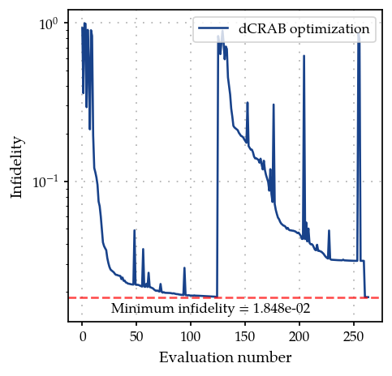
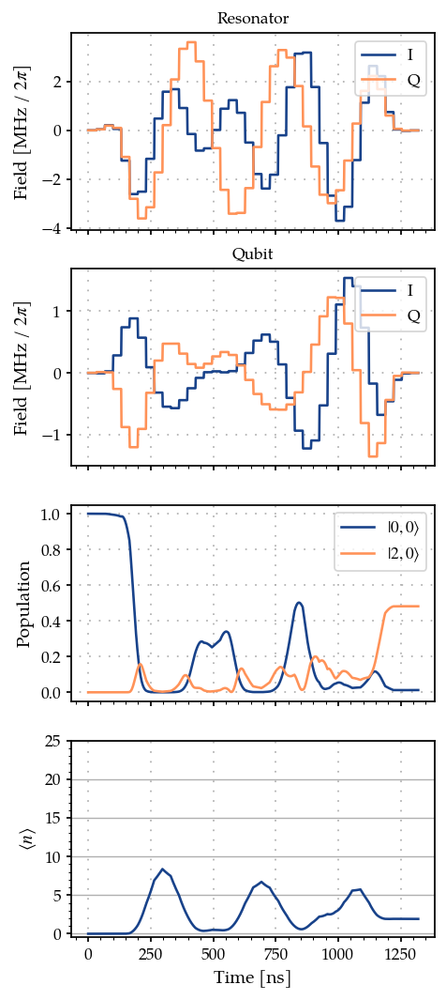
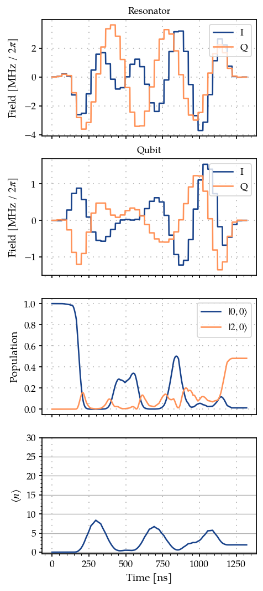
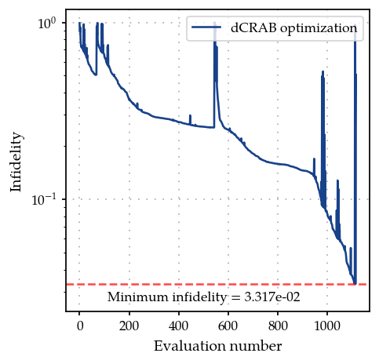

Arbitrary bosonic state preparation using smooth pulses : Gradient based dCRAB optimisation using GOAT over GRAPE method
========================================================================================================================

In this example we solve the task in the previous example of preparing
arbitrary bosonic state, but using smooth functions as the basis. Here
we perform a gradient based dCRAB optimisation, by using the
*GOAToverGRAPE* (or the GROUP [Sørensen2018]) method.

.. code:: ipython3

    import numpy as np
    import matplotlib.pyplot as plt
    
    from paraqeet.quantity import Quantity
    from paraqeet.model.resonator import Resonator
    from paraqeet.model.qubit import Qubit
    from paraqeet.model.coupling import Coupling
    from paraqeet.signal.envelopes import DCRABEnvelope
    from paraqeet.signal.pwc_generator import PWCGenerator
    from paraqeet.model.closed_system import ClosedSystem
    from paraqeet.model.rotating_frame_drive import RotatingFrameDrive
    from paraqeet.model.composite_hamiltonian import CompositeHamiltonian
    from paraqeet.measurement.state_transfer_fidelity import StateTransferFidelityGRAPE
    from paraqeet.measurement.weighted_sum_goal import WeightedSumGoal
    from paraqeet.propagation.scipy_expm_grape import ScipyExpmGRAPE
    from paraqeet.optimisation_map import OptimisationMap
    from paraqeet.measurement.goat_over_grape import GOATOverGRAPE
    from paraqeet.optimisers.dcrab_optimiser_gradient import DCRABOptimiserGradient
    from paraqeet.signal.waveform import FlatTopGaussianFilter
    from paraqeet.file_logger import FileLogger

Following the dCRAB optimization [Müller2022], we initialize our pulses
in the frequency domain by using the ``DCRABEnvelope``. Further we use a
flat-top Gaussian filter on top to ensure that the pulses start and end
at zero. And we use a ``PWCGenerator`` to generate the piece-wise
constant signal required for the ``GOAToverGRAPE`` method.

.. code:: ipython3

    # in seconds (See Eickbusch et al https://arxiv.org/abs/2111.06414 S9 A)
    delta_sampling = 33e-9
    n_pwc = 40  # number of piecewise constants in the pulse
    t_final = n_pwc * delta_sampling  # for now just set up for trying
    tlist = np.linspace(0, t_final, n_pwc + 1)
    eps_res = 3 * np.pi * 1.0  # initial amplitude of the resonator (in MHz)
    eps_max_res = 5 * eps_res  # maximum amplitude of the resonator (in MHz)
    eps_qubit = 3 * np.pi * 1.0  # initial amplitude of the qubit (in MHz)
    eps_max_qubit = 5 * eps_qubit  # maximum amplitude of the resonator (in MHz)
    
    tone_res = DCRABEnvelope(
        num_components=2,
        max_frequency=2 * np.pi * 2.0,
        amplitude=Quantity(eps_res * 1e6, -eps_max_res * 1e6, eps_max_res * 1e6, name="Amplitude CRAB resonator"),
        t_final=Quantity(t_final, 1 / 2 * t_final, 2 * t_final, name="t_final CRAB resonator"),
        seed=46874,
    )
    
    smooth_tone_res = FlatTopGaussianFilter(
        envelopes=tone_res, t_final=Quantity(t_final, 1 / 2 * t_final, 2 * t_final, name="t_final")
    )
    
    tone_qubit = DCRABEnvelope(
        num_components=2,
        max_frequency=2 * np.pi * 2.0,
        amplitude=Quantity(eps_qubit * 1e6, -eps_max_qubit * 1e6, eps_max_qubit * 1e6, name="Amplitude CRAB qubit"),
        t_final=Quantity(t_final, 1 / 2 * t_final, 2 * t_final, name="t_final CRAB qubit"),
        seed=189841,
    )
    
    smooth_tone_qubit = FlatTopGaussianFilter(
        envelopes=tone_qubit, t_final=Quantity(t_final, 1 / 2 * t_final, 2 * t_final, name="t_final")
    )
    
    gen_res = PWCGenerator(envelopes=[smooth_tone_res], tlist=tlist, max_amplitude=2 * eps_max_res * 1e6)
    gen_qubit = PWCGenerator(envelopes=[smooth_tone_qubit], tlist=tlist, max_amplitude=2 * eps_max_qubit * 1e6)

Here we plot the resonator tone and compare it to its smooth version.
Similarly one can plot the qubit tone.

.. code:: ipython3

    from paraqeet.plotting import plot_signal
    
    ts = np.linspace(0, t_final, 1001)
    fig, ax = plt.subplots(1, figsize=(5, 3))
    
    plot_signal(smooth_tone_res, ts, ax, linestyle="-", label="Smooth")
    plot_signal(gen_res, ts, ax, linestyle="--", label="PWC")
    
    plt.legend()
    plt.show()

.. image:: 08C_Bosonic_grape_with_smooth_pulses_files/08C_Bosonic_grape_with_smooth_pulses_5_0.png

Like the previous example, we define qubit and resonator parameters, as
well as the list of different Fock truncation numbers. We also set the
target Fock state.

For now we set the Fock-state truncation at small values (3 and 4) for
testing the method. Later we demonstrate the method with (30 and 31)
levels in the resonator.

.. code:: ipython3

    # Increasing the number of Fock states gives a more realistic scenario, at the price of increasing the simulation time
    n_fock_truncation_list = [3, 4]
    fock_target = 2
    n_times = 1001
    
    omega_range_factor = 1e-3  # just for initialization of the Quantity object
    omega_res = 2 * np.pi * 5.26e9
    omega_qubit = 2 * np.pi * 6.65e9
    
    omega_drive_res = omega_res
    omega_drive_qubit = omega_qubit
    
    detuning_drive_res = omega_res - omega_drive_res
    detuning_drive_qubit = omega_qubit - omega_drive_qubit
    
    drive_res = RotatingFrameDrive(gen_res)
    drive_qubit = RotatingFrameDrive(gen_qubit)

Similar to the previous example, following [Heeres2017], we thus
consider
:math:`N_{\mathrm{T}} \in \{N_{\mathrm{T}}^{(\mathrm{min})}, N_{\mathrm{T}}^{(\mathrm{min})} + 1, \dots, N_{\mathrm{T}}^{(\mathrm{max})} \}`,
and introduce a penalty when having different values of fidelities for
different truncation numbers. Thus, we create different systems, and
accordingly fidelity measures, for the different Fock truncation
numbers.

.. code:: ipython3

    def create_experiment(n_fock_truncation_list, fock_target):
        """
        Create the inital and target states, for the given Fock numbers.
        Also create the propagations and measurements for the given truncation numbers and target Fock states.
        """
        resonator_list = []
        coupling_list = []
        model_list = []
        hamiltonian_list = []
        prop_list = []
        initial_state_list = []
        target_state_list = []
        fock_number_op_list = []
        dcrab_fid_list = []
    
        qubit = Qubit(
            frequency=Quantity(
                value=detuning_drive_qubit,
                min_value=-omega_range_factor * omega_qubit,
                max_value=omega_range_factor * omega_qubit,
            ),
            drives=[drive_qubit],
        )
        ground_state_qubit = np.array([[0.0], [1.0]])
    
        # We take it to be 10 times the value in Eickbusch et al to speed up the simulation
        chi = 2 * np.pi * 32.81e3 * 10
    
        for n in n_fock_truncation_list:
            resonator = Resonator(
                frequency=Quantity(
                    value=detuning_drive_res,
                    min_value=-omega_range_factor * omega_res,
                    max_value=omega_range_factor * omega_res,
                ),
                dimension=n,
                drives=[drive_res],
            )
            resonator_list.append(resonator)
            coupling = Coupling(
                [resonator, qubit],
                is_longitudinal=True,
                coefficient=Quantity(value=chi, min_value=chi / 2, max_value=2 * chi),
            )
            coupling_list.append(coupling)
            ham = CompositeHamiltonian([resonator, qubit], [coupling])
            hamiltonian_list.append(ham)
            model = ClosedSystem(hamiltonian=ham)
            model_list.append(model)
            prop = ScipyExpmGRAPE(model, res=1e9)
    
            initial_res_state = np.zeros([n, 1], dtype=complex)
            initial_res_state[0, 0] = 1  # vacuum state
            initial_state = np.kron(initial_res_state, ground_state_qubit)
            initial_state_list.append(initial_state)
    
            target_res_state = np.zeros([n, 1], dtype=complex)
            target_res_state[fock_target, 0] = 1
            target_state = np.kron(target_res_state, ground_state_qubit)
            target_state_list.append(target_state)
    
            n_op = np.kron(np.diag([x for x in range(n)]), np.identity(2))
            fock_number_op_list.append(n_op)
    
            prop.set_initial_state(initial_state)
            prop.target_state = target_state
            prop.use_schirmer_derivative = True
    
            prop_list.append(prop)
    
            fid = StateTransferFidelityGRAPE(
                propagation=prop, initial_state=initial_state, target_state=target_state, times=tlist
            )
            goat_over_grape_fid = GOATOverGRAPE(fid, generators=[gen_res, gen_qubit], generators_order=[0, 1])
            dcrab_fid_list.append(goat_over_grape_fid)
    
        return initial_state_list, target_state_list, fock_number_op_list, prop_list, dcrab_fid_list
    
    
    initial_state_list, target_state_list, fock_number_op_list, prop_list, dcrab_meas_list = create_experiment(
        n_fock_truncation_list, fock_target
    )

We consider as cost function of the form

.. math::

   C(\varepsilon(t) ) = w_1 \sum_{N = N_{\mathrm{T}}^{(\mathrm{min})}}^{ N_{\mathrm{T}}^{(\mathrm{max})}} \mathcal{F}_{N} (\varepsilon(t) )   - \frac{w_2}{2} \sum_{N, N' = N_{\mathrm{T}}^{(\mathrm{min})}}^{ N_{\mathrm{T}}^{(\mathrm{max})}} \left[\mathcal{F}_{N}(\varepsilon(t))- \mathcal{F}_{N'} (\varepsilon(t) ) \right]^2,

that we want to maximize. This cost weighted cost function can be
constructed using the class WeightedSumGoal.

*Note - As we consider smooth pulses as our basis function, we do not
need to add additional smoothness cost to the goal function.*

.. code:: ipython3

    weights = np.array([1.0 for _ in range(len(dcrab_meas_list))])
    weight_sum_of_squares = -0.05
    total_sum_of_weights = np.sum(weights) + weight_sum_of_squares
    weights = weights / total_sum_of_weights
    weight_sum_of_squares = weight_sum_of_squares / total_sum_of_weights
    dcrab_meas_list_bool = [True for meas in dcrab_meas_list]
    sum_of_squares_options = {"weight": weight_sum_of_squares, "meas_bool": dcrab_meas_list_bool}
    
    dcrab_goal = WeightedSumGoal(dcrab_meas_list, weights, sum_of_squares_options=sum_of_squares_options)

We can plot the initial pulses, as well as the corresponding relevant
dynamics.

.. code:: ipython3

    def plot_states_and_fock_number(item=0):
        """Plot the states."""
        ts = np.linspace(0, t_final, n_times)
        states = prop_list[item].propagate(ts)
        sig_res = gen_res.generate_signal(ts)
        sig_qubit = gen_qubit.generate_signal(ts)
        pop_initial_state = (np.abs(initial_state_list[item].conj().T @ states) ** 2).flatten()
        pop_target_state = (np.abs(target_state_list[item].conj().T @ states) ** 2).flatten()
    
        pop_initial_state = (np.abs(initial_state_list[item].conj().T @ states) ** 2).flatten()
    
        n_fock_avg = np.zeros(n_times, dtype=float)
        for k in range(n_times):
            n_fock_avg[k] = np.real((states[k].conj().T @ fock_number_op_list[item] @ states[k])[0, 0])
    
        _, ax = plt.subplots(4, figsize=(4, 10), sharex=True)
        ax[0].plot(ts / 1e-9, np.real(sig_res) / 1e6 / (2 * np.pi), label="I")
        ax[0].plot(ts / 1e-9, np.imag(sig_res) / 1e6 / (2 * np.pi), label="Q")
        ax[0].legend(loc=1)
        ax[0].set_ylabel(r"Field [MHz / $2\pi$]")
        ax[0].set_title("Resonator")
        ax[0].grid(True, linestyle=(1, (1, 5)), linewidth=1)
    
        ax[1].plot(ts / 1e-9, np.real(sig_qubit) / 1e6 / (2 * np.pi), label="I")
        ax[1].plot(ts / 1e-9, np.imag(sig_qubit) / 1e6 / (2 * np.pi), label="Q")
        ax[1].legend(loc=1)
        ax[1].set_ylabel(r"Field [MHz / $2\pi$]")
        ax[1].set_title("Qubit")
        ax[1].grid(True, linestyle=(1, (1, 5)), linewidth=1)
    
        ax[2].plot(ts / 1e-9, pop_initial_state, label="$|0,0 \\rangle$")
        ax[2].plot(ts / 1e-9, pop_target_state, label="$|2, 0 \\rangle$")
        ax[2].legend(loc="best")
        ax[2].set_ylabel("Population")
        ax[2].grid(True, linestyle=(1, (1, 5)), linewidth=1)
    
        ax[3].plot(ts / 1e-9, n_fock_avg)
        ax[3].set_ylabel("$\\langle n \\rangle$")
        if n_fock_truncation_list[item] < 10:
            y_fock_ticks = np.arange(n_fock_truncation_list[item])
        else:
            y_fock_ticks = np.arange(n_fock_truncation_list[item])[::5]
        ax[3].set_yticks(y_fock_ticks)
        ax[3].grid(axis="y", which="major")
        ax[3].minorticks_on()
        ax[3].grid(True, axis="x", linestyle=(1, (1, 5)), linewidth=1)
    
        ax[-1].set_xlabel("Time [ns]")
        plt.show()
    
    
    plot_states_and_fock_number()

.. image:: 08C_Bosonic_grape_with_smooth_pulses_files/08C_Bosonic_grape_with_smooth_pulses_13_0.png

And we compute the fidelities for the different truncation numbers

.. code:: ipython3

    print(f"Fidelity at N_T={n_fock_truncation_list[0]} = {dcrab_meas_list[0].measure()}")
    print(f"Fidelity at N_T={n_fock_truncation_list[1]} = {dcrab_meas_list[1].measure()}")

.. parsed-literal::

    Fidelity at N_T=3 = 0.09507140546701529
    Fidelity at N_T=4 = 0.040546120929160566

which are quite poor! We now proceed with the pulse optimization.

Lets define the parameters we want to optimize. Since, in this case we
want to optimize the smooth pulses, the parameters for the optmap would
be the parameters of the ``DCRABEnvelope`` tone.

.. code:: ipython3

    params_tone_qubit = tone_qubit.get_parameters()
    params_tone_res = tone_res.get_parameters()
    params_tone_qubit

.. parsed-literal::

    [Amplitude CRAB qubit: 9.42e+06,
     t_final CRAB qubit: 1.32e-06,
     CRAB Re coefficient 0: 0.742,
     CRAB Re coefficient 1: -0.875,
     CRAB Re frequency 0: 1.8 Hz x 2pi,
     CRAB Re frequency 1: 522 mHz x 2pi,
     CRAB Re Phase 0: 342 mHz x 2pi,
     CRAB Re Phase 1: 307 mHz x 2pi,
     CRAB Im coefficient 0: 0.632,
     CRAB Im coefficient 1: -0.163,
     CRAB Im frequency 0: 1.68 Hz x 2pi,
     CRAB Im frequency 1: 331 mHz x 2pi,
     CRAB Im Phase 0: 199 mHz x 2pi,
     CRAB Im Phase 1: -103 mHz x 2pi]

Furhter, we can write the optmization progress into a log file, which we
can later use to plot the infidelity vs function evaluation.

.. code:: ipython3

    import tempfile
    
    temp_dir = tempfile.TemporaryDirectory()
    print(f"Logging directory = {temp_dir.name}")
    
    max_iter = 1000  # set to 1000 for a good result; set to 10 for a quick example
    optmap = OptimisationMap()
    optmap.add(tone_res)
    optmap.add(tone_qubit)
    
    # Remove the t_final and  DRAG Delta from optimisation from drag tone resonator and qubit
    optmap.remove(tone_qubit, params_tone_qubit[1])
    optmap.remove(tone_res, params_tone_res[1])
    optmap.register_params_with_optimisables()
    
    file_logger = FileLogger(temp_dir.name)
    
    # Define the optimiser
    opt = DCRABOptimiserGradient(
        dcrab_goal,
        optimisation_map=optmap,
        super_iteration_every=100,
        max_super_iteration_num=2,
        print_every_iteration_num=20,
        super_iteration_tol=1e-6,
        seed=5648,
    )
    opt.set_options({"maxfun": max_iter, "workers": 32})
    opt.logger = file_logger

.. parsed-literal::

    Logging directory = /tmp/tmpegrxx8m4

.. code:: ipython3

    optmap

.. parsed-literal::

    ==== <class 'paraqeet.signal.envelopes.DCRABEnvelope'> ====
    [Amplitude CRAB resonator: 9.42e+06, CRAB Re coefficient 0: 0.807, CRAB Re coefficient 1: -0.529, CRAB Re frequency 0: 1.51 Hz x 2pi, CRAB Re frequency 1: 916 mHz x 2pi, CRAB Re Phase 0: 124 mHz x 2pi, CRAB Re Phase 1: -339 mHz x 2pi, CRAB Im coefficient 0: -0.614, CRAB Im coefficient 1: 0.803, CRAB Im frequency 0: 1.92 Hz x 2pi, CRAB Im frequency 1: 1.47 Hz x 2pi, CRAB Im Phase 0: -44 mHz x 2pi, CRAB Im Phase 1: 297 mHz x 2pi]
    
    ==== <class 'paraqeet.signal.envelopes.DCRABEnvelope'> ====
    [Amplitude CRAB qubit: 9.42e+06, CRAB Re coefficient 0: 0.742, CRAB Re coefficient 1: -0.875, CRAB Re frequency 0: 1.8 Hz x 2pi, CRAB Re frequency 1: 522 mHz x 2pi, CRAB Re Phase 0: 342 mHz x 2pi, CRAB Re Phase 1: 307 mHz x 2pi, CRAB Im coefficient 0: 0.632, CRAB Im coefficient 1: -0.163, CRAB Im frequency 0: 1.68 Hz x 2pi, CRAB Im frequency 1: 331 mHz x 2pi, CRAB Im Phase 0: 199 mHz x 2pi, CRAB Im Phase 1: -103 mHz x 2pi]

.. code:: ipython3

    opt.optimise()

.. parsed-literal::

    scipy.optimize: The `disp` and `iprint` options of the L-BFGS-B solver are deprecated and will be removed in SciPy 1.18.0.

.. parsed-literal::

    Iteration number = 0 	  Infidelity  = 2.938e-01
    Iteration number = 20 	  Infidelity  = 2.689e-02
    Iteration number = 40 	  Infidelity  = 2.186e-02
    Iteration number = 60 	  Infidelity  = 1.965e-02
    Iteration number = 80 	  Infidelity  = 1.889e-02
    
    
    ==== Max iteration before a super-iteration reached ====
    ==== Starting super-iteration 1 ====
    *** Current lowest infidelity =  0.019 ***
    * Current no. of parameters = 50
    Iteration number = 100 	  Infidelity  = 7.398e-01
    Iteration number = 120 	  Infidelity  = 1.667e-01
    Iteration number = 140 	  Infidelity  = 5.887e-02
    Iteration number = 160 	  Infidelity  = 4.302e-02
    Iteration number = 180 	  Infidelity  = 3.177e-02
    
    
    ==== Max iteration before a super-iteration reached ====
    ==== Starting super-iteration 2 ====
    *** Current lowest infidelity =  0.019 ***
    * Current no. of parameters = 74
    Iteration number = 200 	  Infidelity  = 7.937e-01

.. parsed-literal::

    Stopping the optimisation or backtracking to previous best fidelity. Going to step with 50 parameters.
    Stopping the optimisation or backtracking to previous best fidelity. Going to step with 26 parameters.

.. parsed-literal::

    Setting parameters to the best values.

.. parsed-literal::

    {'status': 2, 'value': 0.01848404858601005, 'iterations': 129, 'message': '`callback` raised `StopIteration`.'}

Lets set the optimization to the best parameters obtained during the run

.. code:: ipython3

    opt.set_parameters(opt.best_params)

.. parsed-literal::

    [Amplitude CRAB resonator: 4.71e+07,
     CRAB Re coefficient 0: 0.638,
     CRAB Re coefficient 1: -0.752,
     CRAB Re coefficient 2: 0,
     CRAB Re coefficient 3: 0,
     CRAB Re coefficient 4: 0,
     CRAB Re coefficient 5: 0,
     CRAB Re frequency 0: 1.34 Hz x 2pi,
     CRAB Re frequency 1: 763 mHz x 2pi,
     CRAB Re frequency 2: 1 Hz x 2pi,
     CRAB Re frequency 3: 1 Hz x 2pi,
     CRAB Re frequency 4: 1 Hz x 2pi,
     CRAB Re frequency 5: 1 Hz x 2pi,
     CRAB Re Phase 0: 70.6 mHz x 2pi,
     CRAB Re Phase 1: -318 mHz x 2pi,
     CRAB Re Phase 2: 0 Hz x 2pi,
     CRAB Re Phase 3: 0 Hz x 2pi,
     CRAB Re Phase 4: 0 Hz x 2pi,
     CRAB Re Phase 5: 0 Hz x 2pi,
     CRAB Im coefficient 0: -0.418,
     CRAB Im coefficient 1: 0.941,
     CRAB Im coefficient 2: 0,
     CRAB Im coefficient 3: 0,
     CRAB Im coefficient 4: 0,
     CRAB Im coefficient 5: 0,
     CRAB Im frequency 0: 1.7 Hz x 2pi,
     CRAB Im frequency 1: 1.88 Hz x 2pi,
     CRAB Im frequency 2: 1 Hz x 2pi,
     CRAB Im frequency 3: 1 Hz x 2pi,
     CRAB Im frequency 4: 1 Hz x 2pi,
     CRAB Im frequency 5: 1 Hz x 2pi,
     CRAB Im Phase 0: -89.7 mHz x 2pi,
     CRAB Im Phase 1: 500 mHz x 2pi,
     CRAB Im phase 2: 0 Hz x 2pi,
     CRAB Im phase 3: 0 Hz x 2pi,
     CRAB Im phase 4: 0 Hz x 2pi,
     CRAB Im phase 5: 0 Hz x 2pi,
     Amplitude CRAB qubit: -4.32e+07,
     CRAB Re coefficient 0: 0.819,
     CRAB Re coefficient 1: -0.809,
     CRAB Re coefficient 2: 0,
     CRAB Re coefficient 3: 0,
     CRAB Re coefficient 4: 0,
     CRAB Re coefficient 5: 0,
     CRAB Re frequency 0: 1.68 Hz x 2pi,
     CRAB Re frequency 1: 995 mHz x 2pi,
     CRAB Re frequency 2: 1 Hz x 2pi,
     CRAB Re frequency 3: 1 Hz x 2pi,
     CRAB Re frequency 4: 1 Hz x 2pi,
     CRAB Re frequency 5: 1 Hz x 2pi,
     CRAB Re Phase 0: 386 mHz x 2pi,
     CRAB Re Phase 1: 473 mHz x 2pi,
     CRAB Re Phase 2: 0 Hz x 2pi,
     CRAB Re Phase 3: 0 Hz x 2pi,
     CRAB Re Phase 4: 0 Hz x 2pi,
     CRAB Re Phase 5: 0 Hz x 2pi,
     CRAB Im coefficient 0: 0.541,
     CRAB Im coefficient 1: -0.395,
     CRAB Im coefficient 2: 0,
     CRAB Im coefficient 3: 0,
     CRAB Im coefficient 4: 0,
     CRAB Im coefficient 5: 0,
     CRAB Im frequency 0: 1.86 Hz x 2pi,
     CRAB Im frequency 1: 702 mHz x 2pi,
     CRAB Im frequency 2: 1 Hz x 2pi,
     CRAB Im frequency 3: 1 Hz x 2pi,
     CRAB Im frequency 4: 1 Hz x 2pi,
     CRAB Im frequency 5: 1 Hz x 2pi,
     CRAB Im Phase 0: 155 mHz x 2pi,
     CRAB Im Phase 1: -12.5 mHz x 2pi,
     CRAB Im phase 2: 0 Hz x 2pi,
     CRAB Im phase 3: 0 Hz x 2pi,
     CRAB Im phase 4: 0 Hz x 2pi,
     CRAB Im phase 5: 0 Hz x 2pi]

We can now plot the new pulses and the corresponding dynamics. If the
number of iterations (max_iter) is chosen to be large enough, we should
see an improvement.

.. code:: ipython3

    plot_states_and_fock_number()

.. image:: 08C_Bosonic_grape_with_smooth_pulses_files/08C_Bosonic_grape_with_smooth_pulses_26_0.png

We can also compare the dynamics with the higher truncation number.
Ideally, if the pulse amplitude is not high enough to produce artifacts
due to the truncation of Hilbert space, the dyanmics in the two cases
should match each other. Else one needs to either reduce the pulse
amplitude or increase the truncation cutoff.

.. code:: ipython3

    plot_states_and_fock_number(1)

.. image:: 08C_Bosonic_grape_with_smooth_pulses_files/08C_Bosonic_grape_with_smooth_pulses_28_0.png

The new fidelities are

.. code:: ipython3

    print(f"Fidelity at N_T={n_fock_truncation_list[0]} = {dcrab_meas_list[0].measure()}")
    print(f"Fidelity at N_T={n_fock_truncation_list[1]} = {dcrab_meas_list[1].measure()}")

.. parsed-literal::

    Fidelity at N_T=3 = 0.9644227153981635
    Fidelity at N_T=4 = 0.9495444579862979

For this small truncation number the dynamics and fidelities do not
match very well. This indicates the need for higher truncation numbers,
which we demonstrate in the next section.

Finally, lets plot the variation of infidelity with evaluation number.

.. code:: ipython3

    from paraqeet.plotting import plot_infidelity_vs_evaluation_from_logs
    
    plot_infidelity_vs_evaluation_from_logs(log_path=temp_dir.name + "/opt.log", label="dCRAB optimization");

Setting trunction to higher value
---------------------------------

Here we set the truncation values to 30 and 31 levels for a more
realistic simualtion and rerun the entire simulation.

*Note - The following takes about 60 mins to run on an AMD-EPYC Milan
processor with 128 cores and 256GB RAM (might take more depending on the
number of CPU cores available).*

We first reset the generator parameters (by redefining them), and
redefine the resonator with higher truncation numbers.

.. code:: ipython3

    # in seconds (See Eickbusch et al https://arxiv.org/abs/2111.06414 S9 A)
    delta_sampling = 33e-9
    n_pwc = 40  # number of piecewise constants in the pulse
    t_final = n_pwc * delta_sampling  # for now just set up for trying
    tlist = np.linspace(0, t_final, n_pwc + 1)
    eps_res = 3 * np.pi * 1.0  # initial amplitude of the resonator (in MHz)
    eps_max_res = 5 * eps_res  # maximum amplitude of the resonator (in MHz)
    eps_qubit = 3 * np.pi * 1.0  # initial amplitude of the qubit (in MHz)
    eps_max_qubit = 5 * eps_qubit  # maximum amplitude of the resonator (in MHz)
    
    tone_res = DCRABEnvelope(
        num_components=3,
        max_frequency=2 * np.pi * 5.0,
        amplitude=Quantity(eps_res * 1e6, -eps_max_res * 1e6, eps_max_res * 1e6, name="Amplitude CRAB resonator"),
        t_final=Quantity(t_final, 1 / 2 * t_final, 2 * t_final, name="t_final CRAB resonator"),
        seed=17619276394480986,
    )
    
    smooth_tone_res = FlatTopGaussianFilter(
        envelopes=tone_res, t_final=Quantity(t_final, 1 / 2 * t_final, 2 * t_final, name="t_final")
    )
    
    tone_qubit = DCRABEnvelope(
        num_components=3,
        max_frequency=2 * np.pi * 5.0,
        amplitude=Quantity(eps_qubit * 1e6, -eps_max_qubit * 1e6, eps_max_qubit * 1e6, name="Amplitude CRAB qubit"),
        t_final=Quantity(t_final, 1 / 2 * t_final, 2 * t_final, name="t_final CRAB qubit"),
        seed=17619276394849436,
    )
    
    smooth_tone_qubit = FlatTopGaussianFilter(
        envelopes=tone_qubit, t_final=Quantity(t_final, 1 / 2 * t_final, 2 * t_final, name="t_final")
    )
    
    gen_res = PWCGenerator(envelopes=[smooth_tone_res], tlist=tlist, max_amplitude=2 * eps_max_res * 1e6)
    gen_qubit = PWCGenerator(envelopes=[smooth_tone_qubit], tlist=tlist, max_amplitude=2 * eps_max_qubit * 71e6)

.. code:: ipython3

    # Increasing the number of Fock states gives a more realistic scenario, at the price of increasing the simulation time
    n_fock_truncation_list = [30, 31]
    fock_target = 2
    n_times = 1001
    
    omega_range_factor = 1e-3  # just for initialization of the Quantity object
    omega_res = 2 * np.pi * 5.26e9
    omega_qubit = 2 * np.pi * 6.65e9
    
    omega_drive_res = omega_res
    omega_drive_qubit = omega_qubit
    
    detuning_drive_res = omega_res - omega_drive_res
    detuning_drive_qubit = omega_qubit - omega_drive_qubit
    
    drive_res = RotatingFrameDrive(gen_res)
    drive_qubit = RotatingFrameDrive(gen_qubit)
    
    
    # Create a new experiment and redefine the measurement
    initial_state_list, target_state_list, fock_number_op_list, prop_list, dcrab_meas_list = create_experiment(
        n_fock_truncation_list, fock_target
    )
    
    weights = np.array([1.0 for _ in range(len(dcrab_meas_list))])
    weight_sum_of_squares = -0.05
    total_sum_of_weights = np.sum(weights) + weight_sum_of_squares
    weights = weights / total_sum_of_weights
    weight_sum_of_squares = weight_sum_of_squares / total_sum_of_weights
    dcrab_meas_list_bool = [True for meas in dcrab_meas_list]
    sum_of_squares_options = {"weight": weight_sum_of_squares, "meas_bool": dcrab_meas_list_bool}
    
    dcrab_goal = WeightedSumGoal(dcrab_meas_list, weights, sum_of_squares_options=sum_of_squares_options)

.. code:: ipython3

    plot_states_and_fock_number()

.. image:: 08C_Bosonic_grape_with_smooth_pulses_files/08C_Bosonic_grape_with_smooth_pulses_37_0.png

.. code:: ipython3

    plot_states_and_fock_number(1)

.. image:: 08C_Bosonic_grape_with_smooth_pulses_files/08C_Bosonic_grape_with_smooth_pulses_38_0.png

Initial fidelity before optimization

.. code:: ipython3

    print(f"Fidelity at N_T={n_fock_truncation_list[0]} = {dcrab_meas_list[0].measure()}")
    print(f"Fidelity at N_T={n_fock_truncation_list[1]} = {dcrab_meas_list[1].measure()}")

.. parsed-literal::

    Fidelity at N_T=30 = 0.00809359027771987
    Fidelity at N_T=31 = 0.00809359027771987

.. code:: ipython3

    tone_res.get_parameters()

.. parsed-literal::

    [Amplitude CRAB resonator: 9.42e+06,
     t_final CRAB resonator: 1.32e-06,
     CRAB Re coefficient 0: -0.218,
     CRAB Re coefficient 1: -0.711,
     CRAB Re coefficient 2: -0.223,
     CRAB Re frequency 0: 4.77 Hz x 2pi,
     CRAB Re frequency 1: 4.34 Hz x 2pi,
     CRAB Re frequency 2: 4.59 Hz x 2pi,
     CRAB Re Phase 0: 478 mHz x 2pi,
     CRAB Re Phase 1: 5.23 mHz x 2pi,
     CRAB Re Phase 2: 415 mHz x 2pi,
     CRAB Im coefficient 0: -0.725,
     CRAB Im coefficient 1: -0.262,
     CRAB Im coefficient 2: 0.901,
     CRAB Im frequency 0: 3.33 Hz x 2pi,
     CRAB Im frequency 1: 3.18 Hz x 2pi,
     CRAB Im frequency 2: 1.97 Hz x 2pi,
     CRAB Im Phase 0: 205 mHz x 2pi,
     CRAB Im Phase 1: 230 mHz x 2pi,
     CRAB Im Phase 2: 60.2 mHz x 2pi]

.. code:: ipython3

    tone_qubit.get_parameters()

.. parsed-literal::

    [Amplitude CRAB qubit: 9.42e+06,
     t_final CRAB qubit: 1.32e-06,
     CRAB Re coefficient 0: -0.693,
     CRAB Re coefficient 1: 0.833,
     CRAB Re coefficient 2: 0.687,
     CRAB Re frequency 0: 4.03 Hz x 2pi,
     CRAB Re frequency 1: 2.46 Hz x 2pi,
     CRAB Re frequency 2: 4.43 Hz x 2pi,
     CRAB Re Phase 0: -98.2 mHz x 2pi,
     CRAB Re Phase 1: -341 mHz x 2pi,
     CRAB Re Phase 2: -211 mHz x 2pi,
     CRAB Im coefficient 0: -0.152,
     CRAB Im coefficient 1: -0.103,
     CRAB Im coefficient 2: 0.579,
     CRAB Im frequency 0: 2.09 Hz x 2pi,
     CRAB Im frequency 1: 4.5 Hz x 2pi,
     CRAB Im frequency 2: 2.08 Hz x 2pi,
     CRAB Im Phase 0: -353 mHz x 2pi,
     CRAB Im Phase 1: 481 mHz x 2pi,
     CRAB Im Phase 2: -16.3 mHz x 2pi]

Redefine the optmap and the optmizer and rerun the optimization

.. code:: ipython3

    import tempfile
    
    temp_dir = tempfile.TemporaryDirectory()
    print(f"Logging directory = {temp_dir.name}")
    
    max_iter = 1000  # set to 1000 for a good result; set to 10 for a quick example
    optmap = OptimisationMap()
    optmap.add(tone_res)
    optmap.add(tone_qubit)
    
    # Remove the t_final and  DRAG Delta from optimisation from drag tone resonator and qubit
    optmap.remove(tone_qubit, params_tone_qubit[1])
    optmap.remove(tone_res, params_tone_res[1])
    optmap.register_params_with_optimisables()
    
    file_logger = FileLogger(temp_dir.name)
    
    # Define the optimiser
    opt = DCRABOptimiserGradient(
        dcrab_goal,
        optimisation_map=optmap,
        super_iteration_every=500,
        max_super_iteration_num=3,
        print_every_iteration_num=10,
        super_iteration_tol=1e-6,
        seed=8647,
    )
    opt.set_options({"maxfun": max_iter, "workers": 32})
    opt.logger = file_logger

.. parsed-literal::

    Logging directory = /tmp/tmp154t4gmo

.. parsed-literal::

    Implicitly cleaning up <TemporaryDirectory '/tmp/tmpegrxx8m4'>

.. code:: ipython3

    opt.optimise()

.. parsed-literal::

    Iteration number = 0 	  Infidelity  = 9.040e-01
    Iteration number = 10 	  Infidelity  = 7.051e-01
    Iteration number = 20 	  Infidelity  = 6.287e-01
    Iteration number = 30 	  Infidelity  = 5.699e-01
    Iteration number = 40 	  Infidelity  = 5.296e-01
    Iteration number = 50 	  Infidelity  = 5.090e-01
    
    
    ==== Decrease in infidelity less than 1e-06 ====
    ==== Starting super-iteration 1 ====
    * Current lowest infidelity =  5.065e-01
    * Current no. of parameters = 74
    Iteration number = 60 	  Infidelity  = 7.309e-01
    Iteration number = 70 	  Infidelity  = 6.711e-01
    Iteration number = 80 	  Infidelity  = 5.943e-01
    Iteration number = 90 	  Infidelity  = 5.457e-01
    Iteration number = 100 	  Infidelity  = 5.092e-01
    Iteration number = 110 	  Infidelity  = 4.889e-01
    Iteration number = 120 	  Infidelity  = 4.637e-01
    Iteration number = 130 	  Infidelity  = 4.350e-01
    Iteration number = 140 	  Infidelity  = 4.204e-01
    Iteration number = 150 	  Infidelity  = 4.048e-01
    Iteration number = 160 	  Infidelity  = 3.780e-01
    Iteration number = 170 	  Infidelity  = 3.578e-01
    Iteration number = 180 	  Infidelity  = 3.425e-01
    Iteration number = 190 	  Infidelity  = 3.312e-01
    Iteration number = 200 	  Infidelity  = 3.212e-01
    Iteration number = 210 	  Infidelity  = 3.125e-01
    Iteration number = 220 	  Infidelity  = 3.087e-01
    Iteration number = 230 	  Infidelity  = 3.053e-01
    Iteration number = 240 	  Infidelity  = 3.000e-01
    Iteration number = 250 	  Infidelity  = 2.947e-01
    Iteration number = 260 	  Infidelity  = 2.914e-01
    Iteration number = 270 	  Infidelity  = 2.901e-01
    Iteration number = 280 	  Infidelity  = 2.883e-01
    Iteration number = 290 	  Infidelity  = 2.869e-01
    Iteration number = 300 	  Infidelity  = 2.853e-01
    Iteration number = 310 	  Infidelity  = 2.838e-01
    Iteration number = 320 	  Infidelity  = 2.810e-01
    Iteration number = 330 	  Infidelity  = 2.780e-01
    Iteration number = 340 	  Infidelity  = 2.747e-01
    Iteration number = 350 	  Infidelity  = 2.726e-01
    Iteration number = 360 	  Infidelity  = 2.692e-01
    Iteration number = 370 	  Infidelity  = 2.676e-01
    Iteration number = 380 	  Infidelity  = 2.656e-01
    Iteration number = 390 	  Infidelity  = 2.638e-01
    Iteration number = 400 	  Infidelity  = 2.612e-01
    Iteration number = 410 	  Infidelity  = 2.596e-01
    Iteration number = 420 	  Infidelity  = 2.583e-01
    Iteration number = 430 	  Infidelity  = 2.576e-01
    Iteration number = 440 	  Infidelity  = 2.570e-01
    Iteration number = 450 	  Infidelity  = 2.560e-01
    Iteration number = 460 	  Infidelity  = 2.550e-01
    Iteration number = 470 	  Infidelity  = 2.548e-01
    
    
    ==== Decrease in infidelity less than 1e-06 ====
    ==== Starting super-iteration 2 ====
    * Current lowest infidelity =  2.546e-01
    * Current no. of parameters = 110
    Iteration number = 480 	  Infidelity  = 5.692e-01
    Iteration number = 490 	  Infidelity  = 3.303e-01
    Iteration number = 500 	  Infidelity  = 2.757e-01
    Iteration number = 510 	  Infidelity  = 2.579e-01
    Iteration number = 520 	  Infidelity  = 2.504e-01
    Iteration number = 530 	  Infidelity  = 2.460e-01
    Iteration number = 540 	  Infidelity  = 2.377e-01
    Iteration number = 550 	  Infidelity  = 2.321e-01
    Iteration number = 560 	  Infidelity  = 2.226e-01
    Iteration number = 570 	  Infidelity  = 2.158e-01
    Iteration number = 580 	  Infidelity  = 2.081e-01
    Iteration number = 590 	  Infidelity  = 1.983e-01
    Iteration number = 600 	  Infidelity  = 1.909e-01
    Iteration number = 610 	  Infidelity  = 1.865e-01
    Iteration number = 620 	  Infidelity  = 1.815e-01
    Iteration number = 630 	  Infidelity  = 1.761e-01
    Iteration number = 640 	  Infidelity  = 1.737e-01
    Iteration number = 650 	  Infidelity  = 1.683e-01
    Iteration number = 660 	  Infidelity  = 1.655e-01
    Iteration number = 670 	  Infidelity  = 1.630e-01
    Iteration number = 680 	  Infidelity  = 1.616e-01
    Iteration number = 690 	  Infidelity  = 1.605e-01
    Iteration number = 700 	  Infidelity  = 1.594e-01
    Iteration number = 710 	  Infidelity  = 1.586e-01
    Iteration number = 720 	  Infidelity  = 1.578e-01
    Iteration number = 730 	  Infidelity  = 1.573e-01
    Iteration number = 740 	  Infidelity  = 1.564e-01
    Iteration number = 750 	  Infidelity  = 1.552e-01
    Iteration number = 760 	  Infidelity  = 1.534e-01
    Iteration number = 770 	  Infidelity  = 1.522e-01
    Iteration number = 780 	  Infidelity  = 1.507e-01
    Iteration number = 790 	  Infidelity  = 1.484e-01
    Iteration number = 800 	  Infidelity  = 1.461e-01
    Iteration number = 810 	  Infidelity  = 1.451e-01
    Iteration number = 820 	  Infidelity  = 1.441e-01
    Iteration number = 830 	  Infidelity  = 1.421e-01
    Iteration number = 840 	  Infidelity  = 1.381e-01
    Iteration number = 850 	  Infidelity  = 1.279e-01
    Iteration number = 860 	  Infidelity  = 1.138e-01
    Iteration number = 870 	  Infidelity  = 1.010e-01
    Iteration number = 880 	  Infidelity  = 8.504e-02
    Iteration number = 890 	  Infidelity  = 7.778e-02
    Iteration number = 900 	  Infidelity  = 6.981e-02
    Iteration number = 910 	  Infidelity  = 6.408e-02
    Iteration number = 920 	  Infidelity  = 5.855e-02
    Iteration number = 930 	  Infidelity  = 5.534e-02
    Iteration number = 940 	  Infidelity  = 5.077e-02
    Iteration number = 950 	  Infidelity  = 4.271e-02
    Iteration number = 960 	  Infidelity  = 3.868e-02
    Iteration number = 970 	  Infidelity  = 3.561e-02
    
    
    ==== Max iteration before a super-iteration reached ====
    ==== Starting super-iteration 3 ====
    *** Current lowest infidelity =  0.033 ***
    * Current no. of parameters = 146

.. parsed-literal::

    Stopping the optimisation or backtracking to previous best fidelity. Going to step with 110 parameters.
    Stopping the optimisation or backtracking to previous best fidelity. Going to step with 74 parameters.

.. parsed-literal::

    Iteration number = 980 	  Infidelity  = 2.546e-01

.. parsed-literal::

    Stopping the optimisation or backtracking to previous best fidelity. Going to step with 38 parameters.

.. parsed-literal::

    Setting parameters to the best values.

.. parsed-literal::

    {'status': 2, 'value': 0.03317484131350723, 'iterations': 70, 'message': '`callback` raised `StopIteration`.'}

Set parameters to current best values

.. code:: ipython3

    opt.set_parameters(opt.best_params)

.. parsed-literal::

    [Amplitude CRAB resonator: 4.71e+07,
     CRAB Re coefficient 0: 0.00911,
     CRAB Re coefficient 1: -0.172,
     CRAB Re coefficient 2: -0.0199,
     CRAB Re coefficient 3: -0.00569,
     CRAB Re coefficient 4: -1,
     CRAB Re coefficient 5: 0.0037,
     CRAB Re coefficient 6: 0.253,
     CRAB Re coefficient 7: -0.904,
     CRAB Re coefficient 8: -0.234,
     CRAB Re coefficient 9: 0,
     CRAB Re coefficient 10: 0,
     CRAB Re coefficient 11: 0,
     CRAB Re frequency 0: 4.81 Hz x 2pi,
     CRAB Re frequency 1: 2.42 Hz x 2pi,
     CRAB Re frequency 2: 4.71 Hz x 2pi,
     CRAB Re frequency 3: 4.75 Hz x 2pi,
     CRAB Re frequency 4: 1.93 Hz x 2pi,
     CRAB Re frequency 5: 4.69 Hz x 2pi,
     CRAB Re frequency 6: 3.6 Hz x 2pi,
     CRAB Re frequency 7: 1.94 Hz x 2pi,
     CRAB Re frequency 8: 3.47 Hz x 2pi,
     CRAB Re frequency 9: 2.5 Hz x 2pi,
     CRAB Re frequency 10: 2.5 Hz x 2pi,
     CRAB Re frequency 11: 2.5 Hz x 2pi,
     CRAB Re Phase 0: 499 mHz x 2pi,
     CRAB Re Phase 1: 500 mHz x 2pi,
     CRAB Re Phase 2: 498 mHz x 2pi,
     CRAB Re Phase 3: 491 mHz x 2pi,
     CRAB Re Phase 4: -222 mHz x 2pi,
     CRAB Re Phase 5: -442 mHz x 2pi,
     CRAB Re Phase 6: -213 mHz x 2pi,
     CRAB Re Phase 7: -238 mHz x 2pi,
     CRAB Re Phase 8: 333 mHz x 2pi,
     CRAB Re Phase 9: 0 Hz x 2pi,
     CRAB Re Phase 10: 0 Hz x 2pi,
     CRAB Re Phase 11: 0 Hz x 2pi,
     CRAB Im coefficient 0: -0.0288,
     CRAB Im coefficient 1: -0.415,
     CRAB Im coefficient 2: -0.0142,
     CRAB Im coefficient 3: 0.00796,
     CRAB Im coefficient 4: -0.55,
     CRAB Im coefficient 5: -0.985,
     CRAB Im coefficient 6: -0.000222,
     CRAB Im coefficient 7: 0.0207,
     CRAB Im coefficient 8: 0.0198,
     CRAB Im coefficient 9: 0,
     CRAB Im coefficient 10: 0,
     CRAB Im coefficient 11: 0,
     CRAB Im frequency 0: 3.07 Hz x 2pi,
     CRAB Im frequency 1: 4.18 Hz x 2pi,
     CRAB Im frequency 2: 4.95 Hz x 2pi,
     CRAB Im frequency 3: 4.97 Hz x 2pi,
     CRAB Im frequency 4: 2.12 Hz x 2pi,
     CRAB Im frequency 5: 1.36 Hz x 2pi,
     CRAB Im frequency 6: 4 Hz x 2pi,
     CRAB Im frequency 7: 4.97 Hz x 2pi,
     CRAB Im frequency 8: 3.94 Hz x 2pi,
     CRAB Im frequency 9: 2.5 Hz x 2pi,
     CRAB Im frequency 10: 2.5 Hz x 2pi,
     CRAB Im frequency 11: 2.5 Hz x 2pi,
     CRAB Im Phase 0: 500 mHz x 2pi,
     CRAB Im Phase 1: 241 mHz x 2pi,
     CRAB Im Phase 2: -187 mHz x 2pi,
     CRAB Im phase 3: 342 mHz x 2pi,
     CRAB Im phase 4: 92.6 mHz x 2pi,
     CRAB Im phase 5: 411 mHz x 2pi,
     CRAB Im phase 6: -6.39 mHz x 2pi,
     CRAB Im phase 7: 130 mHz x 2pi,
     CRAB Im phase 8: -66 mHz x 2pi,
     CRAB Im phase 9: 0 Hz x 2pi,
     CRAB Im phase 10: 0 Hz x 2pi,
     CRAB Im phase 11: 0 Hz x 2pi,
     Amplitude CRAB qubit: 4.36e+07,
     CRAB Re coefficient 0: -0.433,
     CRAB Re coefficient 1: 0.0102,
     CRAB Re coefficient 2: 0.0482,
     CRAB Re coefficient 3: -0.742,
     CRAB Re coefficient 4: -0.0313,
     CRAB Re coefficient 5: 0.188,
     CRAB Re coefficient 6: 0.974,
     CRAB Re coefficient 7: -0.133,
     CRAB Re coefficient 8: -0.458,
     CRAB Re coefficient 9: 0,
     CRAB Re coefficient 10: 0,
     CRAB Re coefficient 11: 0,
     CRAB Re frequency 0: 5 Hz x 2pi,
     CRAB Re frequency 1: 3.33 Hz x 2pi,
     CRAB Re frequency 2: 4.4 Hz x 2pi,
     CRAB Re frequency 3: 4.29 Hz x 2pi,
     CRAB Re frequency 4: 3.57 Hz x 2pi,
     CRAB Re frequency 5: 4.51 Hz x 2pi,
     CRAB Re frequency 6: 1.82 Hz x 2pi,
     CRAB Re frequency 7: 1.12 Hz x 2pi,
     CRAB Re frequency 8: 738 mHz x 2pi,
     CRAB Re frequency 9: 2.5 Hz x 2pi,
     CRAB Re frequency 10: 2.5 Hz x 2pi,
     CRAB Re frequency 11: 2.5 Hz x 2pi,
     CRAB Re Phase 0: 289 mHz x 2pi,
     CRAB Re Phase 1: -386 mHz x 2pi,
     CRAB Re Phase 2: -419 mHz x 2pi,
     CRAB Re Phase 3: 195 mHz x 2pi,
     CRAB Re Phase 4: -185 mHz x 2pi,
     CRAB Re Phase 5: 498 mHz x 2pi,
     CRAB Re Phase 6: -209 mHz x 2pi,
     CRAB Re Phase 7: 412 mHz x 2pi,
     CRAB Re Phase 8: -436 mHz x 2pi,
     CRAB Re Phase 9: 0 Hz x 2pi,
     CRAB Re Phase 10: 0 Hz x 2pi,
     CRAB Re Phase 11: 0 Hz x 2pi,
     CRAB Im coefficient 0: -0.529,
     CRAB Im coefficient 1: -0.237,
     CRAB Im coefficient 2: 0.717,
     CRAB Im coefficient 3: 0.446,
     CRAB Im coefficient 4: -0.648,
     CRAB Im coefficient 5: 0.418,
     CRAB Im coefficient 6: 0.672,
     CRAB Im coefficient 7: -0.136,
     CRAB Im coefficient 8: -0.199,
     CRAB Im coefficient 9: 0,
     CRAB Im coefficient 10: 0,
     CRAB Im coefficient 11: 0,
     CRAB Im frequency 0: 4.28 Hz x 2pi,
     CRAB Im frequency 1: 5 Hz x 2pi,
     CRAB Im frequency 2: 4.56 Hz x 2pi,
     CRAB Im frequency 3: 4.89 Hz x 2pi,
     CRAB Im frequency 4: 5 Hz x 2pi,
     CRAB Im frequency 5: 3.8 Hz x 2pi,
     CRAB Im frequency 6: 4.62 Hz x 2pi,
     CRAB Im frequency 7: 3.72 Hz x 2pi,
     CRAB Im frequency 8: 4.32 Hz x 2pi,
     CRAB Im frequency 9: 2.5 Hz x 2pi,
     CRAB Im frequency 10: 2.5 Hz x 2pi,
     CRAB Im frequency 11: 2.5 Hz x 2pi,
     CRAB Im Phase 0: -329 mHz x 2pi,
     CRAB Im Phase 1: 500 mHz x 2pi,
     CRAB Im Phase 2: -225 mHz x 2pi,
     CRAB Im phase 3: 388 mHz x 2pi,
     CRAB Im phase 4: 500 mHz x 2pi,
     CRAB Im phase 5: -292 mHz x 2pi,
     CRAB Im phase 6: -317 mHz x 2pi,
     CRAB Im phase 7: 226 mHz x 2pi,
     CRAB Im phase 8: -323 mHz x 2pi,
     CRAB Im phase 9: 0 Hz x 2pi,
     CRAB Im phase 10: 0 Hz x 2pi,
     CRAB Im phase 11: 0 Hz x 2pi]

And plot the optimised pulses and dyanmics

.. code:: ipython3

    plot_states_and_fock_number()

Also, verifying the dynamics with the higher truncation

.. code:: ipython3

    plot_states_and_fock_number(1)

And the new fidelities are

.. code:: ipython3

    print(f"Fidelity at N_T={n_fock_truncation_list[0]} = {dcrab_meas_list[0].measure()}")
    print(f"Fidelity at N_T={n_fock_truncation_list[1]} = {dcrab_meas_list[1].measure()}")

.. parsed-literal::

    Fidelity at N_T=30 = 0.9430470710184967
    Fidelity at N_T=31 = 0.9422620192354791

Here the dynamics and the fidelities are very similar to one another,
indicating no truncation artifacts.

Finally, lets plot the variation of infidelity with evaluation number.

.. code:: ipython3

    from paraqeet.plotting import plot_infidelity_vs_evaluation_from_logs
    
    plot_infidelity_vs_evaluation_from_logs(log_path=temp_dir.name + "/opt.log", label="dCRAB optimization");

The sharp rise infidelity represents the beginning of a super-iteration

References
----------

| [Sørensen2018]Sørensen, Jens Jakob WH, et al. “Quantum optimal control
  in a chopped basis: Applications in control of Bose-Einstein
  condensates.” Physical Review A 98.2 (2018): 022119.
| [Müller2022] Matthias M Müller et al “One decade of quantum optimal
  control in the chopped random basis”, Rep. Prog. Phys. 85 076001
  (2022)
| [Heeres2017] R. Heeres et al., “Implementing a universal gate set on a
  logical qubit encoded in an oscillator”, Nature Communications 8, 94
  (2017)
