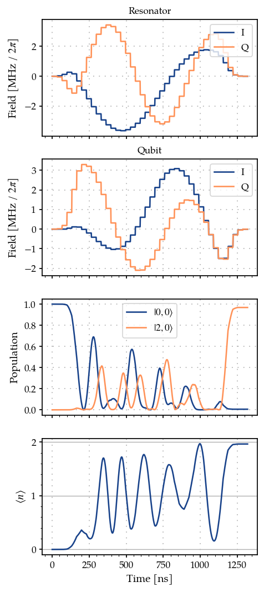
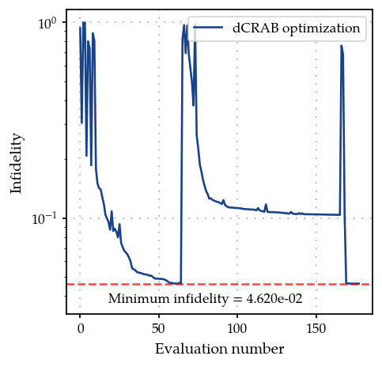

Arbitrary bosonic state preparation using smooth pulses : Gradient based dCRAB optimisation using GOAT over GRAPE method
========================================================================================================================

.. code:: ipython3

    import numpy as np
    import matplotlib.pyplot as plt
    
    from paraqeet.quantity import Quantity
    from paraqeet.model.resonator import Resonator
    from paraqeet.model.qubit import Qubit
    from paraqeet.model.coupling import Coupling
    from paraqeet.signal.envelopes import DCRABEnvelope
    from paraqeet.signal.pwc_generator import PWCGenerator
    from paraqeet.model.closed_system import ClosedSystem
    from paraqeet.model.rotating_frame_drive import RotatingFrameDrive
    from paraqeet.model.composite_hamiltonian import CompositeHamiltonian
    from paraqeet.measurement.state_transfer_fidelity import StateTransferFidelityGRAPE
    from paraqeet.measurement.weighted_sum_goal import WeightedSumGoal
    from paraqeet.propagation.scipy_expm_grape import ScipyExpmGRAPE
    from paraqeet.optimisation_map import OptimisationMap
    from paraqeet.measurement.goat_over_grape import GOATOverGRAPE
    from paraqeet.optimisers.dcrab_optimiser_gradient import DCRABOptimiserGradient
    from paraqeet.signal.waveform import FlatTopGaussianFilter
    from paraqeet.file_logger import FileLogger

We initialize our pulses in the frequency domain, following the dCRAB
optimization [Müller2022]. Further we use a flat-top Gaussian filter on
top to ensure that the pulses start and end at zero.

.. code:: ipython3

    # in seconds (See Eickbusch et al https://arxiv.org/abs/2111.06414 S9 A)
    delta_sampling = 33e-9
    n_pwc = 40  # number of piecewise constants in the pulse
    t_final = n_pwc * delta_sampling  # for now just set up for trying
    tlist = np.linspace(0, t_final, n_pwc + 1)
    eps_res = 3 * np.pi * 1.0  # initial amplitude of the resonator (in MHz)
    eps_max_res = 5 * eps_res  # maximum amplitude of the resonator (in MHz)
    eps_qubit = 3 * np.pi * 1.0  # initial amplitude of the qubit (in MHz)
    eps_max_qubit = 5 * eps_qubit  # maximum amplitude of the resonator (in MHz)
    
    tone_res = DCRABEnvelope(
        num_components=2,
        max_frequency=2 * np.pi * 2.0,
        amplitude=Quantity(eps_res * 1e6, -eps_max_res * 1e6, eps_max_res * 1e6, name="Amplitude CRAB resonator"),
        t_final=Quantity(t_final, 1 / 2 * t_final, 2 * t_final, name="t_final CRAB resonator"),
        seed=46874,
    )
    
    smooth_tone_res = FlatTopGaussianFilter(
        envelopes=tone_res, t_final=Quantity(t_final, 1 / 2 * t_final, 2 * t_final, name="t_final")
    )
    
    tone_qubit = DCRABEnvelope(
        num_components=2,
        max_frequency=2 * np.pi * 2.0,
        amplitude=Quantity(eps_qubit * 1e6, -eps_max_qubit * 1e6, eps_max_qubit * 1e6, name="Amplitude CRAB qubit"),
        t_final=Quantity(t_final, 1 / 2 * t_final, 2 * t_final, name="t_final CRAB qubit"),
        seed=189841,
    )
    
    smooth_tone_qubit = FlatTopGaussianFilter(
        envelopes=tone_qubit, t_final=Quantity(t_final, 1 / 2 * t_final, 2 * t_final, name="t_final")
    )
    
    gen_res = PWCGenerator(envelopes=[smooth_tone_res], tlist=tlist, max_amplitude=2 * eps_max_res * 1e6)
    gen_qubit = PWCGenerator(envelopes=[smooth_tone_qubit], tlist=tlist, max_amplitude=2 * eps_max_qubit * 1e6)

We plot the resonator tone and compare it to its smooth version.
Similarly one can plot the qubit tone.

.. code:: ipython3

    from paraqeet.plotting import plot_signal
    
    ts = np.linspace(0, t_final, 1001)
    fig, ax = plt.subplots(1, figsize=(5, 3))
    
    plot_signal(smooth_tone_res, ts, ax, linestyle="-", label="Smooth")
    plot_signal(gen_res, ts, ax, linestyle="--", label="PWC")
    
    plt.legend()
    plt.show()

.. image:: 08C_Bosonic_grape_with_smooth_pulses_files/08C_Bosonic_grape_with_smooth_pulses_5_0.png

Like the previous example, we define qubit and resonator parameters, as
well as the list of different Fock truncation numbers. We also set the
target Fock state.

For now we set the Fock-state truncation at small values (3 and 4) for
testing the method. Later we demonstrate the method with (30 and 31)
levels in the resonator.

.. code:: ipython3

    # Increasing the number of Fock states gives a more realistic scenario, at the price of increasing the simulation time
    n_fock_truncation_list = [3, 4]
    fock_target = 2
    n_times = 1001
    
    omega_range_factor = 1e-3  # just for initialization of the Quantity object
    omega_res = 2 * np.pi * 5.26e9
    omega_qubit = 2 * np.pi * 6.65e9
    
    omega_drive_res = omega_res
    omega_drive_qubit = omega_qubit
    
    detuning_drive_res = omega_res - omega_drive_res
    detuning_drive_qubit = omega_qubit - omega_drive_qubit
    
    drive_res = RotatingFrameDrive(gen_res)
    drive_qubit = RotatingFrameDrive(gen_qubit)

Due to the infinite-dimensional nature of the Hilbert space of the
resonator, it is necessary to introduce a Fock state truncation number
:math:`N_{\mathrm{T}}`. This creates the problem that given certain
pulses :math:`\mathcal{F}` depends on the choice of
:math:`N_{\mathrm{T}}`. Following [Heeres2017], we thus consider
:math:`N_{\mathrm{T}} \in \{N_{\mathrm{T}}^{(\mathrm{min})}, N_{\mathrm{T}}^{(\mathrm{min})} + 1, \dots, N_{\mathrm{T}}^{(\mathrm{max})} \}`,
and introduce a penalty when having different values of fidelities for
different truncation numbers. Thus, we create different systems, and
accordingly fidelity measures, for the different Fock truncation
numbers.

.. code:: ipython3

    def create_experiment(n_fock_truncation_list, fock_target):
        """
        Create the inital and target states, for the given Fock numbers.
        Also create the propagations and measurements for the given truncation numbers and target Fock states.
        """
        resonator_list = []
        coupling_list = []
        model_list = []
        hamiltonian_list = []
        prop_list = []
        initial_state_list = []
        target_state_list = []
        fock_number_op_list = []
        grape_fid_list = []
        dcrab_fid_list = []
    
        qubit = Qubit(
            frequency=Quantity(
                value=detuning_drive_qubit,
                min_value=-omega_range_factor * omega_qubit,
                max_value=omega_range_factor * omega_qubit,
            ),
            drives=[drive_qubit],
        )
        ground_state_qubit = np.array([[0.0], [1.0]])
    
        # We take it to be 10 times the value in Eickbusch et al to speed up the simulation
        chi = 2 * np.pi * 32.81e3 * 10
    
        for n in n_fock_truncation_list:
            resonator = Resonator(
                frequency=Quantity(
                    value=detuning_drive_res,
                    min_value=-omega_range_factor * omega_res,
                    max_value=omega_range_factor * omega_res,
                ),
                dimension=n,
                drives=[drive_res],
            )
            resonator_list.append(resonator)
            coupling = Coupling(
                [resonator, qubit],
                is_longitudinal=True,
                coefficient=Quantity(value=chi, min_value=chi / 2, max_value=2 * chi),
            )
            coupling_list.append(coupling)
            ham = CompositeHamiltonian([resonator, qubit], [coupling])
            hamiltonian_list.append(ham)
            model = ClosedSystem(hamiltonian=ham)
            model_list.append(model)
            prop = ScipyExpmGRAPE(model, res=1e9)
    
            initial_res_state = np.zeros([n, 1], dtype=complex)
            initial_res_state[0, 0] = 1  # vacuum state
            initial_state = np.kron(initial_res_state, ground_state_qubit)
            initial_state_list.append(initial_state)
    
            target_res_state = np.zeros([n, 1], dtype=complex)
            target_res_state[fock_target, 0] = 1
            target_state = np.kron(target_res_state, ground_state_qubit)
            target_state_list.append(target_state)
    
            n_op = np.kron(np.diag([x for x in range(n)]), np.identity(2))
            fock_number_op_list.append(n_op)
    
            prop.set_initial_state(initial_state)
            prop.target_state = target_state
            prop.use_schirmer_derivative = True
    
            prop_list.append(prop)
    
            fid = StateTransferFidelityGRAPE(
                propagation=prop, initial_state=initial_state, target_state=target_state, times=tlist
            )
            grape_fid_list.append(fid)
    
            goat_over_grape_fid = GOATOverGRAPE(fid, generators=[gen_res, gen_qubit], generators_order=[0, 1])
            dcrab_fid_list.append(goat_over_grape_fid)
    
        return initial_state_list, target_state_list, fock_number_op_list, prop_list, grape_fid_list, dcrab_fid_list
    
    
    initial_state_list, target_state_list, fock_number_op_list, prop_list, grape_meas_list, dcrab_meas_list = (
        create_experiment(n_fock_truncation_list, fock_target)
    )

We consider as cost function of the form

.. math::

   C(\varepsilon(t) ) = w_1 \sum_{N = N_{\mathrm{T}}^{(\mathrm{min})}}^{ N_{\mathrm{T}}^{(\mathrm{max})}} \mathcal{F}_{N} (\varepsilon(t) )   - \frac{w_2}{2} \sum_{N, N' = N_{\mathrm{T}}^{(\mathrm{min})}}^{ N_{\mathrm{T}}^{(\mathrm{max})}} \left[\mathcal{F}_{N}(\varepsilon(t))- \mathcal{F}_{N'} (\varepsilon(t) ) \right]^2,

that we want to maximize. This cost weighted cost function can be
constructed using the class WeightedSumGoal.

*Note - As we consider optimization of smooth pulses, we do not need to
add the smoothness cost.*

.. code:: ipython3

    weights = np.array([0.5 for _ in range(len(dcrab_meas_list))])
    weight_sum_of_squares = 0.0
    total_sum_of_weights = np.sum(weights) + weight_sum_of_squares
    weights = weights / total_sum_of_weights
    weight_sum_of_squares = weight_sum_of_squares / total_sum_of_weights
    dcrab_meas_list_bool = [True for meas in dcrab_meas_list]
    sum_of_squares_options = {"weight": weight_sum_of_squares, "meas_bool": dcrab_meas_list_bool}
    
    dcrab_goal = WeightedSumGoal(dcrab_meas_list, weights, sum_of_squares_options=sum_of_squares_options)

We can plot the initial pulses, as well as the corresponding relevant
dynamics.

.. code:: ipython3

    def plot_states_and_fock_number(item=0):
        """Plot the states."""
        ts = np.linspace(0, t_final, n_times)
        states = prop_list[item].propagate(ts)
        sig_res = gen_res.generate_signal(ts)
        sig_qubit = gen_qubit.generate_signal(ts)
        pop_initial_state = (np.abs(initial_state_list[item].conj().T @ states) ** 2).flatten()
        pop_target_state = (np.abs(target_state_list[item].conj().T @ states) ** 2).flatten()
    
        pop_initial_state = (np.abs(initial_state_list[item].conj().T @ states) ** 2).flatten()
    
        n_fock_avg = np.zeros(n_times, dtype=float)
        for k in range(n_times):
            n_fock_avg[k] = np.real((states[k].conj().T @ fock_number_op_list[item] @ states[k])[0, 0])
    
        _, ax = plt.subplots(4, figsize=(4, 10), sharex=True)
        ax[0].plot(ts / 1e-9, np.real(sig_res) / 1e6 / (2 * np.pi), label="I")
        ax[0].plot(ts / 1e-9, np.imag(sig_res) / 1e6 / (2 * np.pi), label="Q")
        ax[0].legend(loc=1)
        ax[0].set_ylabel(r"Field [MHz / $2\pi$]")
        ax[0].set_title("Resonator")
        ax[0].grid(True, linestyle=(1, (1, 5)), linewidth=1)
    
        ax[1].plot(ts / 1e-9, np.real(sig_qubit) / 1e6 / (2 * np.pi), label="I")
        ax[1].plot(ts / 1e-9, np.imag(sig_qubit) / 1e6 / (2 * np.pi), label="Q")
        ax[1].legend(loc=1)
        ax[1].set_ylabel(r"Field [MHz / $2\pi$]")
        ax[1].set_title("Qubit")
        ax[1].grid(True, linestyle=(1, (1, 5)), linewidth=1)
    
        ax[2].plot(ts / 1e-9, pop_initial_state, label="$|0,0 \\rangle$")
        ax[2].plot(ts / 1e-9, pop_target_state, label="$|2, 0 \\rangle$")
        ax[2].legend(loc="best")
        ax[2].set_ylabel("Population")
        ax[2].grid(True, linestyle=(1, (1, 5)), linewidth=1)
    
        ax[3].plot(ts / 1e-9, n_fock_avg)
        ax[3].set_ylabel("$\\langle n \\rangle$")
        if n_fock_truncation_list[item] < 10:
            y_fock_ticks = np.arange(n_fock_truncation_list[item])
        else:
            y_fock_ticks = np.arange(n_fock_truncation_list[item])[::5]
        ax[3].set_yticks(y_fock_ticks)
        ax[3].grid(axis="y", which="major")
        ax[3].minorticks_on()
        ax[3].grid(True, axis="x", linestyle=(1, (1, 5)), linewidth=1)
    
        ax[-1].set_xlabel("Time [ns]")
        plt.show()
    
    
    plot_states_and_fock_number()

.. image:: 08C_Bosonic_grape_with_smooth_pulses_files/08C_Bosonic_grape_with_smooth_pulses_13_0.png

We can compute the fidelities for the different truncation numbers

.. code:: ipython3

    print(f"Fidelity at N_T={n_fock_truncation_list[0]} = {dcrab_meas_list[0].measure()}")
    print(f"Fidelity at N_T={n_fock_truncation_list[1]} = {dcrab_meas_list[1].measure()}")

.. parsed-literal::

    Fidelity at N_T=3 = 0.09507140546701529
    Fidelity at N_T=4 = 0.040546120929160566

.. code:: ipython3

    params_tone_qubit = tone_qubit.get_parameters()
    params_tone_res = tone_res.get_parameters()
    params_tone_qubit

.. parsed-literal::

    [Amplitude CRAB qubit: 9.42e+06,
     t_final CRAB qubit: 1.32e-06,
     CRAB Re coefficient 0: 0.742,
     CRAB Re coefficient 1: -0.875,
     CRAB Re frequency 0: 1.8 Hz x 2pi,
     CRAB Re frequency 1: 522 mHz x 2pi,
     CRAB Re Phase 0: 342 mHz x 2pi,
     CRAB Re Phase 1: 307 mHz x 2pi,
     CRAB Im coefficient 0: 0.632,
     CRAB Im coefficient 1: -0.163,
     CRAB Im frequency 0: 1.68 Hz x 2pi,
     CRAB Im frequency 1: 331 mHz x 2pi,
     CRAB Im Phase 0: 199 mHz x 2pi,
     CRAB Im Phase 1: -103 mHz x 2pi]

which are quite poor! We now proceed with the pulse optimization.

.. code:: ipython3

    import tempfile
    
    temp_dir = tempfile.TemporaryDirectory()
    
    max_iter = 1000  # set to 1000 for a good result; set to 10 for a quick example
    optmap = OptimisationMap()
    optmap.add(tone_res)
    optmap.add(tone_qubit)
    
    # Remove the t_final and  DRAG Delta from optimisation from drag tone resonator and qubit
    optmap.remove(tone_qubit, params_tone_qubit[1])
    optmap.remove(tone_res, params_tone_res[1])
    optmap.register_params_with_optimisables()
    
    file_logger = FileLogger(temp_dir.name)
    
    # Define the optimiser
    opt = DCRABOptimiserGradient(
        dcrab_goal,
        optimisation_map=optmap,
        super_iteration_every=100,
        max_super_iteration_num=2,
        print_every_iteration_num=10,
        super_iteration_tol=1e-5,
        seed=5648,
    )
    opt.set_options({"maxfun": max_iter, "workers": 32})
    opt.logger = file_logger

.. code:: ipython3

    optmap

.. parsed-literal::

    ==== <class 'paraqeet.signal.envelopes.DCRABEnvelope'> ====
    [Amplitude CRAB resonator: 9.42e+06, CRAB Re coefficient 0: 0.807, CRAB Re coefficient 1: -0.529, CRAB Re frequency 0: 1.51 Hz x 2pi, CRAB Re frequency 1: 916 mHz x 2pi, CRAB Re Phase 0: 124 mHz x 2pi, CRAB Re Phase 1: -339 mHz x 2pi, CRAB Im coefficient 0: -0.614, CRAB Im coefficient 1: 0.803, CRAB Im frequency 0: 1.92 Hz x 2pi, CRAB Im frequency 1: 1.47 Hz x 2pi, CRAB Im Phase 0: -44 mHz x 2pi, CRAB Im Phase 1: 297 mHz x 2pi]
    
    ==== <class 'paraqeet.signal.envelopes.DCRABEnvelope'> ====
    [Amplitude CRAB qubit: 9.42e+06, CRAB Re coefficient 0: 0.742, CRAB Re coefficient 1: -0.875, CRAB Re frequency 0: 1.8 Hz x 2pi, CRAB Re frequency 1: 522 mHz x 2pi, CRAB Re Phase 0: 342 mHz x 2pi, CRAB Re Phase 1: 307 mHz x 2pi, CRAB Im coefficient 0: 0.632, CRAB Im coefficient 1: -0.163, CRAB Im frequency 0: 1.68 Hz x 2pi, CRAB Im frequency 1: 331 mHz x 2pi, CRAB Im Phase 0: 199 mHz x 2pi, CRAB Im Phase 1: -103 mHz x 2pi]

.. code:: ipython3

    opt.optimise()

.. parsed-literal::

    scipy.optimize: The `disp` and `iprint` options of the L-BFGS-B solver are deprecated and will be removed in SciPy 1.18.0.

.. parsed-literal::

    Iteration number = 0 	  Infidelity  = 2.077e-01
    Iteration number = 10 	  Infidelity  = 9.529e-02
    Iteration number = 20 	  Infidelity  = 6.280e-02
    Iteration number = 30 	  Infidelity  = 5.153e-02
    Iteration number = 40 	  Infidelity  = 4.862e-02
    
    
    ==== Decrease in infidelity less than 1e-05 ====
    ==== Starting super-iteration 1 ====
    * Current lowest infidelity =  4.620e-02
    * Current no. of parameters = 50
    Iteration number = 50 	  Infidelity  = 6.938e-01
    Iteration number = 60 	  Infidelity  = 1.460e-01
    Iteration number = 70 	  Infidelity  = 1.176e-01
    Iteration number = 80 	  Infidelity  = 1.119e-01
    Iteration number = 90 	  Infidelity  = 1.096e-01
    Iteration number = 100 	  Infidelity  = 1.068e-01
    Iteration number = 110 	  Infidelity  = 1.050e-01
    Iteration number = 120 	  Infidelity  = 1.043e-01
    Iteration number = 130 	  Infidelity  = 1.038e-01
    
    
    ==== Decrease in infidelity less than 1e-05 ====
    ==== Starting super-iteration 2 ====
    * Current lowest infidelity =  4.620e-02
    * Current no. of parameters = 74

.. parsed-literal::

    Stopping the optimisation or backtracking to previous best fidelity. Going to step with 50 parameters.
    Stopping the optimisation or backtracking to previous best fidelity. Going to step with 26 parameters.

.. parsed-literal::

    Setting parameters to the best values.

.. parsed-literal::

    {'status': 2, 'value': 0.04620362901379549, 'iterations': 74, 'message': '`callback` raised `StopIteration`.'}

.. code:: ipython3

    opt._set_parameters(opt._best_params)

.. parsed-literal::

    [Amplitude CRAB resonator: 4.71e+07,
     CRAB Re coefficient 0: 0.677,
     CRAB Re coefficient 1: -0.71,
     CRAB Re coefficient 2: 0,
     CRAB Re coefficient 3: 0,
     CRAB Re coefficient 4: 0,
     CRAB Re coefficient 5: 0,
     CRAB Re frequency 0: 1.32 Hz x 2pi,
     CRAB Re frequency 1: 735 mHz x 2pi,
     CRAB Re frequency 2: 1 Hz x 2pi,
     CRAB Re frequency 3: 1 Hz x 2pi,
     CRAB Re frequency 4: 1 Hz x 2pi,
     CRAB Re frequency 5: 1 Hz x 2pi,
     CRAB Re Phase 0: 54.3 mHz x 2pi,
     CRAB Re Phase 1: -308 mHz x 2pi,
     CRAB Re Phase 2: 0 Hz x 2pi,
     CRAB Re Phase 3: 0 Hz x 2pi,
     CRAB Re Phase 4: 0 Hz x 2pi,
     CRAB Re Phase 5: 0 Hz x 2pi,
     CRAB Im coefficient 0: -0.465,
     CRAB Im coefficient 1: 0.916,
     CRAB Im coefficient 2: 0,
     CRAB Im coefficient 3: 0,
     CRAB Im coefficient 4: 0,
     CRAB Im coefficient 5: 0,
     CRAB Im frequency 0: 1.7 Hz x 2pi,
     CRAB Im frequency 1: 1.88 Hz x 2pi,
     CRAB Im frequency 2: 1 Hz x 2pi,
     CRAB Im frequency 3: 1 Hz x 2pi,
     CRAB Im frequency 4: 1 Hz x 2pi,
     CRAB Im frequency 5: 1 Hz x 2pi,
     CRAB Im Phase 0: -92.1 mHz x 2pi,
     CRAB Im Phase 1: 495 mHz x 2pi,
     CRAB Im phase 2: 0 Hz x 2pi,
     CRAB Im phase 3: 0 Hz x 2pi,
     CRAB Im phase 4: 0 Hz x 2pi,
     CRAB Im phase 5: 0 Hz x 2pi,
     Amplitude CRAB qubit: -4.32e+07,
     CRAB Re coefficient 0: 0.813,
     CRAB Re coefficient 1: -0.814,
     CRAB Re coefficient 2: 0,
     CRAB Re coefficient 3: 0,
     CRAB Re coefficient 4: 0,
     CRAB Re coefficient 5: 0,
     CRAB Re frequency 0: 1.73 Hz x 2pi,
     CRAB Re frequency 1: 961 mHz x 2pi,
     CRAB Re frequency 2: 1 Hz x 2pi,
     CRAB Re frequency 3: 1 Hz x 2pi,
     CRAB Re frequency 4: 1 Hz x 2pi,
     CRAB Re frequency 5: 1 Hz x 2pi,
     CRAB Re Phase 0: 359 mHz x 2pi,
     CRAB Re Phase 1: 482 mHz x 2pi,
     CRAB Re Phase 2: 0 Hz x 2pi,
     CRAB Re Phase 3: 0 Hz x 2pi,
     CRAB Re Phase 4: 0 Hz x 2pi,
     CRAB Re Phase 5: 0 Hz x 2pi,
     CRAB Im coefficient 0: 0.59,
     CRAB Im coefficient 1: -0.293,
     CRAB Im coefficient 2: 0,
     CRAB Im coefficient 3: 0,
     CRAB Im coefficient 4: 0,
     CRAB Im coefficient 5: 0,
     CRAB Im frequency 0: 1.84 Hz x 2pi,
     CRAB Im frequency 1: 571 mHz x 2pi,
     CRAB Im frequency 2: 1 Hz x 2pi,
     CRAB Im frequency 3: 1 Hz x 2pi,
     CRAB Im frequency 4: 1 Hz x 2pi,
     CRAB Im frequency 5: 1 Hz x 2pi,
     CRAB Im Phase 0: 199 mHz x 2pi,
     CRAB Im Phase 1: -27.2 mHz x 2pi,
     CRAB Im phase 2: 0 Hz x 2pi,
     CRAB Im phase 3: 0 Hz x 2pi,
     CRAB Im phase 4: 0 Hz x 2pi,
     CRAB Im phase 5: 0 Hz x 2pi]

We can now plot the new pulses and the corresponding dynamics. If the
number of iterations (max_iter) is chosen to be large enough, we should
see an improvement.

.. code:: ipython3

    plot_states_and_fock_number()

The new fidelities are

.. code:: ipython3

    print(f"Fidelity at N_T={n_fock_truncation_list[0]} = {grape_meas_list[0].measure()}")
    print(f"Fidelity at N_T={n_fock_truncation_list[1]} = {grape_meas_list[1].measure()}")

.. parsed-literal::

    Fidelity at N_T=3 = 0.9681592720880269
    Fidelity at N_T=4 = 0.9394334698843814

We can also look at how the infidelity varied over the optimization
process by using the logger.

.. code:: ipython3

    from paraqeet.plotting import plot_infidelity_vs_evaluation_from_logs
    
    plot_infidelity_vs_evaluation_from_logs(log_path=temp_dir.name + "/opt.log", label="dCRAB optimization");

References
----------

| [Müller2022] Matthias M Müller et al “One decade of quantum optimal
  control in the chopped random basis”, Rep. Prog. Phys. 85 076001
  (2022)
| [Heeres2017] R. Heeres et al., “Implementing a universal gate set on a
  logical qubit encoded in an oscillator”, Nature Communications 8, 94
  (2017)
