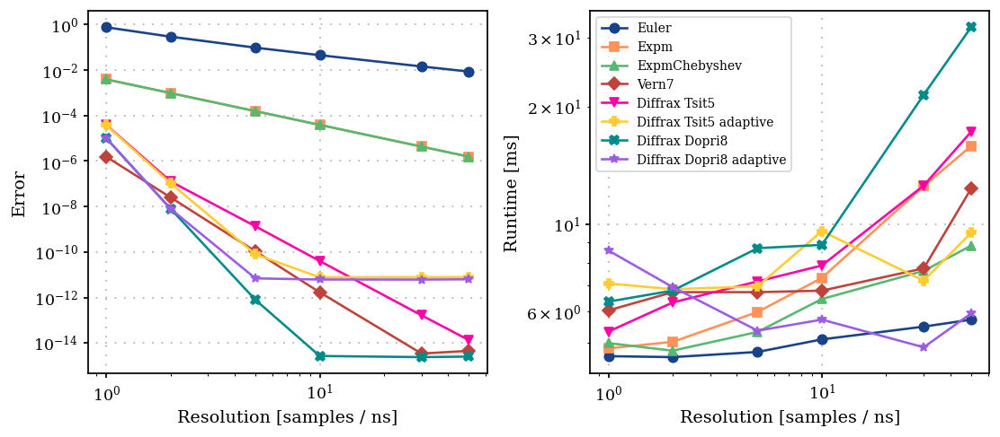
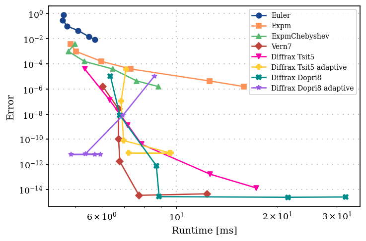
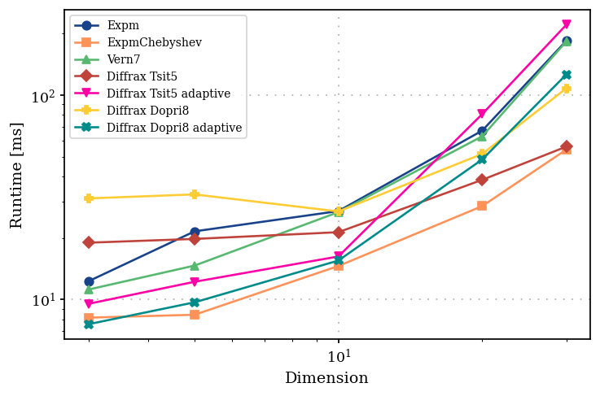

Benchmarking propagation methods
================================

In this notebook, we benchmark the various propagation methods
``Euler``, ``Expm``, ``ExpmChebyshev``, ``Vern7`` and ``DiffraxODE`` for
accuracy and runtime. We briefly discuss about choice of propagation
methods for various scenarios.

*Note: In this example we have explicitly not included ``RungeKutta`` as
it does not support JIT compilation result in long runtime. Further,
``DiffraxODE`` and ``Vern7`` provide alternative ODE solver methods.*

.. code:: ipython3

    import time
    
    import jax
    import jax.numpy as jnp
    import numpy as np
    import plotting  # noqa: F401
    
    
    def benchmark(function, repeats=3):
        """Time a function, separating the first (compiling) call from the fastest of the later ones.
    
        Returns the result of the function, the duration of the first call, and the fastest
        of ``repeats`` subsequent calls, both in seconds.
        """
        start = time.perf_counter()
        result = jax.block_until_ready(function())
        first_call = time.perf_counter() - start
    
        best = np.inf
        for _ in range(repeats):
            start = time.perf_counter()
            jax.block_until_ready(function())
            best = min(best, time.perf_counter() - start)
    
        return result, first_call, best

Model
-----

We consider a transmon (Koch et al., 2007) :cite:p:`koch2007charge`, in
a frame rotating with the drive, and driven by a Gaussian pulse on a
slightly detuned local oscillator,

.. math:: H(t) = \delta \, \hat{n} + \frac{\alpha}{2} \hat{n} (\hat{n} - 1) + \Omega(t) \, a + \Omega^*(t) \, a^\dagger .

.. code:: ipython3

    from paraqeet.eom.schroedinger_equation import SchroedingerEquation
    from paraqeet.hamiltonian.drive import Drive
    from paraqeet.hamiltonian.transmon import TransmonHamiltonian
    from paraqeet.hamiltonian.utils import construct_basis_state
    from paraqeet.quantity import Quantity
    from paraqeet.signal.envelopes import GaussEnvelope
    from paraqeet.signal.iq_mixer import IQMixer
    
    t_final = 20e-9
    detuning = 2 * np.pi * 50e6
    anharm = -2 * np.pi * 200e6
    num_levels = 3
    
    
    def build_model(num_levels=3):
        """Return the envelope, the generator, the Hamiltonian and the equation of motion of a driven transmon."""
        tone = GaussEnvelope(amplitude=Quantity(np.pi / t_final, -4 * np.pi / t_final, 4 * np.pi / t_final))
        tone.t_final.set_value(t_final)
        generator = IQMixer(envelopes=[tone], frequency=Quantity(detuning, 0.0, 2 * detuning, unit="Hz"))
    
        hamiltonian = TransmonHamiltonian(
            num_levels=num_levels,
            frequency=Quantity(detuning, 0.0, 2 * detuning, unit="Hz"),
            anharmonicity=Quantity(anharm, 2 * anharm, 0.0, unit="Hz"),
            drives=[],
        )
        hamiltonian.drives = [Drive(hamiltonian.annihilation_op, generator, add_hermitian=True)]
    
        equation = SchroedingerEquation(
            hamiltonian_func=hamiltonian.get_value,
            hamiltonian_gradient_func=hamiltonian.get_gradient,
        )
        return tone, generator, hamiltonian, equation
    
    
    tone, generator, hamiltonian, equation = build_model(num_levels)
    
    times = np.array([0.0, t_final])
    initial_state = construct_basis_state(dim=num_levels, index=0)
    target_state = construct_basis_state(dim=num_levels, index=0)

Propagation methods
-------------------

Given the model, we define the propagation methods used for solving the
dynamics. Here, in addition to fixed step size, we also add adaptive
step size ODE solvers from Diffrax.

.. code:: ipython3

    import diffrax
    
    from paraqeet.propagation import DiffraxODE, Euler, Expm, ExpmChebyshev, Vern7
    from paraqeet.propagation.utils import schrodinger_step
    
    adaptive_controller = diffrax.PIDController(rtol=1e-10, atol=1e-12)
    
    # Needed for Tsit5 Adaptive
    adaptive_max_steps = 200_000
    
    
    def make_propagation(name, equation, resolution, initial_state):
        """Return a fresh propagation object of the given name."""
        if name == "Euler":
            return Euler(equation.get_value, resolution, initial_state)
        if name == "Expm":
            return Expm(equation.get_value, resolution, initial_state)
        if name == "ExpmChebyshev":
            return ExpmChebyshev(equation.get_value, resolution, initial_state, order=16)
        if name == "Vern7":
            return Vern7(equation.get_value, resolution, initial_state, step_function=schrodinger_step)
        if name == "Diffrax Tsit5":
            return DiffraxODE(equation.get_value, resolution, initial_state, step_function=schrodinger_step)
        if name == "Diffrax Tsit5 adaptive":
            return DiffraxODE(
                equation.get_value,
                resolution,
                initial_state,
                step_function=schrodinger_step,
                stepsize_controller=adaptive_controller,
                max_steps=adaptive_max_steps,
            )
        if name == "Diffrax Dopri8":
            return DiffraxODE(
                equation.get_value,
                resolution,
                initial_state,
                step_function=schrodinger_step,
                solver=diffrax.Dopri8(),
                interpolation_order=10,
            )
        if name == "Diffrax Dopri8 adaptive":
            return DiffraxODE(
                equation.get_value,
                resolution,
                initial_state,
                step_function=schrodinger_step,
                solver=diffrax.Dopri8(),
                interpolation_order=10,
                stepsize_controller=adaptive_controller,
                max_steps=adaptive_max_steps,
            )
        raise ValueError(f"Unknown propagation method {name}.")

We define ``Vern7`` at a very high resolution as our reference method.
As a verification, the resolution has to be high enough such that
halving it leaves the state meaningfully unchanged.

.. code:: ipython3

    reference = np.array(make_propagation("Vern7", equation, 100e9, initial_state).get_value(times))[-1]
    half = np.array(make_propagation("Vern7", equation, 50e9, initial_state).get_value(times))[-1]
    
    print("Change when halving the resolution of the reference:", f"{np.linalg.norm(half - reference):.2e}")

.. parsed-literal::

    Change when halving the resolution of the reference: 4.61e-15

Let’s run all the propagation methods at various resolutions to
benchmark the runtimes. Since all the propagation methods are JIT
compiled, we store the fastest runtime (to avoid adding compile time)

.. code:: ipython3

    resolutions = [1e9, 2e9, 5e9, 10e9, 30e9, 50e9]
    method_names = [
        "Euler",
        "Expm",
        "ExpmChebyshev",
        "Vern7",
        "Diffrax Tsit5",
        "Diffrax Tsit5 adaptive",
        "Diffrax Dopri8",
        "Diffrax Dopri8 adaptive",
    ]
    
    errors = {name: [] for name in method_names}
    runtimes = {name: [] for name in method_names}
    
    print(f"{'method':>23s} | {'resolution':>12s} | {'error':>10s} | {'first call':>12s}  | {'fastest call':>14s}")
    print("----------------------------------------------------------------------------------------------------")
    
    for name in method_names:
        for resolution in resolutions:
            propagation = make_propagation(name, equation, resolution, initial_state)
            states, first_call, fastest = benchmark(lambda: propagation.get_value(times), repeats=2)
            error = float(np.linalg.norm(np.array(states)[-1] - reference))
    
            errors[name].append(error)
            runtimes[name].append(fastest)
            print(
                f"{name:>23s} | {resolution:12.1e} | {error:10.2e} | {first_call * 1e3:10.0f} ms | {fastest * 1e3:12.1f} ms"
            )
        print("----------------------------------------------------------------------------------------------------")

.. parsed-literal::

                     method |   resolution |      error |   first call  |   fastest call
    ----------------------------------------------------------------------------------------------------

.. parsed-literal::

                      Euler |      1.0e+09 |   7.51e-01 |       1557 ms |          4.6 ms

.. parsed-literal::

                      Euler |      2.0e+09 |   2.90e-01 |       1334 ms |          4.6 ms

.. parsed-literal::

                      Euler |      5.0e+09 |   9.54e-02 |       1426 ms |          4.7 ms

.. parsed-literal::

                      Euler |      1.0e+10 |   4.47e-02 |       1389 ms |          5.1 ms

.. parsed-literal::

                      Euler |      3.0e+10 |   1.43e-02 |       1307 ms |          5.5 ms

.. parsed-literal::

                      Euler |      5.0e+10 |   8.50e-03 |        917 ms |          5.7 ms
    ----------------------------------------------------------------------------------------------------

.. parsed-literal::

                       Expm |      1.0e+09 |   3.86e-03 |        466 ms |          4.8 ms

.. parsed-literal::

                       Expm |      2.0e+09 |   9.69e-04 |        401 ms |          5.0 ms

.. parsed-literal::

                       Expm |      5.0e+09 |   1.55e-04 |        400 ms |          6.0 ms

.. parsed-literal::

                       Expm |      1.0e+10 |   3.88e-05 |        379 ms |          7.3 ms

.. parsed-literal::

                       Expm |      3.0e+10 |   4.31e-06 |        373 ms |         12.6 ms

.. parsed-literal::

                       Expm |      5.0e+10 |   1.55e-06 |        349 ms |         15.9 ms
    ----------------------------------------------------------------------------------------------------

.. parsed-literal::

              ExpmChebyshev |      1.0e+09 |   3.86e-03 |        407 ms |          5.0 ms

.. parsed-literal::

              ExpmChebyshev |      2.0e+09 |   9.69e-04 |        367 ms |          4.8 ms

.. parsed-literal::

              ExpmChebyshev |      5.0e+09 |   1.55e-04 |        376 ms |          5.3 ms

.. parsed-literal::

              ExpmChebyshev |      1.0e+10 |   3.88e-05 |        370 ms |          6.5 ms

.. parsed-literal::

              ExpmChebyshev |      3.0e+10 |   4.31e-06 |        368 ms |          7.6 ms

.. parsed-literal::

              ExpmChebyshev |      5.0e+10 |   1.55e-06 |        399 ms |          8.8 ms
    ----------------------------------------------------------------------------------------------------

.. parsed-literal::

                      Vern7 |      1.0e+09 |   1.55e-06 |       1327 ms |          6.0 ms

.. parsed-literal::

                      Vern7 |      2.0e+09 |   2.54e-08 |       1317 ms |          6.7 ms

.. parsed-literal::

                      Vern7 |      5.0e+09 |   1.08e-10 |       1314 ms |          6.7 ms

.. parsed-literal::

                      Vern7 |      1.0e+10 |   1.72e-12 |       1536 ms |          6.8 ms

.. parsed-literal::

                      Vern7 |      3.0e+10 |   3.51e-15 |       1338 ms |          7.7 ms

.. parsed-literal::

                      Vern7 |      5.0e+10 |   4.61e-15 |        205 ms |         12.4 ms
    ----------------------------------------------------------------------------------------------------

.. parsed-literal::

              Diffrax Tsit5 |      1.0e+09 |   3.87e-05 |       2247 ms |          5.3 ms

.. parsed-literal::

              Diffrax Tsit5 |      2.0e+09 |   1.28e-07 |       1817 ms |          6.3 ms

.. parsed-literal::

              Diffrax Tsit5 |      5.0e+09 |   1.36e-09 |       2139 ms |          7.2 ms

.. parsed-literal::

              Diffrax Tsit5 |      1.0e+10 |   4.07e-11 |       1816 ms |          7.9 ms

.. parsed-literal::

              Diffrax Tsit5 |      3.0e+10 |   1.68e-13 |       1694 ms |         12.6 ms

.. parsed-literal::

              Diffrax Tsit5 |      5.0e+10 |   1.37e-14 |       1798 ms |         17.3 ms
    ----------------------------------------------------------------------------------------------------

.. parsed-literal::

     Diffrax Tsit5 adaptive |      1.0e+09 |   3.77e-05 |       1029 ms |          7.1 ms

.. parsed-literal::

     Diffrax Tsit5 adaptive |      2.0e+09 |   1.07e-07 |        699 ms |          6.8 ms

.. parsed-literal::

     Diffrax Tsit5 adaptive |      5.0e+09 |   8.01e-11 |        689 ms |          7.0 ms

.. parsed-literal::

     Diffrax Tsit5 adaptive |      1.0e+10 |   7.88e-12 |        724 ms |          9.6 ms

.. parsed-literal::

     Diffrax Tsit5 adaptive |      3.0e+10 |   8.00e-12 |        731 ms |          7.2 ms

.. parsed-literal::

     Diffrax Tsit5 adaptive |      5.0e+10 |   8.00e-12 |       1130 ms |          9.5 ms
    ----------------------------------------------------------------------------------------------------

.. parsed-literal::

             Diffrax Dopri8 |      1.0e+09 |   1.02e-05 |        676 ms |          6.4 ms

.. parsed-literal::

             Diffrax Dopri8 |      2.0e+09 |   8.05e-09 |        667 ms |          6.8 ms

.. parsed-literal::

             Diffrax Dopri8 |      5.0e+09 |   8.01e-13 |        711 ms |          8.7 ms

.. parsed-literal::

             Diffrax Dopri8 |      1.0e+10 |   2.75e-15 |        690 ms |          8.9 ms

.. parsed-literal::

             Diffrax Dopri8 |      3.0e+10 |   2.45e-15 |        729 ms |         21.5 ms

.. parsed-literal::

             Diffrax Dopri8 |      5.0e+10 |   2.59e-15 |        733 ms |         31.9 ms
    ----------------------------------------------------------------------------------------------------

.. parsed-literal::

    Diffrax Dopri8 adaptive |      1.0e+09 |   1.02e-05 |       1262 ms |          8.6 ms

.. parsed-literal::

    Diffrax Dopri8 adaptive |      2.0e+09 |   8.01e-09 |        719 ms |          6.9 ms

.. parsed-literal::

    Diffrax Dopri8 adaptive |      5.0e+09 |   7.03e-12 |        721 ms |          5.4 ms

.. parsed-literal::

    Diffrax Dopri8 adaptive |      1.0e+10 |   6.27e-12 |        720 ms |          5.7 ms

.. parsed-literal::

    Diffrax Dopri8 adaptive |      3.0e+10 |   6.23e-12 |        662 ms |          4.9 ms

.. parsed-literal::

    Diffrax Dopri8 adaptive |      5.0e+10 |   6.40e-12 |        729 ms |          5.9 ms
    ----------------------------------------------------------------------------------------------------

.. code:: ipython3

    import matplotlib.pyplot as plt
    
    fig, axes = plt.subplots(1, 2, figsize=(9, 4))
    markers = ["o", "s", "^", "D", "v", "P", "X", "*"]
    
    for i, name in enumerate(method_names):
        axes[0].loglog(np.array(resolutions) / 1e9, errors[name], marker=markers[i], label=name)
        axes[1].loglog(np.array(resolutions) / 1e9, np.array(runtimes[name]) * 1e3, marker=markers[i], label=name)
    
    axes[0].set_xlabel("Resolution [samples / ns]")
    axes[0].set_ylabel("Error")
    axes[1].set_xlabel("Resolution [samples / ns]")
    axes[1].set_ylabel("Runtime [ms]")
    for ax in axes:
        ax.grid(True, linestyle=(1, (1, 5)), linewidth=1)
    axes[1].legend(loc="upper left", fontsize=8, frameon=True)
    plt.tight_layout()
    plt.show()

It can be seen that the ``Euler`` scales as
:math:`\mathcal{O}(\Delta t)`. ``Expm`` and ``ExpmChebyshev`` both
saturate at order :math:`\mathcal{O}(\Delta t^2)`, due to the midpoint
interpolation. The ODE solvers have a much better scaling, with the
adaptive solvers having an almost constant runtime across the
resolutions.

If we create a runtime vs error plot, we can pick out the propagation
methods that are faster with high accuracy

.. code:: ipython3

    import matplotlib.pyplot as plt
    
    fig, axes = plt.subplots(1, figsize=(6, 4))
    
    for i, name in enumerate(method_names):
        axes.loglog(np.array(runtimes[name]) * 1e3, errors[name], marker=markers[i], ls="-", label=name)
    
    axes.set_xlabel("Runtime [ms]")
    axes.set_ylabel("Error")
    axes.grid(True, linestyle=(1, (1, 5)), linewidth=1)
    axes.legend(loc="upper right", fontsize=8, frameon=True)
    plt.tight_layout()
    plt.show()

It can be seen that there is a trade off between runtime and error
(expect for the adaptive solvers): methods like ``Vern7`` and ``Dopri8``
provide the highest accuracy at the expense of wall-time and ``Expm``
based solvers are faster.

We can look at how the time is distributed per 100 steps of proapagation

.. code:: ipython3

    from paraqeet.propagation.utils import construct_times
    
    resolution = 5e9
    step_times, dt = construct_times(times, 1, resolution)
    sample_times = step_times + dt / 2
    steps = jnp.arange(len(step_times))
    generators = jnp.array(equation.get_value(sample_times), dtype=jnp.complex128) * dt
    
    _, _, t_signal = benchmark(lambda: generator.get_value(sample_times))
    _, _, t_equation = benchmark(lambda: equation.get_value(sample_times))
    _, _, t_propagate = benchmark(
        lambda: Expm._propagate(generators, jnp.array(initial_state, dtype=jnp.complex128), steps)
    )
    
    print(f"{len(step_times)} propagation steps at a resolution of {resolution:.0e} samples per second")
    print(f"  signal generation      {t_signal * 1e3:8.2f} ms")
    print(f"  equation of motion     {t_equation * 1e3:8.2f} ms")
    print(f"  Expm propagation       {t_propagate * 1e3:8.2f} ms")

.. parsed-literal::

    100 propagation steps at a resolution of 5e+09 samples per second
      signal generation          0.95 ms
      equation of motion         1.71 ms
      Expm propagation           0.67 ms

Scaling with Hilbert space dimension
------------------------------------

.. code:: ipython3

    dimensions = [3, 5, 10, 20, 30]
    method_names = [
        "Expm",
        "ExpmChebyshev",
        "Vern7",
        "Diffrax Tsit5",
        "Diffrax Tsit5 adaptive",
        "Diffrax Dopri8",
        "Diffrax Dopri8 adaptive",
    ]
    
    resolution = 50e9
    
    runtimes = {name: [] for name in method_names}
    
    print(f"{'method':>23s} | {'dimension':>10s} |  {'first call':>12s}  | {'fastest call':>14s}")
    print("---------------------------------------------------------------------")
    
    for name in method_names:
        for dimension in dimensions:
            _, _, _, equation = build_model(num_levels=dimension)
            initial_state = jnp.array(construct_basis_state(dimension, 0), dtype=jnp.complex128)
            propagation = make_propagation(name, equation, resolution, initial_state)
            states, first_call, fastest = benchmark(lambda: propagation.get_value(times), repeats=2)
    
            runtimes[name].append(fastest)
            print(f"{name:>23s} | {dimension:10d} | {first_call * 1e3:10.0f} ms | {fastest * 1e3:12.1f} ms")
        print("---------------------------------------------------------------------")

.. parsed-literal::

                     method |  dimension |    first call  |   fastest call
    ---------------------------------------------------------------------

.. parsed-literal::

                       Expm |          3 |        180 ms |         12.3 ms

.. parsed-literal::

                       Expm |          5 |       1118 ms |         21.6 ms

.. parsed-literal::

                       Expm |         10 |       1524 ms |         27.1 ms

.. parsed-literal::

                       Expm |         20 |       1590 ms |         66.9 ms

.. parsed-literal::

                       Expm |         30 |       1784 ms |        184.0 ms
    ---------------------------------------------------------------------
              ExpmChebyshev |          3 |        134 ms |          8.2 ms

.. parsed-literal::

              ExpmChebyshev |          5 |        556 ms |          8.4 ms

.. parsed-literal::

              ExpmChebyshev |         10 |        618 ms |         14.6 ms

.. parsed-literal::

              ExpmChebyshev |         20 |        603 ms |         28.6 ms

.. parsed-literal::

              ExpmChebyshev |         30 |        636 ms |         54.1 ms
    ---------------------------------------------------------------------

.. parsed-literal::

                      Vern7 |          3 |        375 ms |         11.2 ms

.. parsed-literal::

                      Vern7 |          5 |        917 ms |         14.7 ms

.. parsed-literal::

                      Vern7 |         10 |        998 ms |         26.8 ms

.. parsed-literal::

                      Vern7 |         20 |       1036 ms |         62.8 ms

.. parsed-literal::

                      Vern7 |         30 |       1040 ms |        182.5 ms
    ---------------------------------------------------------------------

.. parsed-literal::

              Diffrax Tsit5 |          3 |        842 ms |         19.0 ms

.. parsed-literal::

              Diffrax Tsit5 |          5 |       1282 ms |         19.8 ms

.. parsed-literal::

              Diffrax Tsit5 |         10 |       1411 ms |         21.4 ms

.. parsed-literal::

              Diffrax Tsit5 |         20 |       1540 ms |         38.5 ms

.. parsed-literal::

              Diffrax Tsit5 |         30 |       1496 ms |         55.9 ms
    ---------------------------------------------------------------------

.. parsed-literal::

     Diffrax Tsit5 adaptive |          3 |       1561 ms |          9.5 ms

.. parsed-literal::

     Diffrax Tsit5 adaptive |          5 |        871 ms |         12.2 ms

.. parsed-literal::

     Diffrax Tsit5 adaptive |         10 |        962 ms |         16.2 ms

.. parsed-literal::

     Diffrax Tsit5 adaptive |         20 |       1081 ms |         80.6 ms

.. parsed-literal::

     Diffrax Tsit5 adaptive |         30 |       1155 ms |        220.3 ms
    ---------------------------------------------------------------------

.. parsed-literal::

             Diffrax Dopri8 |          3 |        910 ms |         31.2 ms

.. parsed-literal::

             Diffrax Dopri8 |          5 |        940 ms |         32.7 ms

.. parsed-literal::

             Diffrax Dopri8 |         10 |        977 ms |         27.0 ms

.. parsed-literal::

             Diffrax Dopri8 |         20 |       1019 ms |         51.5 ms

.. parsed-literal::

             Diffrax Dopri8 |         30 |       1058 ms |        107.7 ms
    ---------------------------------------------------------------------

.. parsed-literal::

    Diffrax Dopri8 adaptive |          3 |       1777 ms |          7.6 ms

.. parsed-literal::

    Diffrax Dopri8 adaptive |          5 |        908 ms |          9.7 ms

.. parsed-literal::

    Diffrax Dopri8 adaptive |         10 |        945 ms |         15.5 ms

.. parsed-literal::

    Diffrax Dopri8 adaptive |         20 |        991 ms |         48.4 ms

.. parsed-literal::

    Diffrax Dopri8 adaptive |         30 |       1122 ms |        125.9 ms
    ---------------------------------------------------------------------

.. code:: ipython3

    import matplotlib.pyplot as plt
    
    fig, axes = plt.subplots(1, figsize=(6, 4))
    
    for i, name in enumerate(method_names):
        axes.loglog(dimensions, np.array(runtimes[name]) * 1e3, marker=markers[i], ls="-", label=name)
    
    axes.set_xlabel("Dimension")
    axes.set_ylabel("Runtime [ms]")
    axes.grid(True, linestyle=(1, (1, 5)), linewidth=1)
    axes.legend(loc="upper left", fontsize=8, frameon=True)
    plt.tight_layout()
    plt.show()

The advantage of adaptive stepping does not survive the growth of the
Hilbert space, with the ``max_steps`` increased for ``Tsit5``. And
``ExpmChebyshev`` provides the best scaling.
